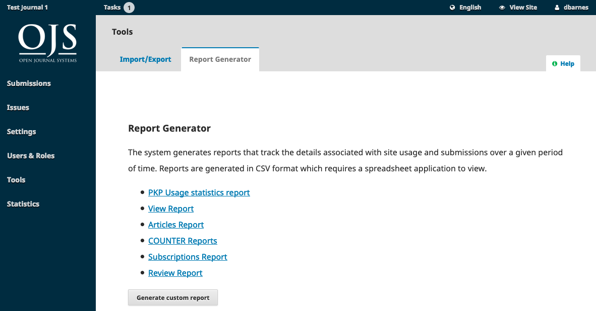
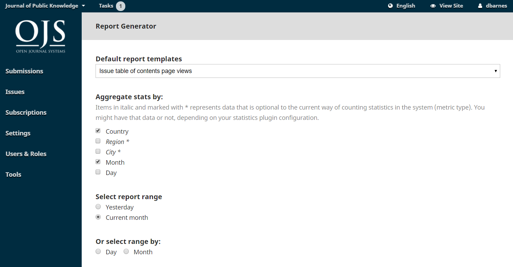

# Statistics

The Statistics page provides access to a variety of reports from your journal.

The system generates reports that track the details associated with site usage and submissions over a given period of time. Reports are generated in CSV format which requires a spreadsheet application to view.

**View Report**: Provides a report on galley and abstract views by readers \(i.e., how many times a PDF for an article has been viewed\).

**Review Report**: Provides a spreadsheet of all review activity.

**Subscriptions Report**: Provides a spreadsheet of subscription activity.

**COUNTER Reports**: Provides COUNTER data.

**Articles Report**: Provides a spreadsheet of all published articles.

**PKP Usage Statistics Report**: Provides basic usage statistics for your journal.

## Generate Custom Report

Use this feature to build your own reports.

