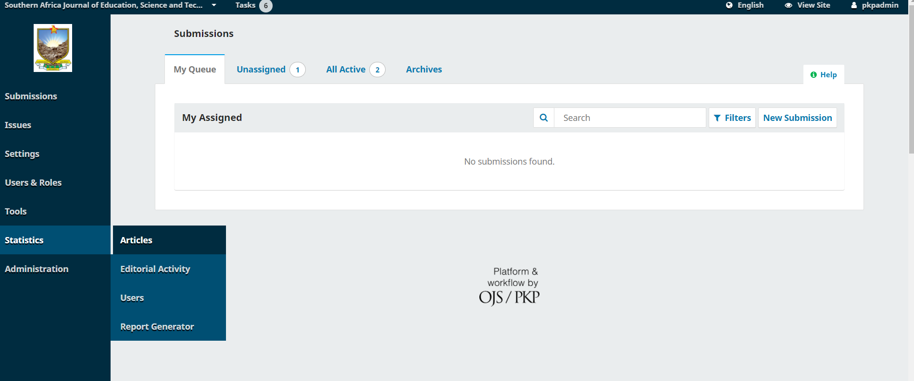
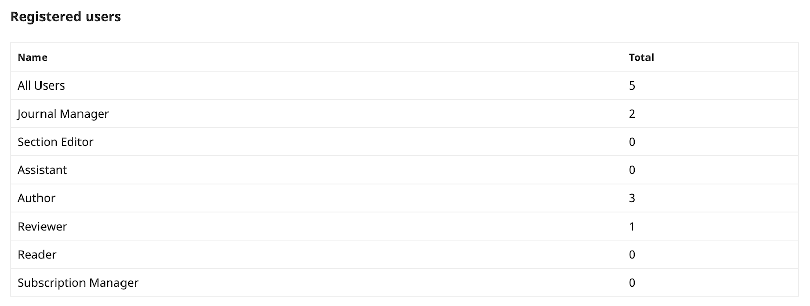

# Statistics

The statistics features of OJS allow you to view different numbers pertaining to the readership and user community of your site, including article and abstract views, subscription activity, editorial and review activity, and user counts separate by role.

This section will describe the statistics report/visualization tools available in OJS and how to use them. If you are interested in how to manage statistics as a systems administrator, including configuring the statistics framework, and troubleshooting statistics, please view [the PKP Administrator’s Guide’s documentation on statistics](https://docs.pkp.sfu.ca/admin-guide/en/statistics).

For a video walkthrough of Statistics in OJS, see our [Setting up a journal in OJS 3.3. Module 13: Statistics](https://www.youtube.com/watch?v=fU1orCK7GSM&list=PLg358gdRUrDVTXpuGXiMgETgnIouWoWaY) video below.
> ⚠️  This resource relates to an earlier version of the software and may not be up to date.
{:.warning}

> ⚠️  This resource relates to an earlier version of the software and may not be up to date.
{:.warning}

## Definitions

The following definitions may be helpful to you for understanding the variety of statistics tracked by OJS.

* **Abstract page:** the landing page for an article, containing the title, author information, abstract, DOI, and links to any article full-text galleys.  Also known as the “article page” or “landing page.” This page is normally used as the point of record for the article for DOIs or other hyperlinks: Crossref DOIs resolve to article abstract pages, as opposed to galley files, for example, as would most other indexing services.
* **Article view:** within the statistics framework, any reference to an “article view” means a single unique view of the article abstract page by a visitor. This is not an aggregate count of all article and galley views - it refers to abstract views only.
* **Galley view:** within the statistics framework, any reference to a “galley view” means a single unique view or download of the a specific galley file by a visitor. Also known as a “galley download.” This is not an aggregate count of all galley views - if there are multiple galleys for an article \(e.g., an HTML file, a PDF file, etc.\), each will have its own unique galley view count. OJS does not distinguish between galley downloads and views in the metrics table; downloads are counted as galley views.
* **Multi-clicks:** the process \(accidental or nefarious\) of increasing usage counts by clicking on an abstract page or galley file multiple times in quick succession. OJS identifies and removes these attempts from its usage metrics, as per the Project COUNTER Code of Practice.
* **Project COUNTER Code of Practice:** a set of practices developed by COUNTER to establish a means to report on usage metrics for electronic resources in a consistent way. The Code provides rules on what should be counted as a view, including specific rules for robot usage and multi-click abuse. OJS filters metrics through these rules. It should also be noted that PKP is part of the COUNTER Bots and Crawlers Working Group.
* **Robots, crawlers, bots:** nonhuman site visitors who may still view and download article data. These are usually identified as such to the server, and OJS does not count them in its usage metrics, as per the Project COUNTER Code of Practice.

## Articles

OJS offers Editors and Journal Managers the option of viewing graph and table representations of article usage, including abstract views and full-text downloads.

The visual statistics can be found under Statistics on the left menu panel, by clicking Articles.

The Articles statistics show the articles’ abstract views in both graph and table format. The visual graphic can be changed to Monthly or Daily view. The table format will allow you to filter the Total in ascending or descending order.

The calendar icon on the top right corner of your dashboard gives you the option of changing the article view to the Last 30 days, Last 90 days, Last 12 months, All dates, or a Custom Date Range.

The filter icon on the top right corner of your dashboard gives you the option of filtering the articles by Sections.

You also have the option of searching the statistics of a specific article by title, author, or manuscript ID by using the search function under Article Details.

### Geographical and Institutional Statistics

When Geographical and Institutional Statistics have been enabled (see the [Administrator's Guide](https://docs.pkp.sfu.ca/admin-guide/en/statistics) for details), OJS can collect data about the readers' locations and institutions for statistical reporting. To access these reports, click "Download Report" and choose the report you wish to access.

This information is also available via the COUNTER SUSHI interface. See the [Administrator's Guide](https://docs.pkp.sfu.ca/admin-guide/en/statistics#counter) for details.

## Institutions

When making institutional statistics available to institutional users, the settings must first be altered in journal setup (requires site admin privileges). In order to do this, go to Administration -> Site Settings -> Statistics, and select the checkbox under “Institutional Subscriptions” 

#### Warning

> Enabling institutional statistics may have an adverse effect on the database size, and it is advised consult with your systems administrator about this change,in order to monitor how this change might affect the performance of your OJS instance going forward.  
{:.warning}

Similar to institutional subscriptions, OJS 3.4 has the ability to provide institutions with statistics regarding journal usage by institutions who are not subscribers. The data used as part of institutional statistics can be used for statistics as well as institutional subscriptions, and institutions will need to be entered into OJS first in order to capture their subscription information as well as their related statistics. 

Pertinent details about institutions who are institutional subscribers can also be entered if the journal uses institutional subscriptions. 

To add a new institution, select “Institutions” from the side menu, and you have the option to search through existing institutions records, or add a new institution. 

To add a new institution, Click on “Add institution” and add the relevant details for the institution: 

Once the details for the institution have been added, institutional usage will begin to be collected. One detail that can be included for institutions is the Research Organizations Registry (ROR) identifier. You can look up the ROR registry ID for the institution at the [Research Organization Registry (ROR) website](https://ror.org/)

Reports for institutions are currently only available via the [SUSHI API (COUNTER) interface](https://docs.pkp.sfu.ca/admin-guide/en/statistics#download)

## Editorial Activity

This section provides statistics about the editorial workflow, such as number of submissions received, days to first editorial decision, and acceptance and rejection rates. You can filter these statistics using a custom date range to, e.g., find the number of articles accepted during a 12-month period.

There are some important things to note when considering the data in these reports:

* Published submissions within a date range only count the initial publication date and not subsequent versions.
* Days to decision uses an 80% threshold, so the data listed represent that 80% of submissions with a decision have received one within X number of days.
* The acceptance and decline rates only count submissions that have received an accept/decline decision, so they exclude submissions still in the queue.
* If a date range is applied, it only counts submissions that were submitted AND accepted/declined within that date range. So, e.g., a submission that was submitted before the date range but received an accept/reject decision within the date range will not be counted. For this reason, it's best to use long date ranges and older date ranges to get accurate acceptance/rejection rates.

An Editorial Activity Report will be generated monthly and can be sent by email to editors and section editors. All managers and section editors are automatically opted out of the monthly report; however, you can opt in by going to User Profile > Notifications and unchecking the box that disables the automated email.

## Users

This section provides information about new user/role registrations within a specified time period. The Total column is not a total number of accounts created; it identifies how many users have that role in the system right now. When an existing user receives a new role, such as a registered author becoming a reviewer, that addition to the total number of reviewers in the system will be reflected in the data by an increase in the number of reviewers but no change in the total number of users.

## Reports

The Reports page provides access to a variety of reports from your journal. The list may be expanded by installing additional plugins.

The system generates reports that track the details associated with site usage and submissions over a given period of time. These reports can be broadly grouped into “usage” reports that contain usage metrics indicative of visitor readership and “content” reports that provide data on the respective item (eg. review information). Reports are usually generated in CSV format which requires a spreadsheet application to view.

* Review Report: Provides review information on all articles in the system, including reviewer names, reviews, and recommendations. (Content)
* Articles Report: Provides a spreadsheet of all published articles. (Content)
* Subscriptions Report: Provides information on any individual and institutional subscriptions. This report option is only available if subscriptions are enabled on the journal. (Content)
* COUNTER Reports: Provides COUNTER 4.1 reports for all journals on the OJS application. Provides monthly and year to date aggregate counts for abstract and galley views. (See the [Admin Guide](/admin-guide/en/statistics.html) for information on accessing Counter R5 reports.) (Usage)
