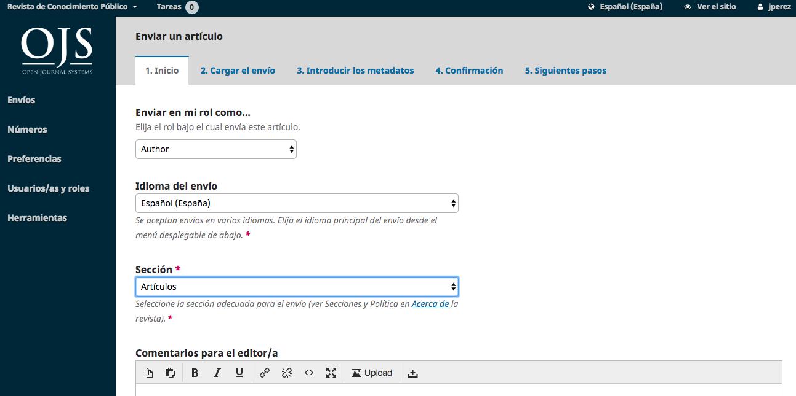
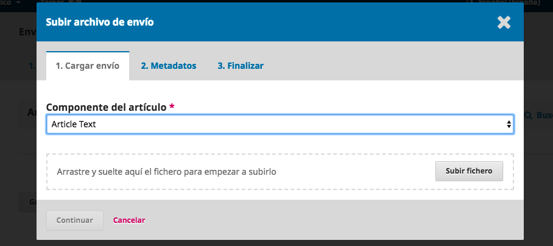
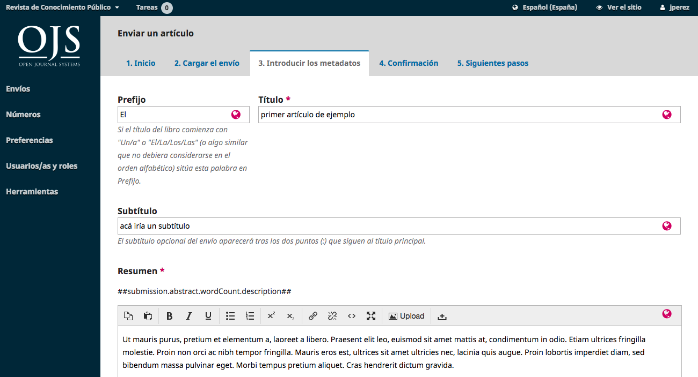
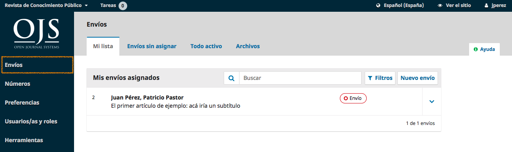
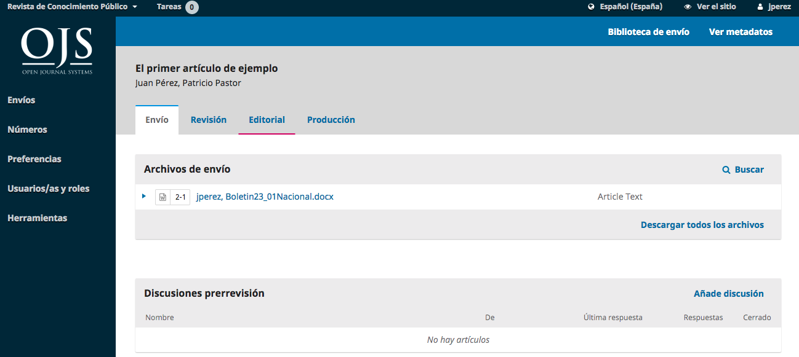
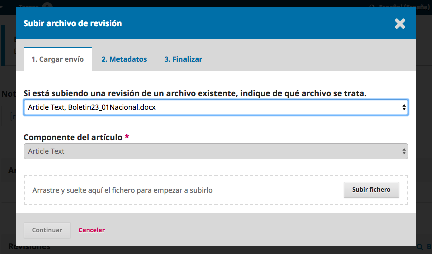
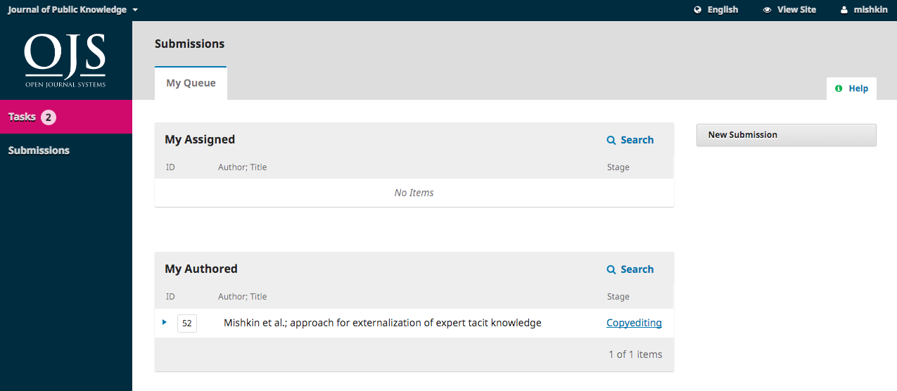
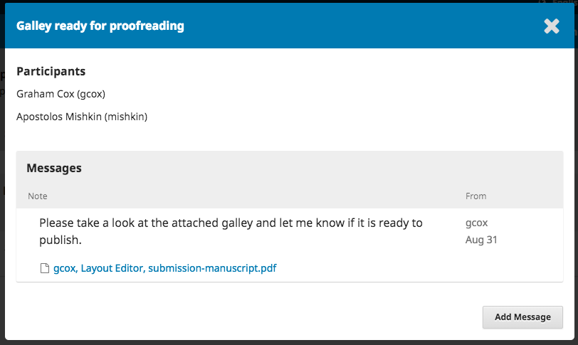

# Capítulo 13. Autoría

En este capítulo, aprenderá cómo funciona un autor en OJS 3.1 desde el registro hasta la revisión de la galerada final.

## Registro en la revista
Para realizar un envío a una revista de OJS 3.1, primero deberá registrarse como autor (consulte Registro en una revista). Después de eso, cuando inicie sesión, se le llevará a su panel de control.

Actualmente está vacío ya que no ha hecho ninguna entrega.

## Enviar un artículo

Para iniciar un nuevo envío, haga clic en el botón Nuevo envío en el lado derecho de la pantalla. Se le llevará al Paso 1 de un proceso de 5 pasos para cargar y describir su envío.

### Paso 1
En el Paso 1 usted proveerá información preliminar sobre su envío.

Para comenzar, seleccione la sección apropiada para su presentación (por ejemplo, artículo, revisión, etc.). Si no está seguro de qué sección es la apropiada, haga su mejor conjetura.

Lea y acepte las declaraciones de la lista de verificación de presentación marcando cada casilla. Incluya cualquier comentario para el editor, lea la declaración de privacidad de la revista y, a continuación, haga clic en el botón Guardar y continuar para ir al paso 2.

### Paso 2
En el Paso 2, se abrirá una ventana que le permitirá cargar su archivo de envío.

Primero, DEBE seleccionar un Componente de Artículo. Esto permite al sistema saber si el archivo es el cuerpo del manuscrito, una imagen, un conjunto de datos, etc. Esto debe ser seleccionado antes de que su archivo se cargue.

Una vez que haya hecho esa selección, puede subir su primer archivo. Es importante tener en cuenta que sólo se puede subir un archivo a la vez. Los archivos adicionales pueden ser cargados más adelante en el proceso. Típicamente, este primer archivo será el cuerpo de su manuscrito. Presione el botón Continuar una vez que el archivo se haya cargado.

Después de subir el archivo, se le pedirá que revise el nombre del archivo. Utilice el enlace Editar para realizar cualquier cambio.

Haga clic en el botón **Continuar**.

A continuación, tiene la opción de repetir el proceso para cargar archivos adicionales (por ejemplo, un conjunto de datos o una imagen).

Una vez que haya terminado de cargar todos sus archivos, haga clic en **Completar**; esto cerrará la ventana de carga.

Volverá a la pantalla Enviar un artículo donde verá los archivos que ha subido. Si necesita hacer cambios, expanda la flecha azul a la izquierda de su archivo y haga cualquier cambio usando el enlace Editar.

Haga clic en '**Guardar y continuar**' para ir al paso 3.

### Paso 3
En el Paso 3, se le pedirá que añada más información sobre la presentación, incluyendo el título de la presentación (desglosado en prefijo, título y subtítulo), el resumen y el desplazamiento hacia abajo....

...cualquier contribuyente adicional.

Puede agregar más **contribuidores** (por ejemplo, coautores), haciendo clic en el enlace **Agregar** contribuidores. Esto abrirá una nueva ventana con campos para introducir su información.

Presione **Guardar**, y el nuevo contribuyente aparecerá en la pantalla.

Dependiendo de la revista a la que se envíe, es posible que vea campos adicionales para completar, como palabras clave.

Para ingresar una palabra clave, simplemente escriba la palabra o frase y presione su tecla Enter. La palabra o frase será formateada como una palabra clave.

Haga clic en **Guardar y continuar** para avanzar.

### Paso 4
En el Paso 4, se le pedirá que confirme que está satisfecho con su envío.

Haga clic en **Finalizar envío**.

Aparecerá un cuadro que le pedirá que confirme que ha terminado. Haga clic en **Ok**.

### Paso 5

Su envío ya está completo! El editor ha sido notificado de su envío. En este punto, puede seguir los enlaces a:
* Revisar este envío
* Crear un nuevo envío
* Vuelve al escritorio

### Tablero de mandos
Y aquí está su envío, en su tablero de instrumentos. Puede ver que actualmente se encuentra en la etapa de Envío.

En los próximos días, pasará a la etapa de Revisión, y si es aceptada, a las etapas de Edición y Producción antes de ser publicada.

## Responder a una revisión
Una vez que el proceso de revisión haya finalizado, el editor le notificará su decisión por correo electrónico.

Después de recibir el correo electrónico, inicie sesión en su panel de control.

Seleccione el enlace **Revisión** junto a su envío para ver la decisión.

Desde aquí, puede ver la decisión (revisiones solicitadas) y un enlace a la notificación del editor.

Basándose en la información del mensaje del editor, ahora debe preparar sus revisiones.

### Cargar el archivo revisado
Al desplazarse por la página hacia abajo, encontrará un panel de **Revisiones**.

Utilice el enlace **Subir archivo** para cargar su manuscrito revisado.

Utilice el menú desplegable para elegir que está cargando una revisión de un archivo existente.

Luego suba el archivo revisado y presione **Continuar**.

Compruebe los detalles del archivo y pulse **Continuar** de nuevo.

Si tiene archivos adicionales para cargar, hágalo ahora. De lo contrario, pulse Completado.

Su archivo revisado ahora es visible en el panel Revisiones.

### Informar al editor

El siguiente paso es informar al editor de que el archivo revisado ya está disponible. Para ello, vaya al panel de discusión de revisión.

Desde allí, seleccione el enlace **Agregar discusión**.

Si aparece, utilice el enlace **Añadir usuario** para añadir el editor.
Añada un asunto y un mensaje.
Presione **OK** para enviar el mensaje.

Se ha enviado un correo electrónico al editor y usted (y el editor) pueden ver el mensaje en el panel Revisar discusiones.

En este punto, el autor necesita esperar a que el editor le responda si las revisiones son aceptables.

### Revisiones aceptadas
Recibirá un correo electrónico informándole de que sus revisiones han sido aceptadas.

Además, las notificaciones aparecerán en el panel de control.

La notificación posterior es la actual. Haga clic en él para abrir el mensaje (que es el mismo que el correo electrónico que también habría recibido).

Use la **X** en la esquina superior derecha para cerrar la ventana.

Más adelante en el panel de control, también verás una respuesta de discusión del editor.

Al hacer clic en el título de la discusión se abrirá.

Felicitaciones! Usted ha sido aceptado y su archivo de envío está pasando a la etapa de derechos de autor.

## Nueva presentación para revisión
Si la decisión del editor es volver a enviar para su revisión, deberá iniciar sesión y seleccionar el artículo en su página de envíos. La nueva presentación se hace en la etapa de revisión, no hay necesidad de comenzar un nuevo envío.

En la etapa de revisión, tendrá que hacer dos cosas para volver a presentar el documento una vez que lo haya revisado:

Cargar el nuevo fichero en la sección de revisiones. Para subir un nuevo archivo, haga clic en 'Subir archivo'. Una nueva ventana se abrirá permitiéndole subir su(s) archivo(s). Seleccione la opción apropiada del menú desplegable para indicar que no envía una revisión de un archivo existente.

Agregar una discusión para notificar al editor que ha vuelto a enviar.

El proceso de revisión por pares se repetirá, y es probable que usted reciba revisiones adicionales que hacer. Una vez que se hayan completado y aceptado, pasará a la siguiente etapa.

## Respuesta a una solicitud de corrección
El siguiente paso en el flujo de trabajo es inspeccionar los archivos de envío que se han copiado.

Recibirá un correo electrónico indicando que los archivos están disponibles. Para verlos, ingrese a la revista y vaya a su panel de control.

Puede ver su entrada en el panel Mi Autor. Seleccione el enlace Corrección de texto para ir al registro de envío completo, incluida la notificación, en el panel Corrección de texto de Discusiones.

Haga clic en la discusión vinculada para abrirla, lea el mensaje y abra el archivo adjunto.

Una vez que haya leído el archivo adjunto, puede responder al corrector indicando los cambios requeridos o su aprobación.

Si es necesario, puede adjuntar una revisión, pero para este ejemplo simplemente aprobaremos los cambios y pulsaremos **OK**.

En su panel de control, puede ver que usted fue la última persona en responder al mensaje.

Su rol en el proceso de edición ya está completo y puede esperar a que la solicitud sea revisada en las galeradas finales (por ejemplo, PDFs, HTML, etc.) antes de su publicación.

## Responder a una solicitud de revisión
El siguiente paso en el flujo de trabajo es inspeccionar los archivos de envío que se han convertido en galeradas (por ejemplo, PDF, HTML, etc.).

Recibirá un correo electrónico indicando que los archivos están disponibles. Para verlos, ingrese a la revista y vaya a su panel de control.

Puede ver su entrada en el panel **Mi Autoría**. Seleccione el enlace Producción para ir al registro de envío completo, incluida la notificación en el panel Discusiones de producción.

Haga clic en la discusión vinculada para abrirla, leer el mensaje y abrir el archivo adjunto.

Una vez que haya leído el archivo adjunto, puede responder al editor de diseño indicando los cambios necesarios o su aprobación.

¡Eso es todo! Su papel en el flujo de trabajo editorial se ha completado.

