# Authoring

In this chapter, you will learn about how an author works in OJS from registration through to proofreading the final galley.


This PKP School video explains how an author can register for a journal and submit an article. To watch other videos in this series, visit [PKP’s YouTube channel](https://www.youtube.com/playlist?list=PLg358gdRUrDUKJbWtr4bgy133_jwoiqoF).

## Registering with the Journal

To make a submission to an OJS journal, you will first need to register a user account with a journal and log in \(see [Registering with a Journal](./user-accounts#registering-with-a-journal)\). Tras esto, cuando inicie sesión, será llevado a su Panel de Control.

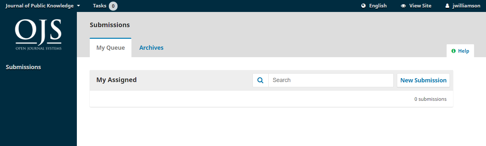

Actualmente está vacío, ya que aún no ha realizado envíos.

## Submitting an Article

Comience un nuevo envío haciendo clic en el botón **Nuevo envío** al lado derecho de la pantalla. Se le llevará al paso 1 de un proceso de 5 pasos para subir y describir su envío.

### Step 1

En el **Paso 1** proporcionará información preliminar sobre su envío.

Si la revista permite envíos en varios idiomas, puede seleccionar el idioma de su envío en el menú desplegable. Los idiomas pueden activarse en la configuración del sitio web -> Configuración -> Idioma.

If the journal has Categories enabled and setup, you can select the categories your submission from the list. Categories can be setup in Journal > Categories.

Seleccione la sección apropiada para su envío \(artículo, revisión, etc.\). Si no está seguro de qué sección es la apropiada, haga la mejor conjetura posible.

Lea y acepte las declaraciones en la lista de verificación de envíos marcando cada casilla. Incluya cualquier comentario para el editor, lea la declaración de privacidad de la revista, y luego haga clic en el botón **Guardar y Continuar** para moverse al **Paso 2**.

### Step 2

En el **Paso 2** se le abrirá una ventana que le permitirá subir su archivo.

In OJS 3.3 authors can upload multiple files at once, as well as drag-and-drop files.

<figure class="video_container">
  <video controls="true" allowfullscreen="true">
    <source src="./assets/submission3.3-files.mp4" type="video/mp4">
  </video>
  <figcaption>OJS 3.3 drag and drop multiple files.</figcaption>
</figure>

Once you've uploaded all your files you can indicate the file type for each from a single menu panel, and metadata such as a description or license can be entered during the workflow.

Once you have finished uploading and labelling all of your files, click the **Save and Continue** button to move to **Step 3**.

### Step 3

En el **Paso 3**se le pedirá que añada más información sobre el envío, incluyendo el título del envío (desglosado en prefijo, título y subtítulo) y el resumen. Si la revista permite envíos en varios idiomas, haciendo clic en los campos de metadatos revelará la opción de introducir los metadatos en otros idiomas previamente habilitados, permitiéndole introducir el título, subtítulo y resumen en el otro idioma(s). Desplazándose hacia abajo...

...puede agregar cualquier colaborador adicional.

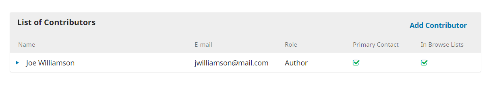

You can add more contributors (e.g., co-authors), by clicking the **Add Contributors** link. Esto abrirá una nueva ventana con campos para introducir sus datos.

Presione **Guardar** y el nuevo colaborador aparecerá en la pantalla.

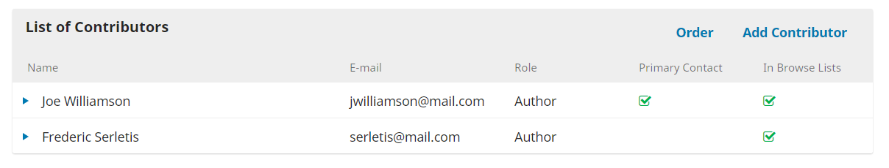

Si las categorías están habilitadas en la revista a la que está realizando un envío, podrá seleccionar una categoría para el manuscrito, si aplica.

También puede ver campos adicionales para rellenar, tales como palabras clave. Si hay idiomas adicionales habilitados en la revista, puede introducir los metadatos en esos idiomas. Al hacer clic en el campo del metadato se mostrarán los campos para otros idiomas habilitados en la revista.

Para introducir una palabra clave, simplemente escriba la palabra o frase y pulse su tecla Intro. La palabra o frase será formateada como palabra clave.

Haga clic en **Guardar y continuar** para avanzar.

### Step 4

En el paso 4, se le pedirá que confirme que está satisfecho con su envío.

Haga clic en **Finalizar envío**.

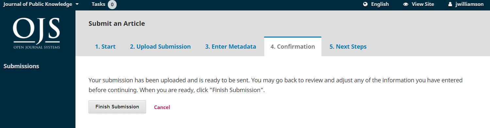

Aparecerá una caja que te pedirá que confirmes que has finalizado. Haga clic en **OK**.

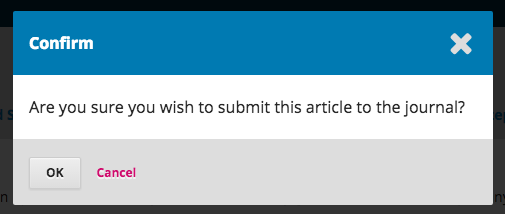

### Step 5

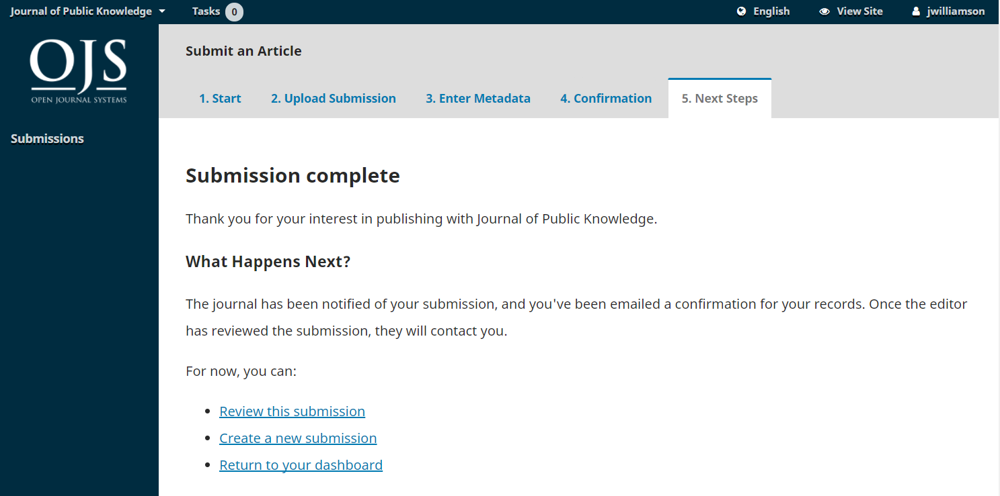

¡Su envío ha sido completado! El editor ha sido notificado de su envío. En este punto, puedes seguir los enlaces para:

* Review this submission
* Create a new submission
* Return to your dashboard

Una vez que complete un envío, no podrá realizar cambios en el mismo.  Si desea reemplazar el archivo que ha enviado o hacer otros cambios al envío, necesitará ponerse en contacto con el editor a través de la herramienta Discusiones.

### Dashboard

Y aquí está su envío en su Panel de Control. Puede ver que actualmente está en la etapa de _Envío_.

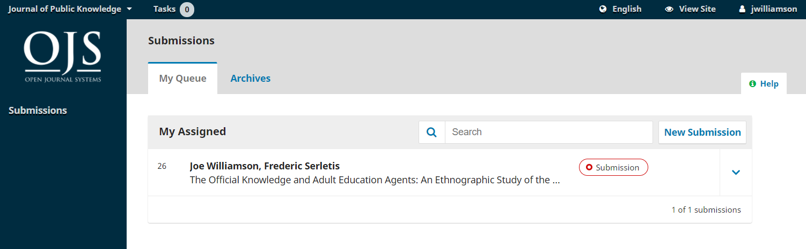

En los próximos días, pasará a la fase de Revisión y, si se acepta, a las fases de Corrección y Producción antes de ser publicadas.

## Editing Metadata

En OJS 3.2, puede editar sus propios metadatos en diferentes etapas del flujo de trabajo editorial. Esto dependerá de la configuración concedida por la Revista. Es posible que tenga permisos globales para realizar ediciones o que tenga que enviar una solicitud al Editor para hacerlo.

Los cambios pueden incluir resúmenes actualizados, correcciones de errores ortográficos o adición de colaboradores adicionales.

Para realizar ediciones al manuscrito enviado, haga clic en la pestaña de publicación de su envío.

Podrá hacer cambios en cualquiera de los submenús de la izquierda haciendo clic en esas pestañas. Si hay varios idiomas habilitados en la revista, podrá editar metadatos en esos idiomas haciendo clic en la pestaña de idioma de la parte superior derecha. Haga clic en 'Guardar' una vez que haya terminado de hacer sus cambios.

Cuando se le conceda permiso, podrá hacer cambios en las siguientes secciones de la pestaña Publicación: Título, Resumen, Colaboradores y Metadatos. Mientras Galeradas aparezca como una opción en el menú lateral no podrá subir ni hacer cambios en esta sección.

Si nota que el botón 'Guardar' es gris y está inactivo, significa que tendrá que solicitar permiso al Editor para hacer cambios en su envío o pedirles que hagan los cambios por usted.

## Responding to a Review


This PKP School video explains how an editor responds to a review and how an author can upload revisions. To watch other videos in this series, visit [PKP’s YouTube channel](https://www.youtube.com/playlist?list=PLg358gdRUrDUKJbWtr4bgy133_jwoiqoF).

Una vez finalizado el proceso de revisión, el editor le notificará por correo electrónico su decisión.

Después de recibir el correo electrónico con la decisión, inicie sesión en su panel de control. Seleccione el manuscrito sobre el que ha sido notificado.

Dentro de la pestaña Revisión del manuscrito, también verá una copia de la Decisión Editorial bajo Notificaciones. Dependiendo del tipo de revisión por pares que utilice el diario, podrá ver menos información en la pestaña Revisión de la revista. El ejemplo a continuación muestra una revisión por pares abierta que permite a los autores ver quién era el revisor.

Para ver la decisión Editorial, haga clic en el enlace debajo de las notificaciones.

Basándose en la información contenida en el mensaje del editor, usted debe ahora preparar sus revisiones.

### Uploading the Revised File

Una vez que esté listo para cargar el archivo revisado, desplácese hacia abajo en la página y encuentre el panel de **Revisiones**.

Utilice el enlace *Subir un archivo* para subir su manuscrito revisado.

Utilice el menú desplegable para seleccionar que está subiendo una revisión de un archivo existente.

A continuación, suba el archivo revisado y pulse **Continuar**.

Compruebe los detalles del archivo y presione **Continuar** de nuevo.

Si tiene algún archivo adicional para subir, hágalo ahora. De lo contrario, pulse **Completar**.

Su archivo revisado ahora es visible en el panel Revisiones.

### Inform the Editor

El editor recibirá una notificación sobre el(los) archivo(s) nuevo(s) que se están subiendo. Adicionalmente, puede informar al editor a través del panel de Discusión de Revisión como se explica a continuación.

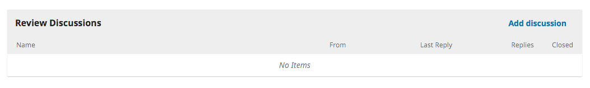

Desde ahí, seleccione el enlace *Añadir Discusión*.

Seleccione los usuarios que desea notificar bajo Participantes.

Añada una línea de asunto y un mensaje.

Pulse **OK** para enviar el mensaje.

Un correo electrónico ha sido enviado al editor, y usted y el editor pueden ver el mensaje en el panel Discusiones de Revisión.

En este punto, el autor tiene que esperar respuesta del editor sobre si las revisiones son aceptables o no.

### Revisions Accepted

Recibirá un correo electrónico diciendo que sus revisiones han sido aceptadas.

Además, las notificaciones aparecerán en su panel de control.

Las notificaciones se muestran en orden de fecha, lo que significa que la más reciente estará en la parte inferior. Haga clic para abrir el mensaje (que es el mismo que el correo electrónico que también habrá recibido).

Use la **X** en la esquina superior derecha para cerrar la ventana.

Bajo su panel de control, también verá la respuesta del editor.

Al hacer clic en el título de la discusión ésta se abrirá.

¡Felicidades! Su envío ha sido aceptado y su archivo está pasando a la fase Corrección.

## Resubmitting for Review

Si la decisión del editor es volver a enviar a revisión, tendrá que iniciar sesión y seleccionar el artículo en su página de envíos. El nuevo envío se realiza en la fase de revisión, no hay necesidad de iniciar un nuevo envío.

En la fase de revisión tendrá que hacer dos cosas para reenviar su documento una vez lo haya revisado:

Suba el nuevo archivo en la sección de revisiones. Para subir un nuevo archivo, haga clic en 'Subir archivo'. Se abrirá una nueva ventana que le permitirá cargar su(s) archivo(s). Seleccione la opción apropiada en el menú desplegable para indicar que está enviando una revisión de un archivo existente.

Añada un comentario para notificar al editor que ha vuelto a enviar un archivo.

El proceso de revisión por pares se repetirá, y posiblemente recibirá nuevas revisiones para realizar correcciones. Una vez que estos hayan sido completados y aceptados, se continuará con la siguiente etapa.

## Responding to a Copyediting Request


This PKP School video explains the copyediting process, including how an editor can respond to a copyediting or proofreading request. To watch other videos in this series, visit [PKP’s YouTube channel](https://www.youtube.com/playlist?list=PLg358gdRUrDUKJbWtr4bgy133_jwoiqoF).

El siguiente paso en el flujo de trabajo es inspeccionar sus archivos de envío que ya han sido corregidos.

Recibirá un correo electrónico indicando que los archivos están disponibles. Para verlos, inicia sesión en la revista y vaya a su panel de control.

Puede ver su envío en el panel Mis archivos. Seleccione el enlace Corregir para ir al registro completo de envíos, incluyendo la notificación en el panel de discusión de Corrección.

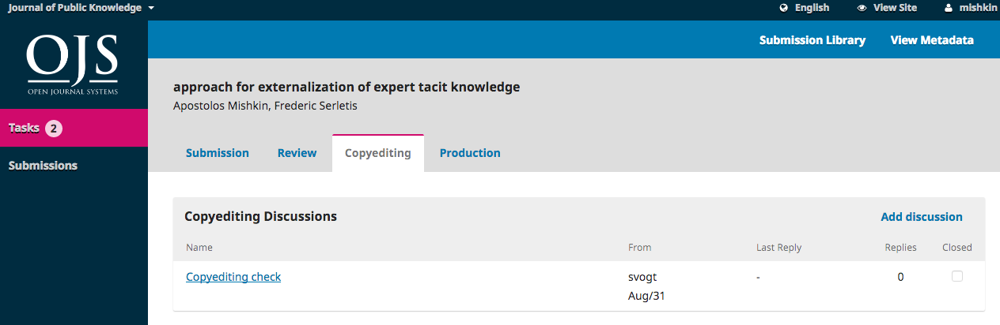

Haga clic en la discusión para abrirla, leer el mensaje y abrir el archivo adjunto.

Una vez que haya leído el archivo adjunto, puede responder al Corrector indicando los cambios necesarios o su aprobación.

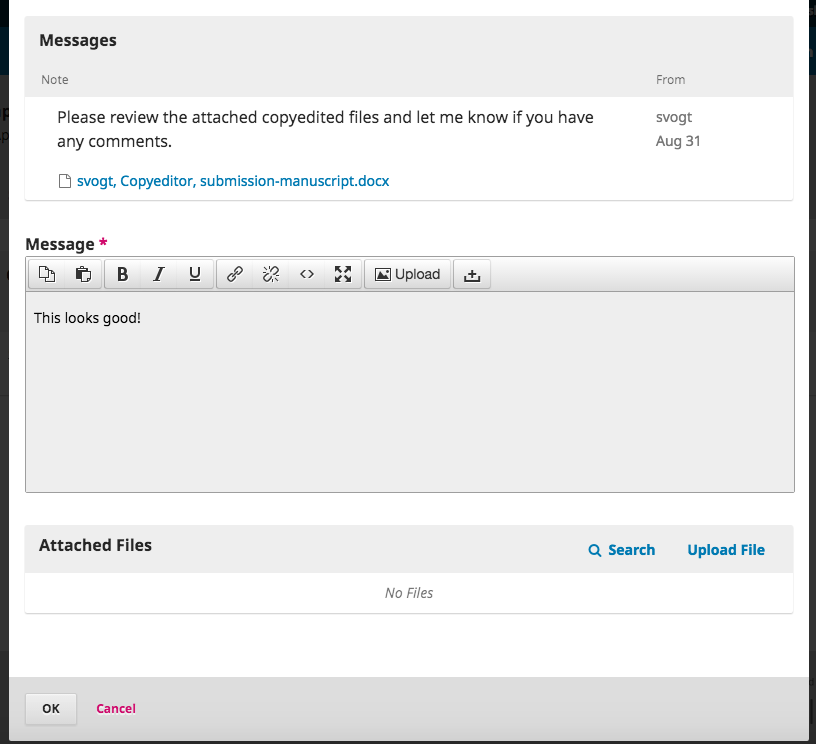

Si es necesario, puede adjuntar una revisión, pero para este ejemplo simplemente aprobaremos los cambios y pulsaremos **OK**.

En su panel de control, puede ver que usted fue la última persona en responder al mensaje.

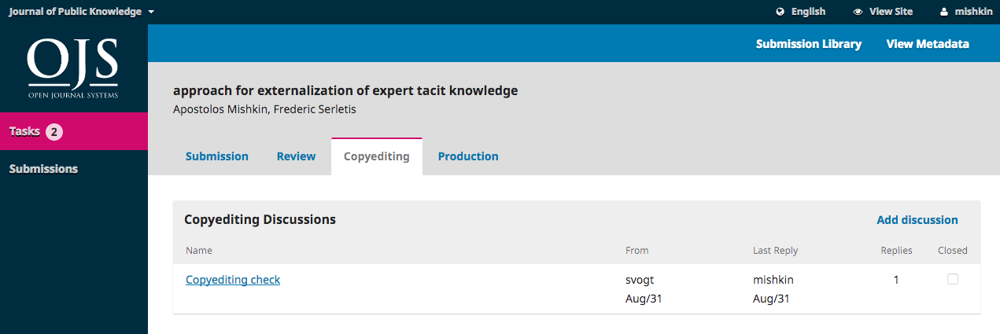

Su papel en el proceso de Corrección ya está completo y puede esperar a la solicitud de revisión de las galeradas finales (PDFs, HTML, etc.) antes de la publicación.

## Responding to a Proofreading Request

El siguiente paso en el flujo de trabajo es revisar sus archivos de envío que se han convertido en galeradas (por ejemplo, PDF, HTML, etc.).

Recibirá un correo electrónico indicando que los archivos están disponibles. Para verlos, inicia sesión en la revista y vaya a su panel de control.

Puede ver su envío en el panel Mis archivos. Seleccione el enlace para ir al registro completo de envíos, incluyendo la notificación en el panel de discusión.

Haga clic en la discusión para abrirla, leer el mensaje y abrir el archivo adjunto.

Una vez que haya leído el archivo adjunto, puede responder al Maquetador indicando los cambios necesarios o su aprobación.

¡Eso es todo! Su papel en el flujo de trabajo editorial se ha completado.
