# Capítulo 14: Flujo de trabajo editorial

En este capítulo, usted seguirá como envío a lo largo del flujo de trabajo, desde el primer envío hasta la publicación final.

El flujo de trabajo se divide en 4 etapas:

**Envío**: Aquí es donde llegan los nuevos envíos mientras se asignan a los Editores de Sección y se consideran para pasar a la etapa de Revisión.

Algunas presentaciones son claramente inapropiadas y nunca llegan más allá de esta etapa.

**Revisión**: Aquí es donde se realiza la revisión por pares, así como cualquier revisión requerida por el autor.

Algunas presentaciones no pasarán la revisión y terminarán aquí. Los que son aceptados pasan a la siguiente etapa.

**Corrección de estilo**: Los artículos aceptados pasan a esta etapa, donde son mejorados por el trabajo de un corrector. Se puede dar a los autores la oportunidad de revisar las correcciones.

**Producción**: Una vez que se completan y aprueban las copias, la presentación pasa a esta etapa. En Producción, los archivos copiados son convertidos a galeradas - HTML, XML, PDF, etc. Una vez más el autor tiene la oportunidad de corregir las galeradas. Una vez que todos estén satisfechos, el envío está programado para su publicación en un número futuro.

## Tareas

Sus Tareas están disponibles en el menú superior izquierdo de su Tablero. Observe el número "1" en la imagen de abajo. Esto indica que actualmente hay 1 tarea en su lista.

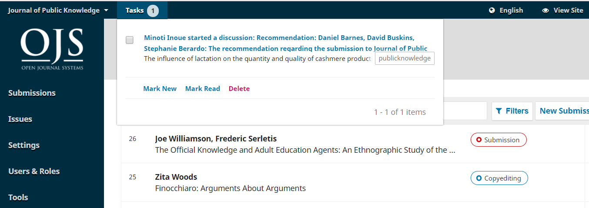

Las tareas proporcionan un vistazo rápido a los elementos que necesitan su atención. Las entradas en negrita no han sido leídas, y las entradas en negrita han sido leídas.

Utilice la casilla de verificación para marcar las tareas que desea eliminar (el enlace para eliminar está disponible en la parte inferior de la lista).

## Envíos

Cuando un autor realiza un nuevo envío a su revista, el editor recibe automáticamente un correo electrónico. Al iniciar sesión en el Panel de control, puede encontrarla desde sus Tareas o desde una de las colas (Mi cola, Sin asignar, Todos activos y Archivos).

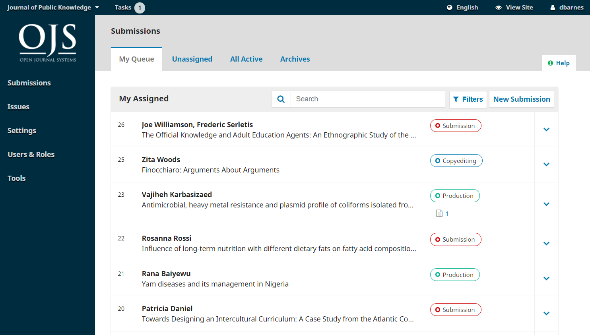

### Mi Cola

**Mi Asignado**: Este panel incluye los envíos agregados a las secciones en las que usted es editor de sección o a sus propios envíos si también es autor de esta revista.

La herramienta de **búsqueda** para cada cola a veces puede ser útil para rastrear los envíos.

La herramienta **Filtro** le permite limitar su navegación a etapas específicas (p. ej., incompleta, vencida) (envío, revisión, edición, producción) o secciones (p. ej., artículos, revisiones) para una búsqueda más rápida.

Ten en cuenta que puedes usar las flechas azules a la derecha de cada envío para revelar más detalles, incluyendo cuántas reseñas están pendientes, nuevas discusiones y más. También muestra botones para acceder al registro de envío, ver el registro de actividad y las notas, y para eliminar el envío.

### Sin asignar

Este panel incluye las presentaciones agregadas a las secciones sin editores de sección.

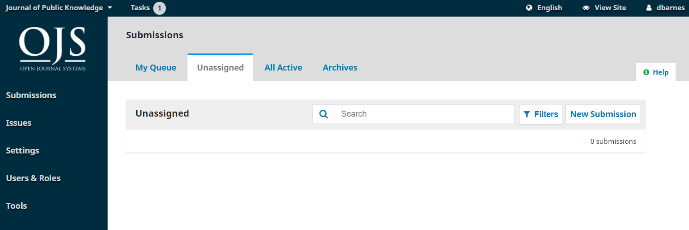

En el ejemplo anterior, no hay envíos sin asignar, por lo que el panel está vacío.

### Todos Activos

Esta sección incluye una lista de todos los envíos, sin estar organizados en colas.

### Archivado

Esta sección incluye una lista de todos los envíos rechazados o ya publicados por la revista.

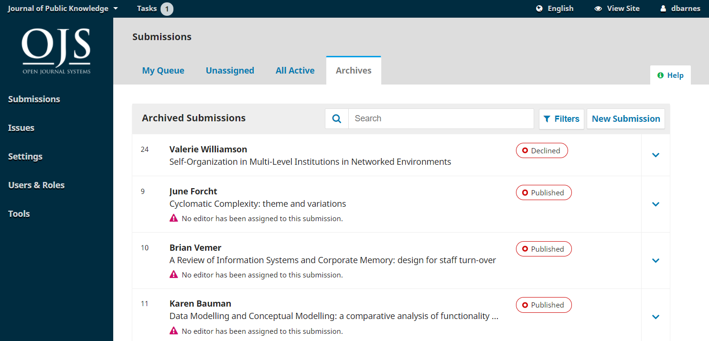

### Demostración de envío

Para esta demostración estamos buscando el envío de Williamson y Serletis, titulado The Official Knowledge and Adult Education Agents. Se puede encontrar en la parte superior de la cola My Assigned, así como en la cola All Active.

Una vez que encuentre el envío, puede usar la flecha azul para revelar las opciones para ver si hay algún debate abierto (no hay ninguno), así como para ver el envío, ver los registros y la nota de actividad, o para eliminar el envío.

**Eliminar** moverá la presentación a los Archivos y el **Registro y las Notas de Actividad** mostrarán el historial de la presentación.

### Registro de envío

Para ver el envío con más detalle, seleccione el botón Ver envío. Esto le llevará al registro de envío.

Desde aquí, puedes ver:

**Archivos de Envío**: Este panel lista los archivos que han sido enviados. En esta vista, sólo hay un archivo, pero se podrían haber enviado varios archivos.

**Discusiones previas a la revisión**: Este panel permite que el editor se comunique con el autor o con otros miembros del equipo editorial. Por ejemplo, para pedirle al autor alguna información adicional, o para pedirle a un editor de sección que asuma la responsabilidad de este envío.

**Botones de Acción**: Estos incluyen Enviar a Revisión, Aceptar y Omitir Revisión, y Rechazar Envío.

> Nota: Si no ve estos botones, es probable que aún no haya asignado el envío a un editor.

**Participantes**: Este panel es donde verá la lista de participantes involucrados en la presentación, incluyendo el editor, los editores de la sección y el autor. Otros nombres (correctores, editores de diseño, etc.) aparecerán aquí a medida que se añadan en los pasos siguientes.

Además, en la barra azul a lo largo de la parte superior, se puede ver:

**Metadatos**: donde puede ver y revisar los metadatos de envío.

Utilice la ficha Identificadores para ver o añadir también un identificador único.

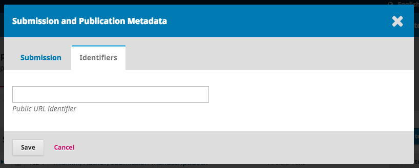

**Historial editorial**: donde puede ver el historial y cualquier nota sobre el envío.

Utilice la ficha Notas para ver o añadir también notas editoriales.

**Biblioteca de envíos**: donde puede agregar cualquier documento relevante a la biblioteca de envíos.

### Asignación de un envío

Dependiendo de cómo tenga configuradas sus secciones, algunos envíos nuevos pueden venir sin asignar. Si este es el caso, el siguiente paso es asignar un editor o un editor de sección. Para ello, seleccione el enlace Asignar en el panel **Participantes**.

Tendrá la opción de localizar a un usuario por rol, elegir a un individuo y enviarle un mensaje solicitando su ayuda.

> Nota: Si no está seguro de los nombres de los editores de la sección, simplemente elija esa función en el menú desplegable y luego pulse el botón Buscar. Todos los editores de sección se mostrarán y estarán disponibles para su selección.

Pulse el botón **OK** para realizar la asignación y enviar el mensaje.

> Observe la nueva Discusión Pre-Revisada que fue creada automáticamente como parte de la asignación.

Ahora puede ver que el Editor de sección se encuentra en la lista de Participantes y que los botones de Acción están disponibles:

**Enviar a revisión**: Mueve la presentación a la siguiente etapa.

**Aceptar y Omitir Revisión**: Omite la Etapa de Revisión y mueve la presentación directamente a Edición.

**Rechazar la presentación**: Rechaza el envío antes de pasar por el proceso de revisión. En ese caso, la presentación se archivaría.

Aunque en este ejemplo, el editor asignó un editor de sección, también sería posible que el editor se asignará a sí mismo a la presentación.

### Editor de sección

Ahora que el Editor de sección ha sido asignado, puede iniciar sesión y ver su panel de control. El envío se puede encontrar en la parte superior de la cola Mi asignado.

Al hacer clic en el título del artículo se abre la presentación completa.

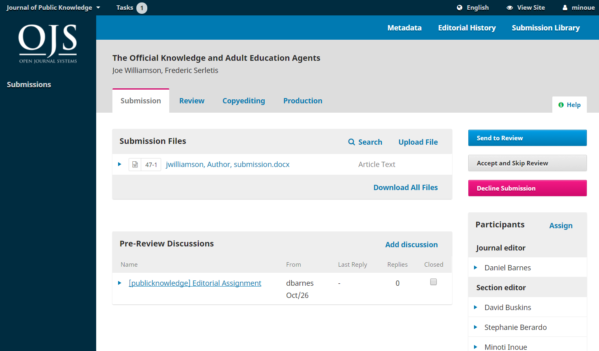

### Aceptación de la asignación

No es necesario, pero el Editor de Sección podría responder a la Discusión Previa a la Revisión para informarle al editor que ella procederá con la tarea.

### Comunicación con el autor

Si el Editor de sección tiene alguna pregunta para el autor, puede utilizar las discusiones previas a la revisión.

### Envío para revisión

Una vez que el Editor de sección esté convencido de que el envío es apropiado para la revista, puede seleccionar el botón Enviar a revisión para mover el envío a la siguiente etapa.

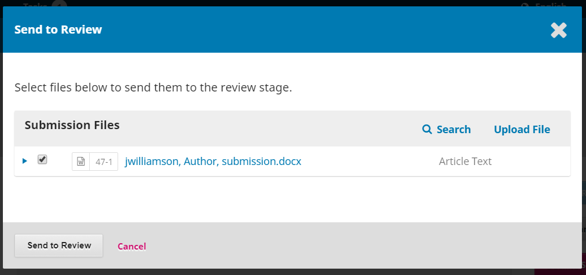

Mantenga marcados los archivos que se van a revisar.

## Revisión

Cuando el envío entra en la Etapa de Revisión, una notificación indica que los Revisores necesitan ser asignados.

> Nota: En la captura de pantalla anterior, vemos la vista del Editor de sección. Observe los botones de acción limitada (sólo está disponible Hacer recomendación). Si estuviéramos conectados como un Editor, veríamos más botones de Acción (Request Revisions, Resubmit for Review, Send to Copyediting, Decline Submission).

En el panel Revisores, puede seleccionar **Agregar Revisor** para asignar un nuevo Revisor.

Se abre una nueva ventana, donde se listan los Revisores y se pueden seleccionar uno a la vez.

Anote los detalles visibles acerca de los Revisores, incluyendo sus intereses, tareas pasadas, etc.

En la parte inferior de este formulario, verá opciones para:

**Seleccionar Revisor**: Utilice esta opción para confirmar su selección una vez que haya elegido un Revisor de la lista.

**Crear nuevo Revisor**: Si ninguno de los Revisores es adecuado, puede utilizar este botón para crear un nuevo Revisor. Esta es una cuenta nueva en el sistema.

**Inscribir usuario existente**: Si ninguno de los Revisores es adecuado, puede inscribir a un usuario existente como Revisor.

Para esta demostración, elegiremos a Adela como nuestra Revisora y presionaremos el botón **Seleccionar Revisor**.

Se abrirá una nueva ventana con un mensaje para el Revisor.

Puede revisar cualquiera de los textos preparados.

Si utiliza un método de revisión a ciegas, asegúrese de que los archivos que envíe al revisor estén desprovistos de cualquier información de identificación sobre el autor.

Más adelante en el formulario, verá los detalles adicionales que se envían al Revisor, incluyendo el título, el resumen, las fechas importantes y un enlace a los archivos que se van a revisar.

De forma predeterminada, los Revisores dispondrán de un cuadro de texto ampliado para escribir sus comentarios. Sin embargo, el Administrador de publicaciones puede crear formularios de revisión en Configuración del flujo de trabajo > Revisar para hacer preguntas más específicas. Si desea que el Revisor llene un formulario de revisión, selecciónelo en Formulario de revisión.

Presione el botón **Agregar Revisor** para enviar el mensaje y asignar el Revisor.

De vuelta en la Etapa de Revisión, podemos ver que el Revisor está ahora en la lista.

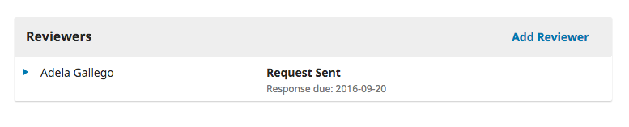

Puede hacer cambios adicionales usando la flecha azul al lado del nombre del Revisor.

**Detalles de la revisión**: Proporciona detalles sobre la revisión.

**Revisor de correo electrónico**: Le permite enviar un mensaje al Revisor.

**Editar Revisión**: Le permite cambiar las fechas de revisión y los archivos.

**Desasignar Revisor**: Le permite desasignar el Revisor.

**Historia**: Proporciona una breve historia de la revisión.

En este punto, podríamos agregar más Revisores y esperar a que lleguen sus recomendaciones.

### Responder a las críticas

Una vez que los Revisores hayan completado su trabajo, el Editor de Sección puede ver los resultados en su panel de control.

Utilice el enlace **Leer Reseña** en el panel de Revisores para leer los comentarios de los Revisores, incluyendo aquellos tanto para el Autor y Editor como para el Editor solamente.

Seleccione el enlace Confirmar en la parte inferior de la pantalla.

En el panel Revisores, ahora puede ver el enlace **Agradecer al Revisor**. Elija eso para agradecer al Revisor.

Pulse el botón **Agradecer al revisor** para enviar el mensaje.

### Tomando la Decisión

Basándose en las recomendaciones del Revisor, puede utilizar los botones de acción para tomar una decisión.

Las opciones incluyen:

**Solicitar revisiones**: Esto requerirá que el Autor haga cambios menores, pero no se requiere ninguna otra revisión por pares.

**Reenviar para revisión**: Esto requerirá que el Autor haga cambios importantes y que se lleve a cabo otra ronda de revisión.

**Enviar a edición**: Esto significa que la presentación es aceptada sin revisiones y puede proceder a la etapa de edición.

**Declinación del envío**: Esto significa que el envío no ha pasado la revisión por pares y no es adecuado para mayor consideración. El envío se trasladaría entonces a los Archivos.

### Solicitar revisiones
En esta demostración, vamos a solicitar que el Autor haga algunas revisiones menores antes de la aceptación.

Para ello, seleccione el botón **Solicitar revisiones**. Esto resulta en una nueva ventana de mensaje.

Puede modificar cualquier parte del texto antes de enviar el mensaje.

Utilice el botón **Agregar revisiones** para importar los comentarios del Revisor desde el campo Editor y autor. Los comentarios en el campo Sólo editor no se mostrarán.

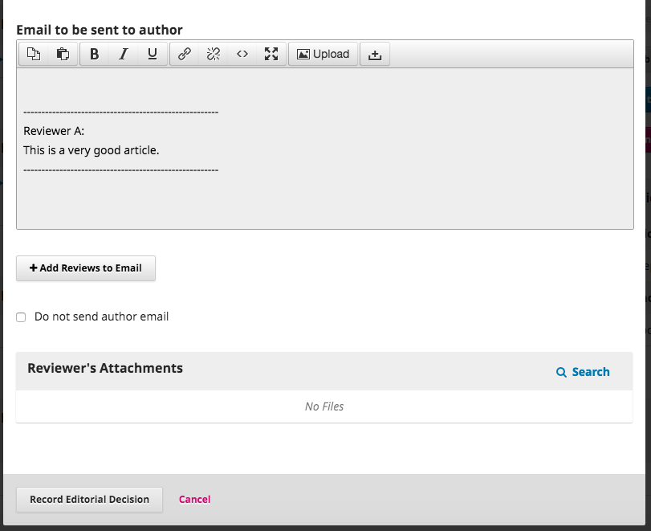

Si hay algún archivo adjunto, como un archivo marcado creado por un Revisor, puede adjuntarlo aquí (siempre y cuando haya sido anonimizado).

Pulse el botón **Grabar decisión editorial** para enviar el mensaje.

Ahora debe esperar a que la autora responda con sus revisiones.

### El autor responde

Una vez que el autor haya realizado las revisiones, recibirá un mensaje (por correo electrónico y en el panel Discusiones de revisión).

También verá el archivo revisado en el panel Revisiones.

En este punto, puede descargar el archivo revisado, comprobar que está listo y comunicarse con el autor mediante el panel Discusiones de revisión.

En este caso, vamos a informar al Autor que estamos aceptando las revisiones. Para ello, haga clic en el título de la discusión. Esto abrirá la caja de discusión.

Utilice el botón **Agregar mensaje** para responder.

Otra opción sería pedir más revisiones, pero en este punto, estamos listos para seguir adelante.

### Pasar a Edición

El envío ya está listo para pasar a edición. Para ello, utilice el botón azul Enviar a edición.

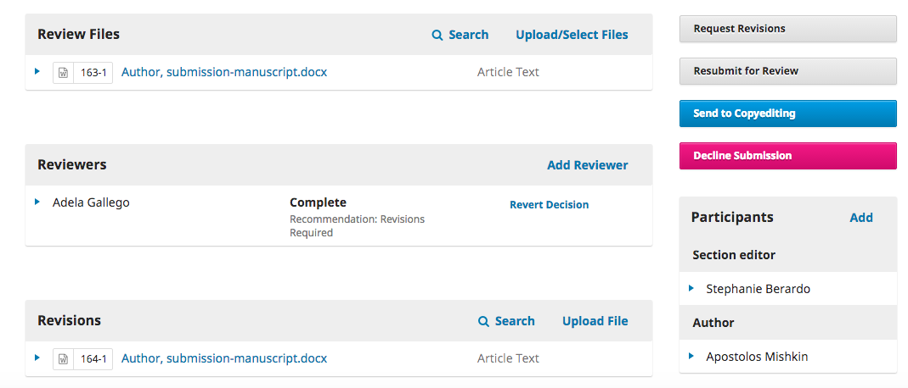

Esto abrirá una nueva ventana.

Pulse el botón Grabar decisión editorial en la parte inferior de la ventana.

El envío se mueve automáticamente a la etapa de edición.

## Edición de textos

Cuando un envío es aprobado en la Etapa de Revisión, se moverá automáticamente a la etapa de Edición.

### Adición de un corrector

Cuando la presentación entra en la etapa de corrección, una notificación indica que se debe asignar un corrector. Los correctores se pueden asignar mediante el enlace Añadir en el panel Participantes.

Esto abrirá una nueva ventana.

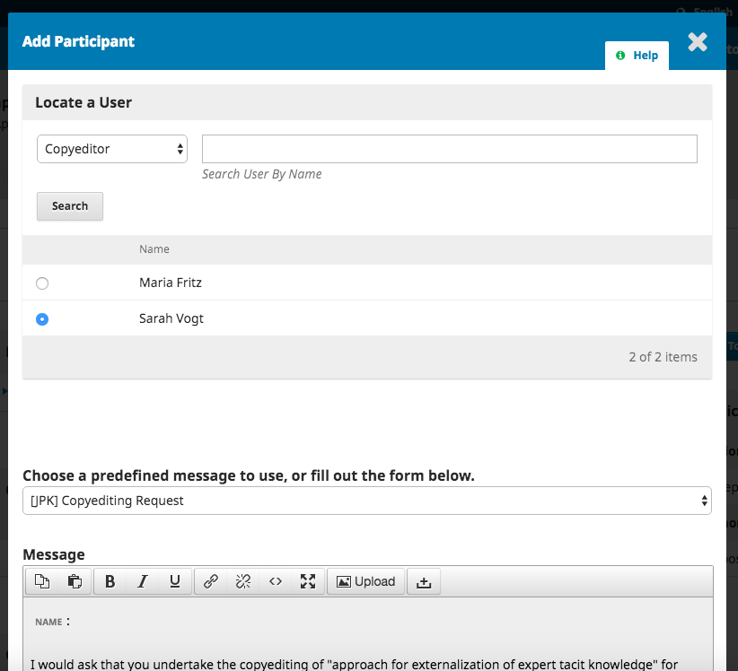

Puede utilizar la lista desplegable de funciones para seleccionar Corrector y pulsar el botón Buscar. Esto mostrará a todos los correctores.

Seleccione uno de los correctores para este envío.

Seleccione un mensaje preparado.

Realice los cambios necesarios en el mensaje.

Oprima **Enviar**.

Ahora puede ver la nueva notificación de que la presentación está a la espera de correcciones, el corrector está ahora incluido en la lista de participantes y la solicitud está visible en las discusiones de corrección.

Ahora puede esperar a que el corrector haga su trabajo.

### Corrector

El corrector recibirá un mensaje de correo electrónico del editor de sección solicitándole que acepte el envío.

Para empezar, debe iniciar sesión y encontrar el envío desde su panel de control.

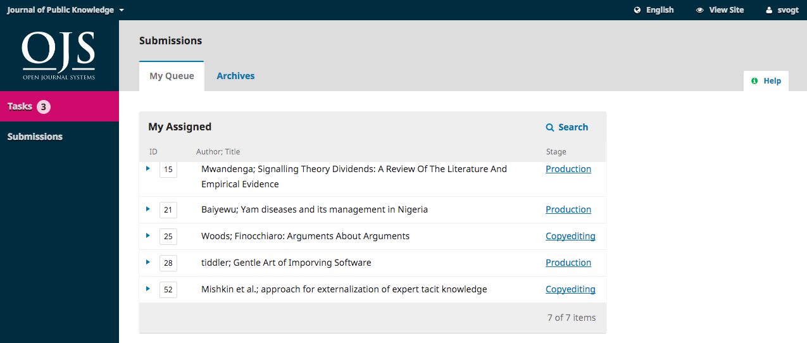

A continuación, puede hacer clic en el enlace **Edición** junto al nombre del envío. Esto la llevará directamente a la etapa de corrección de textos para esta presentación.

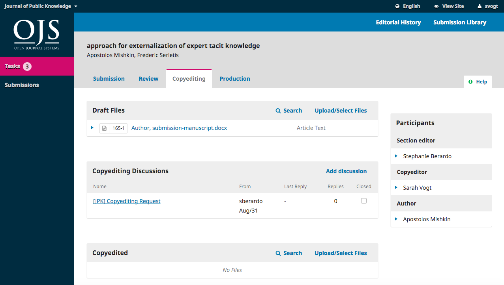

Desde aquí, puede ver los archivos borradores. Estos son los archivos que requieren ser copiados. Haciendo clic en el título enlazado descargará el archivo en su escritorio.

Fuera de OJS, ella hará su trabajo de corrección.

Para comprobar los metadatos de envío, utilice el enlace Metadatos en la barra azul de la parte superior.

Esto incluiría comprobar el título del artículo, el resumen, los nombres de los autores, las palabras clave, etc.

Si se realiza algún cambio, pulse el botón Guardar antes de salir de esta ventana.

### Consultar con el autor

Una vez que haya terminado de copiar, ejecutará los cambios pasando por el Autor añadiendo una nueva discusión, usando el enlace Añadir discusión del panel de Corrección de Discusiones.

En la ventana Agregar discusión, debe elegir el Autor y agregar una línea de asunto y un mensaje.

Más abajo en esa misma ventana, ella debe subir una copia de su archivo copiado.

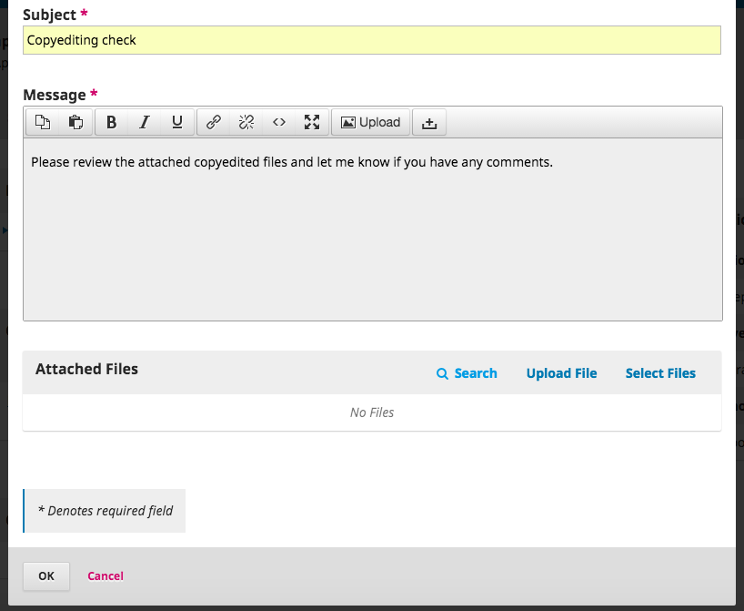

Para ello, utilice el enlace **Cargar Archivo**. Esto abrirá una nueva ventana en la que deberá elegir el Componente del Artículo (por ejemplo, el texto del artículo) y cargar el archivo.

Presione **Continuar** para seguir.

Esto abrirá el siguiente paso, donde puede editar el nombre del archivo si es necesario.

A continuación, puede cargar más archivos si es necesario, o pulsar Completar.

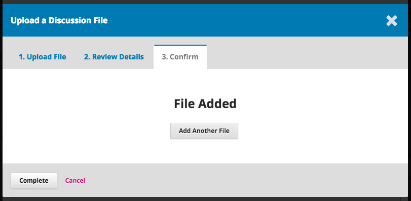

De vuelta en la ventana Agregar, ahora puede ver el archivo adjunto.

Pulse **OK** para enviar el mensaje al autor.

Ahora es visible en las Discusiones de Corrección.

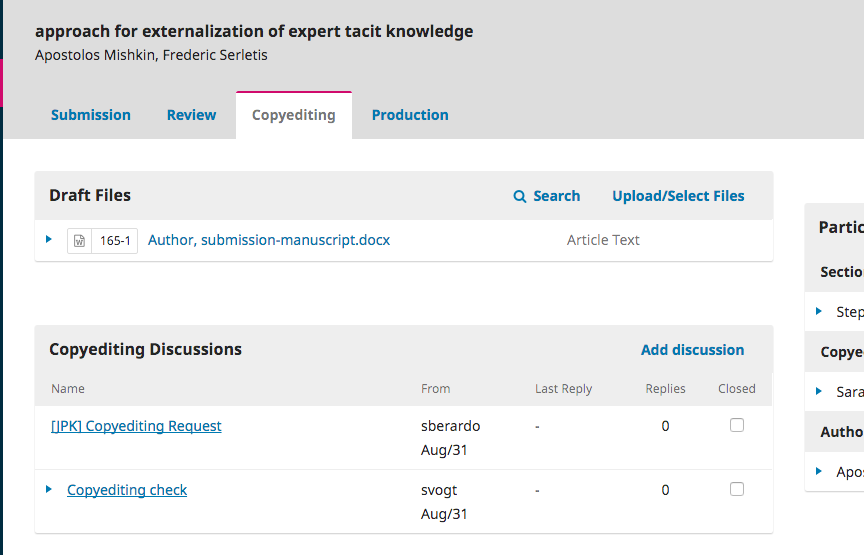

Ahora puede esperar la respuesta del autor.

### El autor responde
Una vez que escuche la respuesta del autor, puede revisar su retroalimentación revisando la respuesta de la discusión.

Desde aquí, puede ver que no se necesitan más modificaciones.

### El archivo final corregido

Ahora puede seguir adelante y subir la versión final corregida al panel Corregido, cerca de la parte inferior de la pantalla.

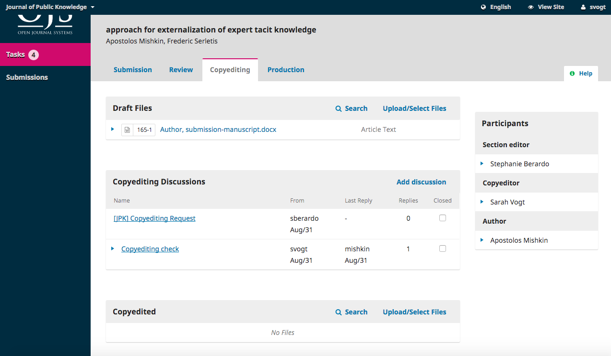

Utilice el enlace Cargar/Seleccionar archivos para cargar la versión final copiada.

Es importante notar aquí que usted tiene algunas opciones.

1.	Puede utilizar el enlace Subir archivo para subir un nuevo archivo (por ejemplo, un archivo con algunos cambios recientes desde que se lo mostró al autor).
2.	Puede seleccionar la versión original del autor (improbable).
3.	Puede seleccionar la versión Copiador, que es la versión que ha enviado al autor (si no ha realizado más modificaciones, seleccione ésta).

Para esta demostración, seleccionaremos la versión del Corrector **marcando la casilla** a la izquierda de ese archivo.

Presiona **OK**.

El archivo ahora es visible en el panel Copiado (cerca de la parte inferior de la pantalla), indicando al editor que esta es la versión final, la cual está lista para la etapa de Producción.

### Informar al editor de la sección

El paso final es informar al Editor de sección de que se ha completado la edición.

Para ello, inicia un nuevo debate de edición utilizando el enlace **Añadir discusión**.

En la ventana de discusión, agregue el Editor de sección, una línea de asunto y un mensaje.

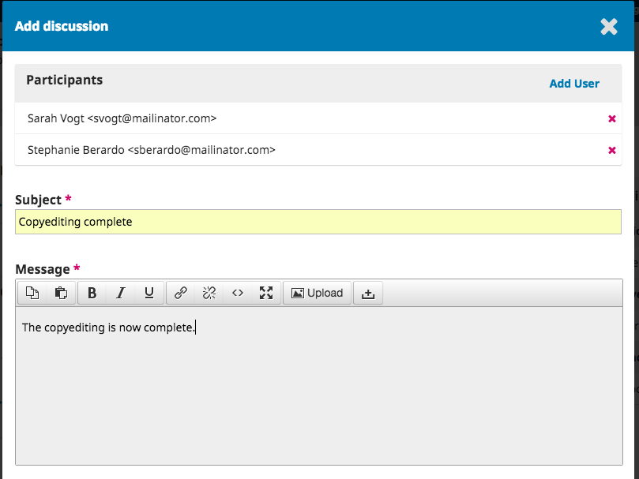

Presione **OK** para enviar el mensaje.

Al volver a la etapa de Edición, se puede ver que se ha contabilizado el mensaje.

Su trabajo como revisor ya está completo!

### Pasar a la Producción

El Editor de sección recibirá un correo electrónico informándole de que la corrección ha finalizado, y verá una notificación en las discusiones.

Puede descargar y revisar la versión final copiada desde el panel Corregido.

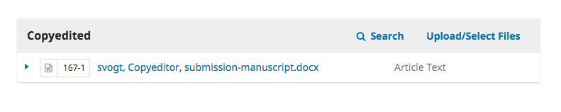

En este punto puede comunicarse más con el corrector o, si está satisfecho, pasar la presentación a la fase de producción.

Para ello, seleccione el botón azul **Enviar a producción**.

Esto generará una notificación oficial a los autores de que el envío está pasando a la siguiente fase.

Note que el archivo apropiado, del panel Corregido, está incluido y será transferido automáticamente a Producción.

Presione **Registrar Decisión Editorial** para proceder.

La etapa de Corrección ha finalizado.

## Producción

Con la finalización de la etapa de Edición, el envío pasa ahora a Producción. A partir de aquí, los archivos copiados (a menudo archivos de Microsoft Word) se convertirán a formatos publicables (por ejemplo, PDF, HTML) y se revisarán antes de publicarlos.

Para empezar a trabajar en Producción, el Editor de Sección debe iniciar sesión en el sistema y elegir el envío desde su panel de control.

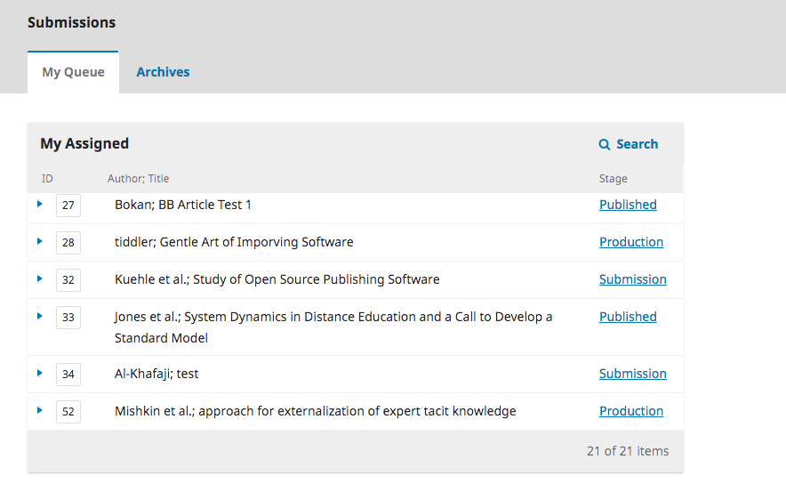

Al elegir el enlace Producción se abrirá el registro de envío.

Verá que los archivos editados ya están disponibles en el panel Archivos listos para producción.

Un banner de notificación también indica que debe asignar a alguien para crear los archivos de la galerada (por ejemplo, los archivos PDF, HTML, etc.) a partir de esos archivos listos para la producción.

Esto puede variar de una revista a otra: es posible que tenga editores de maquetación o asistentes de producción para realizar este trabajo.

Para realizar la asignación, utilice el enlace **Agregar** en la lista de participantes. Esto abrirá una nueva ventana.

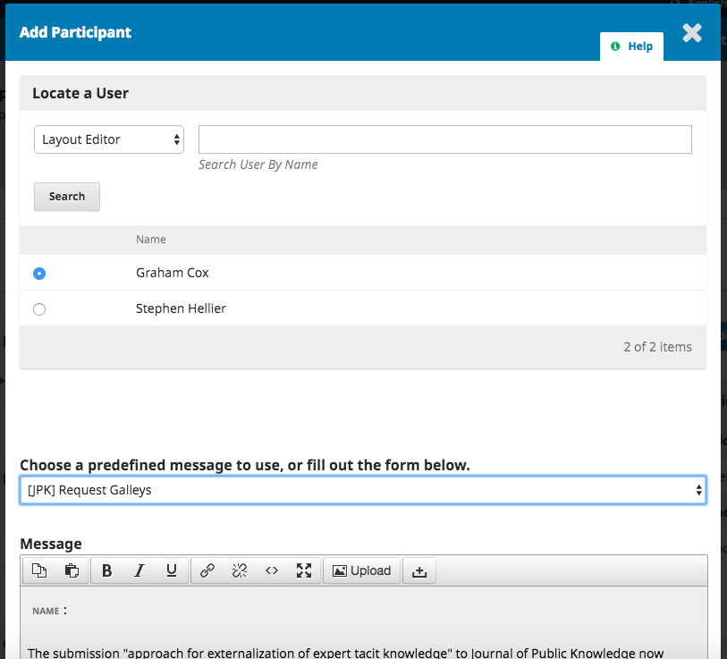

Utilice el selector de funciones y el botón de búsqueda para encontrar los usuarios adecuados, seleccione uno, elija un mensaje predefinido y pulse **OK** para enviarlo.

El usuario ha sido notificado por correo electrónico y en su panel de control.

Observe que la notificación indica ahora que el envío es "Awaiting Galleys". Puede ver el editor de diseño en la lista de Participantes, y puede ver la notificación de solicitud en el panel Discusiones de producción.

Ahora puede esperar a que el editor de maquetas complete sus tareas.

### Edición de maquetas

Como Editor de maquetas, habrá recibido un mensaje invitándole a crear las galeradas para el envío.

Para empezar, inicie sesión en el sistema y vaya a su panel de control.

Desde aquí, busque el envío y seleccione el enlace **Producción**.

Esto le llevará al registro de envío.

Desde el panel **Archivos Listos para la Producción**, descargue los archivos a su escritorio y trabaje fuera de OJS para convertirlos a los formatos apropiados para su revista (por ejemplo, HTML, PDF, etc.).

> Nota: PKP está trabajando actualmente en un proyecto para automatizar la conversión de documentos de Microsoft Word a otros formatos, incluyendo XML, HTML, PDF, EPUB, etc. Mantenga un ojo en nuestro blog para las actualizaciones.

### Decidir sobre los formatos de archivo del artículo

Las revistas en línea publican hoy sus artículos en una variedad de tipos de archivos. Los más comunes son el PDF y el HTML, pero cada vez se utilizan más formatos adicionales, como ePub, MP3 y XML.

La mayoría de los envíos de autores se presentan como documentos de Microsoft Word (.doc o.docx), y normalmente se mueven a través del flujo de trabajo OJS (revisión, revisión, corrección de estilo) en ese formato. Otros formatos a veces incluyen texto (.txt), formato de texto enriquecido (.rtf) u Open Office (.odt). Estos no son adecuados para la publicación final, por lo que tendrán que ser convertidos a un formato más fácil de leer.

#### Trabajar a partir de plantillas

Requerir que todos los envíos utilicen una plantilla preformateada con los estilos de publicación de su revista (por ejemplo, el tipo de letra, el tamaño de letra, la audacia, la ubicación, etc. del encabezado, el cuerpo, los pies de página, etc.) hará que la conversión del documento sea mucho más fácil.

Microsoft proporciona una breve descripción general para crear modelos [aquí](https://www.gitbook.com/book/pkp/ojs3/edit#).

Una vez que haya creado una plantilla que coincida con el estilo de de su revista, debe vincularla desde sus “Pautas para autores”, junto con una breve explicación de la necesidad de usar la plantilla. Esto significa que todos sus envíos vendrán ya formateados, ahorrándole al editor de maquetación una cantidad significativa de trabajo.

He aquí un ejemplo de una revista OJS que requiere que los autores descarguen y utilicen un archivo de plantilla: [Paideusis](https://journals.sfu.ca/pie/index.php/pie#authorGuidelines).

Idealmente, su plantilla debe ser creada usando estilos en lugar de formato directo. Esto no sólo asegura la consistencia de sus documentos, sino que también le ayudará en cualquier conversión a otros formatos (por ejemplo, HTML). He [aquí](https://support.office.com/en-us/article/Style-basics-in-Word-d382f84d-5c38-4444-98a5-9cbb6ede1ba4?CorrelationId=1b00844c-a9dc-4d62-98df-a966f30d4b20&ui=en-US&rs=en-US&ad=US&ocmsassetID=HA010230882) una explicación de la diferencia entre estilos y formato directo en Word.

#### Creación de archivos PDF

Un PDF es el tipo de archivo más fácil de crear a partir de un documento de Word. Las versiones actuales de Microsoft Word (y otros procesadores de texto) le permiten simplemente "Guardar como" un PDF. La mayoría de las revistas de OJS publican sus artículos en formato PDF.

Los PDF también son populares entre muchos lectores, ya que recrean más fielmente la página impresa. Sin embargo, los PDF suelen ser menos flexibles en los dispositivos móviles y no siempre manejan bien los enlaces o los medios incrustados (como archivos de sonido o vídeo). Con la creciente importancia de la informática móvil, asegurar que su audiencia pueda leer fácilmente sus artículos en sus teléfonos o tabletas es cada vez más importante.

Ejemplo (ver enlace PDF en la parte inferior de la página): [Irish Journal of Technology Enhanced Learning](http://www.journal.ilta.ie/index.php/telji/article/view/22/51)

#### Creación de archivos HTML

Los archivos HTML tienen la ventaja de ser flexibles. Manejan muy bien los enlaces y las multimedias, y pueden caber en casi cualquier pantalla - incluyendo teléfonos y tabletas. Sin embargo, tienen un aspecto diferente al de una página impresa, por lo que algunos lectores siguen prefiriendo un PDF. La situación ideal es proporcionar archivos PDF y HTML para satisfacer mejor las necesidades de sus diferentes usuarios.

Vimos en la sección anterior que crear un PDF a partir de un archivo Word enviado es fácil. Desafortunadamente, la creación de archivos HTML consume un poco más de tiempo. Los procesadores de texto no tienen herramientas efectivas para hacer un "Guardar como" en HTML. Microsoft Word intenta hacer esto, pero los resultados no son útiles para subirlos a OJS. En su lugar, intente seguir este flujo de trabajo:

1.	Convierta el documento de Word. Puede utilizar esta [herramienta en línea gratuita](https://word2cleanhtml.com/) para realizar una conversión inicial.
2.	Abra los archivos HTML resultantes en un editor de texto (por ejemplo, NotePad en Windows) o en un editor HTML (por ejemplo, Adobe Dreamweaver). A partir de aquí, tendrá que hacer cualquier limpieza final o formateo. Es necesario entender los conceptos básicos de HTML. No es difícil y hay muchos [tutoriales gratuitos](https://www.w3schools.com/html/), pero toma algún tiempo.
3.	Mantenga el formato HTML básico. Sólo enfóquese en párrafos, saltos de línea, encabezados y enlaces. No se preocupe por las fuentes, colores u otros elementos de diseño - OJS se encargará de todo esto automáticamente como parte del diseño general de la revista.
4.	Subir a OJS como un archivo de galerada HTML

Ejemplo (ver enlace HTML en la parte inferior de la página): [Forum Qualitative Sozialforschung](http://www.qualitative-research.net/index.php/fqs/article/view/2577)

#### Creación de archivos ePUB

Al igual que los archivos HTML, los archivos ePub son ideales para dispositivos móviles, pero requieren una codificación especializada para su creación. Hay herramientas de conversión disponibles, como [Calibre](https://calibre-ebook.com/). Instrucciones más detalladas sobre CÓMO crear archivos ePub están disponibles [aquí](https://www.wikihow.com/Convert-a-Word-Document-to-Epub).

Al igual que con los archivos HTML, es posible que se requiera una limpieza adicional después de la conversión y que se requiera [cierto conocimiento](http://www.jedisaber.com/eBooks/Introduction.shtml) del formato.

Ejemplo (véase el enlace EPUB al final de la página): [International Review of Research in Open and Distance Learning](http://www.irrodl.org/index.php/irrodl/article/view/2895)

#### Creación de archivos de audio

Aunque no es común, algunas revistas también crean archivos de audio de sus artículos, para permitir a los usuarios escuchar el contenido. Esto es particularmente útil para los discapacitados visuales, pero muchas personas disfrutan de podcasts y audiolibros mientras viajan o hacen otras actividades.

La creación de archivos de audio se puede hacer manualmente, haciendo que alguien lea el artículo en una grabadora de voz, o automáticamente usando el software Text to Speech.

Ejemplo (véase el enlace MP3 en la parte inferior de la página): [International Review of Research in Open and Distance Learning](http://www.irrodl.org/index.php/irrodl/article/view/3279)

#### Creación de archivos XML

La creación de archivos XML es una forma muy eficiente de publicar en múltiples formatos. Al crear un archivo XML, puede generar automáticamente archivos PDF, HTML, ePub y otros formatos. PKP está desarrollando una herramienta de conversión XML llamada [Open Typesetting Stack](https://pkp.sfu.ca/open-typesetting-stack/), que actualmente está disponible en versión beta. También puede aprender a crear archivos XML usted mismo. [Excelentes tutoriales](https://www.w3schools.com/xml/) están disponibles en línea, pero requerirán una inversión significativa de tiempo para llegar a ser competentes.

Ejemplo (ver enlace XML en la parte superior derecha de la página): [Journal of Medical Research and Innovation](https://jmri.org.in/jmri/article/view/e000084)

### Contactar con el autor

A continuación, querrá compartir el PDF con el autor para una última mirada y aprobación.

Para ello, utilice el enlace Añadir debate en el panel de debate de producción. Esto abrirá una nueva ventana.

Recuerde añadir el autor en la parte superior de la ventana y, a continuación, añadir un asunto y un mensaje.

Antes de enviar, sin embargo, adjunte una copia del archivo PDF utilizando el enlace Upload File. Esto lo pondrá a disposición del autor.

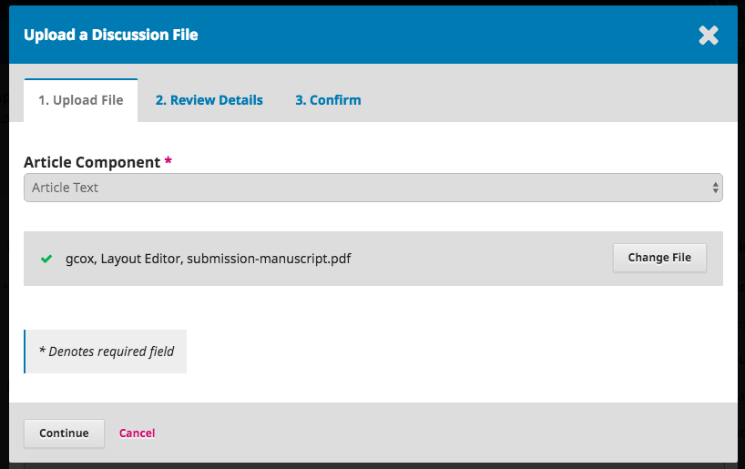

Recuerde seleccionar el componente de artículo correcto y, a continuación, cargar el PDF.

Presione **Continuar**.

A continuación, realice cualquier cambio en el nombre del archivo (normalmente no necesita hacer nada aquí).

Y luego, puede subir archivos adicionales, si es necesario.

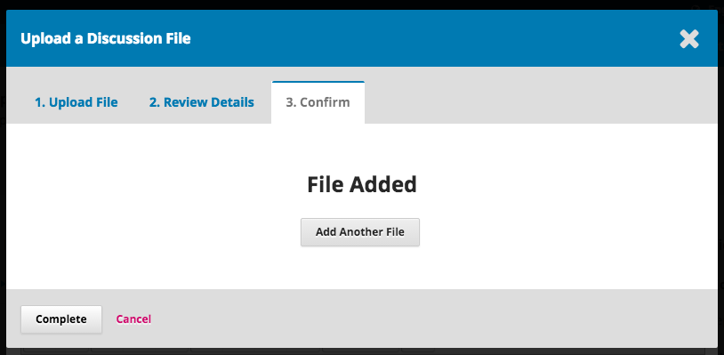

Una vez que haya terminado, presione **Completar**.

El archivo ahora está adjunto y puede enviar el mensaje usando el botón **OK**.

El Autor ha sido notificado y puede esperar su respuesta.

### Respuesta del autor

Una vez que el autor haya tenido la oportunidad de revisar las galeras y responder, usted recibirá una notificación por correo electrónico y verá una respuesta en las Discusiones de Producción.

### Añadir Galeradas

Ahora que el Autor ha corregido las galeradas, puede hacer cualquier cambio final, y luego cargarlos en el panel Galeradas.

Para ello, utilice el enlace Añadir Galerada, que abrirá una nueva ventana.

Añada una etiqueta apropiada (por ejemplo, PDF, HTML, etc.) y pulse **Guardar**.

Desde esta ventana, seleccione el componente del artículo apropiado (por ejemplo, el texto del artículo) y cargue el archivo de la cocina. Presione **Continuar**.

Si es necesario, cambie el nombre del archivo. Presione **Continuar**.

Si tiene más archivos, cárguelos ahora. De lo contrario, pulse **Completar**.

Ahora puede ver las galeradas  en el Panel de Galerada.

Puede realizar cambios en la carga seleccionando la flecha azul a la izquierda de la etiqueta de la cocina, que muestra las opciones para editar, cambiar el archivo o eliminar.

### Informar al editor de la sección

Por último, deberá informar al Editor de sección que las galeras han sido completadas. Para ello, utilice el panel de discusión de producción y seleccione el enlace Añadir discusión.

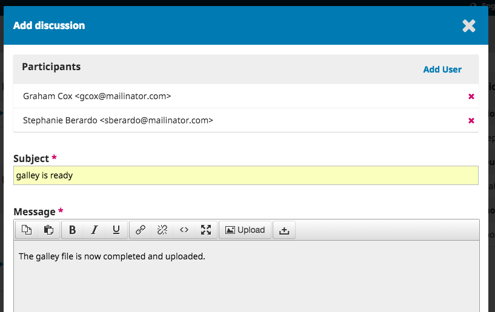

Añada el Editor de sección a la parte superior de la página y, a continuación, incluya un asunto y un mensaje. Presione **OK** para enviar el mensaje.

Ahora puede ver la discusión final.

### Editor de sección Informa al editor

En este punto, el Editor de sección recibe la notificación del Editor de diseño y revisa los archivos de la galerada.

Puede pedirle al editor de maquetas que haga cambios adicionales (usando las discusiones de producción) o informarle al editor que las galeras están listas para su publicación.

Para informar al editor, utilice el enlace **Añadir discusión** del panel de discusión de producción.

### Programación de la publicación

Una vez recibida la notificación de las galeras completadas, el editor inicia sesión en el registro de envío y comprueba los archivos de las galeras cargadas.

Si las galeras parecen estar listas, el editor puede presionar el botón azul de acción **Calendarizar Publicación**.

Al seleccionar este botón se abre una ventana de Publicación.

Utilice esta opción para agregar el envío a un número futuro o anterior de la revista.

También tiene la opción de agregar números de página, permisos e información de licencia.

Si pulsa **Guardar**, el envío se publicará en el número seleccionado. Si el número ya está publicado, el envío estará inmediatamente disponible para los lectores.

Felicitaciones! Han llegado al final del flujo de trabajo editorial.
