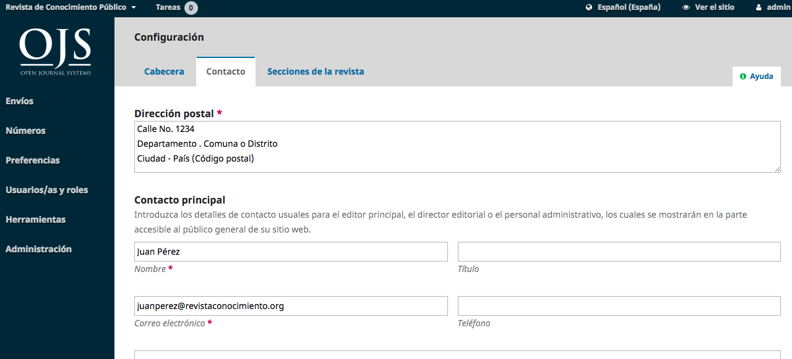

# Capítulo 5: Configuración de la Revista

La sección Configuración le permite configurar su instalación de OJS para que se adapte mejor a sus necesidades de publicación.

Puede encontrar la Configuración en el panel del menú de la izquierda cuando inicie sesión como usuario con permisos de Administrador de la revista.

Consta de Configuración de revista, Configuración de sitio web, Configuración de flujo de trabajo y Configuración de distribución. Este capítulo cubrirá la configuración de la revista. 

La página Configuración de la revista incluye detalles sobre la revista.

Utilice las fichas para navegar a las diferentes secciones de Ajustes de la revista: Cabecera, Contacto, Secciones.

## Cabecera
**Nombre de la revista** es el nombre de su revista. Por ejemplo, *Journal of Software Documentation*.

Las **iniciales de la revista** son las iniciales de la revista. Por ejemplo, *JSD*.

**Abreviatura de la revista** es la abreviatura del nombre de de su revista. Por ejemplo, *JSoftDoc*.

**Editor** es el nombre de la organización que publica la revista.

**ISSN** (International Standard Serial Number) es un número de ocho dígitos que identifica a las revistas. Está gestionado por una red mundial de Centros Nacionales coordinados por un Centro Internacional con sede en París, respaldado por la Unesco y el Gobierno francés. Se puede obtener un número en el sitio web del ISSN. Esto se puede hacer en cualquier momento durante el funcionamiento de la revista. Las revistas de OJS suelen tener un ISSN en línea, pero algunas también pueden publicar una versión impresa, que requiere un ISSN impreso diferente.

**Resumen de la revista** es una breve descripción de su revista. Si está en una instalación de OJS con múltiples revistas, este texto aparecerá con su listado de revistas.

**Masthead** te permite añadir los nombres de tu equipo editorial o de cualquier otra persona que desees mencionar. Esto aparecerá en el sitio web público bajo Acerca de > Equipo Editorial.

**Acerca de la Revista** es un espacio para agregar cualquier información acerca de su revista que pueda ser de interés para lectores, autores o revisores.

Esto podría incluir su política de acceso abierto, el enfoque y el alcance de la revista, el aviso de derechos de autor, la divulgación del patrocinio, la historia de la revista, una declaración de privacidad, y la inclusión en cualquier sistema de archivo LOCKSS o CLOCKSS.

Pulse el botón **Guardar** para guardar los cambios.

## Contacto
Utilice esta sección para agregar contactos de la revista.

**Dirección postal**: Añada aquí la dirección postal oficial de de su revista. Esto aparecerá en la página de Contacto de la revista.

**Contacto principal**: Añada la información de contacto de la persona de contacto principal de la revista.

**Contacto de soporte técnico**: Añada la información de contacto de la persona de soporte técnico de la revista. Esta información aparecerá en la página de Contacto de la revista y también en diferentes puntos del flujo de trabajo para ofrecer ayuda a los usuarios.

Pulse el botón **Guardar** para guardar los cambios.

## Secciones
Utilice esta página para configurar las diferentes secciones de de su revista. Por ejemplo, artículos, editoriales, reseñas, comentarios, etc.

Todas las secciones existentes aparecerán aquí. OJS requiere al menos una sección, y crea una sección "Artículos" por defecto.

Puede modificar las secciones haciendo clic en la flecha azul a la izquierda del nombre de la sección. Esto revelará las opciones para editar o borrar la sección.

### Tratamiento de una sección

Seleccionando el enlace de edición se abrirá una nueva ventana con diferentes opciones de configuración.

Desde aquí, puede modificar el nombre o la abreviatura de la sección.

**Política de la sección**: Utilice este campo para añadir detalles importantes como los requisitos de envío, la revisión por pares, etc.

**Conteo de palabras**: Use esto para limitar el número de palabras para los resúmenes en esta sección.

**Formulario de revisión**: Puede seleccionar formularios de revisión específicos para cada sección. Obtenga más información sobre los formularios de revisión aquí.

**Indexación**: Cada sección puede tener diferentes ajustes de indexación. Por ejemplo, una sección Editorial no suele ser revisada por pares.

**Identificar los elementos publicados en esta sección como a(n)**: Esta es utilizada por algunos sistemas de indexación. Tenga en cuenta que no es un campo obligatorio.

Pulse el botón **Guardar** para guardar los cambios y volver a la página Secciones.

### Crear sección

En la página de secciones, seleccione el enlace **Crear sección** para abrir una ventana en blanco, exactamente igual que la ventana utilizada para editar una sección descrita anteriormente.

Rellene los detalles y pulse Guardar para grabar su trabajo.

### Secciones de pedidos

Cuando haya creado más de una sección, verá un enlace **Ordenar**. Utilícelo para reordenar cómo se muestran esas secciones en el sitio web de su revista.

Pulse el botón **Listo** cuando haya terminado.
