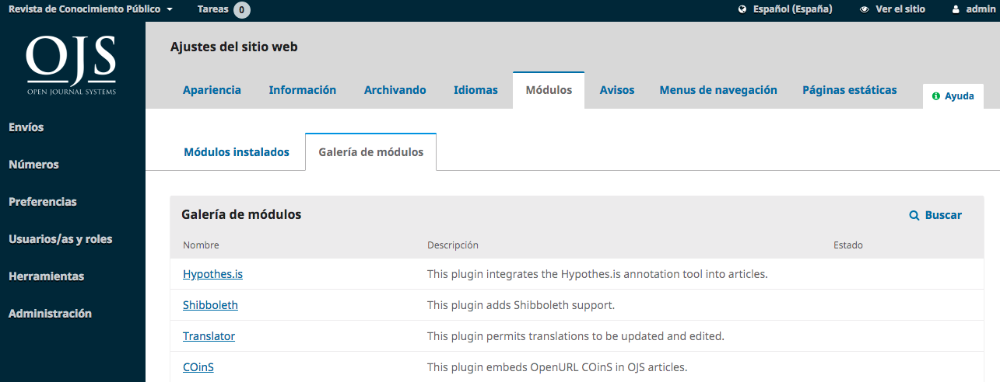

# Capítulo 6: Configuración del sitio web

La Configuración del sitio web le permite configurar el aspecto y funcionamiento del sitio web de su revista. Consiste en pestañas para Apariencia, Información, Archivo, Idiomas, Plugins, Anuncios y Menús de Navegación.

## Apariencia

**Logo:** Utilice este espacio para cargar un logotipo de la revista en la esquina superior izquierda de la interfaz de lectura.

**Pie de página:** Le permite mostrar texto en la parte inferior de cada página de su sitio web.

**Tema:** A medida que haya nuevos temas disponibles, puede habilitarlos aquí.

**Tipografía:** Elija rápidamente las fuentes de su revista.

**Color:** Cambia rápidamente el color del encabezado de su revista.

**Hoja de estilo de la revista:** Utilícela para cargar una hoja de estilo única para la revista.

**Administración de la barra lateral:** Permite mover diferentes bloques dentro o fuera de la barra lateral en la interfaz de lectura.

**Imagen de la página de inicio:** Subir una imagen aquí la colocará en la página de inicio de su revista.

**Favicon de la revista:** Añade un favicon para que aparezca en la barra de direcciones del navegador del lector.

**Contenido Adicional:** Cualquier texto ingresado aquí aparecerá en su página de inicio.

**Listas:** Limite el número de elementos (por ejemplo, presentaciones, usuarios o asignaciones de edición) que se mostrarán en una lista antes de mostrar los elementos subsiguientes en otra página. Además, limite el número de enlaces a mostrar a las páginas siguientes de la lista.

**Miniaturas de revistas:** Suba un pequeño logotipo o imagen representativa de la revista que se utilizará en las listas de revistas de esta instalación de OJS. Esto sólo se usará en instalaciones de OJS con múltiples revistas.

Presione **Guardar** para grabar los cambios.

## Información

Utilice estos campos para modificar el texto de las páginas Para los lectores, Para los autores, Para los bibliotecarios del sitio web de la revista.

Recuerde presionar **Guardar** para registrar cualquier cambio.

## Archivo

Si usted es miembro de una red LOCKSS o CLOCKSS, utilice esta página para activar de su revista.

## Idiomas

Utilice esta página para configurar los idiomas utilizados por su revista.

**Primary Locale:** Un idioma debe ser configurado como primario.

**UI:** Esto permitirá que todos los idiomas seleccionados aparezcan en la interfaz de lectura.

**Envío:** Esto permitirá que todos los idiomas seleccionados estén disponibles para los autores.

**Formularios:** Esto permitirá que todos los idiomas seleccionados estén disponibles al rellenar formularios en línea.

Si un idioma no está disponible en esta página, póngase en contacto con el Administrador del Sitio para agregarlo por usted. Ver  [Capítulo 4: Administración del Sitio](./site-administration.md) para más detalles en el Capítulo 4.

## Plugins
Use esta página para ver todos los plugins instalados y encontrar nuevos plugins.

### Plugins instalados
Todos los plugins listados aquí están disponibles en su instalación de OJS. Utilice el enlace Habilitar para utilizarlos.

Notará que algunos plugins son necesarios para el sistema y no pueden ser desactivados.

### Galería de plugins
La Galería de plugins proporciona acceso a plugins creados externamente, que pueden no estar incluidos en la instalación de OJS, pero que están disponibles para su descarga y activación.

La selección del título del plugin proporcionará detalles adicionales, incluyendo el autor, el estado, la descripción y la compatibilidad.

## Anuncios

Esta sección le permite crear y mostrar anuncios de noticias en el sitio web de la revista.

**Anuncios:** Configure cómo aparecerán los anuncios en el sitio web de su revista.

**Tipos de anuncios:** Puede crear diferentes tipos de anuncios (por ejemplo, Noticias, Alerta de nuevos números, etc.). Utilice el enlace Agregar tipo de anuncio para crearlos.

**Anuncios:** Utilice el enlace Añadir anuncio para crear un nuevo anuncio para su página de anuncios.

## Menús de navegación

Esta sección le permite configurar sus menús de navegación, como la inclusión de nuevos enlaces.

_Menús de navegación:_ Configure el Menú de usuario (que incluye Idioma, Ver sitio y Nombre de usuario) o el Menú principal (en la página principal de la revista, incluyendo Actual, Archivo, Acerca de, etc.).

_Ítems del menú de navegación:_ Estos son enlaces programados que puede agregar a cualquiera de los menús anteriores. Si desea añadir un enlace al menú principal (por ejemplo, "Nuestra Sociedad"), añádalo aquí utilizando el enlace Añadir elemento.

Ahora aparecerá en la lista de elementos del menú de navegación. A continuación, vaya al menú de navegación deseado (p. ej., Primario), utilice la flecha azul para mostrar las opciones y seleccione Editar. Ahora puede arrastrarlo y soltarlo desde Elementos de menú sin asignar a Elementos de menú asignados a la ubicación apropiada en el menú.

Presione Guardar para grabar el cambio.
