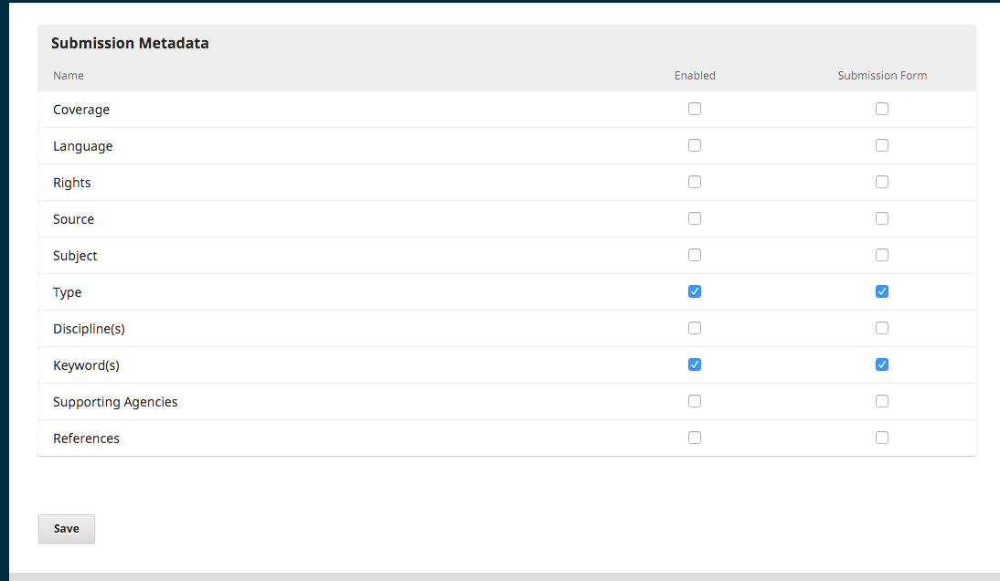

# Capítulo 7

La opción Configuración del Flujo de Trabajo le permiten configurar las diferentes partes del flujo de trabajo editorial de la revista. Sus pestañas incluyen Componentes, Presentación, Revisión, Biblioteca del Editor y Correos Electrónicos.

## Componentes

Cuando un autor hace una presentación, puede cargar varios archivos. Normalmente, un archivo será el texto del artículo, y otros archivos pueden incluir transcripciones de entrevistas, datos, imágenes, etc. Cada uno de estos archivos es un **componente** de la presentación. Los componentes disponibles para su elección por el autor al hacer su presentación se enumeran aquí.

Utilizando los enlaces proporcionados, usted puede cambiar el **Orden** de los componentes (cómo serán enumerados para el autor que somete la presentación), **Agregar un componente** (si hay algo que se necesita y que no está incluido de forma predeterminada --por ejemplo, un vídeo--) o **Restablecer los valores predeterminados** (si alguien ha hecho demasiadas modificaciones y usted solo desea restablecer todo).

### Editar el componente

Usted también puede editar cada componente seleccionando la flecha azul a la izquierda del nombre del componente. Al hacerlo, aparecerá un enlace Editar y un enlace Eliminar. 

**Nombre**: Este es el nombre del componente, como se presenta para el autor.

**Opciones**: Elija la manera en que se tratarán y mostrarán los archivos asociados a este componente. Todo lo que esté marcado como un archivo dependiente no será publicado.

**Agrupación por tipo de archivo**: Determine si este componente está asociado con el documento presentado, consiste en ilustraciones o es un archivo complementario.

## Presentación

Utilice esta sección para configurar el proceso de presentación.

**Directrices para el autor**: Utilice este campo para agregar directrices para sus autores. Esta información se mostrará en el sitio web de la revista.

**Lista de verificación de preparación para la presentación**: Los autores deben marcar que están de acuerdo con cada elemento de esta lista. Utilice el enlace _Order_ para cambiar el orden de los elementos, utilice el enlace _Agregar elemento_ para crear un nuevo elemento, y utilice la flecha azul a la izquierda del nombre del elemento para editar un elemento de resultado.

**Aviso de presentación del autor**: Agregue una dirección de correo electrónico aquí para ser contactado siempre que se someta una nueva presentación.

**Metadatos de la presentación**: Esta sección le permite determinar qué campos de metadatos deben usarse para su revista.

Cada entrada es un diferente tipo de metadatos disponible para cada artículo en su revista.

Algunas revistas pueden desear activarlos todos, pero muchas querrán mantenerlos de manera simple y solo elegir palabras clave.

Si usted elige _Activado_, ese tipo de metadatos se agregará a sus presentaciones para ser completadas por un editor.

Si usted elige _Formato de presentación_, ese tipo de metadatos también será presentado a sus autores para que ellos lo completen al presentar su manuscrito.

Recuerde oprimir el botón **Guardar** para registrar cualquier cambio en esta página.

**Declaración de privacidad**: La declaración de privacidad predeterminada se puede modificar si usted lo desea.

## Revisar

Esta pestaña le permite configurar el proceso de revisión de su revista.

**Fechas límite de revisión predeterminadas**: Indique cuánto tiempo tienen los revisores para decidir si aceptan o rechazan una solicitud de revisión del editor, y cuánto tiempo tienen para hacer una recomendación.

**Mensajes de correo electrónico de recordatorio automatizados**: Se informará automáticamente a los revisores cuando sean asignados para realizar una revisión; sin embargo, usted podría querer activar o desactivar los mensajes de correo electrónico de recordatorio para los revisores. Utilice el menú desplegable para seleccionar ya sea el número de días o "No recordar nunca" en "Enviar un recordatorio si un revisor no ha respondido a una solicitud de revisión en los siguientes (días) después de la fecha límite de la respuesta” para establecer el número de días que pueden transcurrir después de la fecha límite antes que se envíe a los revisores un recordatorio de aceptación o rechazo de una solicitud de revisión.

Utilice el menú desplegable para seleccionar ya sea el número de días o “No recordar nunca" en “Enviar un aviso si un revisor no ha respondido a una solicitud de revisión en el curso de (días) después de la fecha límite de respuesta" para establecer el número de días que pueden transcurrir después de la fecha límite antes que se envíe a los revisores un recordatorio de que deben hacer una recomendación en relación con una presentación.

Tenga en cuenta que el Administrador de la Página debe configurar algunas características del sistema para enviar correos electrónicos. Consulte la [Guía del administrador](https://docs.pkp.sfu.ca/admin-guide/en/email) para obtener información adicional.

**Formatos de revisión**: Los formatos de revisión plantean a los revisores un conjunto de preguntas que deben responder. Estas pueden ayudar a enfocar sus comentarios de la manera que sea más útil para usted.

**Crear un formato de revisión**: Utilice el enlace Crear formato de revisión para elaborar un nuevo formato.

La sección _Descripción e instrucciones_ proporciona información sobre el formato y cuándo usarlo para los Gerentes y Editores de la revista. Este contenido no está incluido en el formato que se muestra a los revisores. Usted puede agregar instrucciones y directrices para los revisores en la sección Directrices de Revisión \(a continuación\).

En la página _Formato de revisión_, seleccione la flecha azul a la izquierda del nombre del formato para que se muestre el enlace _Edit_.    

Seleccione el enlace _Edit_ y complete el formato.

**Elementos** son preguntas del formato.

Usted puede elegir si una pregunta dada se requiere y hacer que se muestre al autor.

A continuación, puede elegir el tipo de respuesta, incluyendo:
* un cuadro de texto de una sola palabra
* un cuadro de texto de una sola línea
* un cuadro de texto extenso (para respuestas más largas)
* casillas de verificación (el revisor puede seleccionar varias respuestas posibles)
* botones de radio (donde el revisor puede seleccionar solo una respuesta posible)
* menú desplegable (donde los revisores pueden seleccionar solo una respuesta posible)

**Opciones de respuesta** son las selecciones que usted puede hacer que sean disponibles para las casillas de verificación, los botones de radio o los menús desplegables. Un buen ejemplo de una respuesta a una casilla de verificación es una [escala tipo Likert](https://es.wikipedia.org/wiki/Escala_Likert), donde el revisor debe elegir solo una opción: Por ejemplo, Bueno, neutral, malo.

Recuerde oprimir el botón **Guardar** para registrar los cambios que haga.

Utilice la pestaña **Vista previa** para probar el formato.

Una vez que envíe el formato a un revisor, ya no podrá editarlo porque hacerlo implicaría cambiar el registro para las revisiones existentes utilizando ese formato. Si desea realizar cambios en el formato de revisión en ese momento, puede copiar el formulario existente y crear una nueva versión actualizada.

**Revisión ciega**: Marque esta casilla para que se muestre un enlace para obtener instrucciones sobre cómo asegurar que todos los archivos de presentación sean anónimos.

**Conflicto de intereses**: Agregue su declaración sobre la política de divulgación de intereses contrapuestos aquí.

**Declaración de conflicto de intereses del revisor**: Agregue una casilla de verificación para marcar que los revisores aceptan cumplir con su declaración de conflicto de intereses.

**Directrices de revisión**: Proporcione a los revisores los criterios para dictaminar sobre la idoneidad de una presentación para su publicación en la prensa; estos pueden incluir instrucciones para preparar una revisión eficiente y provechosa.

**Review Options**: Seleccione si su revista seguirá un proceso de revisión doble ciego, ciego, o abierto.

**Acceso del revisor**: activar (predeterminado) la primera opción para permitir a los revisores acceder con un solo clic a la revisión, obviando la necesidad de ir a la página web, iniciar la sesión y encontrar la presentación. Por razones de seguridad con esta opción, los editores no pueden modificar las direcciones de correo electrónico o agregar CC o BCC antes de enviar invitaciones a los revisores.

Al activar la segunda opción se limita el acceso a los archivos presentados hasta después de que el revisor ha aceptado realizar la revisión.

Oprima el botón **Guardar** para registrar los cambios que haga.

## Biblioteca del editor

Utilice la Biblioteca del Editor para almacenar documentos importantes, tales como el Plan de Comercialización de su revista, y compartirlos con su equipo editorial.

## Correos electrónicos

La sección le permite configurar los correos electrónicos que se envían desde el sistema.

**Firma**: La información en este campo se agregará a la parte inferior de cada correo electrónico enviado por el sistema.

**Dirección del remitente**: Se enviará un aviso a esta dirección de correo electrónico sobre cualquier correo electrónico enviado por el sistema que no llegue a su destinatario, como cuando la dirección de correo electrónico del destinatario ya no es válida.

**Plantillas de correo electrónico preparadas**

OJS facilita la comunicación del flujo de trabajo a través del uso de mensajes de correo electrónico preparados. Usted puede ver y modificar estas plantillas de correo electrónico preparadas aquí. Por favor tenga en cuenta que se requiere realizar cierta configuración para enviar mensajes de correo electrónico. Consulte la [Guía del administrador](https://docs.pkp.sfu.ca/admin-guide/en/email) para obtener información adicional.

**Desactivar las plantillas de correo electrónico**

Todas las plantillas están activadas de forma predeterminada al instalar OJS, pero usted puede desactivar algunas plantillas quitando la marca de la casilla en el extremo derecho con el título "Activada." La mayoría de las plantillas que se pueden desactivar son mensajes que se envían automáticamente por OJS. La desactivación de la plantilla significará que no se enviará el aviso automático.

**Editar las plantillas de correo electrónico**

Cuando usted edita una plantilla de correo electrónico, puede cambiar lo que va a decir cada vez que se utilice. Para correos electrónicos que se envían voluntariamente, por ejemplo, un mensaje que se envía a un revisor solicitándole que revise una presentación, usted también puede cambiar el contenido del mensaje al momento de enviarlo. Esto cambia solamente el contenido de dicho mensaje.

Para editar una plantilla:
1. Vaya a Preferencias de flujo de trabajo > Correos electrónicos > Plantillas de correo electrónico preparadas
2. Haga clic en la flecha azul al lado del nombre de la plantilla para que se muestren los enlaces debajo de ella
3. Haga clic en Edit Email
4. Realizar cambios en el asunto y el cuerpo del texto. Tenga cuidado de no borrar etiquetas tales como "{$authorName}:", las cuales insertan automáticamente el contenido de una presentación.
5. Cuando haya terminado de editar, haga clic en Guardar.

**Volver a cargar las plantillas de correo electrónico predeterminadas**

Si ha modificado las plantillas de correo electrónico pero desea revertir las ediciones y restaurarlas a su contenido predeterminado, usted puede restablecerlas:
1. Vaya a Preferencias de flujo de trabajo > Correos electrónicos > Plantillas de correo electrónico preparadas
2. Haga clic en Reconfigurar todas las plantillas
3. Cuando aparezca el mensaje de confirmación, haga clic en Guardar.

**Agregar plantilla de correo electrónico**

Aunque hay un botón para Agregar una plantilla de correo electrónico, que se puede utilizar para crear una plantilla de correo electrónico personalizada, no estará disponible para su uso en ninguna fase del flujo de trabajo. Esta característica estará disponible en una futura versión de OJS 3.x.

**Agregar archivo anexo al correo electrónico**

La versión OJS 3 no incluye ninguna opción para anexar archivos directamente al correo electrónico, pero usted puede cargar y compartir archivos públicos a través de la Biblioteca del Editor:
1. En Preferencias de flujo de trabajo > Biblioteca editorial > Correos electrónicos, suba su documento y marque la casilla “Acceso público.” 
2. Haga clic en "Guardar" para que se genere la URL
3. Inserte la URL en su correo electrónico.

Usted también puede elegir modificar una plantilla de correo electrónico existente con esta URL, o compartirla públicamente en la página web.
