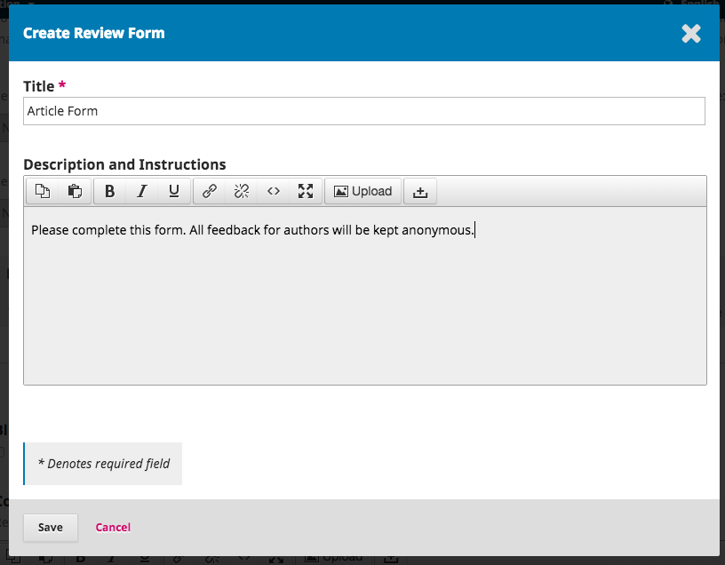

# Capítulo 7

La opción Configuración del Flujo de Trabajo le permiten configurar las diferentes partes del flujo de trabajo editorial de la revista. Sus pestañas incluyen Componentes, Presentación, Revisión, Biblioteca del Editor y Correos Electrónicos.

## Componentes

Cuando un autor hace una presentación, puede cargar varios archivos. Normalmente, un archivo será el texto del artículo, y otros archivos pueden incluir transcripciones de entrevistas, datos, imágenes, etc. Cada uno de estos archivos es un **componente** de la presentación. Los componentes disponibles para su elección por el autor al hacer su presentación se enumeran aquí.

Utilizando los enlaces proporcionados, usted puede cambiar el **Orden** de los componentes (cómo serán enumerados para el autor que somete la presentación), **Agregar un componente** (si hay algo que se necesita y que no está incluido de forma predeterminada --por ejemplo, un vídeo--) o **Restablecer los valores predeterminados** (si alguien ha hecho demasiadas modificaciones y usted solo desea restablecer todo).

### Editar el componente

Usted también puede editar cada componente seleccionando la flecha azul a la izquierda del nombre del componente. Al hacerlo, aparecerá un enlace Editar y un enlace Eliminar. 

**Nombre**: Este es el nombre del componente, como se presenta para el autor.

**Opciones**: Elija la manera en que se tratarán y mostrarán los archivos asociados a este componente. Todo lo que esté marcado como un archivo dependiente no será publicado.

**Agrupación por tipo de archivo**: Determine si este componente está asociado con el documento presentado, consiste en ilustraciones o es un archivo complementario.

## Presentación

Utilice esta sección para configurar el proceso de presentación.

**Directrices para el autor**: Utilice este campo para agregar directrices para sus autores. Esta información se mostrará en el sitio web de la revista.

**Lista de verificación de preparación para la presentación**: Los autores deben marcar que están de acuerdo con cada elemento de esta lista. Utilice el enlace _Order_ para cambiar el orden de los elementos, utilice el enlace _Agregar elemento_ para crear un nuevo elemento, y utilice la flecha azul a la izquierda del nombre del elemento para editar un elemento de resultado.

**Aviso de presentación del autor**: Agregue una dirección de correo electrónico aquí para ser contactado siempre que se someta una nueva presentación.

**Metadatos de la presentación**: Esta sección le permite determinar qué campos de metadatos deben usarse para su revista.

Cada entrada es un diferente tipo de metadatos disponible para cada artículo en su revista.

Algunas revistas pueden desear activarlos todos, pero muchas querrán mantenerlos de manera simple y solo elegir palabras clave.

Si usted elige _Activado_, ese tipo de metadatos se agregará a sus presentaciones para ser completadas por un editor.

Si usted elige _Formato de presentación_, ese tipo de metadatos también será presentado a sus autores para que ellos lo completen al presentar su manuscrito.

Recuerde oprimir el botón **Guardar** para registrar cualquier cambio en esta página.

**Declaración de privacidad**: La declaración de privacidad predeterminada se puede modificar si usted lo desea.

## Revisar

Esta pestaña le permite configurar el proceso de revisión de su revista.

**Fechas límite de revisión predeterminadas**: Indique cuánto tiempo tienen los revisores para decidir si aceptan o rechazan una solicitud de revisión del editor, y cuánto tiempo tienen para hacer una recomendación.

**Mensajes de correo electrónico de recordatorio automatizados**: Se informará automáticamente a los revisores cuando sean asignados para realizar una revisión; sin embargo, usted podría querer activar o desactivar los mensajes de correo electrónico de recordatorio para los revisores. Utilice el menú desplegable para seleccionar ya sea el número de días o "No recordar nunca" en "Enviar un recordatorio si un revisor no ha respondido a una solicitud de revisión en los siguientes (días) después de la fecha límite de la respuesta” para establecer el número de días que pueden transcurrir después de la fecha límite antes que se envíe a los revisores un recordatorio de aceptación o rechazo de una solicitud de revisión.

Utilice el menú desplegable para seleccionar ya sea el número de días o “No recordar nunca" en “Enviar un aviso si un revisor no ha respondido a una solicitud de revisión en el curso de (días) después de la fecha límite de respuesta" para establecer el número de días que pueden transcurrir después de la fecha límite antes que se envíe a los revisores un recordatorio de que deben hacer una recomendación en relación con una presentación.

 para obtener información adicional.

**Formatos de revisión**: Los formatos de revisión plantean a los revisores un conjunto de preguntas que deben responder. Estas pueden ayudar a enfocar sus comentarios de la manera que sea más útil para usted.

**Crear un formato de revisión**: Utilice el enlace Crear formato de revisión para elaborar un nuevo formato.

