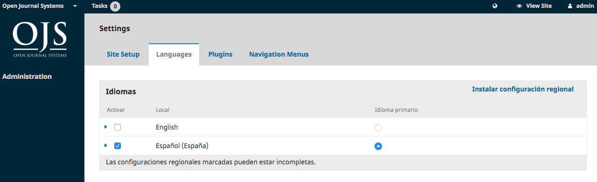
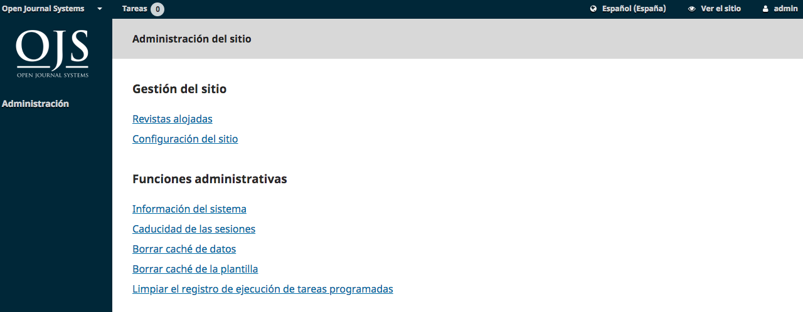

# Capítulo 4: Administración del sitio

Como parte de la instalación de OJS, habrá creado una cuenta de usuario de Administrador del Sitio. Cuando inicie sesión en OJS con esa cuenta, tendrá acceso a la configuración del Administrador del Sitio desde el Panel.

Podrá crear nuevas instancias de la revista alojadas, gestionar el soporte de idiomas en todo el sistema y realizar otras funciones administrativas.

## Administración del sitio

Para llegar a la Administración del Sitio, inicie sesión como Administrador del Sitio y seleccione Administración en el menú de la izquierda.

### Revistas alojadas

Desde aquí, seleccione Revistas alojadas. En la página resultante, verá todas las revistas en esta instalación de OJS. En el ejemplo de abajo, sólo hay uno.

Para editar la revista existente, haga clic en la flecha azul a la izquierda del nombre de la revista. Verá opciones para editar, eliminar o actualizar la configuración.

**Editar** le permitirá cambiar el título, la descripción o la ruta.

**Eliminar** le permitirá eliminar la revista de la instalación. Se le pedirá que confirme que realmente desea hacerlo, ya que es irreversible.

El **Asistente de configuración** le llevará a las distintas opciones de configuración para esa revista. Repasaremos estos ajustes en detalle en el Capítulo 5.

Usuarios le permitirán agregar y administrar los usuarios asociados con esta revista.

De vuelta en la página Revistas alojadas, puede utilizar el enlace **Crear revista** para agregar una nueva revista a esta instalación de OJS. Desde el formulario resultante, rellene los campos con la nueva información.

Nota: Si aún no desea que la nueva revista sea visible, desmarque la casilla Habilitar esta revista para que aparezca públicamente en el sitio.

## Configuraciones del sitio
Esta sección aparecerá si tiene dos o más revistas y le permite agregar información sobre su instalación general de OJS, no revistas individuales.

### Configuración del sitio
Esto incluye el nombre de su sitio, un logotipo del sitio, una declaración introductoria acerca de su sitio, un pie de página del sitio, una opción de redirección (si sólo planea tener una revista en esta instalación), información de contacto, una longitud mínima de contraseña para usuarios registrados, opciones de hojas de estilo y temas, y administración de la barra lateral.

Usted tendrá la oportunidad de proporcionar detalles sobre su(s) revista(s) individual(es) en una etapa posterior.

### Idiomas
OJS es un sistema multilingüe y puede agregar idiomas adicionales a su sitio aquí, poniéndolos a disposición de todas las revistas de su instalación.

OJS 3.1 todavía no tiene tantas traducciones como OJS 2, pero esperamos tener más traducciones con el tiempo. Las contribuciones son siempre bienvenidas.

### Plugins

Desde aquí, puede elegir activar o desactivar varios plugins, haciéndolos disponibles (o no) para todas las revistas en esta instalación de OJS

### Menús de navegación

Utilice esta sección para modificar los menús de su sitio. Puede obtener más información sobre la configuración de menús en el Capítulo 5.

### Próximos pasos
Una vez que haya creado una revista y configurado los ajustes del sitio, es posible que desee crear una cuenta de usuario para el Administrador o Editor de la revistas (consulte el Capítulo 7 para obtener más información).

## Funciones Administrativas

Esta sección proporciona información detallada sobre el servidor en el que se está ejecutando la instalación de OJS.

## Información del sistema
Utilice esta sección para obtener más información sobre el servidor que ejecuta la instalación.

La información de la versión de OJS muestra qué versión está instalada actualmente, y su historial de versiones incluyendo cualquier actualización. Puede hacer clic en el enlace Buscar actualizaciones para ver si está utilizando la versión más reciente de OJS.

La Información del Servidor proporciona detalles sobre el entorno del servidor que alberga su instalación de OJS.

La sección Configuración de OJS muestra todas las opciones de configuración y sus valores tal y como están en “config.inc.php”.

Puede encontrar más información sobre los parámetros de configuración de "config.inc.php" en el propio archivo.

La sección final de esta página muestra información adicional del servidor: su sistema operativo, versión PHP, información del servidor y de la base de datos. También puede ver información extendida de PHP haciendo clic en el enlace de información Extendida de PHP (esto muestra la salida de phpinfo()).

Toda esta información puede ser útil cuando se intenta solucionar un problema.

## Expirar Sesiones de Usuario

Al hacer clic en Expirar sesiones de usuario se borran inmediatamente todas las sesiones de usuario activas en el sistema, lo que requiere que cualquier usuario que esté conectado en ese momento vuelva a iniciar sesión en el sistema. Esto puede ser útil antes de una actualización, para asegurar que todos los usuarios estén desconectados.

## Borrar cachés de datos
Al hacer clic en Borrar caché de datos se borran todos los datos almacenados, incluida la información de localización, la caché de ayuda y la caché de búsqueda. Esta función puede ser útil para forzar la recarga de datos después de haber realizado las personalizaciones.

## Borrar la caché de plantillas
Al hacer clic en Borrar caché de plantillas, se borran todas las versiones en caché de las plantillas HTML. Esta función puede ser útil para forzar que las plantillas se recarguen después de que se hayan hecho las personalizaciones.

## Borrar registros de ejecución de tareas programadas
Si se han habilitado las tareas programadas para la revista, al hacer clic en Borrar registros de ejecución de tareas programadas se eliminarán los archivos de registro de ejecución de tareas del servidor. Los archivos de registro de ejecución incluyen fechas que corresponden a tareas programadas previamente completadas (por ejemplo, el envío automático de recordatorios de revisión por correo electrónico).

