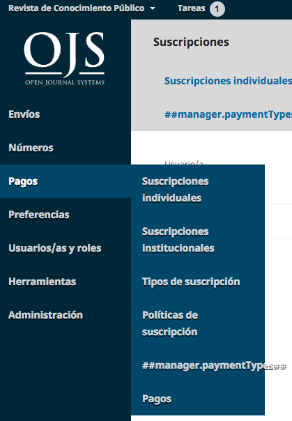
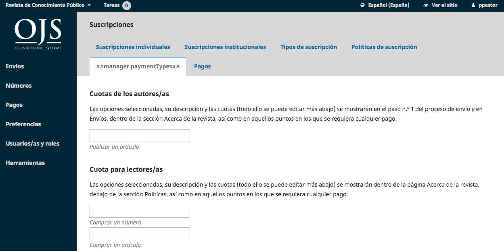

# Capítulo 12: Suscripciones
OJS 3.1 le permite restringir parte o todo su contenido a los suscriptores. Para habilitar las Suscripciones, vaya primero a Preferencias > Distribución > Pagos.

Una vez allí, en Opciones generales, debe dar un clic a la frase “Haga clic aqui para habilitar módulo de pagos...”

Luego, presione el botón Guardar. Aparecerá en el menú izquierdo de la pantalla, el enlace a Pagos

Observe que el menú indica Pagos, pero los elementos a ver se refieren principalmente a suscripciones. Además la administración de tipos de pagos, figura no traducida. No se complique, es sólo un tema de traducción que se solucionará en un plazo breve de tiempo. La funcionalidad de cada opción no está afectada.

## Políticas de suscripción
Rellene los detalles sobre sus políticas de suscripción en esta página.

**Administrador de suscripciones**: Agregue los datos personales de la persona responsable.

**Información de suscripción**: Agregue los detalles de la política para que se muestren en el sitio web de la revista.

**Vencimiento de la suscripción**: Determine si los suscriptores anteriores deben continuar teniendo acceso a contenido más antiguo.

**Recordatorio de vencimiento de suscripción**: Configure recordatorios de renovación automatizados.

**Notificaciones de pago en línea**: Mantenga informado al Administrador de suscripciones sobre las actividades de pago.

**Opciones de acceso abierto para revistas de suscripción**: Si es necesario, seleccione el número de meses en curso para restringir el acceso. El contenido anterior se abrirá automáticamente.

## Tipos de suscripción
El siguiente paso para configurar la administración de suscripciones es designar los tipos de suscripciones que ofrece la revista.

Las revistas suelen ofrecer tarifas de suscripción individual e institucional. Algunas revistas pueden tener ofertas especiales para miembros de una organización o estudiantes. OJS soportará la gestión de suscripciones impresas y/o en línea. Se puede crear más de un tipo de suscripción para cubrir períodos de tiempo más largos (12 meses, 36 meses).

Seleccione **Crear nuevo tipo de suscripción** para agregar uno nuevo.

**Nombre del tipo de suscripción**: Dé a este nuevo tipo de suscripción un nombre único (por ejemplo, Estudiante).

**Descripción**: Proporcione una breve descripción que aparecerá en el sitio web.

**Coste**: Seleccione el tipo de moneda y el importe.

**Formato**: Elija el formato apropiado (p. ej., En línea)

**Duración**: Introduzca el número de meses que cubrirá este tipo de suscripción (por ejemplo, 12).

**Suscripciones**: Indique si este tipo cubre a individuos o instituciones.

**Opciones**: Seleccione las opciones apropiadas (si las hay).

## Tipos de pago
Si aún no lo ha hecho, vaya a Ajustes > Distribución > Pagos y establezca la moneda y el método de pago adecuados (por ejemplo, Paypal).

Utilice esta página para establecer los montos que se cobran por los distintos tipos de cargos.

**Opciones generales**: Marque esta opción para permitir que se cobren los pagos.

**Honorarios del autor**: Establezca la cantidad a cobrar por un cargo por procesamiento de artículo (APC).

**Tarifas del lector**: Utilice esta opción para cobrar tarifas de lector distintas a las de las suscripciones.

**Tarifas generales**: Utilícela para cobrar otras tarifas, como membresías.

## Pagos
A medida que se reciban varios pagos, se mostrarán en esta pestaña.

## Suscripciones individuales
Todos los tipos de suscripciones individuales aparecerán aquí.

Puede crear una nueva suscripción individual utilizando el enlace Crear nueva suscripción. Sin embargo, primero deberá crear una nueva cuenta para esa persona en Usuarios y funciones (consulte el Capítulo 7). Una vez hecho esto, puede buscar la cuenta aquí, y aplicar las diferentes configuraciones.

**Tipo de suscripción**: Seleccione el tipo apropiado para este nuevo suscriptor (por ejemplo, Estudiante) y su estado (por ejemplo, Activo).

Los tipos de suscripción se configuraron anteriormente en este capítulo.

**Fecha**: Establezca las fechas de inicio y fin de esta suscripción.

**Afiliación**: Si el suscriptor está asociado con alguna membresía relevante, agregue esa información aquí (opcional).

**Número de referencia**: Si la suscripción está asociada a un número de referencia relevante (por ejemplo, un número de factura para el pago), añada esa información aquí (opcional).

**Notas**: Si tiene alguna nota relevante que agregar, anote esa información aquí (opcional).

## Suscripciones institucionales
Todos los tipos de suscripciones institucionales aparecerán aquí.

Las suscripciones institucionales se gestionan de forma similar a las suscripciones individuales, pero se utilizan para bibliotecas, institutos de investigación y otras organizaciones que se suscriben a su revista.

Puede crear una nueva suscripción individual utilizando el enlace Crear nueva suscripción. Sin embargo, primero deberá crear una nueva cuenta para la persona de contacto de la institución en Usuarios y funciones (consulte el Capítulo 7). Una vez hecho esto, puede buscar la cuenta aquí, y aplicar las diferentes configuraciones.

**Tipo de suscripción**: Seleccione el tipo apropiado para este nuevo suscriptor (por ejemplo, Biblioteca) y su estado (por ejemplo, Activo).

Los tipos de suscripción se configuraron anteriormente en este capítulo.

**Fecha**: Establezca las fechas de inicio y fin de esta suscripción.

**Institución**: Añada el nombre de la institución para esta suscripción (por ejemplo, Simon Fraser University Library).

**Dirección Postal**: Agregue la dirección de la institución.

**Dominio**: Los lectores que provengan de un ordenador con este dominio recibirán automáticamente acceso (por ejemplo, sfu.ca). Esto se aplicará a los usuarios en el campus.

**Rangos de IP**: La institución puede proporcionarle rangos de IP. Los lectores procedentes de un ordenador de este rango de IP recibirán automáticamente acceso.

**Notas**: Si tiene alguna nota relevante que agregar, anote esa información aquí (opcional).

