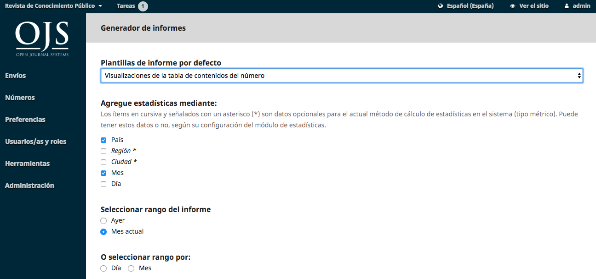

# Capítulo 11: Herramientas
Se puede acceder a la sección Herramientas desde el menú de la barra lateral izquierda.

Las herramientas consisten en una pestaña Importar/Exportar y una pestaña Estadísticas.

## Importación/Exportación
Importar/Exportar le permite obtener fácilmente datos de su publicación OJS y meterlos en ella.

Algunas de las herramientas le permiten exportar a sistemas de terceros, como PubMed o el DOAJ.

Otros le permiten importar o exportar datos de usuario o artículo.

Para obtener más información sobre el plugin de exportación XML de referencias cruzadas, consulte la guía de referencias cruzadas de PKP.

## Estadísticas
La página Estadísticas proporciona acceso a una variedad de informes de de su revista.

El sistema genera informes que rastrean los detalles asociados con el uso del sitio y los envíos durante un período de tiempo determinado. Los informes se generan en formato CSV, lo que requiere una aplicación de hoja de cálculo para su visualización.

**Ver informe**: Proporciona un informe sobre los puntos de vista de galeradas y abstractos de los lectores (es decir, cuántas veces se ha visto un PDF de un artículo).

**Informe de revisión**: Proporciona una hoja de cálculo de toda la actividad de revisión.

**Informe de suscripciones**: Proporciona una hoja de cálculo de la actividad de suscripción.

**COUNTER Reports**: Proporciona datos COUNTER.

**Reporte de Artículos**: Proporciona una hoja de cálculo de todos los artículos publicados.

**Informe de estadísticas de uso de PKP**: Proporciona estadísticas de uso básicas para su publicación.

## Generar un informe personalizado
Utilice esta función para crear sus propios informes.

