# Luku 10: Käsikirjoituksen lähetys

Tässä luvussa kerrotaan OJS3-järjestelmän toiminnoista kirjoittajan näkykulmasta.

## Rekisteröityminen julkaisuun

Käsikirjoituksen lähettämiseksi tarvitset käyttäjätilin OJS-järjestelmään. \(katso [Rekisteröityminen julkaisuun](./registering_with_a_journal.md)\).  Lehden ylläpito voi kytkeä rekisteröitymistoiminnon pois päältä, jolloin järjestelmä ilmoittaa, että rekisteröityminen on suljettu.

Aloita rekisteröityminen valitsemalla Rekisteröidy-linkki, joka löytyy tavallisesti julkaisun kotisivun oikeasta yläkulmasta.

Tilin luomisen jälkeen voit kirjatua sisään järjestelmään ja pääset omaan Hallintapaneeliin.

Näkymä on tällä hetkellä tyhjä, koska käyttäjätilillä ei ole lähetetty aiemmin käsikirjoituksia.

## Käsikirjoituksen lähetys

Julkaisun sivuilla pääset lähettämään käsikirjoitusta valitsemalla "Lähetä käsikirjoitus" yläpalkista tai menemällä valikkoon "Tietoa" => "Käsikirjoitukset", josta valitset toiminnon "Lähetä uusi käsikirjoitus". Joidenkin julkaisujen kotisivuilla voi olla myös vaihtoehtoisia polkuja.

Mikäli olet jo siirtynyt Hallintapaneeliin, aloita käsikirjoituksen lähetys valitsemalla **Uusi käsikirjoitus** näkymän oikeasta reunasta.

Toiminto avaa viisiportaisen lomakkeen, jossa käsikirjoitus lähetetään ja kuvaillaan.

### Vaihe 1

Ensimmäisessä vaiheessa täytetään käsikirjoituksen luokitteluun liittyviä perustietoja. Sivulla näkyvät kohdat riippuvat osittain lehden asetuksista, eli kaikkia alla mainittuja kohtia ei välttämättä ole julkaisussa, johon olet lähettämässä käsikirjoitusta.

Valitse käsikirjoituksen kieli vetovalikosta.

Valitse käsikirjoitukselle sopiva osasto. Jos et ole varma valinnastasi, niin valitse sopivin. Toimituskunta pääsee vaihtamaan osastoa vielä useaan kertaan prosessin aikana.

Lue ja hyväksy tarkistuslistassa olevat kohdat. Mikäli käsikirjoituksesi ei täytä ehtoja, tee tarvittavat korjaukset ennen etenemistä.

Lisää tarvittaessa kommentteja toimittajalle.

Valitse tarvittaessa oikea kirjoittajarooli. Tavallisesti julkaisussa on vain yksi kirjoittajille tarkoitettu käyttäjärooli.

Lue ja hyväksy tekijänoikeuksiin liittyvät ehdot.

Lue ja hyväksy tietosuojaseloste.

Valitse **Tallenna ja jatka**, jolloin siirryt seuraavaan vaiheeseen.

### Vaihe 2

Toisessa vaiheessa pääset lisämään käsikirjoitukseen liittyviä tiedostoja. Ruudulle avautuu uusi pieni ikkuna, joka sisältää kolmiportaisen lomakkeen.

Käsikirjoitustiedostojen tulee tavallisesti olla anonymisoituja, eli niissä ei saa mainita kirjoittajien omia nimiä.

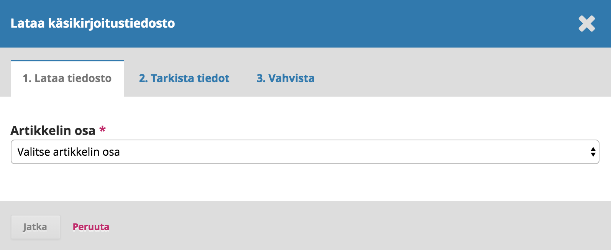

Valitse ensin Artikkelin osa. Valinnalla määritetään, että onko kyse varsinaisesta käsikirjoitustiedostosta vai mahdollisesti jostakin liitetiedostosta. **Pääset lataamaan tiedostoa vasta valinnan jälkeen**. Tavallisesti oikea vaihtoehto on "Artikkelin teksti".

Valinnan tehtyäsi pääset lataamaan ensimmäisen tiedoston. Huomaa, että voit ladata vain yhden tiedoston kerralla. Valitse **Lataa tiedosto** ja etsi oikea tiedosto tietokoneeltasi. Kun tiedosto on siirtynyt, valitse **Jatka**. 

Tiedoston siirron jälkeen voit nimetä sen halutessasi uudelleen, mutta tavallisesti oletuksena annettu nimi riittää. Mikäli olet lisäämässä liitetiedostoa, näkymässä on lomake, johon voit tarvittaessa täyttää tiedoston kuvailutiedot.

Valitse **Jatka**.

Ensimmäisen tiedoston lisäys on nyt valmis. Voit lisätä uusia tiedostoja valitsemalla **Lisää toinen tiedosto**. Kun olet lisännyt kaikki tiedostot, valitse **Suorita**, jolloin ikkuna sulkeutuu.

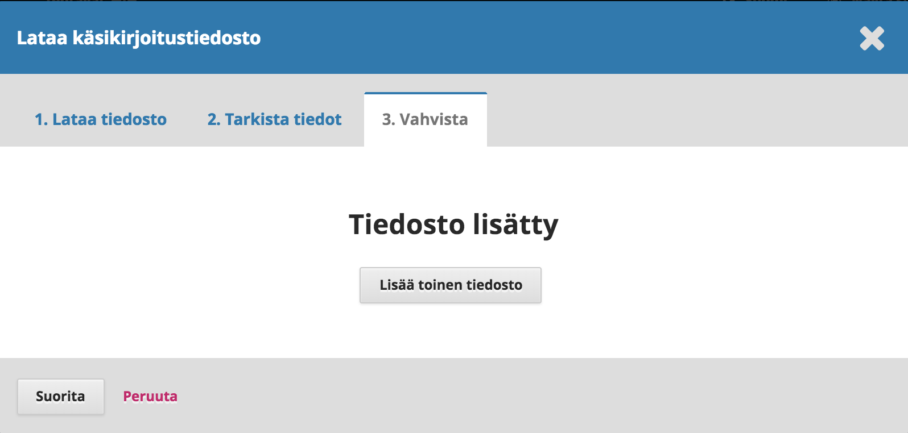

Näkyville tulee lomakkeen toinen vaihe, jossa on nyt listattuna kaikki lisäämäsi tiedostot. Mikäli sinun pitää tehdä tiedostoihin muutoksia, voit painaa tiedoston nimen edessä olevaa sinistä kolmiota, josta pääset joko muokkaamaan tai poistamaan ko. tiedoston. Huomaa, että muokkaus koskee vain tiedoston kuvailutietoja. Voit myös jatkaa tiedostojen lataamista valitsemalla **Lataa tiedosto**.

Valitse **Tallenna ja jatka**, jolloin siirryt lomakkeen kolmanteen vaiheeseen.

### Vaihe 3

Kolmannessa vaiheessa täytetään käsikirjoituksen kuvailutiedot. **Muista täyttää käsikirjoituksen kuvailutiedot huolellisesti**.

Täytä käsikirjoituksen otsikko (kolmessa osassa, joista prefiksi koskee vain joitakin kieliä) sekä abstrakti.

Mikäli lehti on monikielinen, myös kuvailutiedot voi täyttää usealla kielellä. Tällöin esimerkiksi otsikko-kenttää painaessa avautuu jokaiselle kieliversiolle oma tekstikenttä, johon voi kirjoittaa otsikon.

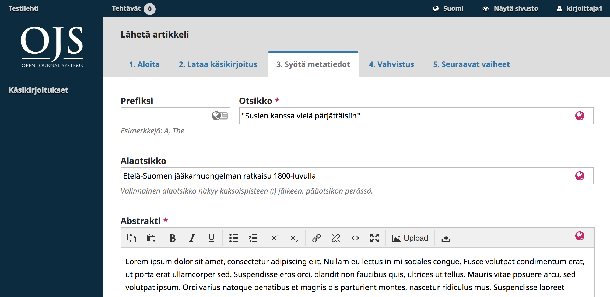

Absraktin alapuolella on tekijäluettelo. Oletuksena käsikirjoitusta lähettävän kirjoittajan tiedot näkyvät valmiina.

Mikäli tarvitaan muita tekijöitä, valitse kohta **Lisää tekijä**. Tämä toiminto avaa uuden lomakkeen, johon tekijän tiedot täytetään. Huomaa, että tarvitset henkilöiden sähköpostiosoitteet. Lomakkeen pakolliset kentät on merkitty punaisella tähdellä.

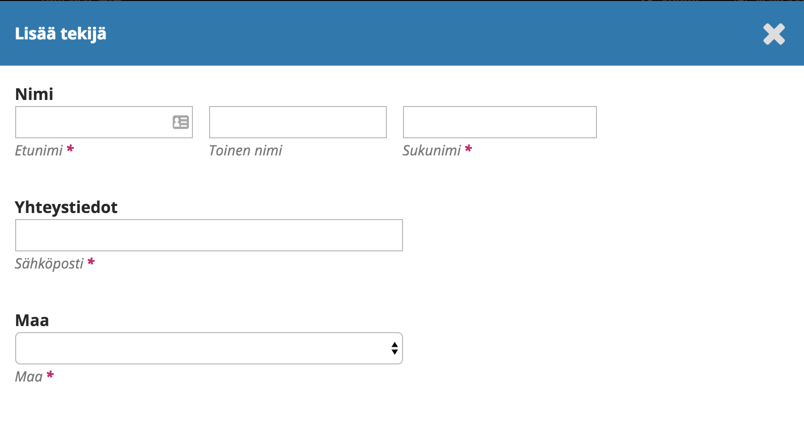

Valitse **Tallenna** ja uusi tekijä lisätään luetteloon.

Riippuen julkaisun asetuksista ja kirjoittajaohjeista voit nähdä tekijäluettelon alla myös muita kuvailutietoja koskevia kenttiä, kuten avainsanat.

Avainsanojen tapaisten kenttien kohdalla erota annettavat sanat painamalla aina enter-nappia sanan jokaisen kirjoittamisen jälkeen. Mikäli järjestelmä ehdottaa sanoja kirjoitettaessa, voit valita sanan klikkaamalla sitä.

Kun kuvailutiedot on tarkistettu valitse **Tallenna ja jatka**.

### Vaihe 4

Neljännessä vaiheessa sinua pyydetään varmistamaan, että olet valmis lähettämään käsikirjoituksen.

Valitse **Suorita lähetys**.

Varmistus kysytään vielä uudelleen avautuvassa ikkunassa. Valitse **OK**.

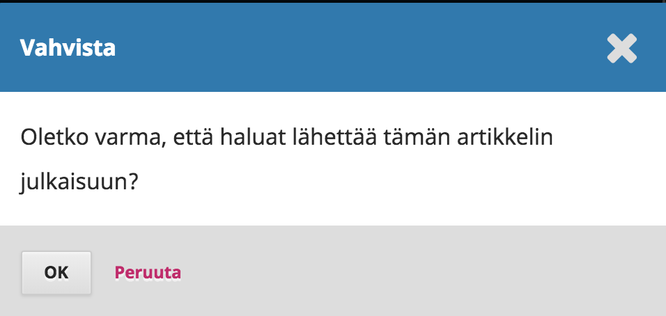

### Vaihe 5

Käsikirjoitus on nyt lähetetty! Toimittajat ovat saaneet tiedon uudesta käsikirjoituksesta.

### Hallintapaneeli

Käsikirjoituksesi näkyy nyt Hallintapaneelissa kohdassa **Oma jononi**. Käsikirjoituksen otsikon perässä näkyy käsikirjoituksen työvaihe ja otsikkoa painamalla pääset katsomaan toimitusprosessia koskevaa näkymää kirjoittajan näkökulmasta. Klikkaamalla otsikon oikeassa reunassa oleva sinistä nuolta, näet lisätietoja käsikirjoitukseen liittyen.

Käsikirjoitus etenee toimitusprosessissa ja toimittajat ovat sinuun yhteydessä järjestelmän kautta. 

## Vertaisarviointiin vastaaminen

Kun artikkelia koskeva vertaisarviointi on valmis, toimittaja ilmoittaa sinulle sähköpostitse päätöksestä.

Sähköpostin saatuasi siirry lehden sivuille ja kirjaudu omaan Hallintapaneeliisi.

Listauksesta näkyy, että käsikirjoitukseen on pyydetty korjauksia. Siirry käsikikirjoitukseen klikkaamalla sen otsikkoa.

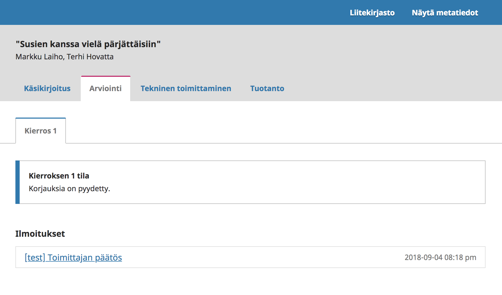

Siirryt käsikirjoituksesi työnkulkuun, jossa olet parhaillaan arviointivaiheessa. Näkymän yläosassa lukee toimittajan päätös ja siinä oleva linkki johtaa toimittajan lähettämään viestiin, jossa annetaan tarkemmat ohjeet.

Tee lähettämääsi käsikirjoitukseen toimittajan ja arvioijien esittämät muutokset. Muista pitää käsikirjoitusta anonymisoituna.

### Uuden version lähetys

Kun muokattu käsikirjoitus on valmis, siirry lehden sivuille ja kirjaudu Hallintapaneeliin. Klikkaa käsikirjoituksesi otsikkoa.

Avautuvalta sivulta, Arviointi-välilehdeltä, löydät laatikon, joka on otsikoitu **Korjaukset**.

Valitse *Lataa tiedosto*.

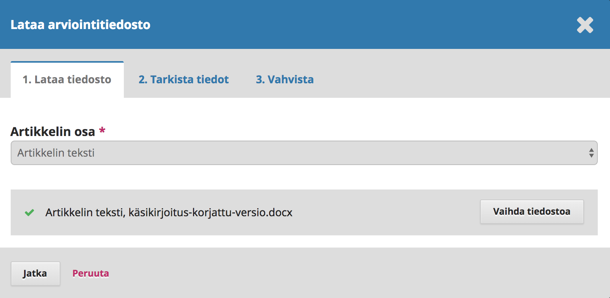

Valitse ensin Artikkelin osa. Valinnalla määritetään, että onko kyse varsinaisesta käsikirjoitustiedostosta vai mahdollisesti jostakin liitetiedostosta. **Pääset lataamaan tiedostoa vasta valinnan jälkeen**. Tavallisesti oikea vaihtoehto on "Artikkelin teksti".

Lataa tämän jälkeen uusi tiedosto ja valitse **Jatka**.

Tarkista tiedoston nimi ja valitse uudelleen **Jatka**. Tavallisesti nimeä ei tarvitse muuttaa.

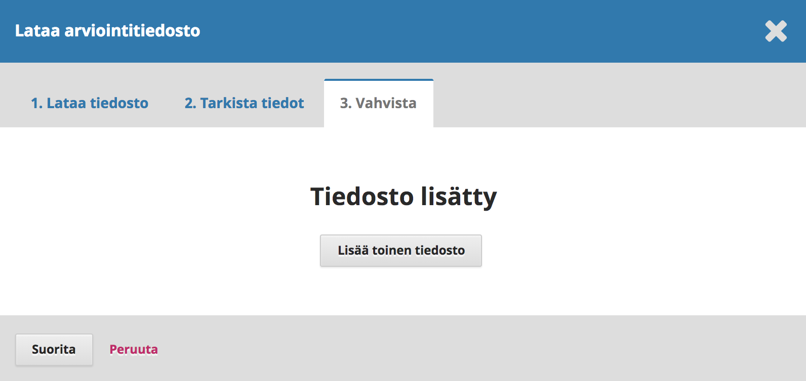

Voit halutessasi ladata myös muita uusia tiedostoja. Kun olet valmis, valitse **Suorita**.

Korjattu käsikirjoitustiedostosi on nyt Korjaukset-laatikossa.

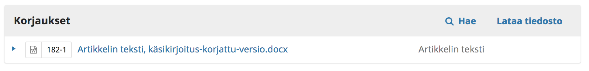

### Ilmoita toimittajalle

On suositeltavaa ilmoittaa toimittajalle erillisellä viestillä korjatun käsikirjoituksen lähettämisestä. 

Avoinna olevalla sivulla näkyy Keskustelut-laatikko.

Valitse **Lisää keskustelu**.

Valitse vastaanottavan toimittajan nimi.

Anna otsikko ja kirjoita viesti, jossa ilmoitat uuden käsikirjoituksen lähettämisestä. Tarvittaessa voit myös kertoa, miten olet ottanut tehdyt muutosehdotukset huomioon.

Valitse **OK** viestin lähettämiseksi.

Toimittaja saa nyt keskustelusta uuden viestin ja voi tarvittaessa vastata siihen. Keskinäisen keskustelunne viestit näkyvät arviointivaiheen keskustelulaatikossa.

Tässä vaiheessa jäät odottamaan toimittajan vastausta ja arviota siitä, ovatko tehdyt muutokset riittäviä.

Päätös voi olla esimerkiksi uuden arviointikierroksen käynnistyminen, jolloin jäät odottamaan uusia arvioita. Joissain tilanteissa käsittely saattaa myös päättyä tässä vaiheessa käsikirjoituksen hylkäykseen.

### Muutokset hyväksytty

Kun toimittaja on hyväksynyt käsikirjoituksesi julkaistavaksi, saat uuden toimittajan tekemän päätöksen sähköpostitse. Hallintapaneelista näet, että käsikirjoitus on siirtynyt teknisen toimittamisen vaiheeseen ja voit jäädä odottamaan lisäohjeita.

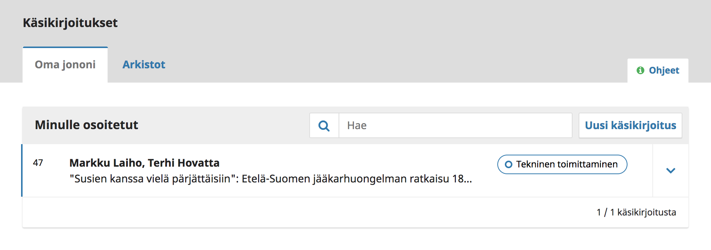

Kun siirryt käsikirjoituksen työnkulkuun klikkaamalla sen otsikkoa, voit vielä katsoa toimittajan päätöstä valitsemalla Arvionti-välilehden.

Jälkimmäinen päätös on viimeisin. Voit avata sen painamalla päätöksen otsikkoa. Sieltä löytyvä teksti on sama kuin sähköpostissa.

Alempana keskustelulaatikossa saatat myös nähdä täydentävän viestin toimittajalta.

## Käsikirjoituksen lähettäminen toiselle arviointikierrokselle

Mikäli toimittaja pyytää lähettämään käsikirjoituksen toiselle arviointikierrokselle, lähetä uusi versio käsikirjoituksesta edellisen luvun ohjeiden mukaisesti, eli:
- Mene omassa hallintapaneelissa käsikirjoituksen arviointivaiheeseen ja lataa muokattu käsikirjoitus Korjaukset-laatikkoon.
- Lähetä vielä keskustelutoiminnon kautta viesti toimittajalle.

Toimittaja käynnistää uuden arviointikierroksen käsikirjoituksen saatuaan. Tällöin myös sinulle näkyvään arviointivaiheeseen tulee esille kaksi välilehteä arvioinnin ensimmäiselle ja toiselle kierrokselle. Uuden kierroksen päätökset näkyvät välilehdellä, joka on otsikoitu "Kierros 2".

Uuden arviokierroksen päätyttyä saat tiedon tehdystä päätöksestä samalla tavalla kuin ensimmäisellä kierroksella.

## Vastaaminen teknistä toimittamista koskevaan pyyntöön

Teknisen toimittamisen työvaiheen eteneminen voi vaihdella julkaisun toimituskunnan työtavoista riippuen.

Voit saada valmiiksi teknisesti toimitetun käsikirjoituksen tarkistettavaksi tai vastaavasti toimittaja voi pyytää sinua tekemään joitakin korjauksia heti työvaiheen alkuvaiheessa. Joidenkin julkaisujen tapauksessa sinuun saattaa olla yhteydessä erikseen määrätty julkaisun tekninen toimittaja.

Näissä tapauksissa toimittaja on yhteydessä kirjoittajaan keskustelutoiminnon välityksellä. Keskusteluviestit näkyvät vain teknistä toimittamista koskevassa työvaiheessa, eli viestit eivät näy esimerkiksi arviointivaiheen keskusteluissa.

Saat uusista keskusteluviesteistä sähköpostin. Siirry lehden sivuille ja kirjaudu sisään hallintapaneeliin.

Näet käsikirjoituksesi hallintapaneelin listauksissa. Klikkaa käsikirjoituksen otsikkoa ja siirryt käsikirjoituksessasi oikeaan työvaiheeseen, josta keskustelu löytyy.

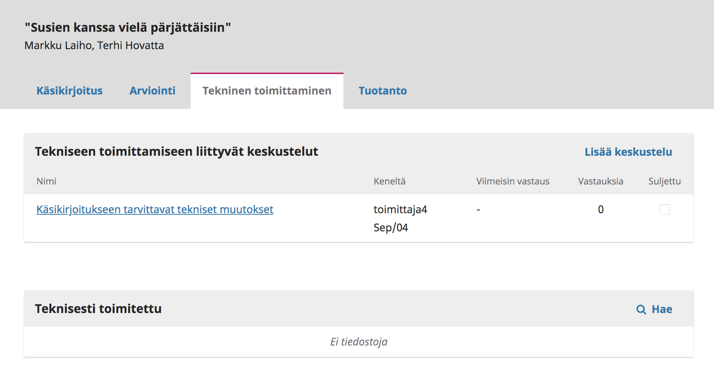

Paina keskustelun otsikkoa avataksesi viestin. Olet todennäköisesti saanut toimittajalta ohjeita sekä liitetiedostona olevan käsikirjoituksen.

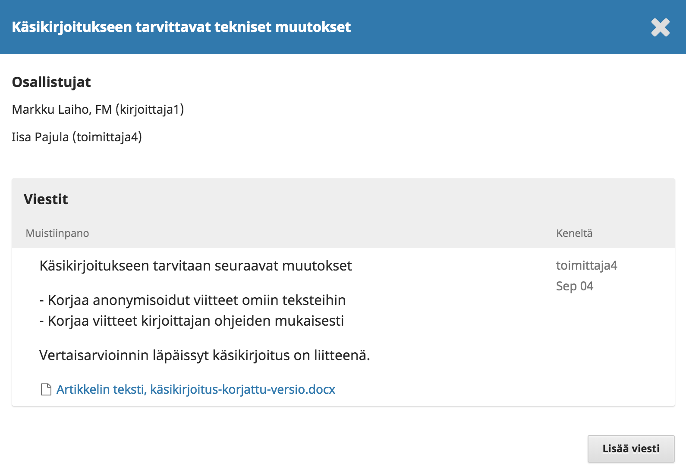

Mikäli sinua on pyydetty vain tarkistamaan käsikirjoitus, voit sen luettuasi vastata toimittajan keskusteluviestiin. Vaihtoehtoisesti palaat tekemään käsikirjoitukseen pyydettyjä muutoksia ja palaat myöhemmin lataamaan uuden version.

Voit vastata viestiin painamalla **Lisää viesti**. Kirjoita vastaus toimittajalta saatujen ohjeiden perusteella. 

Mikäli sinua on pyydetty lataamaan korjattu versio käsikirjoituksesta, valitse kohdasta **Liitetyt tiedosto** linkki **Lataa tiedosto**. Linkistä avautuu jo aiemmista vaiheista tuttu tiedostojen lataukseen käytettävä lomake. Lataa muokattu käsikirjoitus.

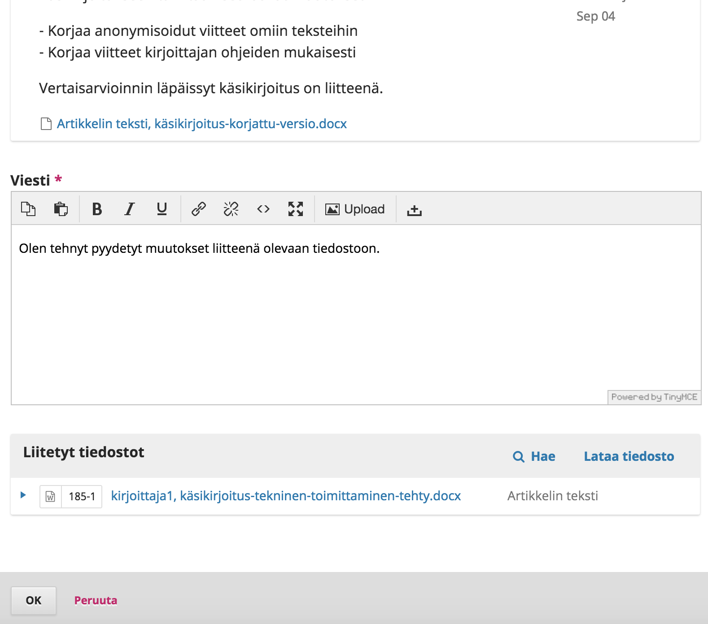

Paina lopuksi **OK**.

Näet nyt keskustelutoiminnosta, että olet viimeinen keskusteluun vastannut henkilö.

Mahdollisesti käsikirjoitusta tarkistetaan ja korjataan vielä uudestaan ja tällöin kommunikointi tapahtuu edelleen keskustelutoiminnon kautta, johon voit palata vastaamaan toimittajan viesteihin.

Kun käsikirjoitus on valmis taitettavaksi, se siirtyy tuotantovaiheeseen, mistä saat ilmoituksen toimittajalta.

## Vastaaminen oikolukua koskevaan pyyntöön

Jotkin julkaisut voivat pyytää kirjoittajaa oikolukemaan oman käsikirjoituksensa taitetun version. Tämä tarkoittaa käytännössä pienten kirjoitusvirheiden jne. etsimistä, eli ei varsinaisia sisältöön liittyviä muutoksia. On myös lehtiä, jotka oikolukevat artikkelit itse, jolloin kirjoittaja ei enää osallistu käsikirjoituksen käsittelyyn.

Mikäli lehti pyytää oikolukua, toimittaja on yhteydessä keskustelutoiminnon välityksellä samaan tapaan kuin teknisen toimittamisen työvaiheessa. Keskusteluviestit näkyvät vain tuotantoa koskeva työvaiheessa, eli viestit eivät näy esimerkiksi arviointivaiheen keskusteluissa. Joidenkin julkaisujen tapauksessa sinuun saattaa olla yhteydessä erikseen määrätty julkaisun taittaja tai julkaisun oikolukija.

Saat viestin, jossa kerrotaan oikoluettavien tiedostojen olevan valmiina. Siirry lehden sivuille ja kirjaudu sisään hallintapaneeliin.

Näet käsikirjoituksesi hallintapaneelin listauksissa. Klikkaa käsikirjoituksen otsikkoa ja siirryt käsikirjoituksessasi oikeaan työvaiheeseen.

Paina keskustelun otsikkoa avataksesi viestin. Olet todennäköisesti saanut  ohjeita sekä liitetiedostona olevan käsikirjoituksen.

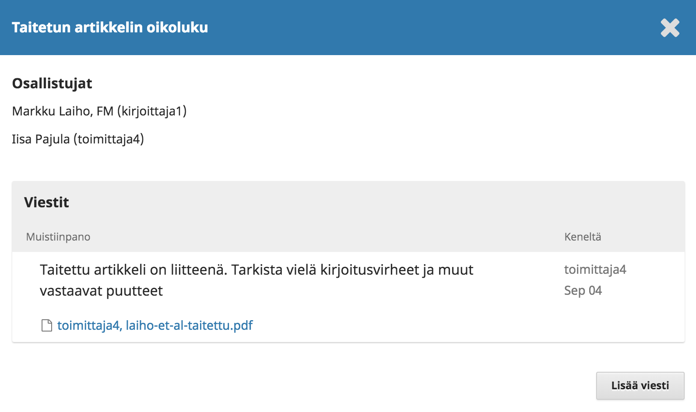

Tarkistettuasi käsikirjoituksen, voit vastata keskusteluviestiin ja ilmoittaa mahdolliset korjauspyynnöt. Valitse **Lisää viesti** ja kirjoita viesti. Paina lopuksi **OK**.

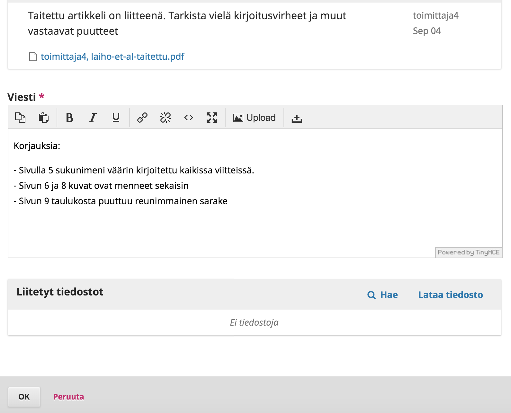

Oikoluvun jälkeen oma osuutesi käsikirjoituksen käsittelyssä on valmis. Lopullinen julkaistava käsikirjoitus ilmestyy kohtaan "Julkaistavat tiedostot", kun se on valmis.

