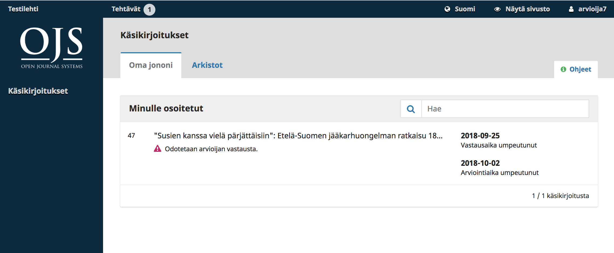
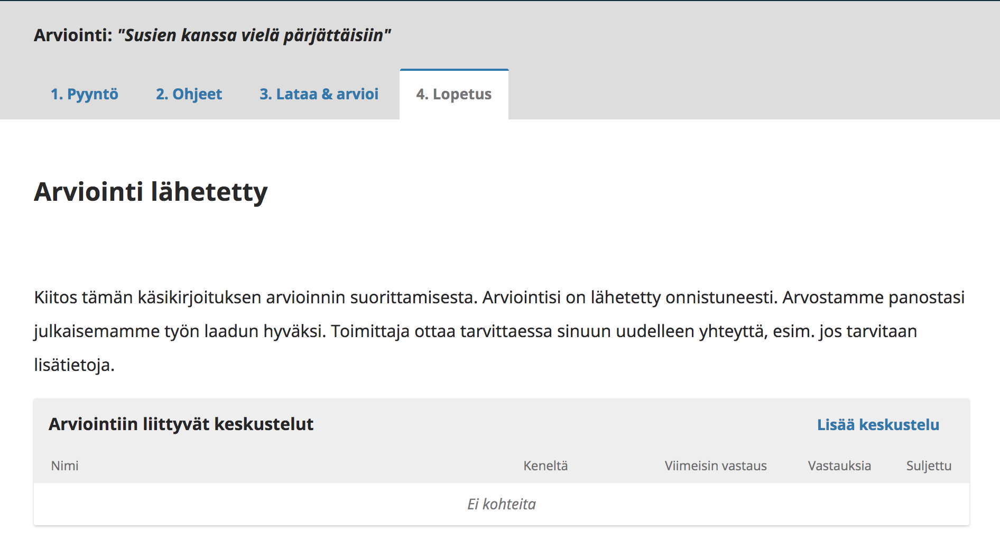

# Luku 11: Arviointi

Julkaisun arvioijaksi voi tulla joko ilmoittamalla halukkuutensa julkaisuun rekisteröitymisen yhteydessä tai vastaavasti julkaisun toimittajan kutsusta.

Mikäli olet saanut kutsun arvioijaksi, saat todennäköisesti kaksi sähköpostiviestiä lähes peräkkäin. Näistä ensimmäisessä ilmoitetaan, että sinua on pyydetty arvioijaksi ja kerrotaan käyttäjätiliisi liittyvät yksityiskohdat. Jos sinulla ei ollut ennestään käyttäjätilia, näet myös salasanasi, joka sinun pitää vaihtaa yleensä ensimmäisen kirjautumisen jälkeen. Jos haluat kieltäytyä kokonaan tekemästä arviointeja kyseessä olevalle julkaisulle, kieltäydy annetusta arviointipyynnöstä alla olevien ohjeiden mukaisesti ja ilmoita vielä erikseen toimittajalle, että et halua uusia pyyntöjä enää jatkossa.

Toinen sähköpostiviesti sisältää varsinaisen arviointipyynnön. Mikäli olet jo ennestään lehden arvioija, saat vain tämän viestin.

Lue saamasi viesti, siirry lehden kotisivuille ja kirjaudu sisään hallintapaneeliin. Joidenkin julkaisujen tapauksessa viesti saattaa sisältää linkin, joka kirjaa sinut suoraan sisään ja siirtää sinut arviointilomakkeeseen.

Mikäli olet kirjautunut sisään omilla tunnuksilla, näet hallintapaneelin listauksissa saapuneet työt ja niihin liittyvän aikataulun. Tässä tapauksessa lehdellä on aktivoituna tuplasokkoarviointi, eli et näe kirjoittajan nimeä. Paina oikean työn otsikkoa päästäksesi arviointilomakkeeseen.

Siirryt arviointilomakkeen ensimmäiseen vaiheeseen. 

Näkymässä näet arvioitavan artikkelin tiedot. Joidenkin julkaisujen tapauksessa voit nähdä jo tässä vaiheessa myös koko artikkelin tekstin. 

Linkistä **Katso käsikirjoituksen yksityiskohdat** avautuu ikkuna, josta näkyy artikkelin metadata. Mikäli kyseessä on avoin vertaisarviointi, näet myös kirjoittajien nimet.

Sivun alaosassa näkyy arviointia koskeva aikataulu sekä arvioinnin vastaanottoon liittyvät painikkeet.

Mikäli hylkäät arviointipyynnön, järjestelmä avaa uuden ikkunan, jossa on esitäytetty viesti toimittajalle. Voit muokata valmista tekstiä haluamallasi tavalla ja lähettää viestin. Arviointiprosessi on tällöin päättynyt omalta osaltasi ja toimittaja on saanut tiedon kieltäytymisestä.

Mikäli hyväksyt arviointipyynnön, siirryt lomakkeen toiseen vaiheeseen. Tällä sivulla näkyvät lehden arviointiohjeet, joihin tulee perehtyä huolellisesti. Jokaisella julkaisulla on omat ohjeet, joten tutustu niihin tarkasti. Ohjeisiin pääsee käsiksi vielä myöhemminkin.

Valitse **Jatka** ja siirryt kolmanteen vaiheeseen.

Tällä sivulla näet viimeistään arvioitavaksi tarkoitetun käsikirjoituksen sekä sen mahdolliset liitteet. Voit ladata tiedoston painamalla sen otsikkoa.

Tiedostojen alapuolella on varsinainen arviointilomake. Oletuksena siinä on kaksi viestikenttää, mutta joillakin julkaisuilla voi olla käytössä laajempi ja yksityiskohtaisempi arviointilomake.

Oletuslomakkeessa ensimmäisen kentän teksti on tarkoitettu sekä kirjoittajalle että toimittajalle ja toinen kenttä vain toimittajalle.

Arvionti *kannattaa aina kirjoittaa ensin omalle tietokoneelle tallenttavaan tiedostoon*. Kun palaat takaisin arviolomakkeeseen, pääset jatkamaan uudestaan arviointilomakkeen kolmannesta vaiheesta ja voit kopioida kirjoittamasi tekstit arviointilomakkeen kenttiin.

Joissakin tapauksissa arvioijaa saatetaan pyytää lähettämään tekstitiedosto, johon muutokset on merkitty suoraan. Tässä tapauksessa voit lisätä tiedostot kohtaan **Arvioijan tiedostot**. Mikäli kyseessä on sokkoarviointi, muista poistaa tiedostosta tiedot, joista sinut voi tunnistaa.

Voit tarvittaessa keskustella arviosta toimittajan kanssa aloittamalla uuden keskustelun kohdassa **Arviointiin liittyvät keskustelut**. Mikäli kyseessä on avoin vertaisarviointi, voit keskustella myös kirjoittajan kanssa.

Kun arvio on valmis, valitse vielä suosituksesi käyttämällä lomakkeen lopussa olevaa vetovalikkoa.

Vaihtoehdot ovat:

- **Hyväksy käsikirjoitus**: ei vaadi muutoksia.
- **Vaatii korjauksia**: vaatii pieniä korjauksia, jotka toimittaja voi arvioida itse.
- **Lähetä uudelleen arvioitavaksi**: vaatii laajoja korjauksia ja uuden arviointikierroksen.
- **Lähetä toiseen julkaisuun**: käsikirjoitus ei sovi julkaisun linjaan.
- **Hylkää käsikirjoitus**: liian heikkotasoinen julkaistavaksi.
- **Katso kommentit**: mikäli mikään yllä mainittu määritelmä ei sovi, voit jättää vapaamuotoisen kommentin toimittajalle, jossa esität näkemyksesi.

Paina lopuksi **Lähetä arviointi** ja vahvista vielä lähetys kysyttäessä painamalla **OK**.

Arviointi on nyt lähetetty. Lomakkeen viimeisellä sivulla näkyy vahvistus valmiista arvioinnista sekä arviointia koskevat keskustelut. Voit tarvittaessa olla vielä yhteydessä toimittajan kanssa keskustelutoiminnon avulla.

