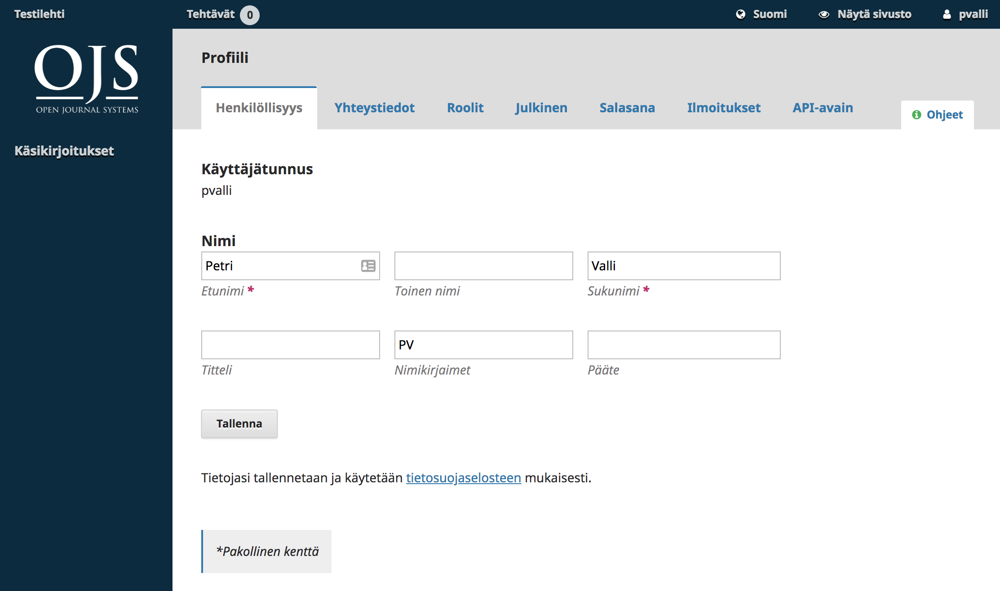

# Luku 3: Käyttäjätilit

OJS-järjestelmän käyttäjätilit ovat aina sivustokohtaisia. Jos samalla sivustolla ylläpidetään useita julkaisuja, kelpaa sama käyttäjätunnus kaikkiin lehtiin, eli käyttäjän ei tarvitse rekisteröityä uudelleen.

OJS-järjestelmän käyttöoikeuksia ja pääsyä erilaisiin järjestelmän toimintoihin hallitaan käyttäjäroolien avulla. Sama käyttäjä voi olla kirjoittajan roolissa yhdessä julkaisussa ja samaan aikaan toimittajan roolissa toisessa julkaisussa. 

Kun käyttäjä on kirjautunut sisään järjestelmään ja siirtyy omaan Hallintapaneeliin, näkymä riippuu niistä rooleista, joita käyttäjälle on annettu.

## Rekisteröityminen

Rekisteröityminen julkaisuun voi olla joissakin tilanteissa suljettu. Kun käyttäjä rekisteröityy OJS-järjestelmän johonkin julkaisuun, hän saa tavallisesti Lukija-roolin. Jotkin julkaisut antavat käyttäjälle mahdollisuuden tarjoutua myös arvioijaksi.

Kirjoittaja-roolin käyttäjä saa, kun hän lähettää ensimmäisen käsikirjoituksen julkaisuun.

Rekisteröityminen julkaisuun alkaa painamalla kohtaa **Rekisteröidy**, joka löytyy tavallisesti lehden kotisivun oikeasta yläkulmasta.

Linkistä avautuu rekisteröitymislomake, johon tulee täyttää pyydetyt tiedot.

Kaikki tähdellä merkityt kentät ovat pakollisia tietoja. Näitä ovat tavallisesti etunimi, sukunimi, affiliaatio, mmaa, sähköposti, käyttäjätunnus sekä salasana. Mikäli lehti on monikielinen, valitset lisäksi ensisijaisen kielen.

Tämän julkaisun tapauksessa saat automaattisesti Lukija-roolin ja voit myös halutessaisi valita Arvioija-roolin. Lomakkeen kautta ei voi rekisteröityä muihin rooleihin. Mikäli tarvitse jonkin toisen roolin julkaisussa, ota yhteyttä lehden toimittajaan.

## Käyttäjäprofiilin muokkaus

Käyttäjätilin luomisen jälkeen voit muokata omaa profiilia kirjautumalla sisään järjestelmään ja viemällä hiiren oikeaan yläkulmaan oman käyttäjätunnuksen päälle. Valitse avautuvasta vetovalikosta **Näytä profiili**.

Välilehdistä löytyvät kohdat mm. henkilötiedoille, yhteystiedoille, roolivalinnoille, julkiselle profiilille, salasanan vaihdolle sekä järjestelmän lähettämien ilmoitusten hallinnalle.

Rooleja ja ilmoituksia koskevat asetukset koskevat sitä lehteä, jonka sivuilla olet parhaillaan.

## Salasanan vaihtaminen

Jos unohdat salasanan, voit pyytää uuden valitsemalla lehden kotisivun oikeasta yläkulmasta linkin **Kirjaudu** ja avautuvalta sivulta linkin **Unohditko salasanasi?**. Avautuvaan lomakkeeseen annetaan oma sähköpostiosoite, johon järjestelmä lähettää uuden salasanan.

Jos haluat muuttaa salasanaasi, kirjaudu sisään järjestelmään, siirry käyttäjäprofiiliin ja sieltä Salasana-välilehdelle. Anna lomakkeeseen nykyinen salasana ja tämän jälkeen uusi salasana kahdesti ja paina **Tallenna**.

