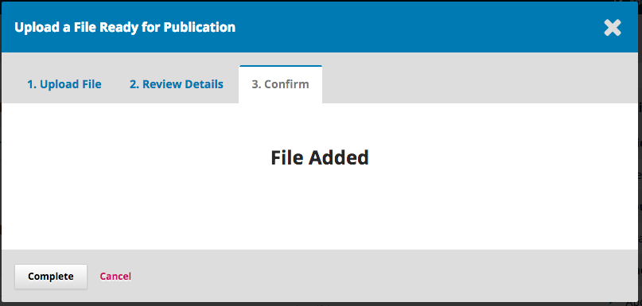
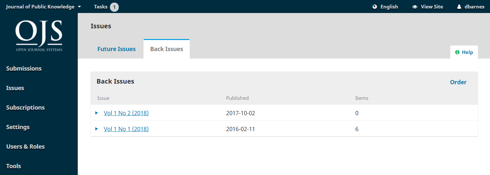

# Chapitre 15: Production et Publication

Une fois la phase de révision terminée, la soumission passe maintenant à la production. À partir de là, les fichiers copiés seront convertis en formats publiables sous forme de fichiers épreuves (par exemple, PDF, HTML) et relus avant publication. Un nouveau numéro de revue sera créé et l'article sera publié dans le numéro. Ce chapitre explique les étapes de ce processus, ainsi que la façon d'utiliser la fonction de contrôle de version d'OJS 3.2 pour publier une nouvelle version d'un article si des modifications importantes sont apportées.

OJS offre également un moyen simple de contourner le flux de travail éditorial décrit dans le chapitre précédent et de soumettre le contenu directement en production, où il peut être ajouté à un numéro et publié. Vous pouvez le faire via le plugiciel Soumission Rapide. Consultez les [ Instructions détaillées du plugiciel Soumission Rapide dans le chapitre Importation et Exportation de Données ](./tools.md#importexport)

Pour commencer le travail de Production, le/la rédacteur-trice de la rubrique ou le/la rédacteur-trice de la revue doit se connecter au système et choisir la soumission dans son tableau de bord.

Cliquez sur l'article afin d'ouvrir le dossier de soumission.


Vous verrez que les fichiers copiés sont désormais disponibles dans le panneau **&nbsp;Fichiers prêts pour la production **.

Dans l'onglet **Production** , vous pouvez affecter des participants (comme un/une rédacteur-trice de mise en page) à l'étape de production du flux de travaux et communiquer avec les participants dans le panneau **Discussions sur la production** .

## Onglets de Publication

Tout ce qui concerne la publication d'une soumission se fait sous l'onglet Publication. L'onglet Publication vous permet de modifier ou d'ajouter des informations sur la soumission, y compris les contributeurs, les métadonnées et les identifiants. C'est également là que vous téléverserez les fichiers finaux épreuves pour la publication dans la revue.


Voici un aperçu de ce à quoi servent les différents onglets de cette section. Des instructions détaillées sur certains d'entre eux sont disponibles plus loin dans le chapitre.

**Titre et résumé** Utilisez cet onglet pour modifier le titre, le sous-titre et le résumé de l'article.

Si des modifications sont apportées, cliquez sur Enregistrer avant de quitter cette fenêtre.

**Contributeurs-trices** Utilisez cet onglet pour ajouter, modifier ou supprimer des contributeurs-trices à l'article.

**Métadonnées** Utilisez cet onglet pour ajouter ou modifier des mots-clés d'article.

Si des modifications sont apportées, cliquez sur Enregistrer avant de quitter cette fenêtre.

**Références** Utilisez l'onglet références pour afficher ou ajouter une référence unique, tel qu'un DOI. Plus d'informations sur l'attribution et la gestion des DOI sont disponibles dans le [Guide du plugiciel DOI](https://docs.pkp.sfu.ca/doi-plugin/en/) .

**Épreuves** Utilisez l'onglet Épreuves pour téléverser le fichier final pour la publication. Ceci est expliqué ci-dessous.

**Autorisations et divulgation** Incluez des détails sur le titulaire du droit d'auteur et un lien vers la licence de l'article, le cas échéant. Celui-ci sera automatiquement renseigné en fonction de vos [Paramètres de Distribution](./settings-distribution.md) .

**Numéro** Utilisez l'onglet Numéro pour affecter l'article à un numéro de revue. Ceci est expliqué ci-dessous.

### Soumissions Multilingues

Les onglets Titre et résumé, Métadonnées, Autorisations et divulgation et Numéro ont des options pour ajouter et modifier des métadonnées dans plusieurs langues. Les langues doivent d'abord être activées dans Paramètres du Site Web -> Configuration -> Langues.

Sélectionnez l'onglet de langue souhaitée sous le bouton «Calendrier de production» et remplissez les champs de métadonnées dans la langue sélectionnée.


L'onglet «Numéro» vous permet de téléverser plusieurs images de couverture dans les langues sélectionnées.


## Format d'Article pour la Publication

### Attribuer un/une Rédacteur-trice de mis en page

Une bannière de notification indique que vous devez désigner quelqu'un pour créer les fichiers épreuves (par exemple, les PDF, HTML, etc.) à partir des fichiers prêts pour la production.

Cela peut varier d'une revue à l'autre - vous pouvez avoir des rédacteurs-trices de mise en page ou des adjoints-tes de production pour faire ce travail. Certaines revues utilisent un service de conception graphique ou de composition externe. Si vous souhaitez communiquer avec votre rédacteur-trice de mise en page, adjoint de production, graphiste ou compositeur via OJS et gérer le processus de production avec eux dans OJS, assurez-vous qu'ils ont un compte utilisateur et ajoutez-les en tant que participant à la soumission.

Pour effectuer l'affectation, utilisez le lien **Assigner** dans la liste des participants. Cela ouvrira une nouvelle fenêtre.


Utilisez le sélecteur de rôle et le bouton de recherche pour trouver les utilisateurs appropriés. Sélectionnez l'utilisateur et choisissez un message prédéfini, puis cliquez sur **OK** pour envoyer.

L'utilisateur a maintenant été averti par courriel et dans le tableau de bord.


Vous pouvez maintenant voir le/la Rédacteur-trice de Mise en Page dans la liste des Participants et vous pouvez voir l'avis de demande dans le Panneau Discussions sur la production. Vous pouvez maintenant attendre que le/la rédacteur-trice de mise en page termine ses tâches.

### Rédaction de la mise en page

En tant que rédacteur-trice de mise en page, vous aurez reçu un message vous invitant à créer les épreuves pour la soumission. Pour commencer, connectez-vous au système et accédez à votre tableau de bord.


À partir de là, recherchez la soumission et sélectionnez le lien **Production** . Cela vous mènera au dossier de soumission.


Depuis le panneau Fichiers prêts pour la production, téléchargez les fichiers sur votre bureau et travaillez en dehors d'OJS pour les convertir en fichiers épreuves. La section suivante explique les formats et la préparation des fichiers épreuves.

> Remarque: PKP travaille actuellement sur un projet d'automatisation de la conversion de documents Microsoft Word dans d'autres formats, notamment XML, HTML, PDF, EPUB, etc. Gardez un œil sur notre blog pour les mises à jour.

### Préparer et Ajouter des Fichiers Épreuves

Une Épreuve est le fichier final, prêt pour la publication qui a été préparé pour les lecteurs et sera publié sur la page de l'article. Les épreuves doivent être dans un format stable non modifiable (par exemple, HTML, PDF, ePub ou XML) des versions de l'article en texte intégral. Les fichiers Épreuves peuvent également inclure des éléments supplémentaires tels que des fichiers multimédias et des données de recherche. Vous pouvez publier un fichier épreuve pour un article et pour un numéro entier.

#### Éléments de Fichiers Épreuves

Lorsque vous téléversez un fichier épreuve, vous devrez sélectionner un **Type d'Élement** . Ce sont les mêmes types d'élements que ceux que les auteurs-es sélectionnent lorsqu'ils téléversent des fichiers de soumission. Vous pouvez configurer les types d'élements sous Paramètres de flux de travaux > Soumission > Éléments, selon que vous souhaitez que le type d'éléments soit publié et que vous souhaitiez qu'un lien vers celui-ci apparaisse sur la page de destination de l'article ou dans la table de matières.

Les configurations sont les suivantes:

- Relié: le lien n'apparaîtra pas du tout avec le contenu publié
- Supplémentaire: le lien apparaîtra sur la page de destination de l'article
- Ni supplémentaire ni relié: le lien apparaîtra sur la page de destination de l'article et dans la table des matières

Par exemple, si vous souhaitez incorporer des fichiers multimédias dans des fichiers HTML et les faire apparaître sur la page de destination, la page du numéro et la page de soumission, vous devez configurer les paramètres de la façon suivante:

- Accédez à Paramètres > Flux de travaux > Soumission > onglet **Éléments**
- Cliquez sur la flèche bleue à côté de la **Feuille de Style HTML** et **Modifier**
- Décochez «Marquer les fichiers de ce type en tant que fichiers reliés» et «Marquer les fichiers de ce type en tant que fichiers supplémentaires». Cliquez sur **Enregistrer** .
- Cliquez sur la flèche bleue à côté de **Multimédia** et **Modifier**
- Décochez "Marquer les fichiers de ce type en tant que fichiers supplémentaires". Laissez «Fichiers reliés» coché. Cliquez sur **Enregistrer** .

#### Formats de Fichiers Épreuves

Les revues en ligne publient leurs articles dans divers types de fichiers. Les plus courants sont le PDF et le HTML, mais de plus en plus de formats supplémentaires sont utilisés, tels que ePub, MP3 et XML.

Les plugiciels d'OJS permettent d'afficher ou de télécharger des fichiers PDF, HTML et XML dans un navigateur Web. Si les fichiers sont téléchargés au lieu d'être affichés dans le navigateur, vous devrez peut-être activer l'un de ces plugiciels sous Paramètres de Site Web > Plugiciels:

- Le lecteur PDF.JS PDF fournit un support de rendu pour les fichiers d'article PDF.
- Le lecteur d'article eLife Lens fournit une prise en charge du rendu pour les fichiers d'article XML JATS à l'aide d'eLife Lens.
- Le plugiciel mise en page pour HTML fournit un support de rendu pour les mise en pages d'article sous forme de fichiers HTML.

D'autres formats peuvent nécessiter des plugiciels supplémentaires ou peuvent être téléchargés directement. Vous pouvez également héberger le contenu en texte intégral sur une plateforme différente et intégrer une URL distante en cochant la case: "Cette épreuve sera disponible sur un Site Web distinct."

#### Utiliser des Modèles

Exiger que toutes les soumissions utilisent un modèle de document préformaté avec les styles de publication de votre journal (par exemple, la police, la taille de police, les caractères gras, l'emplacement, etc., de l'en-tête, du corps, des pieds de page, etc.) peut rendre la conversion de votre document beaucoup plus facile. [Microsoft fournit un bref aperçu de la création de modèles dans MS Word](https://support.office.com/en-us/article/create-a-template-86a1d089-5ae2-4d53-9042-1191bce57deb) .

Une fois que vous avez créé un modèle qui correspond au style de votre revue, il peut être utile pour la soumission d'auteurs-es, de rédacteurs-trices de mise en page ou d'autres utilisateurs. Voici un exemple de revue OJS qui oblige les auteurs-es à télécharger et à utiliser un fichier modèle: [Paideusis](https://journals.sfu.ca/pie/index.php/pie#authorGuidelines) .

Idéalement, votre modèle doit être créé à l'aide de styles plutôt que d'un formatage direct. Cela garantit non seulement la cohérence de tous vos documents, mais aidera également toutes les conversions vers d'autres formats (par exemple, HTML). Voici une [explication de la différence entre les styles et la mise en forme directe dans Word](https://support.office.com/en-us/article/Style-basics-in-Word-d382f84d-5c38-4444-98a5-9cbb6ede1ba4?CorrelationId=1b00844c-a9dc-4d62-98df-a966f30d4b20&ui=en-US&rs=en-US&ad=US&ocmsassetID=HA010230882)

#### Fichiers PDF

Un PDF est le type de fichier le plus simple à créer à partir d'un document Word. Les versions actuelles de Microsoft Word (et d'autres traitements de texte) vous permettent «d'enregistrer sous» ou «d'exporter sous» un PDF. La majorité des revues OJS publient leurs articles au format PDF.

Les fichiers PDF sont également populaires auprès de nombreux lecteurs car ils recréent le plus fidèlement la page imprimée. Cependant, les PDF sont souvent moins flexibles sur les appareils mobiles et ne gèrent pas toujours très bien les liens ou les supports intégrés (tels que les fichiers audio ou vidéo). Avec l'utilisation généralisée des appareils mobiles, il est de plus en plus important de s'assurer que votre public peut lire vos articles sur leurs téléphones ou tablettes.

Exemple (voir lien PDF au bas de la page): [Irish Journal of Technology Enhanced Learning](http://www.journal.ilta.ie/index.php/telji/article/view/22/51)

#### Fichiers HTML

Les fichiers HTML ont plus de flexibilité. Ils gèrent très bien les liens et les multimédia et peuvent s'adapter à presque tous les écrans, y compris les téléphones et les tablettes. Cependant, ils ont un aspect différent d'une page imprimée, de sorte que certains lecteurs préfèrent un PDF. La situation idéale est de fournir à la fois des fichiers PDF et HTML pour répondre au mieux aux besoins des différents utilisateurs.

La création d'un fichier HTML peut exiger plus de temps et d'efforts que la création de fichiers PDF. Les traitements de texte ne disposent pas d'outils efficaces pour effectuer un «Enregistrer sous» au format HTML. Microsoft Word essaie de le faire, mais les résultats ne sont pas utiles pour le téléversement vers OJS. Au lieu de cela, essayez de suivre ce flux de travaux:

- Convertissez le document Word. Vous pouvez utiliser [cet outil en ligne gratuit](https://word2cleanhtml.com/) pour effectuer une première conversion.
- Ouvrez les fichiers HTML résultants dans un éditeur de texte (par exemple, NotePad sur Windows) ou un éditeur HTML (par exemple, Adobe Dreamweaver). À partir de là, vous devrez effectuer un nettoyage ou un formatage final. Comprendre les bases du HTML est nécessaire. Il existe de nombreux [tutoriels gratuits](https://www.w3schools.com/html/) , mais cela prend du temps.
- Gardez le formatage HTML basique. Concentrez-vous simplement sur les paragraphes, les sauts de ligne, les titres et les liens. Ne vous inquiétez pas des polices, des couleurs ou d'autres éléments de conception - OJS se chargera de tout cela automatiquement dans le cadre de la conception globale de la revue.
- Téléversez vers OJS en tant que fichier épreuve HTML
- Le lecteur HTML restitue les fichiers HTML dans une iframe, ce qui peut affecter la navigation vers des pages Web contenant des hyperliens. Vous pouvez contourner cette fonctionnalité en ouvrant des hyperliens dans un nouvel onglet de navigateur, en ajoutant l'attribut `target="_blank"` à vos balises href.

Quelques exemples de modèles HTML peuvent être trouvés et adaptés à partir de ces sources:

- [Ressource par U of A](https://drive.google.com/file/d/1mCP0tguFJf7jJn_CNceEwvRn5eCJrvxP/view) - Licence: CC0 1.0 Universal (CC0 1.0)

Exemples (voir lien HTML en bas de page):

- [Anthropologie culturelle](https://journal.culanth.org/index.php/ca/article/view/4434)
- [Bibliothèque factuelle et pratique d'information](https://journals.library.ualberta.ca/eblip/index.php/EBLIP/article/view/29621)

##### Styliser des fichiers épreuves HTML

Il est possible de styliser la conception de vos fichiers épreuves HTML en masse ou sur une base individuelle par article. Styliser en masse ne peut être effectué que si vous utilisez un thème personnalisé.

Afin de styliser un fichier épreuve HTML individuel:

- Lors de la création du fichier épreuve HTML, assurez-vous qu'il inclut une référence à la feuille de style dans la section `<head>` , par exemple `<link rel="stylesheet" href="./article_styles.css" type="text/css" />`
- Téléversez le fichier épreuve HTML (voir ci-dessous pour savoir comment **ajouter des fichiers épreuves**)
- Modifier le fichier épreuve
- Téléversez les feuilles de style CSS avec le **&nbsp;type d'élément - feuille de style HTML ** approprié.

Pour styliser tous les fichiers épreuves HTML: Si vous utilisez un plugiciel de thème personnalisé, vous pouvez écrire une ligne de code pour inclure un style personnalisé pour toutes les épreuves HTML. Cela ne s'appliquera qu'aux fichiers épreuve HTML qui n'ont pas de style appliqué individuellement. Plus d'informations sur le thème personnalisé sont disponibles dans le [guide sur les thème PKP](https://docs.pkp.sfu.ca/pkp-theming-guide/en/) .

##### Ajoutez des images et du multimédia à une épreuve HTML

Si vous souhaitez inclure des images ou des fichiers multimédias dans un fichier épreuve HTML, vous pouvez les télécharger en tant que fichiers reliés dans la soumission, et créer un lien vers eux dans le fichier pour les afficher.

Avant de commencer de téléverser l'élément, vous aurez besoin d'une page HTML contenant l'un des éléments suivants:

- Élément `<audio controls>` (pour MP3)
- Élément `<video>` (pour MP4), ou
- `` pour les images

La page HTML doit également contenir le nom exact du fichier auquel vous vous connectez.

Vous devrez enregistrer le fichier audio/vidéo/image au format MP3/MP4/JPEG/GIF en utilisant le nom dans la page HTML.

Votre fichier HTML devra contenir le code minimum suivant (pour les fichiers audio). Pour le code vidéo ou du fichier image associé, veuillez consulter les instructions de w3schools sur l'incorporation de vidéo en HTML ou les instructions sur l'incorporation d'images en HTML.

```
<html>
<head>
<title>MP3 upload</title>
</head>
<body>
<audio controls>
  <source src="filename.mp3" type="audio/mpeg">
Your browser does not support the audio element.
</audio>
</body>
</html>
```

Dans OJS, vous devrez configurer les paramètres de vos types d'éléments avant d'ajouter des fichiers multimédia. Voir **Types d'éléments de fichiers épreuves** ci-dessus pour plus de détails sur l'ajustement de ces paramètres.

Assurez-vous que les fichiers «Multimédia» et/ou «Image» sont configurés comme «fichiers reliés» dans les paramètres sur les types d'éléments.


Revenez maintenant à la soumission pour téléverser une feuille de style HTML pour afficher votre fichier multimédia. Voir ci-dessous pour savoir comment **ajouter des fichiers épreuves** . De plus, lorsque vous téléchargez le fichier:

- Étiquetez l'épreuve en fonction du type de fichier multimédia (par exemple, MP3, MP4, Image)
- Sélectionnez **&nbsp;Feuille de style HTML ** dans la liste déroulante **&nbsp;Éléments d'article **.
- Téléversez le fichier HTML que vous avez préparé avec au moins le code minimum (instructions ci-dessus)
- Cliquez sur **Continuer**
- Dans l'onglet **&nbsp;Examiner les détails **, vous pouvez téléverser des fichiers reliés. C'est ici que vous téléversez le fichier MP3/MP4/image.


Sélectionnez **&nbsp;Multimédia ** ou **&nbsp;Image ** dans le menu déroulant **&nbsp;Éléments d'Article **, puis importez le fichier MP3, MP4 ou l'image.


Lors du téléversement d'un fichier image, il vous sera demandé d'ajouter une Légende, un Crédit, un Propriétaire du Droit d'Auteur et des Conditions d'Autorisation, quand c'est valable.


Cliquez sur **Continuer** pour terminer le téléversement, vérifiez les détails et confirmez. Votre fichier multimédia a maintenant été ajouté en tant que fichier relié avec le HTML, et sera incorporé dans le HTML lorsque l'objet sera publié.


#### Fichiers ePUB

Semblables aux fichiers HTML, les fichiers ePub sont idéaux pour les appareils mobiles mais nécessitent un codage spécialisé pour leur création. Des outils de conversion sont disponibles, tels que [Calibre](https://calibre-ebook.com/) . Des instructions plus détaillées pour créer des fichiers ePub sont [disponibles ici](https://www.wikihow.com/Convert-a-Word-Document-to-Epub) .

Comme les fichiers HTML, un nettoyage supplémentaire peut être nécessaire après la conversion et [nécessite une certaine connaissance](http://www.jedisaber.com/eBooks/Introduction.shtml) du format.

Exemple (voir le lien EPUB au bas de la page): [Revue Internationale de Recherche sur l'Enseignement Ouvert et à Distance](http://www.irrodl.org/index.php/irrodl/article/view/2895)

#### Fichiers XML

Les fichiers XML sont des fichiers structurés dans lesquels chaque partie de l'article est étiquetée comme un composant distinct. Cela permet au lecteur de naviguer facilement et d'accéder aux figures, images, métadonnées, références et parties du texte de l'article. La création de fichiers XML est un moyen très efficace de publier dans plusieurs formats. Lorsque vous créez un fichier XML, vous pouvez ensuite générer automatiquement des PDF, HTML, ePub et d'autres formats.


PKP développe des outils qui vous permettront de créer, convertir et rédiger des fichiers XML dans OJS. Actuellement, vous devez créer et modifier les fichiers en dehors d'OJS. Si vous souhaitez produire des fichiers XML pour votre revue, vous pouvez utiliser les services d'un graphiste ou d'un compositeur, ou si vous avez une certaine expertise XML, vous pouvez créer les fichiers vous-même. W3schools propose d'excellents tutoriels sur XML.

Exemple: [Recherche sur les Aliments et la Nutrition](https://foodandnutritionresearch.net/index.php/fnr/article/view/3609/10173)

#### Fichiers Multimédias

Il est de plus en plus populaire pour les revues de publier du contenu multimodal, y compris des fichiers audio et vidéo, en plus d'articles textuels. En plus de fournir des formats audio et visuels pour les articles textuels, ce qui peut aider à accroître l'accessibilité du contenu des revues, le contenu multimodal est de plus en plus [valorisé comme une forme alternative de recherche](https://www.tandfonline.com/doi/full/10.1080/07294360.2017.1389857?casa_token=QlJ8xBTQUEMAAAAA%3AWDkOV6R-qfZxJBimLv_Jv4iB3o2XYeA-Cym7uxHoCww9THLVmZFVfKmRP3dtqq098HvYG6kqTl_v) qui représente et reflète différents modes d'expression et de savoir. Les revues qui choisissent de créer des versions audio d'articles textuels peuvent choisir de le faire manuellement, en demandant à quelqu'un de lire l'article dans un enregistreur vocal, ou en utilisant automatiquement le logiciel Text to Speech.

Les fichiers multimédias peuvent être intégrés à la page de l'article sur votre site de revue, ou peuvent être liés à partir d'un site externe, tel que YouTube ou SoundCloud. Si vous utilisez un site externe, la qualité peut être meilleure, mais les statistiques ne seront pas collectées sur les vues ou les téléchargements d'épreuve, et la préservation du contenu dépend du site externe.

Lors du téléversement d'un fichier multimédia, vous pouvez sélectionner «texte de l'article» dans la liste d'éléments et téléverser directement le fichier (MP3, MP4, fichier image, etc.). Cela permettra à l'utilisateur d'accéder au fichier à l'aide du logiciel de visualisation d'images ou du logiciel de lecture audio/vidéo installé sur son appareil.

Exemple (voir le lien MP3 dans le menu latéral en bas de la page): [Revue Internationale de Recherche sur l'Enseignement Ouvert et à Distance](http://www.irrodl.org/index.php/irrodl/article/view/3279)

Vous pouvez également intégrer le fichier audio, vidéo ou image dans une page HTML afin que les utilisateurs puissent afficher le fichier directement dans leur navigateur. Voir **Ajouter des images et du multimédia à une épreuve HTML** ci-dessus pour obtenir des instructions sur la façon de procéder.

Exemple: [Apocalypse intersectionnelle](https://journals.lib.sfu.ca/index.php/ifj/article/view/673)

##### Téléverser un fichier multimédia lié depuis un site externe

Téléversez le fichier épreuve multimédia à l'étape de production du flux de travaux. Voir ci-dessous pour savoir comment **Ajouter des fichiers Épreuves** . De plus, lorsque vous téléversez le fichier:

- Étiquetez l'épreuve en fonction du type de fichier multimédia (par exemple, MP3/MP4)
- Cochez la case indiquant "Cette épreuve sera disponible sur un site web distinct"


Pour obtenir l'URL, recherchez la vidéo ou l'audio sur YouTube, SoundCloud, etc., puis cliquez sur **Partager** et copiez l'URL.


Collez l'URL dans le champ de l'épreuve distante et cliquez sur **Enregistrer** .

La vidéo devrait maintenant apparaître dans la soumission publiée.

### Contactez l'Auteur-e

Ensuite, vous voudrez partager le PDF avec l'auteur-e pour un dernier regard et vous déconnecter. Pour ce faire, utilisez le lien **Ajouter une discussion** dans le panneau Discussion sur la production. Cela ouvrira une nouvelle fenêtre.


N'oubliez pas d'ajouter l'auteur-e en haut de la fenêtre puis ajoutez un sujet et un message.

Avant l'envoi, joignez une copie du fichier PDF à l'aide du lien **Téléverser un fichier** . Cela le rendra disponible à l'auteur-e.


N'oubliez pas de sélectionner l'élément d'article approprié, puis téléversez le PDF.

Cliquez sur **Continuer** .

Ensuite, modifiez le nom du fichier (généralement, vous n'avez rien à faire ici).


Ensuite, vous pouvez téléverser des fichiers supplémentaires, si nécessaire.


Une fois que vous avez terminé, appuyez sur **Terminé** .

Le fichier est maintenant joint et vous pouvez envoyer le message en utilisant le bouton **OK** .


L'auteur-e a maintenant été notifié et vous pouvez attendre sa réponse.

### Réponse de l'Auteur-e

Une fois que l'auteur-e a eu la chance de revoir les épreuves et d'y répondre, vous recevrez une notification par courriel et verrez une réponse dans les discussions sur la production.


### Ajouter des Fichiers Épreuves

Maintenant que l'auteur-e a relu les épreuves, vous pouvez apporter les modifications finales, puis les téléverser dans la soumission. Pour téléverser des épreuves, allez dans l'onglet Publication, puis Épreuves.


Cliquez ensuite sur **Ajouter des épreuves** , ce qui ouvrira une nouvelle fenêtre.


Ajoutez un libellé approprié (par exemple, PDF, HTML, etc.) et cliquez sur **Enregistrer** .


Dans cette fenêtre, choisissez l'élément d'article approprié (par exemple, le texte de l'article) et téléversez le fichier épreuve. Cliquez sur **Continuer** .


Si nécessaire, modifiez le nom du fichier. Cliquez sur **Continuer** .



Si vous avez plus de fichiers, téléversez-les maintenant. Sinon, cliquez sur **Terminer** .

Vous pouvez maintenant voir les épreuves dans le panneau Épreuve.


Vous pouvez apporter des modifications au téléversement en sélectionnant la flèche bleue à gauche du libellé de l'épreuve, qui révèle des options pour modifier, changer le fichier ou le supprimer.

### Modifier les Fichiers Épreuves

Si vous souhaitez modifier un fichier épreuve ou un libellé de fichier épreuve après son téléversement, vous pouvez le modifier. Veuillez noter que si l'article a déjà été publié, pour apporter une modification au fichier épreuve, vous devrez d'abord annuler la publication de l'article ou créer une nouvelle version (voir Versionnage des articles ci-dessous). Mais avant la publication de l'article, vous pouvez facilement éditer le fichier épreuve.

1. Ouvrez la soumission à partir du tableau de bord de soumission
2. Allez dans l'onglet Publication puis Épreuves
3. Cliquez sur la flèche bleue à côté du fichier que vous souhaitez modifier
4. Si vous souhaitez modifier le libellé de l'épreuve, cliquez sur le bouton Modifier qui apparaît et changez le libellé de l'épreuve
5. Si vous souhaitez modifier le fichier, cliquez sur Modifier le fichier et téléversez un nouveau fichier
6. Lorsque vous avez terminé les modifications, cliquez sur Enregistrer


### Informer le/la Rédacteur-trice de la Rubrique

Enfin, vous devrez informer le rédacteur de la rubrique que les épreuves sont terminées. Pour ce faire, utilisez le panneau Discussion sur la Production et choisissez le lien **Ajouter une discussion** .


Ajoutez le rédacteur de la rubrique au haut de la page, puis incluez une ligne d'objet et un message. Cliquez sur **OK** pour envoyer le message.

Vous pouvez désormais voir la discussion finale.


### Le/La Rédacteur-trice de la Rubrique Informe Le/La Rédacteur-trice

À ce stade, le/la rédacteur-trice de la rubrique reçoit la notification du/de la rédacteur-trice de mise en page et examine les fichiers épreuves.

Ils peuvent demander au/à la rédacteur-trice de mise en page d'apporter des modifications supplémentaires (en utilisant les discussions de production) ou informer le/la rédacteur-trice que les épreuves sont prêtes pour la publication.

Pour informer le/la rédacteur-trice, utilisez le lien **Ajouter une discussion** du panneau Production Discussion.

La prochaine étape de la publication de la soumission consiste à vérifier et à finaliser les métadonnées.

## Finaliser les Métadonnées

Avant de publier la soumission, vous devez vérifier que les métadonnées de l'article sont complètes et exactes dans OJS et correspondent aux métadonnées du PDF. Ceci est important pour garantir que le contenu est indexé par Google Scholar, détectable par d'autres services et accessible aux lecteurs.

Vous pouvez vérifier les métadonnées de la soumission en accédant à **Soumissions** , en ouvrant la soumission, en accédant à l'onglet **Publication** et en vérifiant les onglets **Titre** , **Contributeurs** et **Métadonnées** .

À ce stade, vous pouvez également ajouter l'article à une catégorie pour l'afficher sur une page de catégorie thématique de votre site et extraire et enregistrer les références (si ce n'est déjà fait).

### Ajouter l'Article à une Catégorie

Les catégories peuvent être utilisées pour organiser vos articles en collections thématiques. Si vous utilisez des catégories dans votre revue, vous pouvez éventuellement ajouter l'article à une ou plusieurs catégories. Pour savoir comment créer des catégories, consultez le [ Chapitre sur les Paramètres de la Revue ](./journalsetup.md). Vous pouvez ajouter l'article à une catégorie en modifiant ses métadonnées.

- Dans la soumission d'article, allez dans l'onglet **Publication**
- Cliquez sur **Numéro**
- Dans la zone **Catégories** , cochez la ou les catégories auxquelles vous souhaitez ajouter l'article
- Cliquez sur **Enregistrer**


### Extraire et Enregistrer les Références

Si vous souhaitez afficher les références bibliographiques de l'article sur la page de l'article avec les DOI liés et soumettre les références à Crossref avec le reste des métadonnées de l'article, vous pouvez utiliser la fonction «Extraire et enregistrer les références». Cette fonctionnalité ne peut être utilisée que si vous utilisez le plugiciel DOI et le plugiciel Crossref pour exporter vos métadonnées vers Crossref. La fonctionnalité stockera chaque référence dans la base de données en tant que référence distincte et ajoutera le DOI à la référence sur la page de l'article. Cela facilitera également l'indexation des services, tels que Google Scholar, à identifier et à indexer les citations de l'article.

La première chose à faire est d'activer les références en tant que champ de métadonnées de soumission.

1. Accédez à Paramètres du flux de travaux > Soumission > Métadonnées
2. Faites défiler jusqu'à **Références** et cochez **Activer la métadonnée « Références »**
3. De nouvelles options apparaîtront ci-dessous et vous pouvez choisir entre

- Ne pas demander de références à l'auteur-e pendant la soumission - le champ Références ne sera pas sur le formulaire de soumission et à la place des références peuvent être ajoutées par un/une rédacteur-trice
- Demander à l'auteur-e de fournir des références pendant la soumission - le champ Références sera sur le formulaire de soumission et les auteurs-es peuvent éventuellement y ajouter leurs références, ou un/une rédacteur-trice peut ajouter des références à la soumission plus tard
- Obliger l'auteur-e à fournir des références avant d'accepter sa soumission - le champ Références sera sur le formulaire de soumission et les auteurs-es devront y ajouter leurs références

1. Cliquez sur **Enregistrer**


Maintenant, si vous allez dans l'onglet **Publication** d'un enregistrement de soumission, vous verrez un onglet **Références** ci-dessous. Un/une rédacteur-trice peut ouvrir l'onglet et copier-coller les références de l'article dans le champ. De plus, si vous avez coché la deuxième ou la troisième option ci-dessus, il y aura un champ **Références** lorsqu'un/une auteur-e soumet une soumission et l'auteur-e pourra y ajouter ses références.

Chaque référence doit figurer sur une ligne distincte et vous devez vous assurer que le texte que vous collez dans le champ n'est pas formaté et ne comporte aucun saut de ligne ou espace supplémentaire. Supprimez tous les DOI des références si vous prévoyez de les ajouter plus tard avec le plugiciel de liaison de références Crossref.

Lorsque l'article est publié, les références apparaîtront sur la page de l'article et les références seront soumises à CrossRef.

Après avoir exporté les métadonnées de l'article vers Crossref, vous pouvez insérer les DOI pour les références d'article à partir de Crossref si vous utilisez le plugiciel de liaison de références Crossref. Des instructions sur l'utilisation du plugiciel sont disponibles dans le [Guide du plugiciel Crossref](https://docs.pkp.sfu.ca/crossref-ojs-manual/en/references) .

Une fois que vous avez configuré le plugiciel et que vous avez exporté les métadonnées de l'article vers Crossref, vous pouvez réinsérer les DOI de Crossref dans les références:

1. Ouvrez la soumission
2. Accédez à l'onglet **Publication** et **Références**
3. Cliquez sur **Verifier les DOIs Crossref**
4. Certains DOI seront désormais ajoutés aux références

## Créer un numéro

Lorsque vous êtes prêt à publier l'article, vous devez d'abord créer un numéro pour le publier. Ensuite, vous planifierez la publication d'articles dans le numéro. Les articles ne seront pas publiés tant que vous n'aurez pas publié le numéro dans son ensemble. Cette section explique comment créer et modifier des numéros.

Dans le menu de gauche, sélectionnez Numéros pour gérer tous les numéros de votre revue.


Vous verrez des onglets pour les Numéros à Venir et les Numéros Précédents.

**Numéros à Venir** sont tous vos numéros non publiés. Vous pouvez en créer autant que vous le souhaitez et planifier des soumissions à n'importe lequel d'entre eux.

**Numéros Précédents** répertorie tous vos numéros publiés.



Pour créer un nouveau numéro, utilisez le lien **Créer un Numéro** et remplissez le formulaire.


Il y a des espaces pour ajouter de l'informations sur le volume, le numéro, l'année et le titre (par exemple, numéro spécial n ° 1), ainsi qu'une description, une image de couverture et une URL personnalisée. L'image de couverture et la description apparaîtront en haut de la page du numéro sur votre site, si vous les ajoutez. Si vous avez coché le volume, le numéro et le titre ci-dessous, vous devrez remplir quelque chose dans chaque champ.

Lorsque vous avez terminé, cliquez sur **Enregistrer** .

### Modifier le Numéro

Vous pouvez également modifier un Numéro à Venir existant en sélectionnant la flèche bleue à gauche de l'entrée du numéro sur la page Numéros à Venir.


Cela révélera un lien **Modifier** , qui ouvrira une nouvelle fenêtre d'informations.


**Table des Matières** : pour un nouveau numéro, ce sera vide, mais pour les numéros pour lesquels des soumissions ont été planifiées, ils seront répertoriés ici.

Utilisez la flèche bleue à côté de chaque soumission pour révéler des liens pour accéder directement à l'enregistrement de soumission (plus à ce sujet dans le chapitre 10) ou supprimez-le.

**Données du Numéro** : cela permet d'accéder aux données de volume, de numéro et de chiffres que vous avez saisies lors de la création initiale du numéro.

**Épreuves du Numéro** : Cela vous permet de téléverser une épreuve du numéro complet - par exemple, un fichier PDF contenant tous les articles. Ce sera lié à partir de la page web du numéro.

**Identificateurs** : utilisez cet espace pour ajouter un DOI pour le numéro, si votre revue prend en charge les identificateurs au niveau du numéro.

### Commander les Rubriques et les Articles

Lorsque vous publiez un numéro, les articles seront affichés dans les rubriques de votre revue.

Si vous allez dans Paramètres de la Revue > Rubriques de la revue et modifiez une rubrique, vous pouvez configurer la façon dont elle apparaîtra sur la page de votre numéro publié, y compris si le titre de la rubrique est affiché.

Vous pouvez également faire glisser et déposer les rubriques pour modifier leur ordre d'apparition sur votre numéro publié.

Si vous souhaitez modifier l'ordre des rubriques par numéro ou l'ordre des articles dans une rubrique:

- Accédez à **Numéros** et ouvrez le numéro que vous souhaitez modifier
- Cliquez sur **Trier**
- Faites glisser et déposez les rubriques et les articles où vous le souhaitez
- Cliquez sur **Terminé** lorsque vous avez terminé

### Aperçu du Numéro et des Articles

Si vous souhaitez voir à quoi ressemblera votre numéro et les articles qu'il contient sur votre site avant de le publier, vous pouvez utiliser la fonction Aperçu:

- Cliquez sur la flèche bleue à côté du numéro á venir
- Cliquez sur **Aperçu**
- La page d'aperçu du numéro s'ouvre. Pour afficher un aperçu d'un article, cliquez sur le titre de l'article dans la table des matières.


### Publier le Numéro

Une fois que vous êtes satisfait du numéro, cliquez sur le lien **Publier le Numéro** pour le publier sur le site web de votre revue.

### Notifier les Lecteurs

Vous aurez la possibilité d'envoyer une notification aux utilisateurs concernant le nouveau numéro.

Pour ne pas envoyer de notification d'un nouveau numéro publié, décochez la case "Envoyer un courriel de notification à tous les utilisateurs enregistrés" avant d'appuyer sur **OK** .


Le contenu de l'annonce est généré automatiquement et ne peut pas être modifié. Vous pouvez également utiliser la fonction [Annonces](./settings-website.md#announcements) pour envoyer une annonce de publication avec un contenu personnalisé.

### Dépublier un Numéro

Utilisez le lien **Dépublier le numéro** pour supprimer la question et tout son contenu de la vue du public. Le numéro reviendra à l'onglet Numéros à Venir.

### Supprimer un Numéro

Vous pouvez utiliser le lien **Supprimer** pour supprimer complètement le numéro. Non seulement le numéro ne sera pas publié, mais la structure organisationnelle et toutes les métadonnées du numéro seront également supprimées. Tous les articles attribués retrouveront leur statut non publié.

## Ajouter l'Article à un Numéro

Maintenant que vous avez créé un numéro, vous pouvez y ajouter l'article. Veuillez noter que l'article ne sera pas publié tant que le numéro ne sera pas publié. Dans cette étape, vous affectez l'article à un numéro.

- Revenir aux **Soumissions**
- Recherchez et ouvrez la soumission que vous souhaitez publier
- Allez dans l'onglet **Publication** > **Numéro**
- Dans le champ **Numéro** , sélectionnez le numéro dans lequel vous souhaitez publier l'article
- La **Rubriques de la revue** sera remplie automatiquement en fonction des métadonnées de soumission, mais vous pouvez la modifier si nécessaire
- Vous pouvez sélectionner une **Catégorie** si vous ne l'avez pas déjà fait (expliqué ci-dessus)
- Si vous souhaitez qu'une image apparaisse sur la page de l'article, téléversez-la sous **Image de Couverture**
- Vous pouvez ajouter des **Numéros de Page** , qui seront inclus dans les métadonnées et sur la table des matières
- La **Date de Publication** sera définie automatiquement lors de la publication du numéro. N'entrez pas de date de publication à moins que l'article n'ait déjà été publié ailleurs et que vous ayez besoin de le mettre à jour.
- Cliquez sur **Enregistrer** lorsque vous avez terminé


### Publication Continue

OJS est actuellement conçu pour un modèle d'édition traditionnel où les articles sont publiés dans des numéros. Cependant, la publication continue est un moyen alternatif populaire de publier des recherches savantes, dans lesquelles les articles sont publiés au fur et à mesure qu'ils sont prêts. Vous pouvez utiliser un modèle de publication continue dans OJS.

Vous pouvez créer un numéro avec un titre tel que «Publications Actuelles», le publier et y ajouter des articles dès qu'ils sont disponibles. Les articles seront publiés immédiatement sur la page de publication actuelle de votre site.

Lorsque le numéro «Publications Actuelles» est plein, vous pouvez le renommer avec un chiffre de numéro (par exemple, Vol 1, Numéro 2) et créer un nouveau numéro «Publications Actuelles» pour le prochain lot de nouveaux articles.

Si vous souhaitez informer vos lecteurs de la publication de chaque nouvel article, vous devrez créer une **Annonce** individuelle, car le message de notification automatique pour une nouvelle publication ne peut être envoyé que lorsqu'un nouveau numéro est publié. Consultez le [chapitre Paramètres du site web](./settings-website.md#announcements) pour plus d'informations sur les annonces.

## Calendrier de Publication

L'étape suivante consiste à planifier la publication de l'article. Bien que l'article ne sera pas publié tant que le numéro auquel il est affecté ne sera pas publié, l'étape Planifier la Publication est la dernière étape pour confirmer que l'article est prêt à être publié.

Seul un/une rédacteur-trice de la revue peut planifier la publication d'un article, pas un/une rédacteur-trice de rubrique ou un/une rédacteur-trice invité.

L'article doit avoir été affecté à un numéro et avoir passé l'étape d'évaluation pour pouvoir planifier sa publication.

Lorsque vous êtes prêt à publier l'article:

- Ouvrez la soumission
- Allez dans l'onglet **Publication**
- Cliquez sur le bouton bleu **Calendrier de publication**.


Un message apparaîtra pour confirmer que vous souhaitez planifier la publication de l'article. Cliquez sur **Publier**.

### Calendrier des publications individuelles

Dans les versions précédentes d'OJS, un article était attribué à un numéro et était publié lorsque ce numéro serait publié. Dans OJS 3.2, il est désormais possible de fixer une date de publication spécifique pour chaque publication.

Pour ce faire, sous l'onglet **Publication** du manuscrit, accédez à **Numéros**.

Sous **Date de publication,** vous pouvez entrer la date de publication si elle est différente de la date de publication du numéro. Sinon, laissez ce champ vide.


Afin de planifier une publication individuelle, elle doit être affectée à un numéro et avoir passé l'étape d'évaluation.

Si la date est définie sur une date future, la publication doit être publiée lorsque la tâche planifiée s'exécute pour cette date.

Si le manuscrit programmé n'est pas programmé depuis le numéro, la date programmée précédemment ne doit pas changer.

## Gestion des Versions d'Articles

La possibilité de publier des versions d'articles est l'une des principales nouvelles fonctionnalités d'OJS 3.2. Cette fonctionnalité prend en charge la publication pré-imprimée et la publication de nouvelles versions d'articles lorsqu'une correction ou un changement important a été apporté. Avec la fonction de contrôle de version, vous pouvez gérer différentes versions d'article et indiquer clairement quelle est la plus récente.

Une fois qu'un article est publié, ni les métadonnées ni les épreuves ne peuvent être modifiés. Lorsqu'une révision d'un article publié ou de métadonnées est nécessaire, elle peut être effectuée de deux manières:


**Option 1: Dépublier et Republier**

La suppression de la publication d'un article vous permet d'apporter des modifications sans créer de nouvelle version. Après l'annulation de la publication, vous pouvez mettre à jour les métadonnées et/ou remplacer le fichier épreuve et planifier à nouveau la publication de l'article. S'il est programmé dans un numéro publié, il sera disponible immédiatement. Aucune notification ne sera envoyée aux lecteurs, puisque la notification est envoyée lorsqu'un numéro est publié, pas pour un article individuel.

**Option 2: Créer une nouvelle version**

Lors de la création d'une nouvelle version, vous pourrez apporter des modifications aux métadonnées et/ou aux fichiers épreuves. Assurez-vous de cliquer sur **Enregistrer** en bas à droite pour enregistrer les modifications.

Vous pouvez suivre les mises à jour de version sous **Toutes les Versions** . Chaque version est marquée par un numéro et une date de publication. La version en cours de mise à jour est marquée par un numéro et **Non publiée** .


Une fois vos modifications terminées, vous pouvez publier la nouvelle version en cliquant sur **Publier** en haut à droite. S'il est programmé dans un numéro publié, il sera disponible immédiatement. Aucune notification ne sera envoyée aux lecteurs puisque la notification est envoyée lorsqu'un numéro est publié, pas pour un article individuel.

La liste des versions antérieures et les dates de mise à jour seront répertoriées sur la page de l'article publié.


Les lecteurs pourront accéder aux versions précédentes. Ils verront un message sur l'article et les pages d'épreuve les informant qu'il s'agit d'une version obsolète et les pointant vers la version la plus récente.

Exemple de message de version obsolète sur la page de l'article:


Exemple de message de version obsolète sur la page épreuve PDF:


L'URL de l'article pointera toujours vers la version la plus récente, les versions antérieures étant disponibles à la même URL avec la version à la fin de l'URL (par exemple/version/1234/).

### DOI et Indexation de Versions

Lorsqu'un DOI a été attribué à la version originale, il ne sera pas modifié automatiquement. Les métadonnées CrossRef précédemment déposées ne seront pas automatiquement mises à jour. Si les métadonnées d'article ont été modifiées, nous vous recommandons de mettre à jour les métadonnées CrossRef dans le plugiciel d'exportation XML CrossRef en déposant manuellement l'article mis à jour. Pour savoir comment déposer manuellement un article, consultez le [Guide du Plugiciel CrossRef - Dépôts Manuels](https://docs.pkp.sfu.ca/crossref-ojs-manual/en/config#manual-deposits) de PKP.

Les services d'indexation et les référentiels qui utilisent OAI pour récolter les métadonnées devront à nouveau récolter les métadonnées de l'article afin de mettre à jour vers la nouvelle version.

La nouvelle version sera correctement balisée pour être reconnue et mise à jour par l'index de Google Scholar, mais le moissonneur devra visiter à nouveau votre site afin de trouver la nouvelle version.

Il est préférable de vérifier avec un référentiel ou un index particulier pour savoir quel est leur processus et ce dont ils ont besoin.
