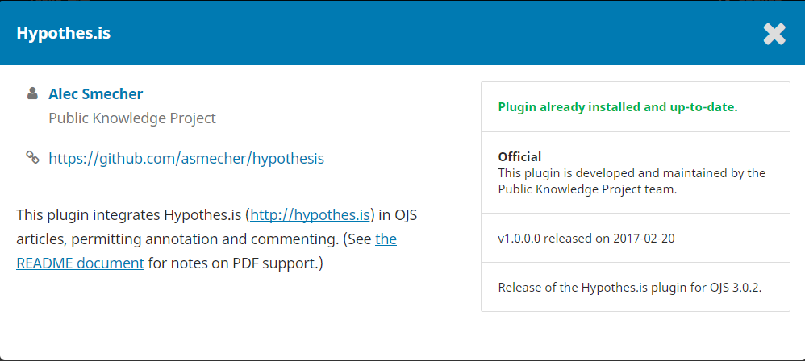
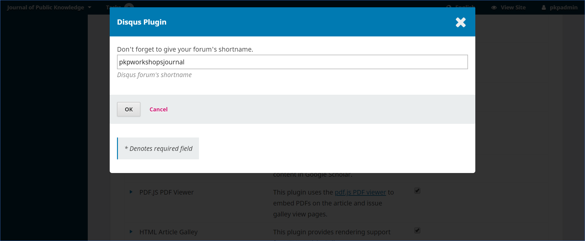

# Paramètres du Site Web

Les Paramètres du Site Web vous permettent de configurer l'apparence et le fonctionnement du Site Web de votre revue. Il se compose de 3 onglets principaux pour l'Apparence, la Configuration et les Plugiciels.


## Apparence

### Thème

Le thème détermine la conception ou la mise en page générale de votre site. Plusieurs options de thème différentes sont disponibles et vous pouvez les essayer sans affecter le contenu ou la configuration de votre site.

Vous pouvez d'abord vous assurer que tous les thèmes disponibles ont été activés sur votre site.

1. Accédez à l'onglet Plugiciels sous Paramètres du Site Web.
2. Faites défiler vers le bas et recherchez les plugiciels de thème.
3. Cochez la case à côté de chaque plugiciel pour l'activer.

Vous pouvez également rechercher des thèmes supplémentaires dans la Galerie de Plugiciels et les installer et les activer.

Maintenant que vous avez tous les thèmes disponibles, revenez à l'onglet Apparence pour essayer différents thèmes.

1. Sous Thème, vous verrez une liste déroulante de thèmes. Sélectionnez un.
2. Faites défiler vers le bas de la page et cliquez sur Enregistrer.
3. Le thème peut avoir des sous-thèmes supplémentaires ou des options de configuration disponibles. Pour les faire apparaître, actualisez la page dans votre navigateur.
4. Si vous sélectionnez un autre sous-thème ou modifiez le jeu de couleurs ou d'autres fonctionnalités de conception, cliquez à nouveau sur Enregistrer en bas de la page.
5. Ouvrez la page d'accueil de votre site dans un nouvel onglet ou une nouvelle fenêtre de votre navigateur pour voir à quoi ressemble le site avec le nouveau thème ou sous-thème et avec différentes options de configuration.
6. Si vous ne voyez pas les modifications apparaître sur votre site, vous devrez peut-être vider le cache dans le menu Administration.

Si vous souhaitez apporter des modifications mineures à la conception et à la mise en page de votre site, vous pouvez télécharger une **Feuille de Style de la Revue** dans Paramètres du Site Web > Apparence > Avancé

- **Typographie**: choisissez rapidement les polices de votre revue. Cette option peut être disponible ou non selon le thème sélectionné.

- **Couleur**: changez rapidement la couleur de l'en-tête de votre revue. Cette option peut être disponible ou non selon le thème sélectionné.

- **Résumé de la Revue** : cochez cette option pour afficher le résumé de la Revue sur la page d'accueil. Vous pouvez ajouter le résumé de votre revue sous Paramètres de la Revue > Masthead. Cette option peut être disponible ou non selon le thème sélectionné.

- **Image d'Arrière-Plan de l'En-Tête**: cochez cette option si vous souhaitez que l'image de la page d'accueil téléchargée soit affichée comme arrière-plan de l'en-tête.

### Installation

Où vous pouvez télécharger des images (logo, vignette, page d'accueil) vers la page principale de votre site, saisir des informations de pied de page et configurer le menu de votre barre latérale.

- **Vignette de la Revue**: téléchargez un petit logo ou une image représentative de la revue qui sera utilisée dans les listes de revues de cette installation OJS. Cela ne sera utilisé que sur les installations OJS avec plusieurs revues.

- **Image de la Page d'Accueil**: le téléchargement d'une image ici la placera sur la page d'accueil de votre revue.

- **Pied de Page**: saisissez les images, le texte ou le code HTML que vous souhaitez voir apparaître au bas de votre site Web.

- **Barre Latérale**: Cela vous permet de déplacer différents blocs dans ou hors de la barre latérale dans l'interface du lecteur. Vous pouvez également créer un bloc personnalisé à l'aide du [Plugiciel Custom Block](./settings-website.md#custom-block-plugin)

### Avancé

Où vous pouvez télécharger votre feuille de style de la revu, Favicon et contenu supplémentaire.

- **Feuille de Style de la Revue**: utilisez cette option pour télécharger une feuille de style unique pour votre revue. Si vous souhaitez apporter des modifications plus importantes à la conception ou donner à votre site un aspect tout à fait unique, vous pouvez développer votre propre thème ou thème enfant. Les instructions sont disponibles dans le [Guide de Thématisation PKP](https://docs.pkp.sfu.ca/pkp-theming-guide/en/) .

- **Journal Favicon**: Add a [favicon](https://en.wikipedia.org/wiki/Favicon) to display in the reader's browser address bar.

- **Additional Content**: Any text entered here will appear on your homepage.

Appuyez sur **Enregistrer** pour enregistrer vos modifications.

## Installation

### Information

Utilisez ces champs pour modifier le texte des pages Pour Lecteurs, Pour Auteurs, et Pour Bibliothécaires du site Web de la Revue.


N'oubliez pas de cliquer sur **Enregistrer** pour enregistrer les modifications.

Pour supprimer ces champs et leur contenu de l'affichage public sur l'interface utilisateur du site Web, désélectionnez le Bloc d'informations dans Paramètres du Site Web > Apparence > Gestion de la Barre Latérale.

### Langues

OJS est multilingue, ce qui signifie que l'interface, les emails et le contenu publié peuvent être disponibles en plusieurs langues sur un seul site ou revue. Lorsque vous installez OJS, vous pouvez sélectionner une ou plusieurs langues pour votre site.

Sous Paramètres du site Web > Langues, vous pouvez voir une liste des langues ou des paramètres régionaux installés sur votre site et configurer la façon dont les langues sont utilisées dans votre journal. Des langues supplémentaires peuvent être installées sur votre site par un Administrateur - voir le [Chapitre 4](https://docs.pkp.sfu.ca/learning-ojs/en/site-administration) pour plus de détails.


- **Paramètres Régionaux Principaux**: une langue doit être définie comme paramètres régionaux principaux, ce qui signifie la langue dans laquelle le journal apparaît par défaut.

- **UI**: If you want the journal’s interface to be available in other languages, select them here.

- **Formulaires**: Cela permettra à toutes les langues sélectionnées d'être disponibles lors du remplissage des formulaires en ligne. Cela permettra d'ajouter des métadonnées dans les langues sélectionnées dans l'onglet Publication.

- **Submission**: If you want authors to be able to make submissions in other languages, select them here. This will allow authors to add metadata in selected languages when uploading their submission.

Si vous activez l'affichage de plusieurs langues dans l'interface utilisateur, assurez-vous que dans Paramètres du site Web > Apparence > Gestion de la Barre Latérale, le Bloc Toggle de Langue est sélectionné pour rendre cette fonctionnalité disponible aux utilisateurs.

### Navigation

Cette section vous permet de configurer vos menus de navigation, par exemple pour inclure de nouveaux liens.


- **Menus de navigation** : configurez le Menu d'Utilisateur et/ou le Menu Principal.

Certains types d'éléments de menu ne seront affichés que sous certaines conditions. Par exemple, le type d'élément de menu Connexion sera lié à votre page de connexion, mais il n'apparaîtra dans le menu que lorsque le visiteur de votre site Web sera déconnecté. De même, le type d'élément de menu Déconnexion n'apparaîtra que lorsqu'un visiteur du site Web est connecté.

Lorsque vous attribuez à un élément de menu des conditions d'affichage à un menu, vous verrez une icône d' un œil avec une barre oblique en dessus. Vous pouvez cliquer sur cette icône pour en savoir plus sur le moment où l'élément sera affiché ou masqué.

- **Éléments du Menu de Navigation**: Ce sont des liens programmés que vous pouvez ajouter à l'un des menus ci-dessus. Si vous souhaitez ajouter un lien vers le menu principal (par exemple, «Notre société»), ajoutez-le ici en utilisant le lien *Ajouter un élément* .


L'l'élément apparaîtra maintenant dans la liste des éléments du menu de navigation. Ensuite, accédez au menu de navigation souhaité (par exemple, principal), utilisez la flèche bleue pour afficher les options et choisissez Modifier. Vous pouvez maintenant le faire glisser et le déposer des éléments de menu non attribués vers les éléments de menu attribués et à l'emplacement approprié dans le menu.


Appuyez sur Enregistrer pour enregistrer le changement.

### Annonces

Cette section vous permet de créer et d'afficher des annonces de nouvelles sur le site Web de la revue.


- **Annonces**: cochez cette case si vous souhaitez avoir des annonces sur votre site Web
    - **Introduction**: saisissez les informations que vous souhaitez voir apparaître sur votre page d'annonces.
    - **Afficher sur la Page d'Accueil**: saisissez le nombre d'annonces à afficher sur la page d'accueil. Si ce champ est laissé vide, aucune annonce ne sera affichée.

### Listes

Limitez le nombre d'éléments (par exemple, des soumissions, des utilisateurs ou des affectations de modification) à afficher dans une liste avant d'afficher les éléments suivants sur une autre page. Limitez également le nombre de liens à afficher aux pages suivantes de la liste.

### Déclaration de Confidentialité

Saisissez la déclaration de confidentialité que vous souhaitez voir apparaître sur votre site.

## Plugiciels

Utilisez cette page pour voir tous les plugiciels installés et trouver de nouveaux plugiciels.

### Plugiciels Installés

Tous les plugiciels répertoriés ici sont disponibles dans votre installation OJS. Cochez le lien Activer pour les utiliser.


Vous remarquerez que certains plugiciels sont requis pour le système et ne peuvent pas être désactivés.

Cliquez sur la flèche bleue à côté du nom du plugiciel pour afficher des liens vers les paramètres de suppression, de mise à niveau ou de configuration du plugiciel.

### Galerie de Plugiciels

La Galerie de Plugiciels donne accès à des plugiciels créés en externe, qui peuvent ne pas être inclus dans votre installation OJS, mais sont disponibles pour téléchargement et activation. Seul un utilisateur administrateur peut installer un nouveau plugiciel.


La sélection du titre du plugiciel fournira des détails supplémentaires, y compris l'auteur, le statut, la description et la compatibilité.



### Plugiciels Externes

Parfois, les nouveaux plugiciels ou plugiciels développés par des personnes extérieures à PKP n'apparaissent pas dans la galerie des plugiciels et vous devez les installer séparément.

1. Téléchargez le fichier tar.gz du plugiciel à partir de son référentiel sous l'onglet Versions.
2. Accédez à l'onglet Plugiciels Installés.
3. En haut à droite, cliquez sur Télécharger un nouveau plugiciel.
4. Upload the plugin file.
5. When it has finished uploading, click Save. Give it some time to install.

Si le téléchargement échoue, vous pouvez recevoir un message d'erreur indiquant: "L'archive du plugin téléchargé ne contient pas de dossier correspondant au nom du plugiciel." Habituellement, cela signifie que vous devez changer le nom du dossier du plugiciel dans le dossier zippé en un nom plus simple. Par exemple, remplacez «traducteur-ojs-3_0_0-0» par «traducteur».

N'oubliez pas de cliquer sur Enregistrer pour enregistrer le changement.

### Plugiciels d'Amélioration du Contenu et de Découverte

OJS 3 dispose d'un certain nombre de plugiciels que vous pouvez activer pour améliorer l'expérience utilisateur et la découvrabilité de votre contenu et de votre revue. Cette section décrit les différents plugiciels disponibles dans OJS et comment les configurer et les utiliser.

Étant donné que certains plugiciels ci-dessous sont des plugiciels tiers, vous devrez peut-être télécharger le fichier zip depuis GitHub et le télécharger dans votre revue. Pour des informations générales sur les plugiciels et comment installer et activer des plugiciels, veuillez consulter [Apprendre OJS 3 - Plugiciels](https://docs.pkp.sfu.ca/learning-ojs/en/settings-website#plugins) .

Veuillez noter que vu que PKP ne gére pas de plugiciels tiers, nous ne pouvons pas garantir qu'il fonctionnera avec votre version d'OJS.

#### Plugiciel AddThis

[AddThis](https://www.addthis.com/) permet un partage facile des réseaux sociaux en intégrant des outils pour plusieurs plates-formes dans un ensemble compact de boutons configurables. Le plugiciel intègre AddThis dans OJS/OMP pour un partage rapide du contenu publié.

Ce plugiciel peut être activé à partir de la galerie de plugiciels.


Vous pouvez configurer les icônes des réseaux sociaux et obtenir des statistiques en cliquant sur le bouton Paramètres du plugin.


Afin d'obtenir les statistiques de ce plugiciels, vous devrez vous inscrire pour un [compte AddThis](https://www.addthis.com/) .


#### Plugiciel Browse

Ce plugiciel implémente un plugiciel de bloc qui permet à l'utilisateur de naviguer dans le contenu par catégories. Le bloc de navigation apparaît dans la barre latérale de la revue.

Ce plugiciel peut être activé à partir de la galerie de plugiciels.


#### Plugiciel Citation Style Language

Le Plugiciel Citation Style Language ajoute un bloc «Comment citer» à la page de l'article qui contient une citation pour l'article dans le format de votre choix, avec une option en dessous pour générer la citation dans un autre format.


Ceci est un plugiciel installé et devra être activé sous Paramètres du site Web > Plugiciels > Plugiciels installés.

Pour configurer le plugiciel:

- Cliquez sur la flèche bleue à côté du nom du plugiciel
- Cliquez sur le lien **Paramètres** qui apparaît en dessous.


- Sélectionnez le format de citation principal que vous souhaitez utiliser dans la première liste, suivi des autres formats de citation que vous * souhaiteriez voir disponibles dans la deuxième liste
- Ensuite, vous pouvez éventuellement sélectionner un format téléchargeable à mettre à la disposition des lecteurs pour l'exporter vers un logiciel de gestion de bibliographie
- Vous pouvez également ajouter l'emplacement de votre publication/éditeur pour les citations qui le nécessitent
- Cliquez sur **OK** lorsque vous avez terminé la configuration

Désormais, le bloc Comment citer apparaîtra sur chaque page d'article de votre revue.

*Remarque: les formats de style de citation sont générés par une bibliothèque externe. Si vous remarquez une erreur dans un format de citation, vous pouvez signaler un problème dans [le dépôt de Citation Style Language sur GitHub](https://github.com/citation-style-language/styles) .*

*Vous pouvez également ajouter un style de citation personnalisé avec un codage personnalisé.*

#### Plugiciel de Bloc Personnalisé

Pour configurer et ajouter des blocs personnalisés:

- Cliquez sur Gérer les Blocs Personnalisés sous le nom du plugiciel
- À partir de cet écran, cliquez sur Ajouter un Bloc pour créer un nouveau bloc ou cliquez sur Modifier ou Supprimer sous le nom du bloc pour gérer les blocs existants.
- Lors de l'ajout d'un nouveau bloc, entrez un nom pour votre bloc (sans espaces ni caractères non alphanumériques) et le contenu à afficher dans la barre latérale.
- L'affichage et l'ordre des blocs peuvent être modifiés dans la section Gestion de la barre latérale de Tableau de bord > Paramètres > Site Web > Apparence > Configuration.

#### Plugiciel d'En-Tête Personnalisé

Le plugiciel d'en-tête personnalisé peut être utilisé pour ajouter du JavaScript personnalisé à un en-tête ou à un bloc. JavaScript est souvent nécessaire pour lier votre site à des services externes, mais ne peut pas être ajouté directement à un champ pour des raisons de sécurité.

Le plugiciel peut être installé à partir de la galerie de plugiciels.

**Exemple: utilisez le plugiciel d'en-tête personnalisé pour ajouter un fil Twitter à votre barre latérale**

Vous pouvez ajouter un fil Twitter pour votre revue, presse ou organisation dans la barre latérale d'OJS ou d'OMP.

Tout d'abord, vous devez activer et configurer le plugiciel d'en-tête personnalisé, qui vous permet d'ajouter du code JavaScript à un bloc personnalisé:

1. Accédez à Paramètres du site Web > Plugiciels et assurez-vous que le plugiciel En-tête personnalisé est installé et activé
2. Cliquez sur la flèche bleue à côté du nom du plugiciel et cliquez sur le bouton **Paramètres** qui apparaît ci-dessous
3. Collez ce qui suit dans le champ Contenu de l'en-tête:

```
<script async src="https://platform.twitter.com/widgets.js" charset="utf-8"></script>
```

1. Cliquez sur **OK** pour l'enregistrer

Ensuite, vous devez créer un bloc personnalisé:

1. Accédez à nouveau aux plugiciels installés et activez le plugiciel Custom Block Manager
2. Cliquez sur la flèche bleue à côté du nom du plugiciel, puis sur **Gérer les Blocs Personnalisés** en dessous
3. Cliquez sur **Ajouter un Bloc**
4. Donnez au bloc un nom, tel que "Twitter"
5. Above the **Content** field, click the **Source Code** button
6. Dans la boîte de dialogue qui apparaît, collez le contenu suivant - sauf utilisez votre propre lien et nom de compte Twitter:

```
<a class="twitter-timeline" href="https://twitter.com/asmecher?ref_src=twsrc%5Etfw">Tweets by asmecher</a>
```

1. Des paramètres de chronologie personnalisés supplémentaires peuvent être ajoutés si vous le souhaitez, par exemple:

```
<a class="twitter-timeline" "data-tweet-limit="3" ...
```

1. Cliquez sur **Enregistrer**

Enfin, vous devez ajouter le bloc personnalisé que vous venez de créer à votre barre latérale.

1. Accédez à Paramètres du site Web > Apparence et faites défiler jusqu'à **Gestion de la Barre Latérale**
2. Vous devriez voir le bloc Twitter sous **Non Sélectionné**
3. Faites glisser et déposez le bloc sur la **Barre Latérale**. Vous pouvez faire glisser et déposer tous vos blocs dans l'ordre souhaité.

Une autre option consiste à utiliser le [plugiciel de la barre latérale Twitter](https://github.com/RBoelter/ojs3-twitter-sidebar). Ce plugiciel crée un bloc Twitter pour la barre latérale.

#### Plugiciel Disqus

Le [plugiciel Disqus](https://github.com/ajnyga/disqus) s'intègre à [Disqus](disqus.com) et permet aux utilisateurs d'ajouter des commentaires aux pages d'article.

Le plugiciel Disqus est un plugiciel tiers et doit être installé à partir de son référentiel Github.

Après avoir installé et activé le plugiciel, vous devez créer un compte Disqus sur le [Site Web Disqus](disqus.com). Lors de votre inscription, choisissez l'option permettant d'utiliser Disqus sur votre site Web. Disqus propose des forfaits gratuits et payants et vous devez choisir un forfait lors de votre inscription.

Lorsqu'on vous demande d'enregistrer le **Nom de votre Site Web**, créez un nom basé sur le nom de votre journal. Cela apparaîtra dans les fils Disqus, les notifications par courriel et votre onglet Communauté. Par exemple "pkpworkshopsjournal."

Ignorez l'étape **Installer Disqus{/ strong0} et accédez à **Configurer Disqus{/ strong1}. Saisissez l'URL de votre revue dans le champ **URL du site Web{/ strong2}. Entrez vos règles pour les commentaires, si vous en avez.******


Vous pouvez maintenant configurer le plugiciel Disqus sur votre site de revue:

1. Allez dans Paramètres du Site Web > Plugiciels
2. Trouvez le plugiciel Disqus
3. Cliquez sur la flèche bleue à côté du nom du plugiciel et des **Paramètres** qui apparaîtront en dessous
4. Entrez le nom du site Web de votre compte Disqus dans le champ **nom court du forum Disqus**
5. Cliquez sur **OK**



Après avoir configuré le plugiciel, si vous ouvrez l'une de vos pages d'article, vous devriez voir les commentaires Disqus en bas. Vos utilisateurs devront s'inscrire à Disqus pour utiliser la fonctionnalité.


#### Plugiciel Hypothes.is

Ce plugiciel ajoute l'intégration de Hypothes.is à la vue publique de l'article d'OJS, permettant l'annotation et les commentaires. Il prend actuellement en charge les commentaires sur les épreuves HTML.

Ce plugiciel peut être activé à partir de la galerie de plugiciels.

Une fois activés, les lecteurs verront les outils hypothes.is sur le côté droit de l'épreuve HTML.


Vous aurez besoin d'un compte hypothes.is gratuit pour participer aux commentaires publics. Des groupes de commentaires spécifiques/privés peuvent également être créés. [Voir hypothes.is](https://web.hypothes.is/help/how-to-create-a-private-group/) pour les instructions.

Les annotations et mises en évidence publiques seront visibles (si il y en a) une fois que vous serez connecté.


#### Plugiciel Keyword Cloud

Ce plugiciel affiche un nuage d'étiquettes de mots-clés qui peuvent être activés dans la barre latérale de votre journal ou de votre presse.


Il s'agit d'un plugiiciel tiers qui devra être [téléchargé à partir de GitHub](https://github.com/lepidus/ojs3-keywordcloud-plugin) .

Une fois que vous avez téléchargé le fichier depuis GitHub, téléversez-le dans votre journal et activez-le. Cela rendra le nuage de mots-clés disponible sous forme de bloc que vous pourrez ajouter à la barre latérale de votre journal.

Pour ajouter l'affichage du nuage de mots clés à votre barre latérale:

1. Accédez à Paramètres > Site Web > Apparence > Gestion de la barre latérale
2. Faites glisser le bloc Keyword Cloud de la colonne **Non sélectionné** vers la colonne de la **barre latérale**
3. Réorganisez l'ordre des blocs au besoin
4. Cliquez sur **Enregistrer**

Le nuage devrait maintenant apparaître dans la barre latérale de votre site de revue.

#### Plugiciel Most Read

Ce plugiciel crée une section «articles les plus lus» dans la barre latérale de la revue avec les 5 articles les plus consultés (avec liens) la semaine dernière, ainsi que le nombre de vues par article.


Ceci est un plugiciel tiers et le fichier devra être [téléchargé à partir de GitHub](https://github.com/ajnyga/mostRead) .

*Ce plugiciel est compatible avec OJS version 3.1.2 ou supérieure. Il est actuellement en cours d'adaptation pour OJS 3.2.*

Une fois que vous avez téléchargé le fichier depuis GitHub, téléversez-le dans votre revue et activez-le. Cela créera un bloc «Les plus lus» que vous pourrez ajouter à la barre latérale de votre revue.

Pour ajouter le bloc les plus lus à votre barre latérale:

1. Accédez à Paramètres > Site Web > Apparence > Gestion de la barre latérale
2. Faites glisser le bloc les plus lus de la colonne **Non sélectionné** vers la colonne de la **barre latérale**
3. Réorganisez l'ordre des blocs au besoin
4. Cliquez sur **Enregistrer**

Le bloc apparaîtra maintenant dans la barre latérale de votre site de revue.

#### Plugiciel Recommander des Articles par d'Auteur

Ce plugiciel insère une liste d'articles du même auteur (avec les liens appropriés) sur la page de résumé d'un article.


Ce plugiciel peut être activé dans la galerie de plugiciels.

Une fois qu'il a été activé, aucune configuration supplémentaire n'est requise.

#### Plugiciel Recommander des Articles Similaires

Ce plugiciel insère une liste d'articles similaires dans la page de résumé de l'article.

Ce plugiciel peut être activé dans la galerie de plugiciels.

Une fois qu'il a été activé, aucune configuration supplémentaire n'est requise.

#### Plugiciel Statistiques d'Utilisation

Ce plugiciel affiche le nombre de téléchargements d'un article sur la page de l'article.


Pour configurer le plugiciel de statistiques d'utilisation, vous devez être un **Administrateur**:

1. Accédez à Paramètres > Site Web > Plugiciels.
2. Sous Plugiciels Génériques, recherchez le Plugin de Statistiques d'Utilisation. 3.Cliquez sur la flèche bleue à gauche du nom du plugiciel pour faire apparaître des liens en dessous du plugiciel.
3. Cliquez sur Paramètres.
4. Faites défiler vers le bas de la boîte de dialogue qui s'ouvre à la section Options d'Affichage des Statistiques.
5. Cochez la case à côté de Afficher les statistiques de soumission pour le lecteur.
6. En dessous, vous pouvez sélectionner si vous souhaitez afficher les statistiques sous forme de graphique à barres ou à courbes et le nombre maximum de mois pour lesquels afficher l'utilisation.
7. Cliquez sur Enregistrer.


Veuillez noter que:

- Les statistiques d'utilisation ne peuvent être affichées que pour l'année en cours. Le plugiciel est réinitialisé au début de chaque année.
- Les statistiques affichées indiquent le nombre de fois qu'un article a été téléchargé.

## Pages Statiques

Le **plugiciel Pages Statiques** vous permet de créer de nouvelles pages sur le site Web de votre journal pour du contenu supplémentaire - par exemple, vous pouvez créer une page qui détaille vos règles d'accès ouvert.

Pour utiliser le plugiciel Pages Statiques:

- Accédez à Paramètres du site Web > Plugiciels et recherchez le plugiciel Pages Statiques
- Activez le plugiciel en cochant la case à côté
- Actualisez la page dans votre navigateur. Vous devriez maintenant voir un nouvel onglet à côté de **Plugiciels** appelé **Pages Statiques** .
- Cliquez sur l'onglet **Pages Statiques**


- Ajoutez une nouvelle page en cliquant sur **Ajouter une Page Statique** .
- Remplissez le formulaire qui s'ouvre avec le contenu que vous souhaitez avoir sur la page. Le **Chemin** sera utilisé dans le cadre de l'URL de la page et le **Titre** apparaîtra comme titre de la page.


- Vous pouvez prévisualiser la page pendant que vous travaillez en cliquant sur le lien **Aperçu** en bas du formulaire
- Lorsque vous avez terminé de créer la page, cliquez sur **Enregistrer**

Après avoir créé la page, vous voudrez l'ajouter à votre menu. Les instructions sur la façon de procéder se trouvent dans la section ci-dessus sur **les Menus de Navigation** .

Pour modifier une page que vous avez créée avec le plugiciel:

- Allez dans Paramètres du site Web > Pages Statiques
- Cliquez sur **Modifier** à côté de la page que vous souhaitez modifier
- Vous pouvez prévisualiser la page pendant que vous travaillez en cliquant sur le lien **Aperçu** en bas du formulaire
- Lorsque vous avez terminé de modifier la page, cliquez sur **Enregistrer**
