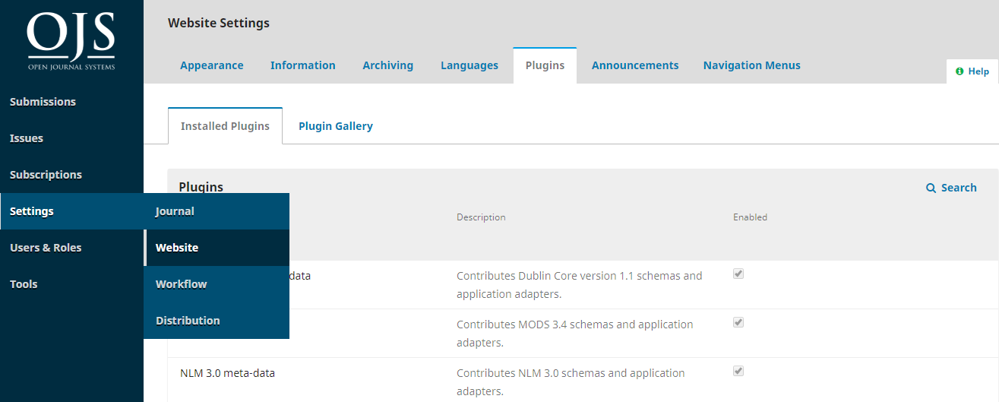

# Outils

La section Outils est accessible à partir du menu de la barre latérale gauche.

Les Outils consistent d'un onglet Import/Export, d'un onglet Générateur de Rapports (appelé Statistiques dans OJS 3.1.1 et versions antérieures) et d'un onglet Autorisations.

## Importer/Exporter

Importer/Exporter vous permet d'extraire facilement des données de votre journal OJS et d'y insérer des données.

Quelques outils vous permettent d'exporter vers des systèmes tiers, tels que PubMed ou le DOAJ. D'autres vous permettent d'importer ou d'exporter des données utilisateur ou article.

If you want to export user data, you can find the option to export it as an XML file here. If you prefer your user data in a spreadsheet format, you can download it as a CSV file from **Statistics > Users**.

Pour plus d'informations sur le plugiciel Crossref XML Export, consultez le [Guide PKP Crossref](/crossref-ojs-manual/) .

Pour des instructions détaillées sur l'importation et l'exportation voir le [Guide de l'Administrateur/trice](/admin-guide/fr/data-import-and-export).

### Plugiciel Quick Submit

Le Plugiciel Quick Submit vous permet d'ajouter rapidement des soumissions complètes à un numéro. Il fournit un processus de soumission en une étape pour les éditeurs qui doivent contourner le processus traditionnel de soumission, d'évaluation et d'édition.

Pour utiliser ce plugiciel, vous aurez besoin des éléments suivants:

* Revues qui utilisent OJS pour afficher et publier leur contenu sans utiliser le flux des travaux éditorial
* Revues publiées sur une autre plate-forme et migrant vers OJS, lorsqu'un outil de conversion pour cette plate-forme n'est pas disponible
* Revues initialement publiées sur papier et digitalisées depuis

To use this plugin, you will need the following:

* Être inscrit en tant qu'éditeur/trice ou directeur/trice de revue
* Un ensemble de fichiers prêts à publier (par exemple, des PDF)
* Toutes les métadonnées des fichiers (par exemple, noms d'auteurs, titres, résumés, etc.)

Tout d'abord, assurez-vous que le plugin Quick Submit a été installé et activé pour votre journal.  Vous premièrement avoir le rôle de Directeur/trice de Revue pour activer le plugiciel et le rôle d'Administrateur/trice pour installer le plugiciel.

1. Allez dans Paramètres > Site Web > Plugiciels
2. Sous Plugiciels installés, recherchez le Plugiciel Quick Submit.  Si vous le voyez dans la liste, passez à l'étape 8.
3. Si vous ne voyez pas le Plugiciel Quick Submit sous Plugiciels installés, accédez à l'onglet Galerie de Plugiciels.
4. Cliquez sur Quick Submit. Une boîte de dialogue s'ouvre.
5. Cliquez sur Installer.  Si vous ne voyez pas le bouton Installer, vous devrez demander à l'Administrateur/trice de votre site d'installer le plugiciel pour vous.
6. Une boîte de dialogue s'ouvre et demande "Êtes-vous sûr de vouloir installer ce plugiciel?"  Cliquez sur OK et attendez quelques minutes pendant que l'installation se termine.
7. Une fois le plugiciel installé, revenez à l'onglet Plugiciels Installés et recherchez le plugiciel Quick Submit.
8. Cochez la case à droite du nom et de la description du plugiciel pour activer le plugiciel.

Ensuite, vous devrez créer les numéros qui contiendront les nouveaux articles que vous importez.

1. Accédez à Numéros > Numéros à venir et sélectionnez Créer un Numéro.
2. Saisissez les métadonnées du Numéro
3. Si le Numéro est déjà publié, vous pouvez cocher "Publié"
4. Cliquez sur Enregistrer.
5. Faites cela pour tous les Numéros pour lesquels vous téléchargez des articles.

Ensuite, vous pouvez importer chaque article avec le Plugiciel.

1. Allez dans Outils > Importer/Exporter et sélectionnez Plugiciel de soumission expresse
2. Téléversez une image de couverture si vous en avez une.  Ce champ est facultatif et peut être ignoré.
3. Choisissez la section de la revue dans laquelle l'article apparaîtra dans la liste déroulante du champ Section.
4. Saisissez les métadonnées de l'article dans les autres champs. Si vous ne voyez pas tous les champs de métadonnées souhaités, accédez à Paramètres du flux des travaux > Soumission > Métadonnées de Soumission pour configurer les champs à inclure dans les soumissions.
5. Sous Liste des Contributeurs, cliquez sur Ajouter un Contributeur pour saisir les noms des auteurs et des autres contributeurs à l'article.
6. Sous Épreuves, cliquez sur Ajouter une Épreuve pour télécharger un fichier PDF de l'article.  Une boîte de dialogue s'ouvrira où vous pourrez entrer l'Étiquette de l'Épreuve et la langue de l'Épreuve.  Une fois que vous avez cliqué sur Enregistrer, une autre boîte s'ouvre où vous pouvez sélectionner le Composant de l'Article et télécharger le fichier.
7. À la fin du formulaire du Plugiciel de soumission expresse, vous pouvez choisir si vous souhaitez que l'article que vous ajoutez soit publié immédiatement ou non publié si vous souhaitez le publier plus tard. Si vous sélectionnez **Publié**, vous devrez sélectionner le numéro dans lequel vous souhaitez le publier et entrer la **Date de Publication**. Vous pouvez également saisir des numéros de page et des informations sur les autorisations.
8. Lorsque vous avez terminé de saisir toutes les données de l'article, cliquez sur Enregistrer.

Les DOI ne sont pas ajoutés avec le plugiciel QuickSubmit. Au lieu de cela, vous devez les ajouter séparément.

Pour attribuer de nouveaux DOI aux articles:

1. Activez et configurez le plugiciel DOI de sorte que vous deviez "Entrer un suffixe DOI individuel pour chaque élément publié."
2. Après avoir téléchargé l'article avec le plugiciel QuickSubmit, cliquez sur «Aller à la Soumission» pour accéder à l'enregistrement de soumission de l'article. Ou accédez à l'enregistrement de soumission de l'article via le tableau de bord Soumissions.
3. Ouvrez les Métadonnées en haut à droite et accédez à l'onglet Identificateurs
4. Entrez le suffixe DOI de l'article.
5. Cliquez sur Enregistrer puis enregistrez à nouveau pour attribuer le DOI
6. Si vous attribuez normalement des DOI à l'aide d'un modèle par défaut, reconfigurez le plugiciel DOI pour cela après avoir terminé d'ajouter des DOI aux articles que vous avez téléchargés avec le plugiciel QuickSubmit.

La page Générateur de Rapports permet d'accéder à divers rapports de votre revue.

1. Assurez-vous que le plugiciel DOI est activé et configuré
2. Après avoir téléversé l'article avec le plugiciel de soumission expresse, cliquez sur «Aller à la Soumission» pour accéder à l'enregistrement de soumission de l'article. Ou accédez à l'enregistrement de soumission de l'article via le tableau de bord Soumissions.
3. Ouvrez les Métadonnées en haut à droite et accédez à l'onglet Identificateurs. Vous devriez voir un aperçu du DOI qui sera attribué et une case cochée à côté de «Attribuer le DOI à cet article».
4. Cliquez sur Enregistrer et le DOI sera attribué.

## Générateur de rapports

L'outil Réinitialiser les Autorisations d'Article vous permet de réinitialiser la déclaration des droits d'auteur et les informations de licence sur tous les articles publiés, et les rétablira aux paramètres par défaut actuels de votre revue. Soyez prudent lorsque vous utilisez cet outil et consultez une expertise juridique si vous ne savez pas quels droits vous détenez sur les articles publiés dans votre revue.

