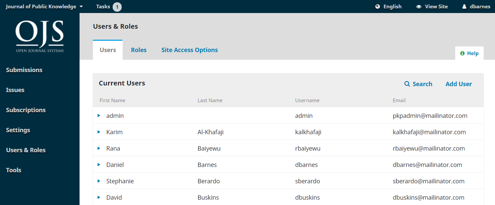

# Utilisateurs et Rôles

Cette section donne accès à tous les comptes d'utilisateurs associés à votre revue, ainsi que la possibilité de gérer les rôles et les autorisations.

## Utilisateurs

En plus de gérer le site Web de la revue, le/la Directeur/trice de la Revue est également responsable de tous les comptes utilisateurs du système.

Pour afficher les comptes d'utilisateurs, sélectionnez Utilisateurs et Rôles dans le menu de gauche.

### Utilisateurs

Les utilisateurs sont affichés par ordre de nom.

Vous pouvez modifier un compte utilisateur en sélectionnant la flèche bleue à gauche d'une entrée.

Cela ouvre les options Email, Modifier l'Utilisateur, Désactiver, Supprimer, connexion sous , Fusionner l'Utilisateur.

#### Utilisateurs d'Email

Si vous souhaitez envoyer un email à un utilisateur à propos d'une soumission particulière, vous pouvez utiliser la fonction Discussion dans la soumission. Cela garde toutes les communications concernant une soumission en un seul endroit.

Pour envoyer un email à un utilisateur qui n'est pas lié à une soumission:

1. Dans le tableau de bord du/de la directeur/trice de la revue ou du rédacteur, allez à Utilisateurs et Rôles > Utilisateurs
2. Trouvez l'utilisateur à qui vous souhaitez envoyer un e-mail
3. Cliquez sur la flèche bleue à côté du nom de l'utilisateur pour afficher les liens en dessous
4. Cliquez sur Email. Une boîte de dialogue apparaîtra dans laquelle vous pouvez taper votre message et l'envoyer

Vous ne pouvez pas envoyez un email à plusieurs utilisateurs à la fois sauf en utilisant la fonction d'Annonces. Voir le [Chapitre Paramètres de Flux des Travaux](https://docs.pkp.sfu.ca/learning-ojs/en/settings-workflow) pour des instructions sur comment onvoyer des annonces. Il n'est pas non plus possible d'envoyer un message à tous les utilisateurs dans un rôle, comme tous les évaluateurs enregistrés sur votre site.

Si vous souhaitez envoyer régulièrement un email à plusieurs utilisateurs ou à tous les utilisateurs d'un même rôle, vous pouvez utiliser une application de marketing par email externe telle que Mailchimp. Les enregistrements d'utilisateur peuvent être exportés au format XML en utilisant Outils > Importer/Exporter > Plugiciel Users XML ou un administrateur peut les exporter de la base de données au format CSV.

Il n'est actuellement pas possible d'ajouter des adresses cc ou cci aux messages ou d'ajouter des pièces jointes aux messages. Pour envoyer des pièces jointes, vous pouvez utiliser la fonction de Discussion ou la Bibliothèque de Soumission.

**Modifier l'Utilisateur** vous permet d'apporter des modifications au compte de cet utilisateur.

**Désactiver** maintient le compte en place, mais empêche l'utilisateur d'y accéder.

**Supprimer** désinscrit l'utilisateur de tous les rôles dans la revue, mais le compte utilisateur reste dans le système. La seule façon de supprimer réellement un compte utilisateur de votre système est de **Fusionner les Utilisateurs** (voir ci-dessous).

**Connexion sous** vous permet de vous connecter temporairement en tant que cet utilisateur, par exemple, pour terminer une tâche en cours.

#### Fusionner l'Utilisateur

La fonction Fusionner l'Utilisateur vous permet de déplacer les aspects de ce compte d'utilisateur, y compris les soumissions ou affectations, vers un autre compte d'utilisateur sur votre système.

> **Remarque**: c'est le seul moyen de supprimer complètement un compte du système.

Vous pouvez créer un compte d'utilisateur factice (par exemple, les utilisateurs supprimés) et l'utiliser pour y fusionner les comptes indésirables.

Pour fusionner des utilisateurs:

1. Dans Utilisateurs et Rôles > Utilisateurs, recherchez le compte d'utilisateur que vous souhaitez supprimer
2. Cliquez sur la flèche bleue à côté du nom d'utilisateur
3. Cliquez sur **Fusionner l'Utilisateur** dans le menu qui apparaît ci-dessous
4. Recherchez le compte d'utilisateur dans lequel vous souhaitez fusionner ce compte utilisateur (l'utilisateur que vous souhaitez garder)
5. Cliquez sur la flèche bleue à côté du nom d'utilisateur
6. Cliquez sur **Fusionner avec cet utilisateur**
7. Appuyez sur **OK** pour confirmer

#### Rechercher des Utilisateurs

Lorsque vous avez un grand nombre d'utilisateurs, vous souhaiterez profiter de la fonction de recherche.

Cela peut vous aider à trouver rapidement un utilisateur par son prénom, son nom ou son adresse email, ou à voir tous les utilisateurs d'un rôle particulier.

**Remarque**: si vous laissez le champ Rechercher vide, sélectionnez un Rôle et appuyez sur Rechercher, vous obtiendrez une liste de tous les utilisateurs de ce rôle (par exemple, tous les réviseurs).

#### Ajouter un Utilisateur

Pour ajouter un nouvel utilisateur à votre revue, sélectionnez le lien Ajouter un Utilisateur. Cela ouvrira une nouvelle fenêtre avec un ensemble de champs à remplir.

Une fois ces champs complétés et que vous cliquez sur *Enregistrer*, il vous sera alors demandé d'attribuer des rôles au nouveau compte. Utilisez le lien *Ajouter un Rôle* pour ouvrir le sélecteur de rôle.

Une fois que vous avez ajouté tous les rôles, cliquez sur le bouton **Enregistrer** .

#### Enregistrer un-e Utilisateur/trice à partir d'une Autre Revue

Sur les installations multi-revues, un-e administrateur/trice peut enregistrer un-e utilisateur/trice de la Revue A en tant qu'utilisateur/trice de la Revue B.

1. Connectez-vous à la revue B en tant qu'Administrateur/trice
2. Allez dans Utilisateurs et rôles > Utilisateurs
3. Recherchez l'utilisateur/trice dans la revue A que vous souhaitez enregistrer dans la revue B, en cochant la case **Inclure les utilisateurs sans rôle dans cette revue**
4. Lorsque l'utilisateur/trice apparaît, cliquez sur la flèche bleue à côté de son nom
5. Cliquez sur **Modifier l'Utilisateur/trice**
6. Faites défiler jusqu'à **Rôles d'Utilisateur/trice** dans la zone Modifier l'Utilisateur/trice qui s'affiche.
7. Cochez le rôle que vous souhaitez que l'utilisateur/trice ait sur la revue B
8. Cliquez sur **Enregistrer** à la fin du formulaire

#### Si un-e Utilisateur/trice ne peut Pas se Connecter

Si un-e utilisateur/trice ne peut pas se connecter à votre site de revue, dites-lui de sélectionner **Mot de passe oublié** sur la page de connexion. Ils recevront alors un lien de réinitialisation du mot de passe par e-mail et pourront réinitialiser leur mot de passe.

Si l'utilisateur/trice a d'autres problèmes, un-e Directeur/trice de Revue ou un rédacteur  peut effectuer les opérations suivantes:

1. Allez dans Utilisateurs et Rôles > Utilisateurs
2. Trouvez l'utilisateur/trice qui ne peut pas se connecter et cliquez sur la flèche bleue à côté de son nom
3. Cliquez sur le bouton **Modifier l'Utilisateur/trice** qui apparaît ci-dessous
4. Entrez un nouveau mot de passe dans le champ **Mot de passe**, en notant le mot de passe
5. Cochez L'**utilisateur/trice doit changer le mot de passe lors de la prochaine connexion**
6. Cliquez sur **Enregistrer** à la fin du formulaire
7. Envoyez le nouveau mot de passe à l'utilisateur/trice et demandez-lui de se connecter avec ce mot de passe

Si l'utilisateur/trice ne parvient toujours pas à se connecter, son compte a peut-être été désactivé. Pour le réactiver:

1. Allez dans Utilisateurs et rôles > Utilisateurs
2. Trouvez l'utilisateur qui ne peut pas se connecter et cliquez sur la flèche bleue à côté de son nom
3. Regardez sous leur nom pour **Activer** ou **Désactiver.** Si Désactiver apparaît, le compte est déjà activé. Si Activer apparaît, cliquez dessus pour réactiver le compte.

## Rôles

Les utilisateurs du système doivent avoir un ou plusieurs rôles.

Les rôles définissent ce qu'un-e utilisateur/trice peut faire dans le système. Un auteur peut faire des soumissions et rien d'autre. Un-e rédacteur/trice peut gérer les soumissions et un-e directeur/trice de revue peut configurer les paramètres du journal. Voir le [Chapitre Comptes d'Utilisateurs](https://docs.pkp.sfu.ca/learning-ojs/en/user-accounts#roles-in-ojs) pour une liste et une description de chaque rôle.

Un utilisateur peut avoir plusieurs rôles, par exemple, être un-e directeur/trice, un-e rédacteur/trice et un-e auteur dans la même revue.

Voici un exemple des rôles et des niveaux d'autorisation respectifs dans un flux des travaux de revue typique:

Sur cette page, vous pouvez voir chaque rôle et la phase éditoriale à laquelle chaque rôle peut accéder. Un bon exemple de ceci est le rôle de Réviseur/euse, qui ne peut accéder qu'à l'étape de révision. Les réviseurs ne peuvent pas passer à l'étape d'évaluation pour voir ce qui s'est passé pendant le processus d'évaluation par les pairs. Voir le chapitre Flux des Travaux éditorial pour plus d'informations sur les différentes étapes éditoriales.

### Modification des Rôles

Décocher une case supprime l'accès à cette étape pour les utilisateurs ayant ce rôle.

La sélection de la flèche bleue à gauche du nom du rôle révèle le lien de modification. Cliquez dessus pour ouvrir la fenêtre d'édition.

**Niveau d'Autorisation**: indique ce qu'un-e utilisateur/trice avec ce rôle peut faire à n'importe quelle étape.

Le niveau Assistant-e de Revue peut communiquer avec d'autres utilisateurs et télécharger et réviser des fichiers. Dans les revues où un-e seul-e utilisateur/trice a reçu un rôle d'assistant-e, il/elle sera automatiquement affecté-e à une nouvelle soumission. Une fois qu'une deuxième personne a reçu ce rôle, cette action s'arrête.

**Nom du Rôle**: vous pouvez utiliser ce champ pour renommer facilement n'importe quel rôle.

**Abréviation**: chaque rôle doit avoir une abréviation unique.

**Attribution d'Étape**: cela vous permet de déterminer à quelle étape les utilisateurs avec ce rôle peuvent accéder.

**Options de Rôle**: utilisez ces cases à cocher pour afficher toute personne ayant ce rôle dans la liste des contributeurs (par exemple, la liste des auteurs). Depuis OJS 3.2, les rôles peuvent être autorisés à modifier les métadonnées de soumission en cochant la case.

Utilisez la deuxième option pour déterminer si les utilisateurs peuvent s'inscrire eux-mêmes dans ce rôle. Les auteurs et les évaluateurs sont de bons candidats pour l'auto-inscription. Vous ne voudriez certainement PAS permettre aux utilisateurs de s'auto-enregistrer en tant que Directeurs ou Éditeurs de la Revue!

La troisième option est utile pour les rédacteurs invités ou éventuellement les rédacteurs de rubrique, selon votre flux des travaux et votre chaîne d'autorité préférés.

### Créer de Nouveaux Rôles

Utilisez le lien *Créer de Nouveaux Rôles* pour ouvrir une fenêtre dans laquelle vous pouvez créer un nouveau rôle pour votre revue, notamment en définissant les étapes auxquelles le rôle peut accéder et le niveau d'autorisation dont il doit disposer.

## Options d'Accès au Site

Cette page vous permet de déterminer comment les lecteurs peuvent accéder à votre revue.

**Restrictions Supplémentaires d'Accès au Site et à l'Article**: choisissez parmi ces options pour limiter l'accès.

> Gardez à l'esprit que même si le fait d'exiger une inscription pour lire le contenu en libre accès peut être pratique pour votre suivi, cela peut dissuader certaines personnes de lire votre contenu. Utiliser avec précaution.

**Inscription des Utilisateurs**: cette option vous permet de déterminer si les utilisateurs peuvent créer leurs propres comptes ou s'ils doivent être inscrits par un-e Directeur/trice de Revue.

> Permettre aux utilisateurs de s’enregistrer eux-mêmes, mais uniquement dans les rôles d’auteur, de évaluateur/trice ou de lecteur/trice, est un bon choix.
