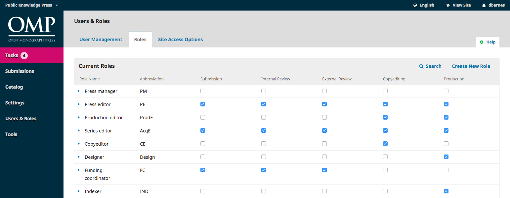
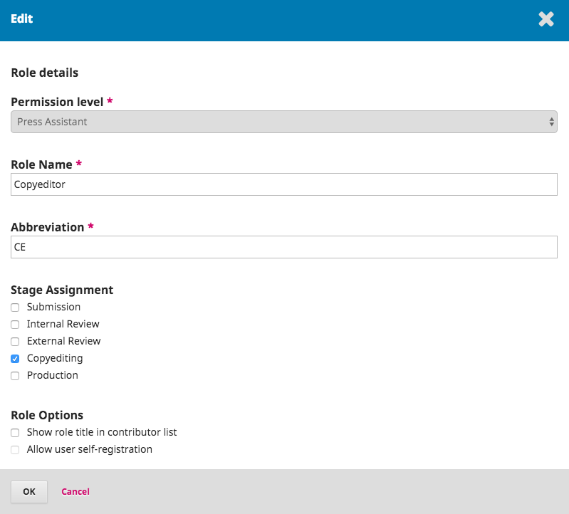

# Roles

Users in the system must have one or more roles.

Roles define what a user can do within the system. An Author can make submissions and little else. A Press Editor can manage submissions, and a Press Manager can configure press's settings.

One user can have more than one role, for example, being a Press Manager, Press Editor, and Author in the same press.

OMP has multiple roles available, each with different permission levels.

From this page, you can see each role, and the editorial stage each role can access. A good example of this is the Indexer role, which can only access the production stage. Indexers cannot jump to the External Review stage to see what happened during the peer review process. See Chapter 10 for more information about the different editorial stages.

## Editing Roles

Unchecking a box removes access to that stage for users with that role.

Selecting the blue arrow to the left of the role name reveals the edit link. Clicking this opens the editing window.

**Permission Level**: This indicates how much a user with this role can do in any stage. The Press Assistant level can communicate with other users and upload and revise files.

**Role Name**: You can use this field to easily rename any role.

**Abbreviation**: Each role must have a unique abbreviation.

**Stage Assignment**: This allows you to determine which stage users with this role can access.

**Role Options**: Use these checkboxes to show anyone with this role in the contributor list \(e.g., the author list\) as well as whether users can self-register in this role. Authors and Reviewers are good candidates for self-registration. You would definitely NOT want to allow users to self-register as Press Managers or Editors!

## Create New Role

Use the _Create New Roles_ link to open a window where you can create a new role for your press, including setting which stages it can access and how much permission it should have.

