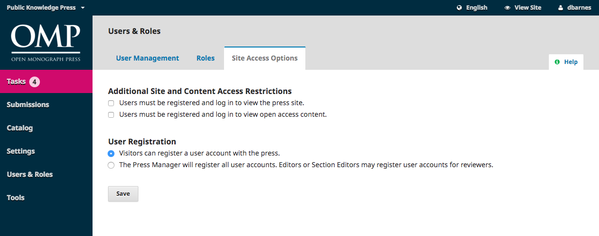

# Site Access Options

This page allows you to determine how readers can access your press.

**Additional Site and Article Access Restrictions**: Choose from these options to limit access.

**User Registration**: This option allows you to determine whether users can create their own accounts or must be enrolled by a Press Manager.

> Allowing users to register themselves, but only into Author, Reviewer, or Reader roles, is a good choice.

