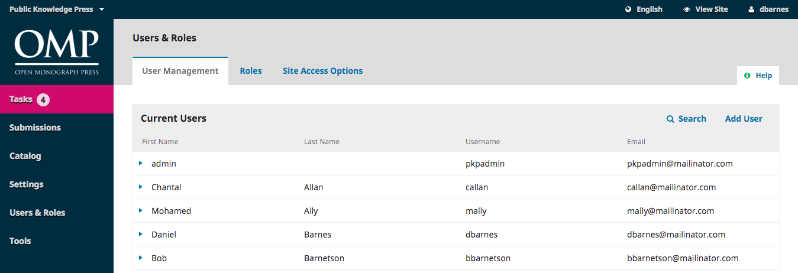
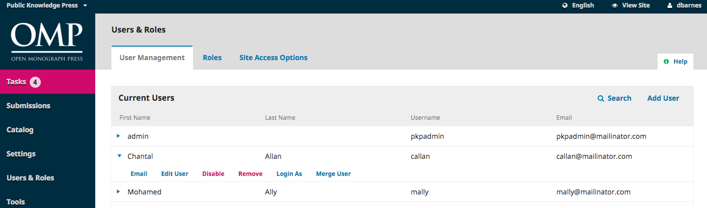
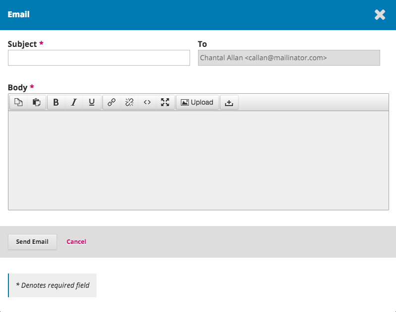
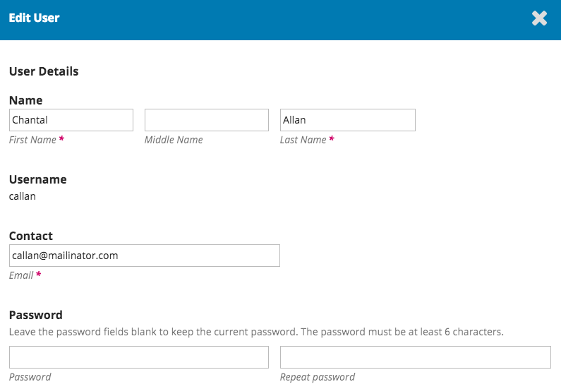
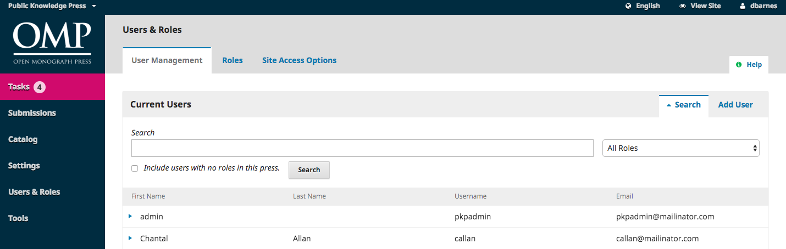
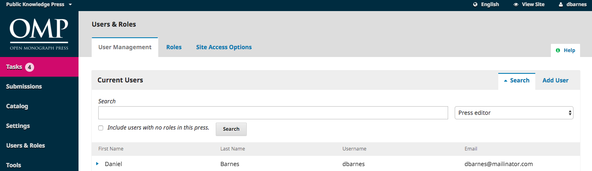
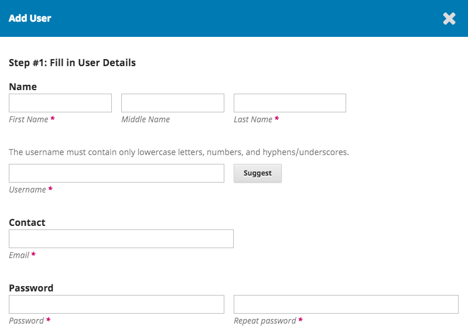
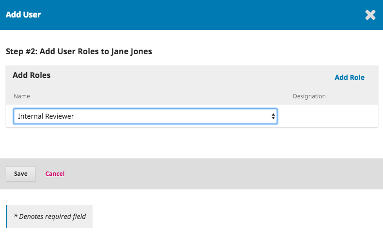

# Users

In addition to managing the press web site, the Press Manager is also responsible for all of the user accounts in the system.

To view the user accounts, select Users & Roles from the left menu.

## User Management

Users are displayed in last name order.

You can edit a user account by selecting the blue arrow to the left of an entry.

This opens the options to Email, Edit User, Disable, Remove, Login As, or Merge User.

**Email **opens a window allowing you to quickly send a message to that user.

**Edit User **allows you to make changes to that user's account.

**Disable **keeps the account in place, but blocks the user from accessing it.

**Remove **clears the user account out of your press records and the user can no longer login, but the account remains in the system.

**Login As **allows you to temporarily log in as that user, for example, to complete an outstanding task.

**Merge User **lets you fold this user account, including any submissions or assignments, into another user account on your system.

> **Note**: This is the only way to completely delete an account from the system.

You may want to create a dummy user account \(e.g., Deleted Users\), and use that to merge unwanted accounts into.

## Search

When you have a large number of users, you will want to take advantage of the search feature.

This can help you quickly find a user when you know a first name, a last name, or some other piece of information.

**Note**: If you leave the Search field blank, select a Role, and hit Search, you will get a list of all users in that role \(e.g., all Press editors\).

## Add User

To add a new user to your press, select the Add User link. This will open a new window with a set of fields to fill in.

Once these fields are completed and you hit _Save_, you will then be asked to assign roles to the new account. Use the _Add Role _link to open the role selector.

Once you have added all of the roles, hit the **Save **button.

