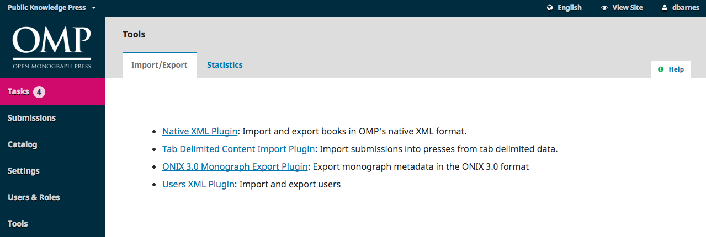

# Import/Export

Import/Export allows you to easily get data out of your OMP press and get data into it.

Some of the tools allow you to export metadata, such as the ONIX 3.0 plugin.

Others allow you to import or export users or submissions data.

