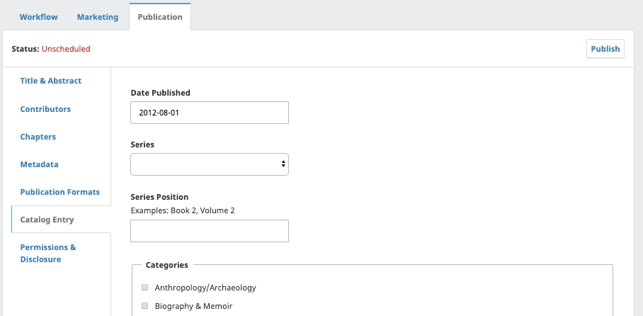
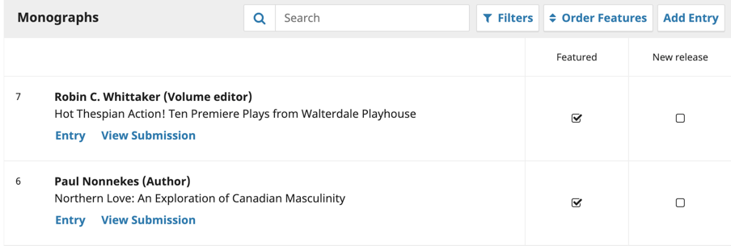
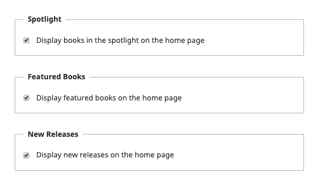
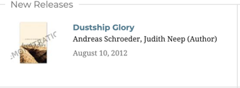
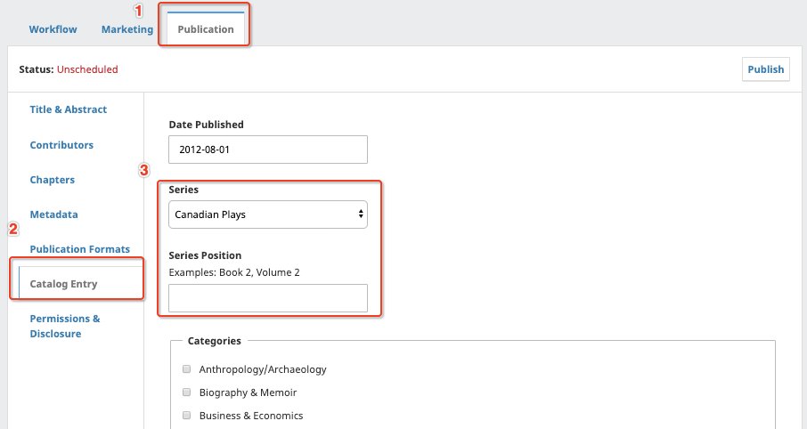
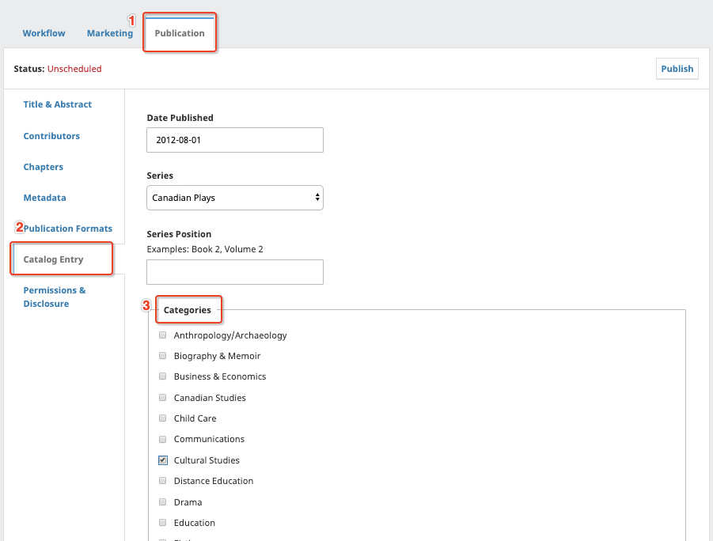

# Catalog Management

This chapter is about managing your press’ catalog, or the grouping of books that are available in various formats to the reading public located off the press home page, and displaying your published content for easy reader access.

As the Press Manager or Editor, you can manage your catalog in a number of ways. OMP includes an overall Catalog Management interface that you can find on your left menu panel.

You will also find a Catalog Entry tool for each individual submission on each submission page.
Authors may also assign their original submissions to various categories and series, and editors can change these assignments at any time.

## Create a new catalog entry

You can create a new entry from the list of submissions in Catalog > All Monographs by clicking __Add Entry__ on the main panel submenu.

Select the submission(s) you want to add to the catalog and click __Add Selected to Catalog.__

### Create a catalog entry for a chapter

See section on adding [Chapter files](./role-specific-workflows.md#chapters).

### Create a catalog entry within a manuscript submission

To create a catalog entry within the submission of a manuscript:
1. Click Catalog entry on the left panel of the Publication tab
2. Enter and select the necessary information for this manuscript
3. Click Save.

## Select Featured and New Release entries

In Catalog > All Monographs you will see checkboxes beside each catalog entry that will allow you to designate it as a Featured Entry or a New Release.

When you select either of these checkboxes, the entry will appear under a special section on the homepage for “Featured” and “New” monographs.

If you don’t see the entry appear, make sure you have enabled them on the Homepage Content setting under Website Settings > Appearance > Setup

You can reorder Featured entries using the Order Features link at the top of the grid. New Releases will appear with the latest first.

## Manage Spotlights

Spotlights allow you to select a few books to be displayed prominently on the homepage along with a custom title and description.

This is useful when you want to promote a book with marketing language that goes beyond the book’s title and abstract, such as highlighting praise a publication has received.

To select, add, or edit your spotlight go to Catalog > Spotlights.

## Author Browse Lists

### How to include authors in browse lists

All contributors listed for each manuscript will be displayed in the monograph’s summary page.

When entering contributors, the submitting author will have the option to include all other contributors in the browse list.

Selecting to include contributors means that their name will be displayed in the press’ home (if selected as a new release or feature), series, or category page.

### Highlight author who is an editor of the volume

To highlight an author who is also the editor of the volume, the submitting author must indicate their role accordingly when entering them in the list of contributors.

If this role is not being displayed in your press, please check your User & Role settings (Users & Roles > Roles > Arrow on Volume Editor > Edit > Role Options)

## Add Books to Series

Series can be used to help organize your publications into a special set of books devoted to a theme or topic. See [Press Settings](/learning-omp/en/press-setup.html#press-settings) for instructions on how to create and edit series.

To add a book to a series:

1. Go to the book’s submission page and click the Publication tab followed by Catalog Entry.
2. In the Series, select which one you would like to add it to.
3. Enter the Series Position information.
4. Click Save.

## Add Books to Categories

Categories can be used to organize your books into thematic collections and provide another way for readers to access your content. For instructions on how to create categories, see [Press Settings](/learning-omp/en/press-setup.html#press-settings). You can add a book to a category by editing its metadata.

1. Go to the book’s submission page and click the Publication tab followed by Catalog Entry
2. Enable the categories this manuscript belongs to
3. Click Save

