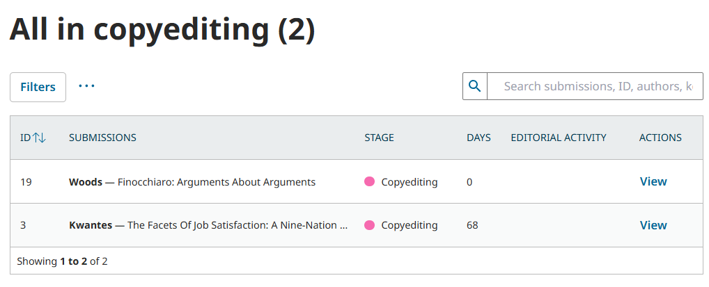
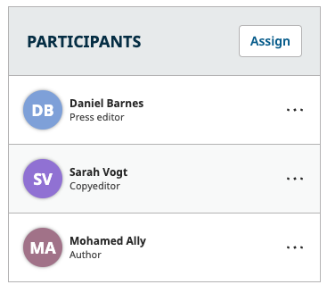
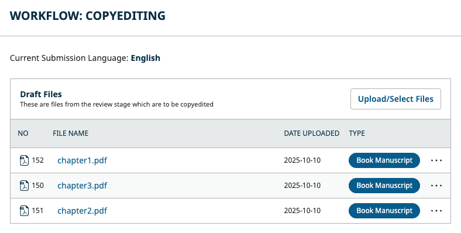
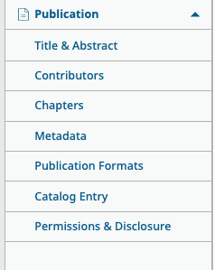
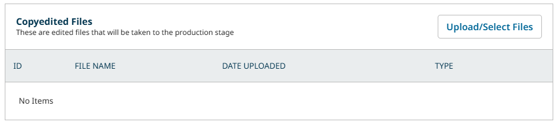
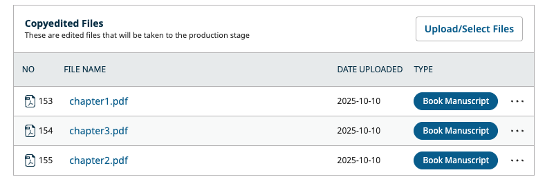
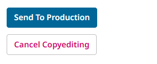

# Copyediting: Assign Copyeditors and Upload Edited Files {#copyedit}

The fourth stage of the Editorial Workflow is the Copyediting stage. After passing internal and external review or otherwise being accepted by an Editor, the submission will arrive at the copyediting stage.

In this chapter, we will explain:
* How to assign copyeditors
* How to upload copyedited files
* How to send copyedited files to production so they can be scheduled for publication

The roles involved in this stage are typically: Press or Series Editors, Copyeditors, and Authors (for approval of the copyedits).

> Editors can cancel copyediting and return the submission to the External Review stage at any time by clicking “Cancel Copyediting” in the action buttons
{:.tip}

## Track Submissions Requiring Copyediting {#track-copyedit}

You can view which submissions require copyediting from the “All in copyediting” Dashboard view. Additionally, all submissions in copyediting will have the pink copyediting stage indicator.

Dedicated copyeditors will also be able to access their assignments from the “Assigned to me” and “All in copyediting” Dashboard views.

## Assign a Copyeditor {#assign}

If your press has dedicated copyeditors, you can assign them to the submission.

Click the “Assign” button in the Participants section.

Use the role dropdown to select the Copyeditor role and hit the **Search** button to show a list of all copyeditors. Like with other assignments in OMP, you will have the option to notify the assignee, as well as edit the prepared message.

This will add the assignee to the participants list, granting them access to the submission. It will also open a discussion containing the request.

## Copyedit the Draft Files {#draft}

Whether copyediting will be done by a dedicated copyeditor or the editor in charge of the submission, the next step is to download the files needing copyediting.

The Draft Files section contains the files selected for copyediting by the Editor after reviews were completed. Click on the filename to download the file and begin copyediting with your program of choice.

If you need to check the details of the submission such as title, abstract, contributor names, chapters, keywords, etc., you can click the items under the Publication menu.

If your role is permitted, you can make changes to this information as needed, then click Save at the bottom of the page.

You can also preview how this information will appear in the published book page by clicking the Preview button in the top right of the submission record (or the Preview button in the Publication tab).

## Upload the Final Copyedited Files {#final-copyedit}

You can use Discussions to communicate with Authors and Editors and get their approval for your copyedits. 

> For information on using Discussions, including how to upload and share files with other participants, consult the [Communication: Use Discussions](URL) section of this guide.
{:.tip}

Once your copyedits are complete and approved, you can upload the final version. Scroll to the Copyedited Files section of the central panel and click the Upload/Select Files button.

You will have several options here:

1. Use the Upload File button link to upload a new file.
2. Select the Draft file to submit it without changes.
3. Select any files uploaded in discussions with Author(s) and/or Editor(s).

Check the box next to the files you wish to submit as your final versions, and click OK.

The file will now be visible in the Copyedited Files section.

> If you are a dedicated copyeditor, consider using Discussions to let the Editor know that copyediting is now complete.
{:.tip}

## Move the Copyedited File to Production {#move-to-production}

As an Editor, once you have completed copyediting or have been informed by a copyeditor that work is complete, you can move the submission to the final stage before publication.

Review the final copyedited version from the Copyedited panel and discuss further with any participants if necessary. Once you are ready, select the **Send to Production** from the action buttons.

You will be prompted to send a notification to the author. Use the suggested email template, or choose a different email template using Find Template on the left. 

Lastly, you will select the copyedited files to send to the Production stage. All files from the Copyedited Files panel will be selected by default.

Hit **Record Decision** to confirm.

The Copyediting stage is now complete.

