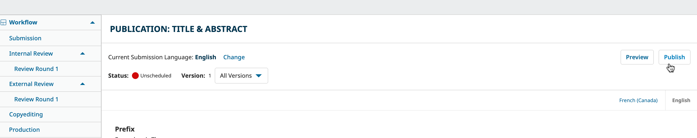
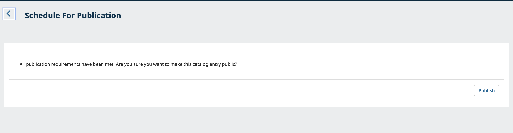
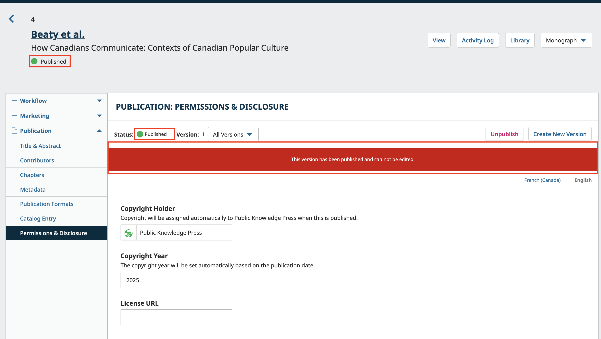
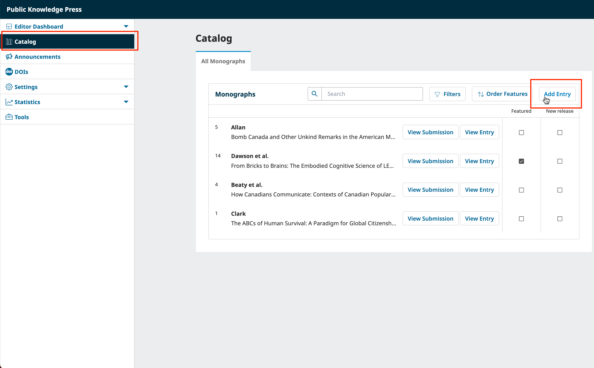
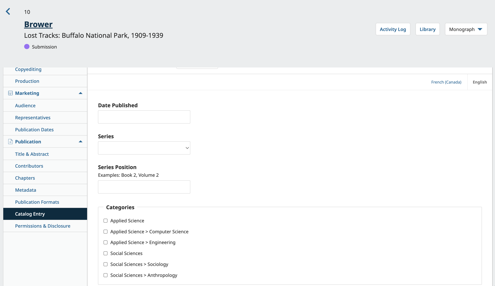
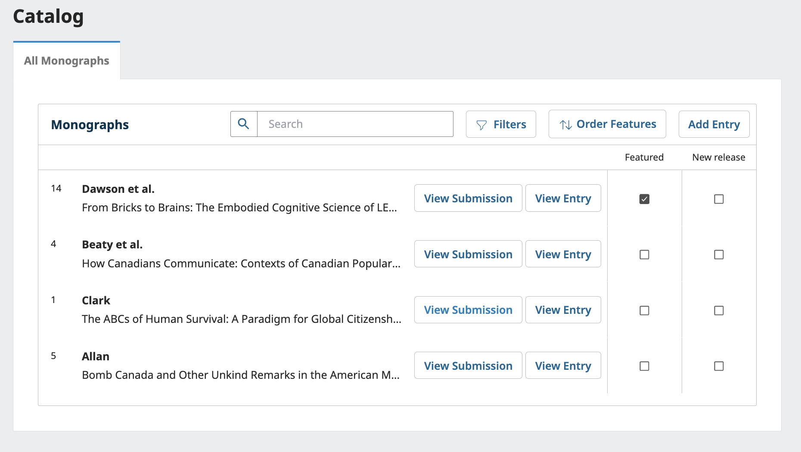
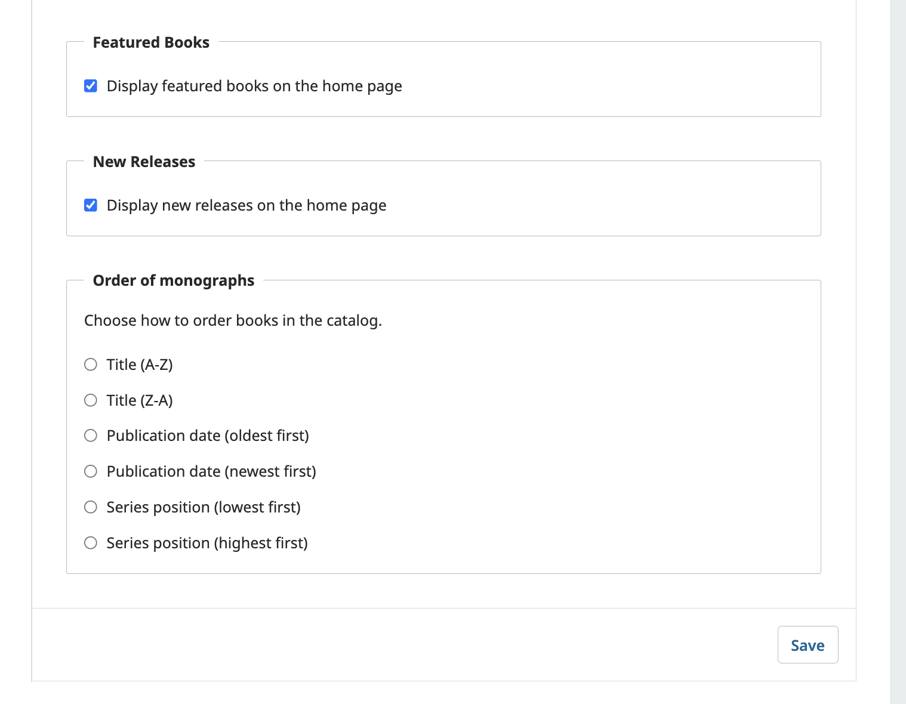
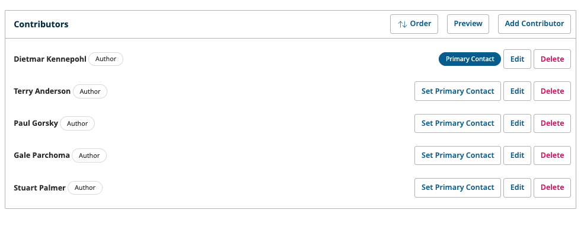
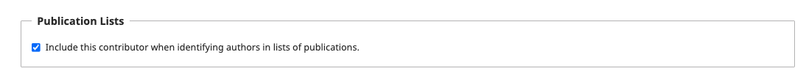
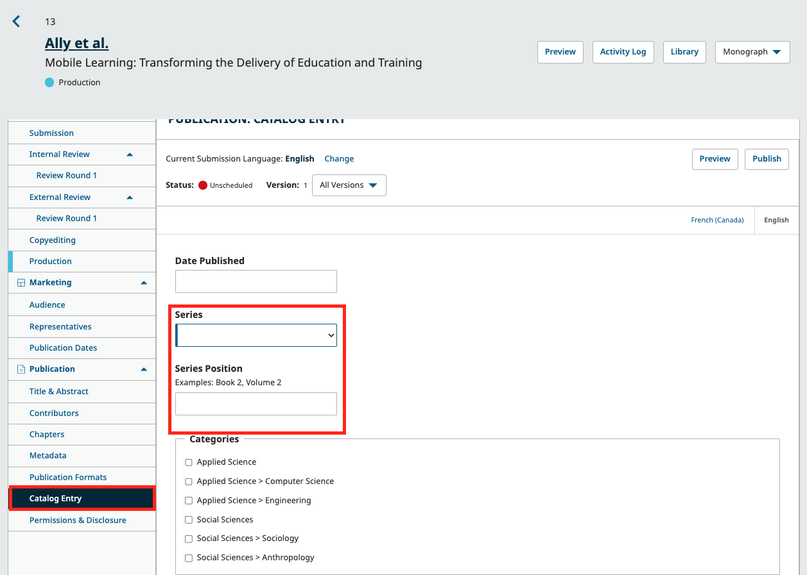

# Publication & Post-Publication: Publishing, Editing Published Books and Managing your Catalog {#publication}
After the submission has gone through all four stages in the workflow, it is ready to be published.

In this chapter, we will explain:

* How to use versioning
* How to capture statistics
* How to manage OMP book's catalog

The role involved in this stage is typically a Press Manager or Press Editor.

##Publish
Now that you’ve entered all the relevant information and proofs for your manuscript in the publication and marketing tabs, and are ready to click the Publish button. The Publish button is visible in all tabs of the Publication menu. 

This will prompt a secondary box confirming you want to publish.

  Once you’ve published the manuscript, you will see the status change in the following places.

## Versioning {#versioning}

Once you have published your content online, you may need to make substantial changes to published books and monographs (e.g. retractions, amendments, etc.) or track statistical information about published content. 

This section teaches Press Managers and Press Editors how to effectively version books and track books statistics. 

### Use Versioning for Substantial Changes to Published Content {#versioning}

Once an article is published, neither its metadata nor galleys can be edited. 

While books can be unpublished and republished for small corrections to chapters or publication formats metadata, e.g., misspellings, formatting errors, etc., we **strongly recommend** creating a new version of the book if a substantial change is needed.

A substantial change might include:
* Retracting a chapter
* Adding or removing significant content to the book or chapters
* Adding, removing, or editing information that changes the findings, meaning, or significance of the book or chapters
* Adding or removing previously uncredited/credited contributors

To create a new version of a submission, navigate to the submission record of a published submission and access any item in the Publication menu. Click the “Create New Version” button. You will now be able to make any changes necessary before clicking “Publish” to publish the new version.

> No notification is sent to users for new versions. If you need to communicate with readers about the changes, consider using the [Announcements feature](URL).

The current version will be clearly displayed at the top, along with a dropdown to view previous versions. Each version is identified by a number and date published (or the “Unpublished” label if not yet published). 

### How Versions Appear to Readers {#version-view}

When a book has multiple versions, the list of prior versions and the dates they were published will be listed on the book landing page.

Readers will be able to access previous versions. They will see a message on the chapters pages advising them that it is an outdated version and pointing them to the most recent version.

Example of an outdated version message on a book page:

Example of an outdated version message on the PDF chapter page:

The book URL will always point to the most recent version, with earlier versions being available at the same URL with the version at the end of the URL (e.g. /version/1234/).

### DOIs and Indexing of Versions

If a DOI was assigned to the original version, it will not be changed automatically. Previously deposited CrossRef metadata will not be automatically updated. If book metadata was changed, we recommend updating CrossRef metadata.

Indexing services and repositories that use OAI to harvest metadata will need to harvest the book metadata again in order to update to the new version.

## Capture Statistics {#statistics}

Updated information on statistics will be available here at a later date. For now, you may wish to consult the [Learning OMP 3.4 chapter on statistics](https://docs.pkp.sfu.ca/learning-omp/en/statistics) to learn how to view and manage statistics about articles and readership.

	

## Catalog Management {#catalog-management}

This section is about managing your press’ catalog, or the grouping of books that are available in various formats to the reading public located off the press home page, and displaying your published content for easy reader access.

As the Press Manager or Editor, you can manage your catalog in a number of ways. OMP includes an overall Catalog Management interface that you can find on your left menu panel.

You will also find a Catalog Entry tool for each individual submission on each submission page. Authors may also assign their original submissions to various categories and series, and editors can change these assignments at any time.

### Create a new catalog entry {#new-catalog-entry}

To create a new entry, click on the Catalog menu item and click on the Add Entry button. 

Select the submission(s) you want to add to the catalog and click Add Selected to Catalog.

### Create a catalog entry within a manuscript submission {#new-catalog-entry}

To create a catalog entry within the submission of a manuscript:
Click Catalog entry on the left panel of the Publication menu
Enter and select the necessary information for this manuscript
Click Save.

### Select Featured and New Release entries  {#featured-new-relese}

In the Catalog menu, you will see checkboxes beside each catalog entry that will allow you to designate it as a Featured Entry or a New Release.

When you select either of these checkboxes, the entry will appear under a special section on the homepage for “Featured” and “New” monographs.

If you don’t see the entry appear, make sure you have enabled them on the Homepage Content setting under Website Settings > Appearance > Setup

You can reorder Featured entries using the Order Features button at the top of the grid. New Releases will appear with the latest first.

### How to include authors in lists of publications  {#list-of-publication}

The contributors list for each manuscript will be displayed in the monograph’s record under the Contributors menu item, located under the Publication menu.

When entering contributors, the submitting author will have the option to identify authors in lists of publications.

By selecting to include contributors in the list of publication, their names will be displayed on the press’s home page (if selected as a new release or feature), series, or category page.

###Highlight author who is an editor of the volume  {#highlight-volume-editor}

To highlight an author who is also the editor of the volume, the submitting author must indicate their role accordingly when entering them in the list of contributors.

If this role is not being displayed in your press, please check your User & Role settings (Users & Roles > Roles > Arrow on Volume Editor > Edit > Role Options)

### Add Books to Series  {#add-to-book-series}

Series can be used to help organize your publications into a special set of books devoted to a theme or topic. See [Press Settings](./press-setup#series) for instructions on how to create and edit series.

To add a book to a series:
Go to the book’s submission page and click Catalog Entry, under the Publication drop-down menu
In the Series, select which one you would like to add it to.
Enter the Series Position information.
Click Save.

### Add Books to Categories  {#add-to-book-categories}
Categories can be used to organize your books into thematic collections and provide another way for readers to access your content. For instructions on how to create categories, see [Press Settings](./press-setup#categories). You can add a book to a category by editing its metadata.
1. Go to the book’s submission page and click Catalog Entry, under the Publication drop-down menu
2. Enable the categories this manuscript belongs to
3. Click Save

