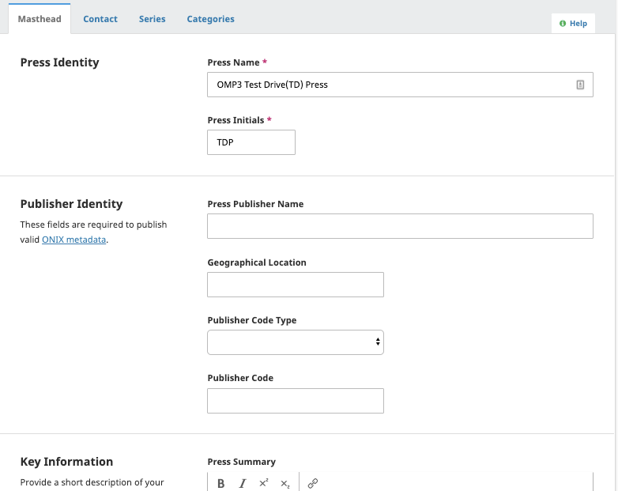
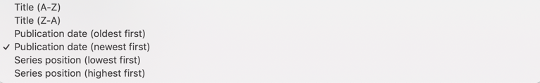
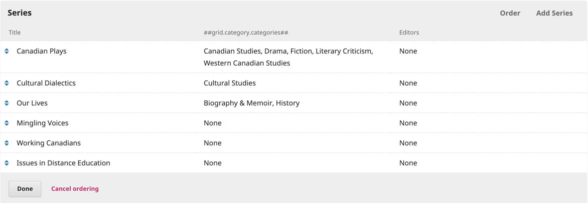
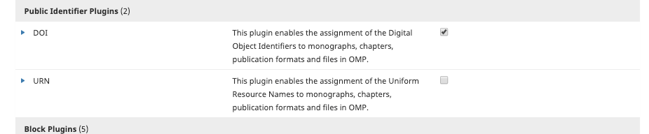
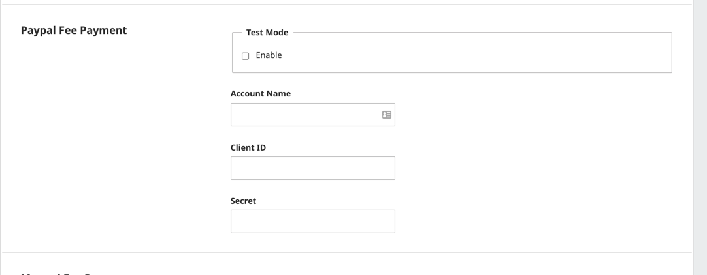
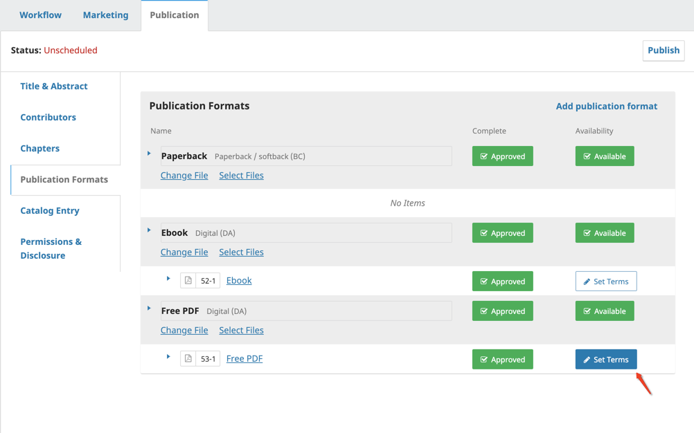
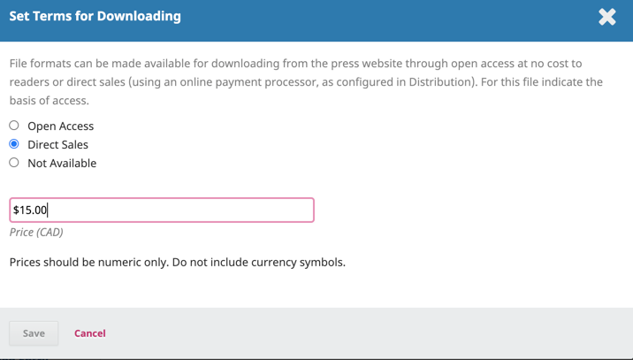
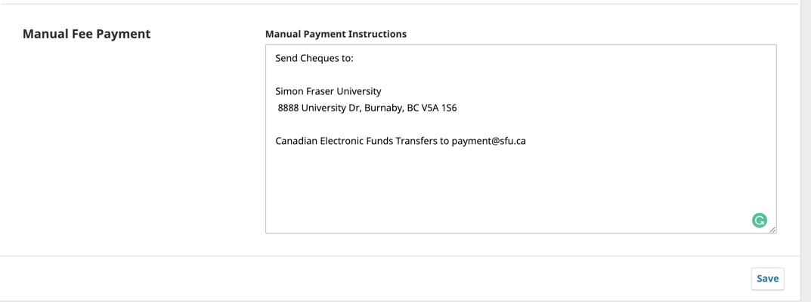
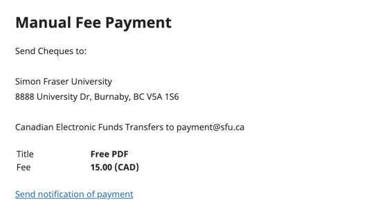

# Setting up and Maintaining Your Press

There are a number of components to your press found in the Settings menu on the left navigation bar. All of the site configuration options are under Settings > Press. The options you find here control every aspect of the press, including press information, how your press looks, workflow settings, and how the publication and distribution processes work. This section will go in-depth on your Press and Workflow Settings. Please refer to the [Learning OJS guide](/learning-ojs/en/) for information regarding the Website and Distribution that will be applicable in your OMP installation.

## Press Settings

In the Press Settings section, you can configure information about your press that will be displayed for readers, such as your press name, editorial team, and contact information. You can also set up and configure series and categories, which are used to display and organize your published monographs.

You can find the Settings in the left menu panel when you are logged in as a user with Press Manager permissions. This section contains most of the information that you provided when originally creating your press (and which can be modified at any time).

In OMP 3.2, the Publisher information is now stored under the Press setting. You will need to enter all the information required to generate your ONIX metadata.

### Masthead

Enter and edit information about your press, including press name, editorial team, and about the press. All Masthead information will appear under pages in the About menu on your press website.

### Contact

This section contains the primary contact information you provided when originally creating your press and includes a technical support contact option. You can also add a mailing address. All contact information will appear on the Contact page under the About menu on your press website.

### Series

Series can be used to help organize your publications. A series represents a special set of books devoted to a theme or topic. Visitors will be able to search and browse the press by series. In the Series tab of your Press Settings, you can create, edit, and order the series that will appear on your press website.

#### Add Series

To add a series, click **Add Series**  on the right corner of the Series table and fill in the following fields:

* __Cover Image__: Upload a cover for the series (optional)
* __Title__: Title of series
* __Description__: Use this field to add details regarding the series, editor, editor information, etc.
* __ISSN__: The 8-digit code to identify your print and/or online series (you can apply for an ISSN through your country’s ISSN centre, listed in the [ISSN Network](https://www.issn.org/the-centre-and-the-network/members-countries/the-issn-network-today/#))
* __Order Monograph__: The order in which you would like monographs within the series to be displayed 
* __Category__: The subject matter this series will be part of
* __Path__: What you want to use for the end of the URL

#### Edit Series

You can modify a series by clicking on the blue arrow to the left of the series name. This will reveal options to edit or delete the series.

#### Order Series

To order your series, click Order on the right corner of the series box. Using the double arrow beside the Series title, drag the series in order and click Done once you have completed ordering your series.

#### Add books to series

See the [Catalog and Displaying Content chapter](./catalog-management.md) for instructions on how to add books to series.

### Categories

Categories can be used to group and display books according to the subject matter or themes — for example, economics, literature, and poetry. Categories may be nested within “parent” categories in a hierarchy. Categories can be displayed as a browse block on your press site, and readers can select a category to view all books in that category.

You can place a book in a category by editing its metadata, which is explained in the Catalog and Displaying Content chapter. This section explains how to create and edit categories.

To start, go to Press Setting followed by the Categories tab.

#### Create a category

1. Click Add Category
2. Enter a name for your category that will be displayed to readers
3. Select a Parent Category (if applicable)
4. Enter a path for the category’s URL on your site
5. Enter a description that will appear above the list of books in the category
6. Change the order of the books by date or title (optional)
7. Add an image that will appear at the top of the category’s page (optional)
8. Click Save

#### Edit a category

1. Click the name of the category you want to edit
2. Make the changes
3. Click OK

#### Remove a category

1. Click the blue arrow next to the category you want to remove
2. Click the Remove button that appears below
3. Confirm that you want to remove the category

#### Display categories

To display categories on your website you can go to Website Settings > Appearance > Sidebar Management and place the Browse block on your sidebar.

#### Add books to categories

See the Catalog and Displaying Content chapter for instructions on how to add books to categories.

### Public Identifiers

If your Press will be using Public Identifiers such as DOI or URN, these will need to be enabled in the Plugin Gallery (Website Settings > Plugin > Plugin Gallery).

Once these have been enabled, you can click the blue arrow to configure the settings for both these.

## Website Settings

Please refer to the [Learning OJS guide](/learning-ojs/en/) for information on Website Setting applicable to OMP.

Please note that some plugins for OJS are not available for OMP.

## Workflow Settings

Workflow Settings include all submission and publication configuration options, including those that relate to the initial submission process as well as the review, editing, and production workflow processes.

This section will focus on the Production tab of Workflow Settings, as these are specific to your OMP installation. Please refer to [Learning OJS](/learning-ojs/en/) for information on configuring Components, Submissions, Review, Press Library, and Emails. The Publisher Library is the journal equivalent to your Press Library.

## Distribution

### Payment

The payment configuration for OMP is much simpler than in OJS. If you are using your press to accept payment you have the option of PayPal or manual payment notification.

#### PayPal

For help setting up your PayPal account see [Using the PayPal Plugin for OJS and OMP](/using-paypal-for-ojs-and-ocs/en/)

Once you have your PayPal account set up, you will need to enter the following information under the PayPal Fee Payment setup.

For books or publication versions that will be available for purchase, you will need to indicate the price of these in the Publication Formats by clicking __Set Terms__

Select Direct Sales followed by the price and Save.

The book's landing page will now show the prices for each format.

Users who wish to purchase will click the button which will direct them to PayPal to complete payment. Once payment has been processed the document will become available to the user for reading and/or download.

#### Manual Payment

If your press will be collecting payment in another form (e.g cheque, ETF) you can provide the instructions under Manual Payment.

Opting for this payment method will provide users with the same payment button on the book’s landing page with instructions on how to pay and will prompt them to send notification of payment.

This notification will be sent to the Journal Manager via email with the users information (Full Name and Username). It will be up to the Press to determine the delivery method of the publication.
