# Production: Prepare Final File Formats and Finalize Details {#production}
The final stage of the Editorial Workflow is the Production stage. After passing internal review and/or external review and being copyedited, it’s time to prepare the files for publication.

In this chapter, we will explain:
* What publication formats are and how to upload them
* How to edit the metadata of a book (key information such as title, abstract, author information, chapters,  etc.)
* How to add chapters

The roles involved in this stage are typically Press Editors, Layout Editors/Designers, and Authors (for approval of the final publication files).

> Editors can cancel production and return the submission to the Copyediting stage at any time by clicking “Back to Copyediting” in the action buttons
{:.tip}

## Track Submissions in Production {#track}

You can view which submissions are in Production from the “All in production” Dashboard view. Additionally, all submissions in copyediting will have the blue production stage indicator.

Dedicated layout editors, designers, and other assignees will also be able to access their assignments from the “Assigned to me” and “All in production” Dashboard views.

## Format Final Proofs for Publication {#format-final-proof}

You will need to prepare the final formats of the book for readers to access. In publishing, these final proofs are typically referred to as Publication Formats.

Publication formats are generally in a *stable, non-editable* format (e.g., HTML, PDF, ePub, or XML). Publication format files can also include supplementary material such as multimedia files and research data.

An example of publication format that a press might provide for a book can be: a PDF version of the book, a ZIP file containing raw analysis data, and a high quality image file for figures used in the publication.

### Assign a Layout Editor {#assign-layout-editor}

If your press has dedicated layout editors or designers to prepare the final version of the book, you can assign them as a participant just as you would assign a copyeditor in the [Copyediting stage](./copyediting).

### Prepare Files for Production {#prepare-production-files}

Whether the final formats will be created by a dedicated layout editor or the editor in charge of the submission, the next step is to download the files that need to be formatted.

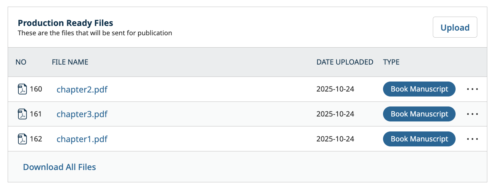

The Production Ready Files section contains the copyedited files selected for production by the Editor after copyediting was completed. Click on the filename to download the file and begin copyediting with your program of choice.

### What Publication Formats Can OMP Accept? {#publication-formats}

OMP allows users to upload almost any kind of file so long as it fits the limitations set by the system administrator, but some common galley types include:

* PDF - The most common file type for publication formats in OMP.
* HTML - These can also be used as containers for multimedia presentations.
* ePub
* XML
* MP3
* Image formats (PNG, JPG, GIF)
* External links - OMP can also link to publications hosted off-site, for example, videos uploaded to external video hosting services.

### Add Publication Format {#add-publication-format}

Once you have prepared the book file in as many formats as you wish to offer, navigate to the Publication Format item under the Publication menu.

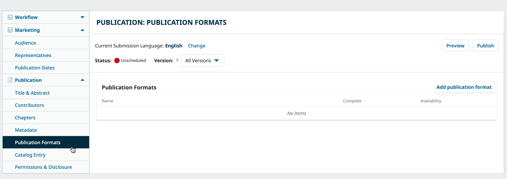

Click the “Add publication format” button.

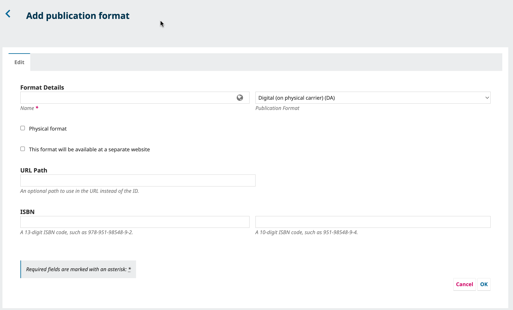

First, you’ll be asked to enter a name for the publication format. This will be the file label, for example, PDF. 

Select the format from the drop-down list: Digital (on physical carrier)(DA); Digital (delivered electronically) (EA); Audio (AA); Hardback (BB); or Paperback/softback (BD). 

You can optionally specify a unique URL path for the galley.

> Generally, object IDs are used in the URL of a publication file, for example: https://omp35.testdrive.publicknowledgeproject.org/index.php/td-press/en/catalog/view/19/49/**48**
>
> In this example **48** is the object ID. We could enter “pdf” in the URL path, which would result in the following URL for our galley: 
https://omp35.testdrive.publicknowledgeproject.org/index.php/td-press/en/catalog/view/19/49/**pdf**

Lastly, enter the ISBN 13 or ISBN 10 as applicable. Click OK to save.

### Edit Publication Format Metadata {#edit-publication-format-metadata}

To edit the metadata of an updated file format, click in the blue arrow next to the publication format name and click Edit.

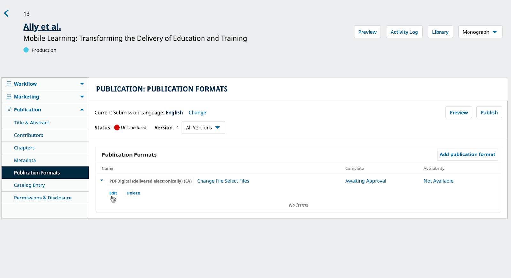

Use the metadata tab to enter further details about the format, including specific product information (ID codes, sales rights, composition, availability, dimensions, etc).

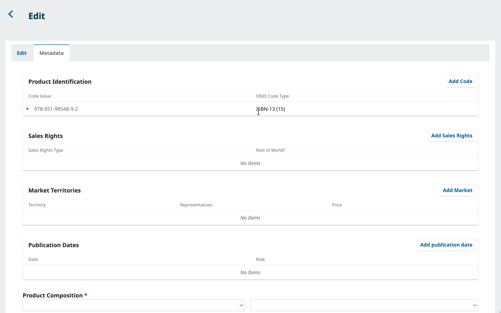 (./assets/metadata2-format-file-omp3.5.png)

### Add Publication Format files {#add-publication-format-files}

Once you’ve created the publication format(s), you have two options. If you’ve uploaded the final files under the Production Ready files in the Production stage of the workflow, select the corresponding file by clicking ‘Select Files’; otherwise, upload them directly into the Publication Formats.

#### Option 1: Final files were uploaded in the production stage

Select from Publication Ready Files.

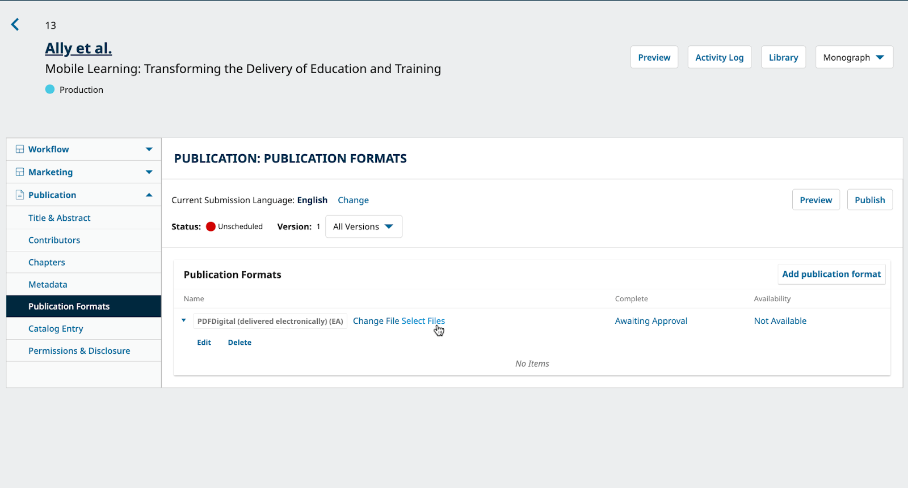

If you’ve uploaded your Book and Chapter Manuscripts under the Publication Ready Files, click Select Files to select all the relevant files from the Production Workflow.

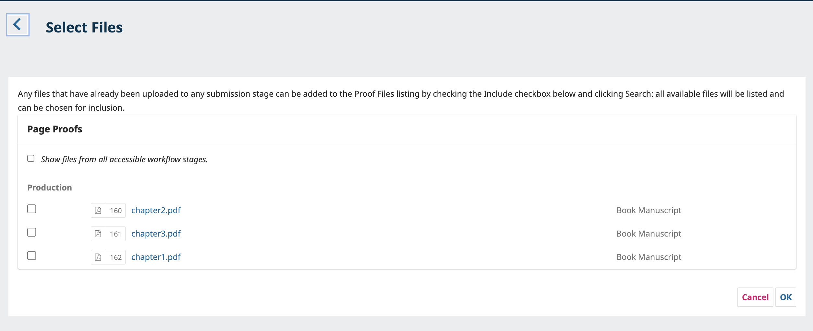

#### Option 2: Final files have not yet been uploaded

For files that have not been updated in the workflow, click ‘Change File.’

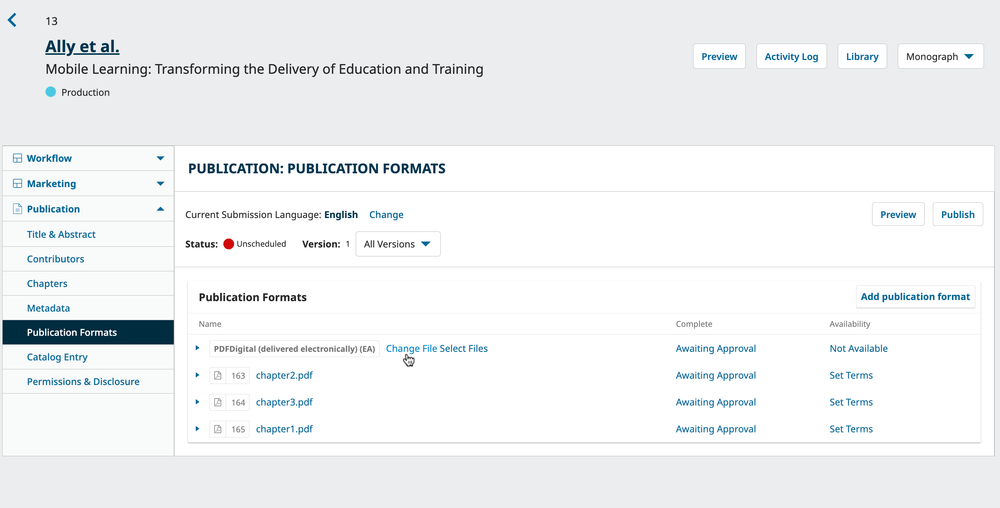

In “1. Upload File” in the drop down options, select ‘This is not a revision of an existing file’ then select the appropriate Submission Component (e.g. Chapter; Book Manuscript; Index). Upload the file and complete Steps 2 and 3. Repeat these steps until all files have been uploaded.

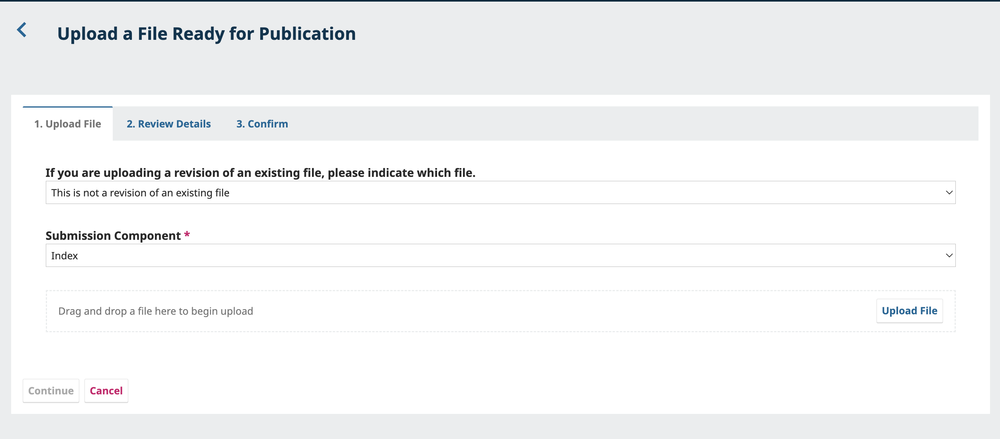

### Approve Publication Formats {#approve-publication-formats}

Once Publication Formats have been proofread, you can approve them by clicking Awaiting Approval on the right of each publication format file.

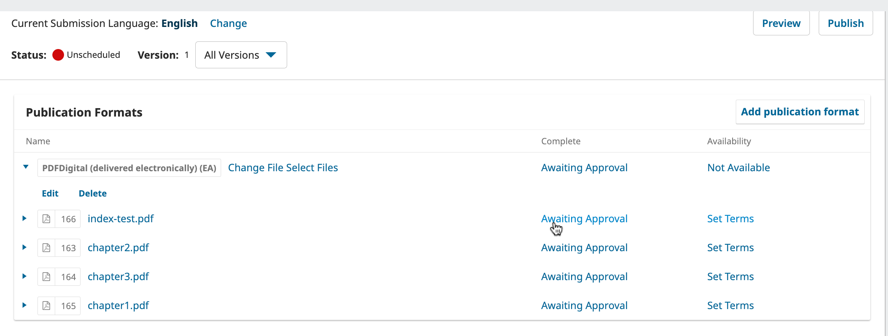

Click Awaiting Approval.
Click OK to indicate the file has been proofread.

To select the file availability, click Set Terms and choose the terms for downloading.

Once the files have been approved and made available, their status under ‘Complete’ and ‘Availability’ will change accordingly.

> You may wish to use Discussions to communicate with Authors and Editors and get their approval for the final files. 
{:.tip}

>Any approved Publication Format files that have not been assigned to a Chapter will appear as a Publication Format under the cover image.
{:note}

### Add Chapters {#add-chapters}

If your manuscript contains different chapters, you can add the information from Chapters under the Publication menu.

> Note: Chapter files can only be added by the Editor or Production Editor of the press.
{:.note} 

If you’re uploading individual files as chapters that haven’t been included in the workflow, ensure you add them using the [Add Publication Format Files](#add-publication-format) steps before creating the chapter for that file.

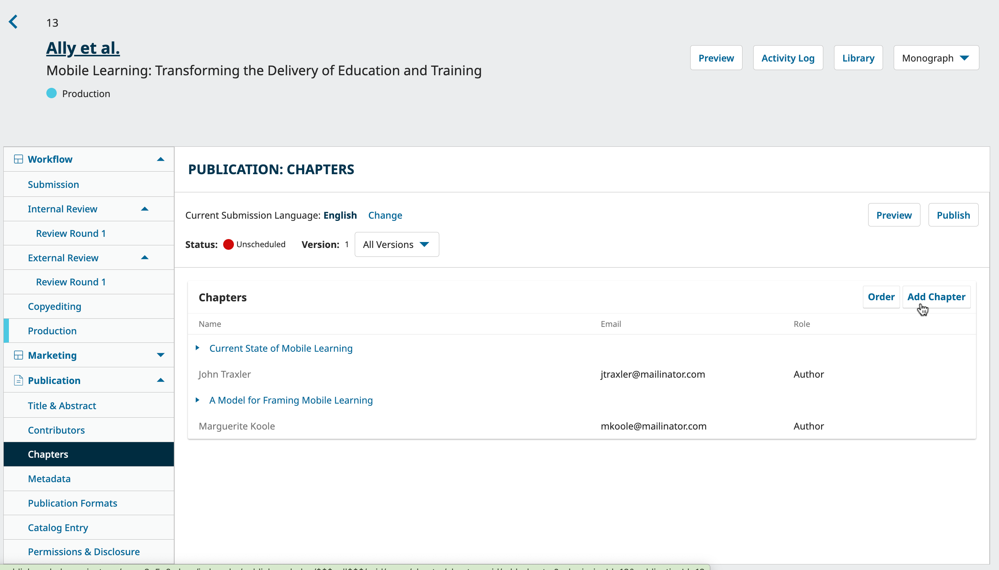

To add chapters, click Add Chapter and then:

1. Enter the chapter's title and subtitle, if applicable
2. Add an abstracted, if applicable
3. Add chapter's pages range
4. Select the Chapter Page box if you want to show this chapter on its own page and link to that page from the book's table of contents
5. Add contributors
6. Add the file to the corresponding chapter. The files from all the stages of the workflow will be visible here. Be sure to pick the one that has been approved in the production stage or the one you have added in the Publication Formats menu.
7. Click Save when you're done.

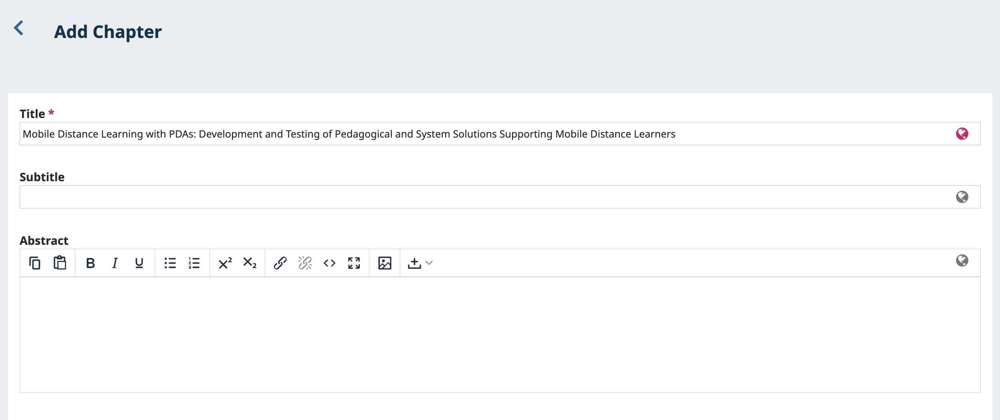

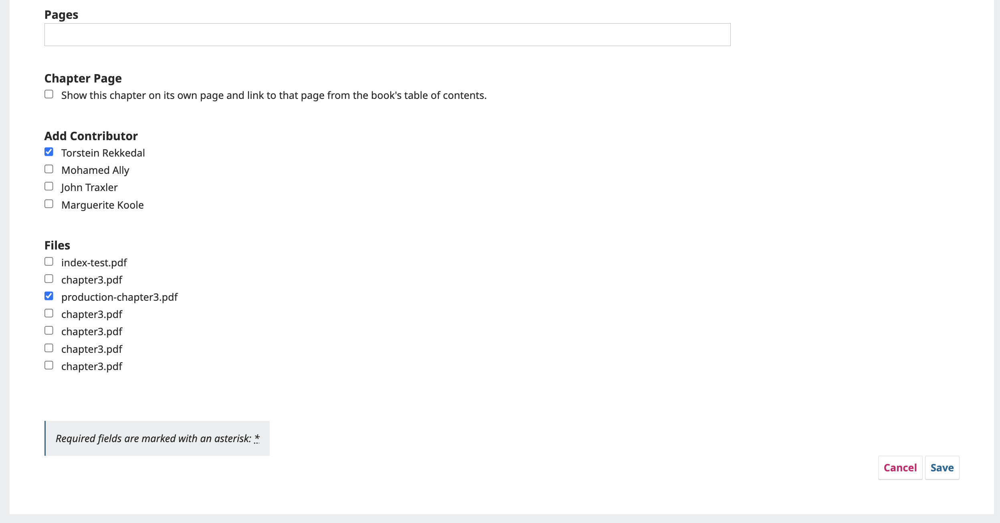

### Preview Books {#preview-books}

At any time during production work, you may wish to preview the book before it gets published. Click the Preview button on the top right of the window.

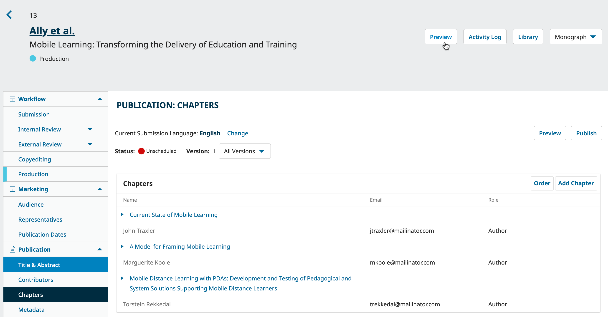

This will show you the book landing page as it will appear to readers.

## Use the Publication Menu to Finalize Details {#publication-menu}

Once you or your layout editor has finalized the files for the publication, the final step is to edit the metadata of the submission. Metadata is information about the submission. This includes basic information like the author list, abstract, title, copyright information, and more.

While much of this information will have been provided to you by the author, it is the job of the Press Editor to make sure that this metadata is accurate. Accurate and complete metadata is a key element for allowing your press’s content to be indexed and easily discovered.

You can make these changes using the Publication menu on the left side of a submission record.

> Note: If a book has already been published, it will need to be unpublished before you can edit these details. Click Unpublish at the top right of the window, make your changes, and click Schedule for Publication to publish it once again.
{:.warning}

We will explore each item in the menu below.

* **Title & Abstract**: Edit the book title, subtitle, and abstract.
* **Contributors**: Add, edit, or remove article contributors.
**Chapters**: Add, edit or order chapters.
* **Metadata**: Add or edit additional metadata requested by the press such as keywords.This item will only appear for presses who have enabled the collection of additional metadata in [their metadata settings (see Learning OJS 3.5 for info on these settings)](https://docs.pkp.sfu.ca/learning-ojs/journal-managers/en/policies#metadata-settings).
**Publication Formats**: Upload and approve the final files for publication, as explained above.
**Catalog Entry**: Use this tab to add catalog information including date, series, series position, and category. 
**Permissions & Disclosure**: Edit copyright holder, copyright year, and license. These are generally filled in automatically according to the press's settings. Use this tab to override these defaults.

>Note: If your press is using identifiers such as DOIs, you should consult the DOIs and DOI Plugin guide](https://docs.pkp.sfu.ca/doi-plugin/en/) and the related [Crossref Plugin Guide](https://docs.pkp.sfu.ca/crossref-ojs-manual/en/references) (if using Crossref services).
{:.notice}

Edit the information on this tab in any relevant languages and be sure to click Save at the bottom of each page.

Now the submission should have everything needed for you to formally publish the content online.

## Marketing {#marketing}

The marketing dropdown menu will need to be completed prior to publishing the manuscript. 

The section below outlines what information should be entered in this tab. This information can be added at the Publication stage or at any point in this information becomes available throughout the workflow.

Within the marketing type there are 3 menus that you can configure - audience, representative, publication dates.

### Audience {#audience}

This is where you can add/select audience information for your ONIX export.

Depending on your market, the Audience, Ranges and Education values may be handled in various ways. In English speaking North America, the following ONIX values are typically used.

* ONIX Code List 28 for Audience codes
* Audience Range for age and grade ranges

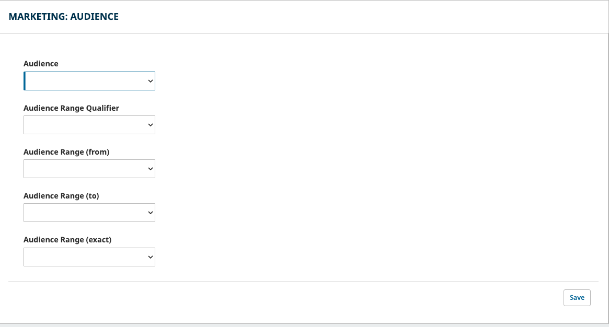

**Audience** - Identify the intended audience from the dropdown list.

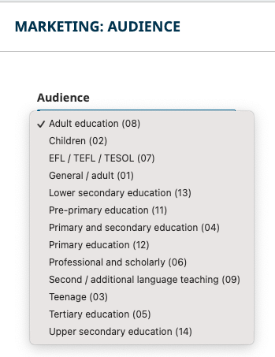

**Audience Range Qualifier** - Identify the range from the dropdown list.
**Audience Range (from)** and **Audience Range (to)** or **Audience Range (exact)** - Identify the audience range by educational grades

### Representatives {#representatives}

You can add Agents and Suppliers for your manuscript here by clicking Add Representative.

In the pop-up box, you can select whether you are adding an Agent or Supplier. Depending on the selection, additional fields will be generated.

In order to save you will need to fill all the required fields (marked with an asterisk). All remaining fields are optional.

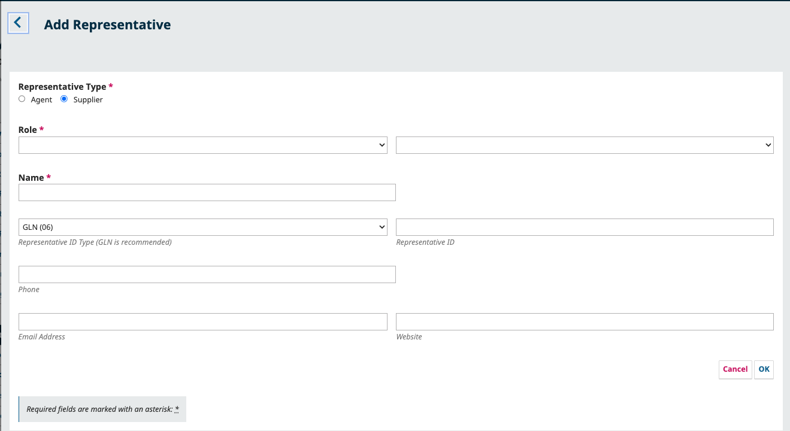

To edit or delete a representative, click the blue arrow beside the name
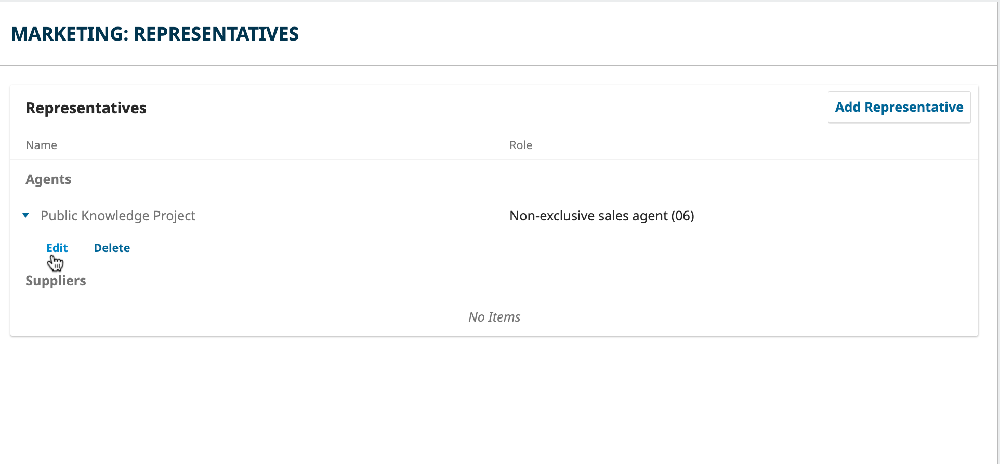

### Publication Dates {#publication-dates}
If your manuscript will have multiple chapters with differing publication dates, you can enable it here.

This will enable an extra field for publication dates when adding chapter files.

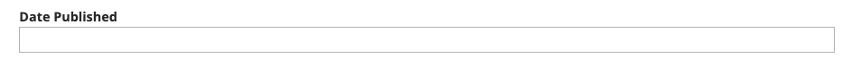 

### Multilingual Submissions {#multilingual-submissions}

For multilingual books, the Title & Abstract, Metadata, Chapter, and Permission & Disclosure tabs have options for adding and editing metadata in multiple languages. Languages must first be turned on in Website Settings > Setup > Languages.

To enter the submission multilingual metadata, click in the language you wish to include the translation. This can be done at any time under the publication menu item tabs.

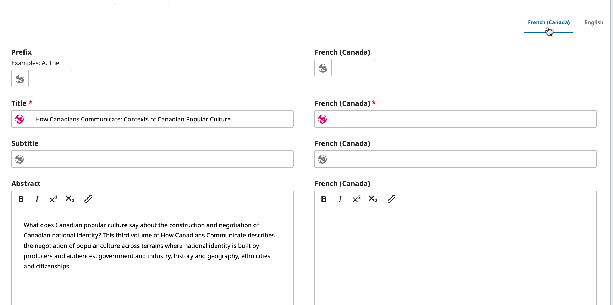

