# Role-specific Workflows

This chapter will provide a general outline and instruction for the various role-specific workflows including the author, reviewer, and editorial team.

## Author Workflow

### Registration

To create an account in a Press, click **Register** on the Press’ homepage. This is typically found on the top-right corner of the Press’ site.

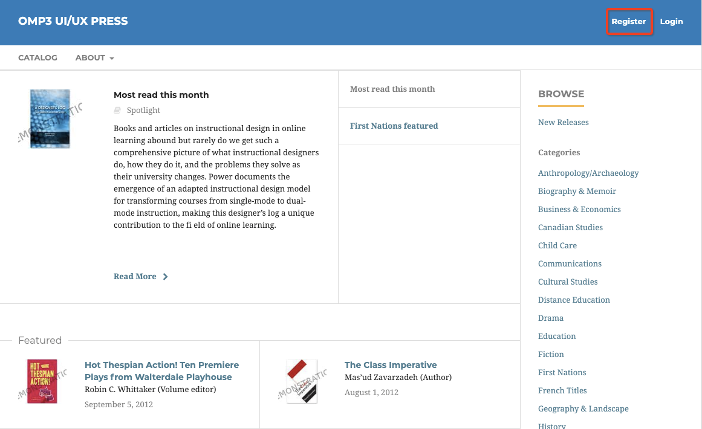

Enter all of the required information on the registration form as indicated by the red asterisk and agree to the terms and conditions.

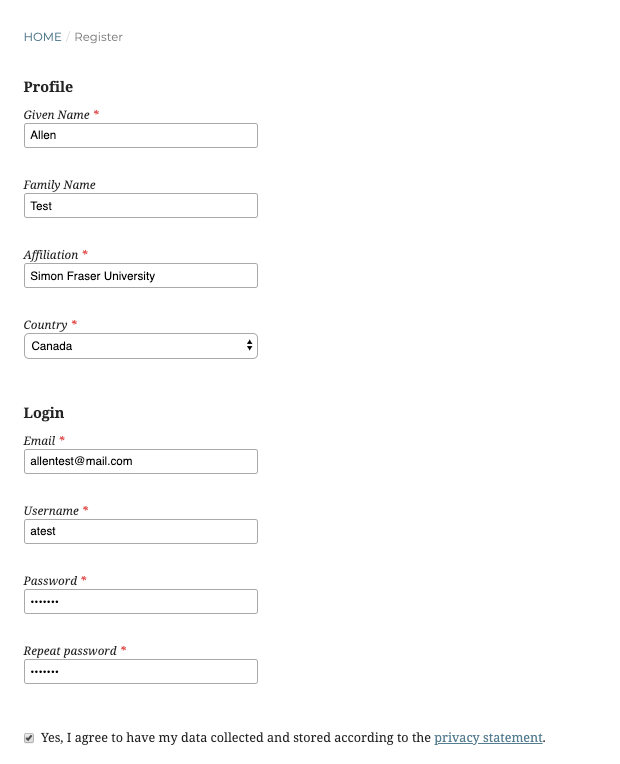

Once you have completed the form and agreed to the terms, click Register. After completing the registration you’ll be able to submit a manuscript, edit your profile, and continue browsing.

### Edit Profile

Once logged in you will be able to edit your user profile by clicking your username on the top-right corner of your dashboard.

Click **Edit Profile**

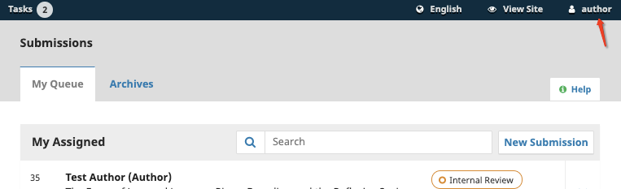

From here, you’ll be able to edit your name, contact information, signature, and public profile; change your password; set notification preferences; etc.

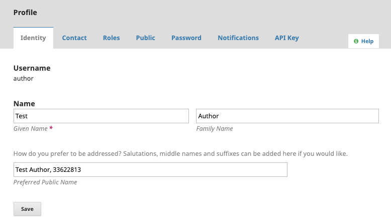

### Author Submission

Once you are ready to make a submission, click **New Submission** on your user dashboard.

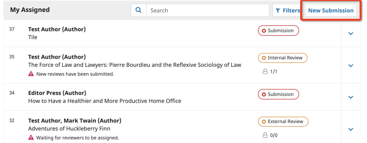

**Step 1: Prepare**

You will need to select the Submission Type, Category, Series, the Role in submission, as well as agree to the submission guidelines and add notes to the Editor (if applicable).

Once you have completed this form, click agree to the terms and click **Save and continue**.

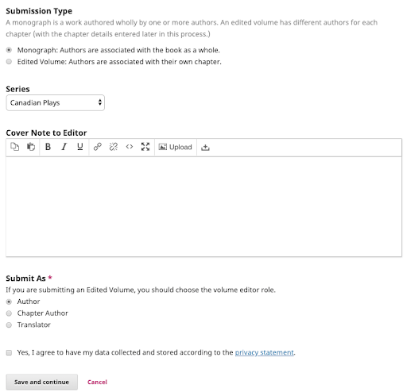

**Step 2: Upload Submission**

Identify your Submission Component from the list. Once selected, upload all of the files relevant to your submission. You can select multiple files from the file browser using Ctrl+Click or Command+Click, or Shift+Click to select a range of files. Once your files are uploaded, you will be prompted to identify the file type. Click on a label to assign it to an uploaded file.

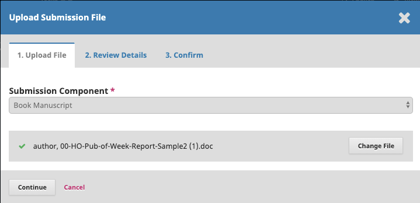

Press **Complete** followed by **Save and Continue**.

**Step 3: Catalog**

You will need to enter the following metadata regarding your manuscript. Items marked with the red asterisk are a mandatory part of the submission.

Enter your manuscript’s Title, Subtitle, Abstract, List of Contributors, Chapters, Additional Refinements Subjects, and Keywords as applicable.

For the List of Contributors, you will need to fill in the required information: Name, Email, Country, and Contributor’s Role.

You will need to select who will be the principal contact for the submission and whether their name will appear in the browse list on the press.

Once you have completed the form, click **Save and Continue**.

**Step 4: Confirmation**

Once you have completed all the steps, click **Finish Submission**.

## Reviewer Workflow

Reviewer requests will listed in a pop-up screen once they click the notification icon.

A reviewer can see more details regarding the request by clicking on the manuscript. The request submenu will have the general information regarding the submission, the review file, and additional submission details and review schedule.

The information in the **View All submission Details** will vary depending on your review policy.

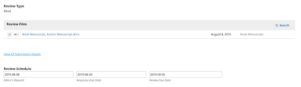

The reviewer's option to accept or decline the review request will be at the bottom of this page. Once the reviewer accepts the request, they will have access to the remaining tabs.

The second tab will outline the press’ reviewer guidelines. The third tab will have the review file for download and text boxes for the reviewer to enter their comments to the author and editor or editor only. They can also upload files for the author or editor, as well as start discussions with the editor. The reviewer can submit the review at the bottom of this page. After the review has been submitted, the reviewer still has the option of starting a discussion with the editor.

## Editorial Workflow

### Manuscript Review

Once a manuscript has been submitted, the Editor will review the submission to determine its suitability.

The submitted manuscript will appear in the Editor’s **My Queue** or **Unassigned**. The Editor will select and download the manuscript.

After reviewing the manuscript, the Editor can decide to Accept and Skip Review, Decline Submission, or send it through Peer Review. The Editor can either assign a Series Editor or undertake the review process themselves.

The assigned Editor will then decide whether they will send the manuscript for Internal or External Review.

### Internal vs. External Review

As an editor, you can choose to conduct an Internal Review followed by an External Review or choose to move straight to peer review; each of these optional stages involves its respective set of reviewers.

### Internal review

As an editor, you can initiate the internal review process for an assigned submission by choosing the Internal Review option on the monograph's Submission page. By sending the manuscript for Internal Review, other Editors can review this manuscript.

You will be prompted to select the submission files the author provided for inclusion in the review process, and you can optionally upload new files or revise existing files. Once you have selected the appropriate files, you can select to send the manuscript to review.

Once the Internal Review has been prompted on your dashboard, you will need to select reviewers by clicking **Add Reviewer** in your main menu subpanel.

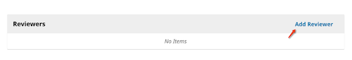

You can select a reviewer from the reviewers in your journal, create a new reviewer, or enroll an existing reviewer from another journal within a multi-journal installation.

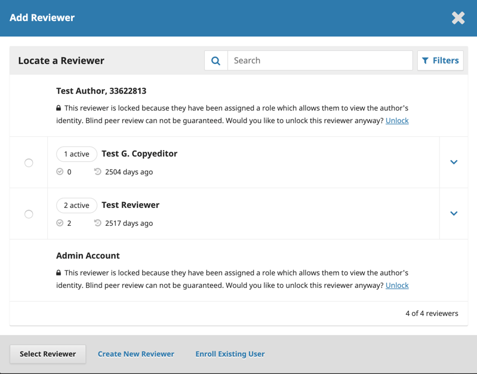

At this stage, reviewers associated with the press evaluate the submission. In an Open or Anonymous Reviewer/Disclosed Author review, an editor can contact reviewers as well as revise their due dates by clicking the icon next to their names.

You will be notified of completed reviews and can access the reviews by clicking the arrow beside the reviewer's name and selecting **Email Reviewer** in the Reviewers section.

Once all the reviews are in, you must make a decision on the submission. Options are the following:

* Request Revisions (in which case the author will be able to modify their submission information and/or upload revised submission files)
* Send to External Review (editor selects files to send to the external review process)
* Accept for Submission (at which point the submission will enter the Editorial stage, bypassing External Review)
* Decline Submission (at which point the submission will be archived and the author notified).

A declined submission can be reverted, see [Reversing a declined decision](/learning-omp/en/role-specific-workflows#reversing-a-declined-decision).

These selections are found on the right panel in the **Internal Review** menu.

### External review

The external review process can be initiated at the end of the internal review process by choosing the Send to External Review or at the time of initial triage. Similar to the Internal Review, you will be prompted to select the submission files the author provided for inclusion in the review process, and you can optionally upload new files or revise existing files. Once you have selected the appropriate files, you can select to send the manuscript to review.

Once the Internal Review has been prompted on your dashboard, you will need to select reviewers by clicking **Add Reviewer** in your main menu subpanel.

You can select a reviewer from the reviewers in your journal, create a new reviewer, or enroll an existing reviewer from another journal within a multi-journal installation.

At this stage, reviewers associated with the press evaluate the submission. In an Open or Anonymous Reviewer/Disclosed Author review, an editor can contact reviewers as well as revise their due dates by clicking the icon next to their names.

Once the review has been completed you will be notified. As an editor, you can access the reviews by clicking on the reviewer's name in the Reviewers section.

All author, reviewer, and editor revision files are available from the Revisions section. Only documents included in this section will be available to be moved to later workflow stages.

Once all the reviews are in, you must make a decision on the submission. You may select one of the following:

* Request Revisions, in which case the author will be able to modify their submission information and/or upload revised submission files
* Decline Submission, at which point the submission will be archived and the author notified. A declined submission can be reverted
* Accept Submission, at which point the submission will enter the Editorial stage

These selections are found on the right panel in the Internal Review menu.

#### Reversing a declined decision

OMP 3.3 allows Press Editors to to reverse a declined decision in the submission and review stages. After a declined decision is reverted, the submission is restored to its previous stage and review round if active. 

## Copyediting Workflow

Please refer to the Copyediting section of [Learning OJS](/learning-ojs/en/editorial-workflow#copyediting).

## Production/Publication Workflow

Following the Copyediting stage, the manuscript enters the Production stage. In the Production stage you will finalize the metadata, configure publication formats, upload final files for publication, and publish the book online.

This chapter explains the steps in that process and the different tabs used in the production stage.

Following the section on multilingual submission below, this chapter will outline the different tabs found in the production workflow and what information and files can be added within each tab.

Finally, it will detail how to use the versioning feature new to OMP 3.2 to publish a new version of a book if significant changes are made.

Please note that in OMP 3.2, Catalog Entry has been replaced by the Publication tab. The Publication tab is now where you can add and edit metadata, identifiers, and publication formats. The Publication tab is explained in more detail below.

To start working in Production, the Press Manager or Editor must log in to the system and choose the submission from their dashboard.

Clicking on the manuscript will open the submission record.

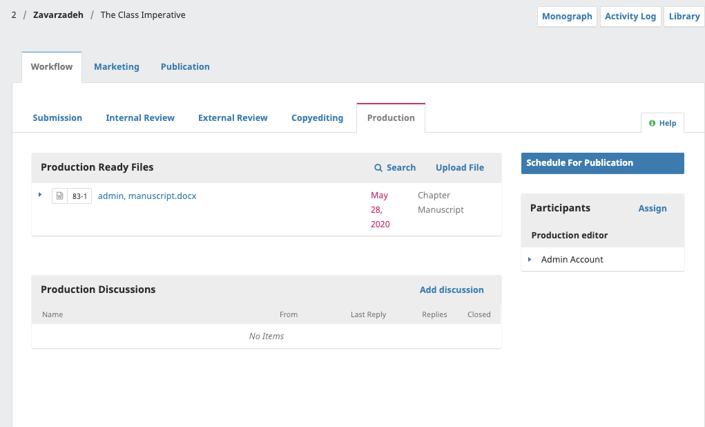

You will see the copyedited files are now available in the __Production Ready Files__ panel.

In the Workflow > Production tab, you can assign participants (such as a Production Editor) to the Production stage of the workflow and communicate with participants in the Production Discussions panel.

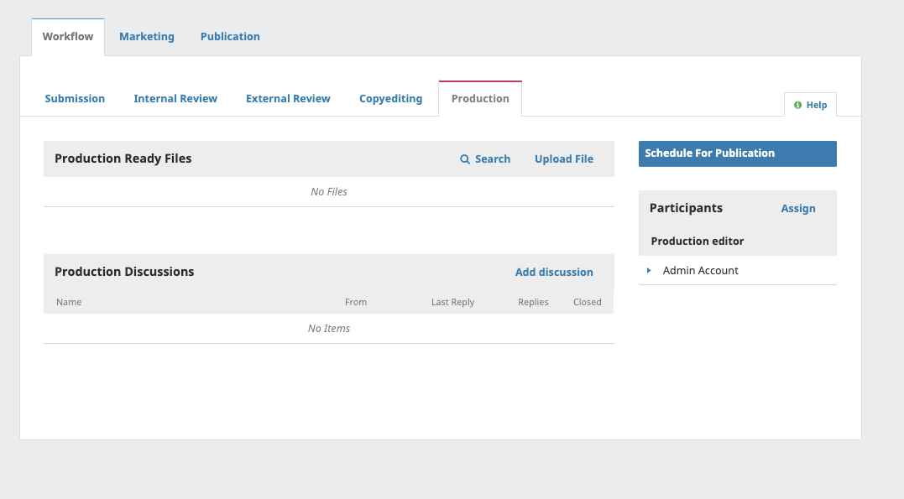

This process is normally managed by a Production Editor, with the input and assistance of Designers and Proofreaders. Production Editors can be assigned from the Participants panel of the submission.

### Prepare Files for Publication

Books can be published on your public OMP press site in a variety of formats, including HTML, PDF, and EPUB. These files must be uploaded during the Production stage as publication formats. You can also create publication formats for physical hardcover and paperback copies of the book.

The publication files must be prepared outside of OMP by a typesetter, graphic designer, or layout editor.

[Learning OJS 3.3](https://docs.pkp.sfu.ca/learning-ojs/en/production-publication) has information on how to prepare different formats of files for publication (referred to as “galley files” for journals).

In the event that a user (i.e., designer or layout editor) does not have the proper permissions to upload files to the __Publication Formats__ on the __Publication tab__, final galley files can be uploaded under __Production Ready Files__.

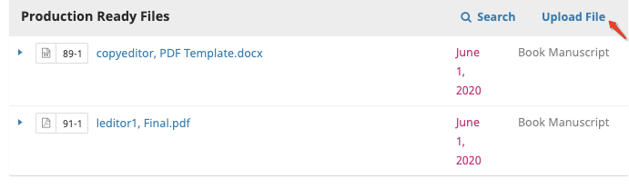

Alternatively, they can also be uploaded in the __Publication Formats__ in Publication tab. Additional instructions on __Publication Formats__ are provided below.

#### Contacting Author

If your press will be sending proofs to the author for approval, you can use the Notify function in the Participants tab. See [Learning OJS - Chapter 15](/learning-ojs/en/production-publication#contact-the-author) for more details.

### Publication Tabs

The Publication tab allows you to edit or add information about the submission, including contributors, metadata, and identifiers for the final publication. It is also where you will upload the final publication files for publication in the Press.

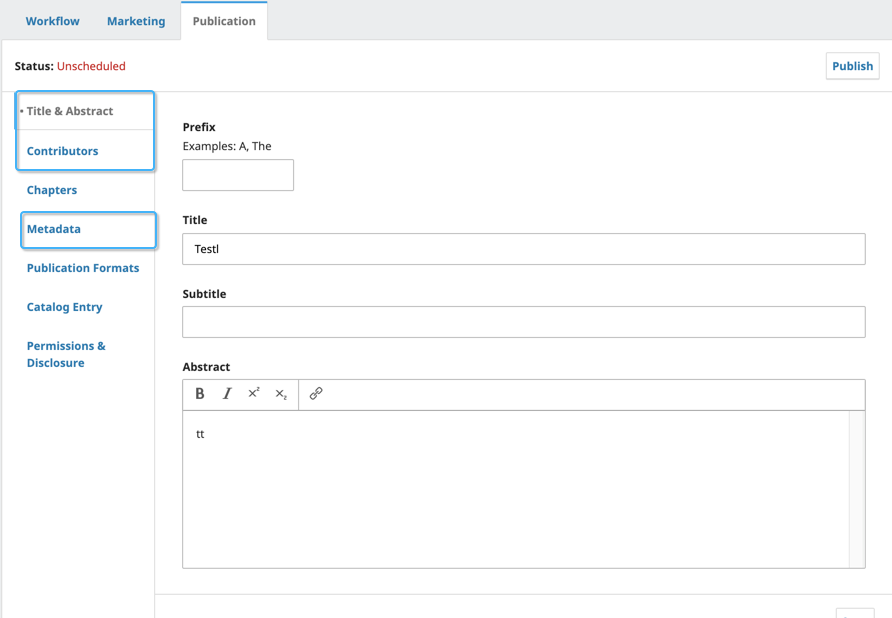

__Title & Abstract__: Use this tab to edit the book title, subtitle, and abstract. If any changes are made, click Save before exiting this window.

__Contributors__: Use this tab to add, edit, or remove book contributors. If any changes are made, click Save before exiting this window.

__Chapters__: Use this tab to add multiple chapter files (if applicable)

__Metadata__: Use this tab to add, edit or remove keywords and/or subjects.

__Publication Formats__: Use this tab to add Publication formats. See Publication Formats below for more information.

__Catalog Entry__: Use this tab to add catalog information including date, series, series position, and category. See Catalog Entry below for more information.

__Permissions & Disclosure__: Include details about the copyright holder and link to the publication license, if applicable. This will be automatically filled in according to your Distribution Settings.

#### Chapters

If your manuscript contains different chapters, you can add the information in this menu.

__Note__: Chapter files can only be added by the Editor or Production Editor of the press.

To add a chapter after final galleys have been prepared, click __Add Chapter__.

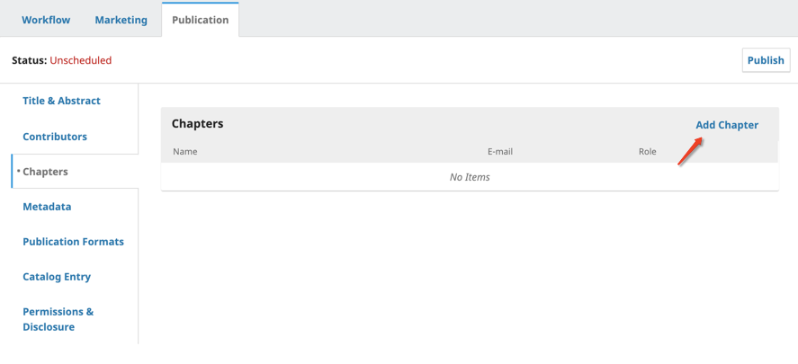

Enter Title (required), Subtitle, Abstract, Pages, Contributor, and select the chapter file.

##### Publication Dates

If your chapters have different publication dates, there is an additional setting that can be enabled to add a field to enter this date.

To enable this, see Publication Dates in the [Marketing tab](./role-specific-workflows.md#publication-dates-1).

##### Adding Chapter files

Once you have created your chapters, you can add the chapter files by clicking the chapter name.

You will now find an additional box at the end to select your file. The files options listed here include the ones from the editorial workflow (indicated by username at the beginning) and the final production files (indicated by file type at the beginning).

If you do not see the chapter file listed here, you may need to upload it in the Production tab.

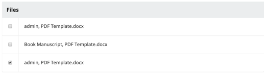

#### Publication Formats

Books can be published on your public OMP press site in a variety of formats, including HTML, PDF, EPUB, and more. Supplementary materials can also be published.

These files can be uploaded by the Layout Editor or Editor depending on the workflow of your press.

To add publication formats, click __Add publication format__.

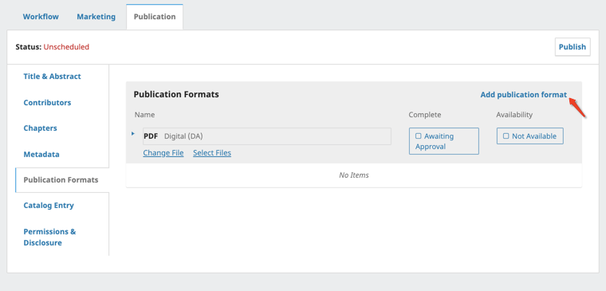

Enter the format title, select format from the drop-down list and select the option that applies. Click OK to save.

!\[Sample new publication format information entered in the upload form.\](./assets/learning-omp3.2-workflow-production-formats-2.p

##### Add Publication Format files

Once you have added the publication formats, you can select the corresponding file by clicking __Select Files__.

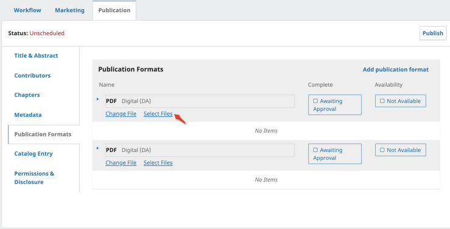

Select the file that corresponds with the publication format you’ve created.

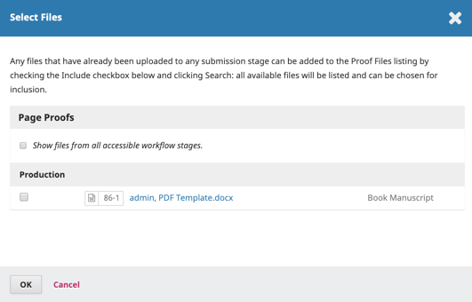

Once Publication Formats have been created you can update the Completion and Availability by clicking the blue boxes beside the formats.

Once it has been approved and made available, the status bar will change accordingly.

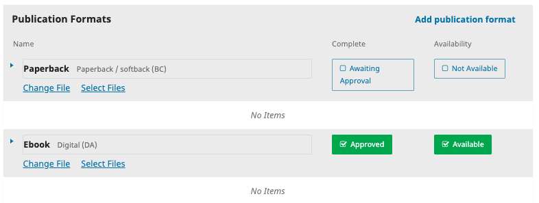

#### Catalog Entry

To add this publication to a catalog, fill and select the following information in this tab including:

* Publication Date
* Series
* Series Position
* Category
* URL Path
* Cover Image and alternative text.

#### Permission & Disclosure

Your press will automatically assign the default permissions set in your Distribution Setting (Setting > Distribution Settings> License)

If you need to override this, it can be done under this tab by clicking override. This will enable the textbox to the left where you can enter this information.

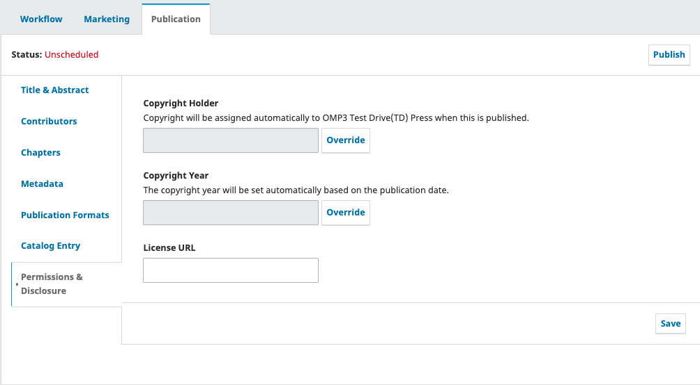

### Marketing Tab

The marketing tab will need to be completed prior to publishing the manuscript. The section below outlines what information should be entered in this tab. This information can be added at the Publication stage or at any point in this information becomes available throughout the workflow.

Within the marketing type there are 3 menus that you can configure - audience, representative, publication dates.

#### Audience

This is where you can add/select audience information for your ONIX export.

Depending on your market, the Audience, Ranges and Education values may be handled in various ways. In English speaking North America, the following ONIX values are typically used.
* ONIX Code List 28 for Audience codes
* Audience Range for age and grade ranges

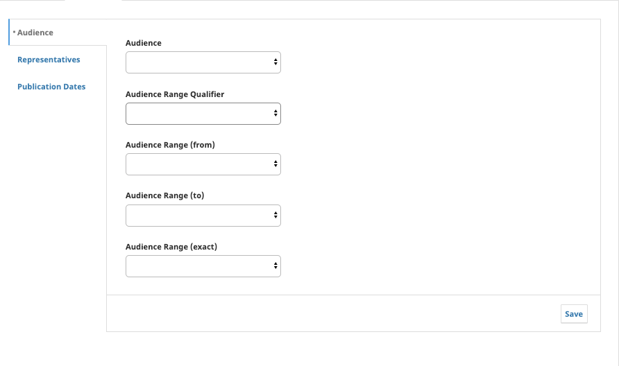

__Audience__ - Identify the [intended audience](https://booknetcanada.atlassian.net/wiki/spaces/UserDocs/pages/16449595/How+do+Audience+Subject+Audience+Range+work+together+to+help+librarians+and+other+professionals+select+products) from the dropdown list.

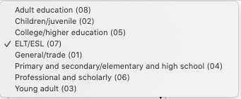

__Audience Range Qualifier__

__Audience Range__

##### Additional Resources

* [How do Audience / Subject / Audience Range work together to help librarians and other professionals select products?](https://booknetcanada.atlassian.net/wiki/spaces/UserDocs/pages/16449595/How+do+Audience+Subject+Audience+Range+work+together+to+help+librarians+and+other+professionals+select+products)
* [ONIX](https://booknetcanada.atlassian.net/wiki/spaces/UserDocs/pages/1378909/ONIX)
* [Thema Basics: Subject Categories, Qualifier Codes, National Qualifier Lists](https://booknetcanada.atlassian.net/wiki/spaces/UserDocs/pages/8257659/Thema+Basics+Subject+Categories+Qualifier+Codes+National+Qualifier+Lists#ThemaBasics:SubjectCategories,QualifierCodes,NationalQualifierLists-SubjectCategoriesvsQualifierCodes)

#### Representative

You can add Agents and Suppliers for your manuscript here by click Add Representative.

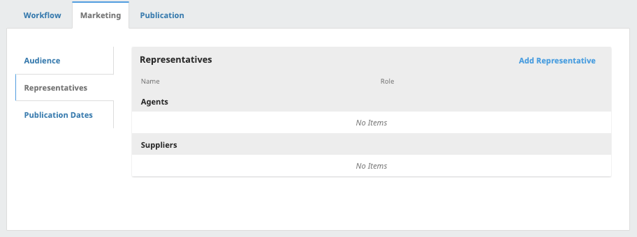

In the pop-up box, you can select whether you are adding an Agent or Supplier. Depending on the selection, additional fields will be generated.

In order to save you will need to fill all the required fields (marked with an asterisk). All remaining fields are optional.

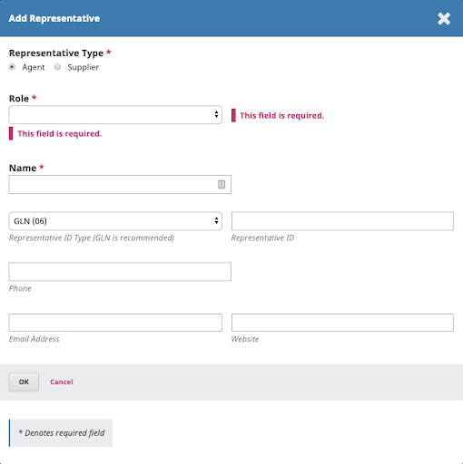

To edit or delete a representative, click the blue arrow beside the name.

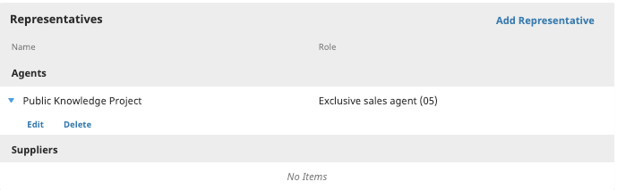

#### Publication Dates

If your manuscript will have multiple chapters with differing publication dates, you can enable it here.

This will enable an extra field for publication dates when adding chapter files.

### Multilingual Submissions

For multilingual books, the Title & Abstract, Metadata, Chapter, and Permission & Disclosure tabs have options for adding and editing metadata in multiple languages. Languages must first be turned on in Website Settings > Setup > Languages.

Under the ‘Publish’ button, select the desired language. In the example above, French and English are enabled. The French text boxes will appear beside the English when selected.

### Publish

Now that you’ve entered all the relevant information and proofs for your manuscript in the publication and marketing tabs, and are ready to click the **Publish** button. 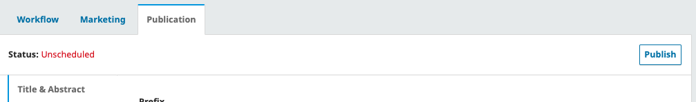

This will prompt a secondary box confirming you want to publish.

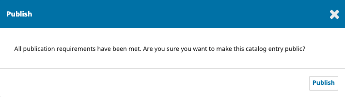

Once you’ve published the manuscript, you will see the status change in the following places.

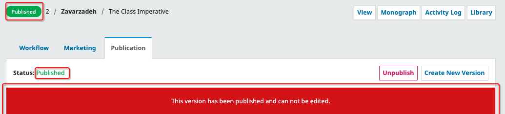

#### Versioning

OMP 3.2 introduces a new versioning feature which gives you the ability to publish versions of books.

Once a book is published, neither metadata nor publication files can be edited while the book is live. When a revision of a published book or metadata is necessary, it can be done in one of two ways:

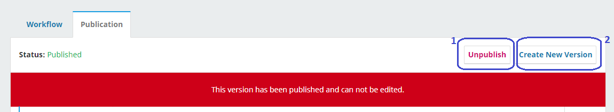

##### Option 1: Unpublish and republish

Unpublishing a book allows you to make changes without creating a new version. After unpublishing, you can update metadata and/or replace the publication file and schedule the book for publication again.

##### Option 2: Create new version

When creating a new version, you will be able to make changes to the metadata and/or publication files. Make sure to click Save on the bottom right to record the changes.

You can keep track of version updates under All Versions. Each version is marked by a number and date published. The version currently being updated is marked by a number and Unpublished.

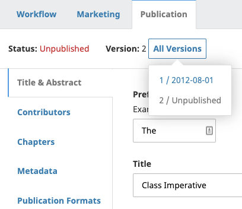

Once your changes are completed, you can publish the new version by clicking Publish on the top right.

The list of prior versions and update dates will be listed on the publication page.

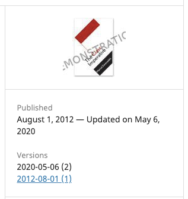

Readers will be able to access previous versions. They will see a message on the book page and publication file advising them that it is an outdated version and pointing them to the most recent version.

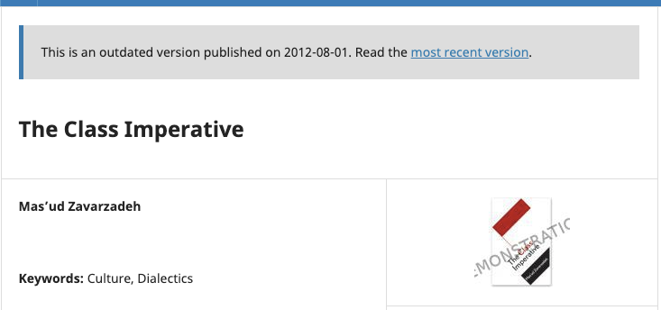

Example of an outdated version message on the publication page:

_The publication URL will always point to the most recent version, with earlier versions being available at the same URL with the version at the end of the URL_ (e.g. /version/1234/).
