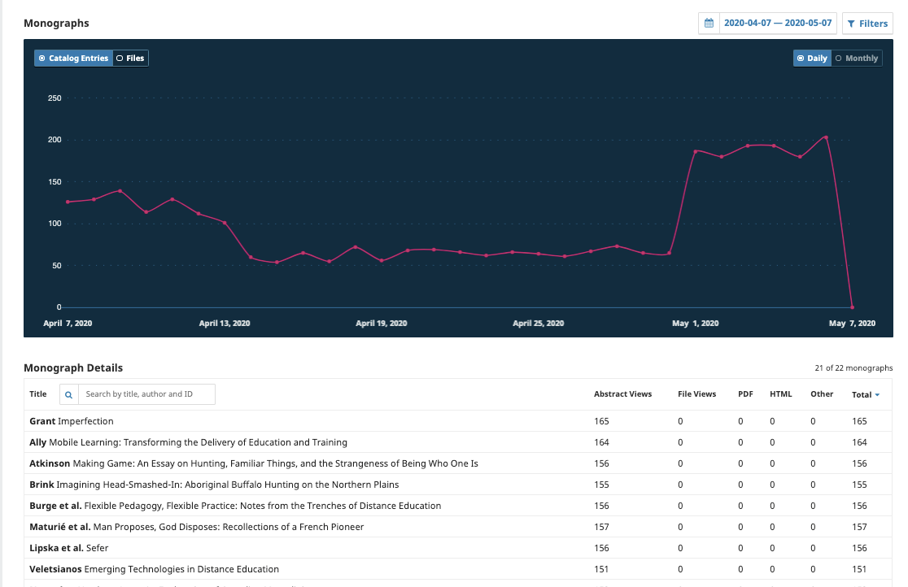

# Statistics

This chapter of the Learning OMP provides a general overview of statistics available in Open Monograph Press (OMP). For more detailed information on statistics and usage guidelines, please see the Statistics chapter on the [PKP Administrator’s Guide](/admin-guide/en/statistics).

## Monographs

Similar to the [Article Usage visual statistics](/admin-guide/en/statistics#article-usage-visual-statistics), Monographs shows a visual graphic of the catalogue activity.

### Geographical and Institutional Statistics

When Geographical and Institutional Statistics have been enabled (see the [Administrator's Guide](https://docs.pkp.sfu.ca/admin-guide/en/statistics) for details), OMP can collect data about the readers' locations and institutions for statistical reporting. To access these reports, click "Download Report" and choose the report you wish to access.

This information is also available via the COUNTER SUSHI interface. See the [Administrator's Guide](https://docs.pkp.sfu.ca/admin-guide/en/statistics#counter) for details.

## Editorial Activity

The Editorial activity statistics provides a visual graph and trend table with a summary of the editorial activity for your press. This can be filtered for a specific date range and/or series.

## Users

Provides a summary of the number of users registered in your press and by roles.

Press Managers and Press Editors can export the user database as a CSV file, a user-friendly spreadsheet format. The CSV format is easy to use with marketing and mailing list management tools, such as Mailchimp.

To export users, navigate to **Statistics > Users**. Click on the button **Export**. Next, use checkboxes to select the group(s) of users you wish to export, and **Export** again. This will generate a download, which may take several minutes to process, depending on the size of your user database.

It is also possible to export the user database in XML format under **Tools**.

## Reports

The Reports page provides access to a variety of reports from your press. The list may be expanded by installing additional plugins. For information on how to use and configure statistics in OMP, see the relevant section in [Learning OJS](/learning-ojs/en/statistics#reports).
