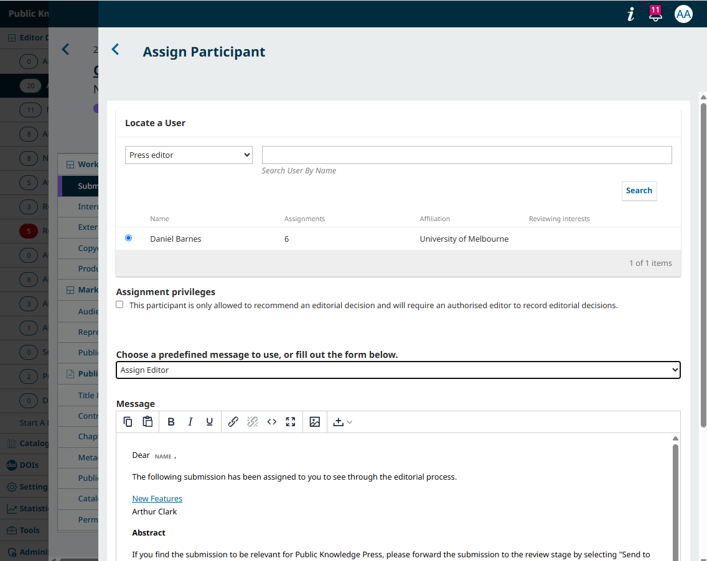
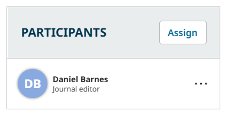
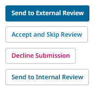

# The Submission Stage: Assign Editors and Make Desk Decisions {#submission}
The first stage of the Editorial Workflow is the Submission stage. New submissions land in this stage, where they are assigned to Series Editors (automatically or manually by a Press Editor or Press Manager). The Editor will be able to record an editorial decision or choose to move into the Review stage. 

In this chapter, we will explain:
* How an Editor is notified and automatically assigned to a submission
* How to manually assign an Editor
* How to make a desk decision or send the submission for internal or external review.

The roles involved in this stage are typically: Editors (Press Editor and Series Editor) and Authors.

## Manage New Submission Notifications and Automatic Assignments {#manage-assignment}

When an author makes a new submission, Editor(s) will be automatically emailed a notification and informed via their Tasks menu. 

>  Automatic assignments and notifications about a new submission are reliant on the press settings selected by the Press Editor or Manager. 
>
> * If there is only one user appointed to a Press Editor or Press Manager role, that user will be automatically assigned and notified. 
> * If one or more Editors are [assigned to the series](./press-setup.html#series) the submission was made in, they will be automatically assigned to the submission and notified.
> * If one or more Editors are [assigned to a category](./press-setup.html#categories) the submission was made in, they will be automatically assigned to the submission and notified.
> * Additional contacts for new submission notifications can be customized from Settings > Workflow > Emails. See [Configure Email Settings in Learning OJS for Journal Managers](https://docs.pkp.sfu.ca/learning-ojs/journal-managers/en/communications#email-config) for more details.

You can change your personal notification settings by clicking the user menu from the top right and accessing Edit Profile > Notifications.

## Manually Assign an Editor to a Submission {#assign-editor}

Depending on the configurations described above, some new submissions may come in unassigned. In this case, the next step is to assign an Editor. You can assign yourself or another user with a Press Editor or Series Editor role.

Select the _Assign_ link in the **Participants** panel.

Search for an individual by name or view all individuals in a given role by choosing the relevant role and pressing the Search button. You will see the number of submissions already assigned to each individual to help you track their editorial workload and plan accordingly.
Choose whether the assignee should be able to finalize an editorial decision, or simply recommend an editorial decision.
Choose whether the assignee should have permission to edit publication details.
Choose an email template from the dropdown to inform the assignee about their new assignment, or draft a custom email message. 

Hit the **OK** button to make the assignment and send the message.

The selected Editor will now be added to the Participants list.

> Note that a Pre-Review Discussion has been automatically created as part of the assignment.

## Send to Review or Make a Desk Decision {#desk-decision}

Once the editor is assigned, the submitted manuscript will appear in the “assigned to me” section of the editor dashboard. 

The editor will review the submission to determine its suitability. After reviewing the manuscript, the Editor can decide to proceed with one of the following actions.

**Send to External Review**: If the assigned Editor is satisfied that the submission is appropriate for the press and in need of external peer review, they can select this option to move the submission to the external review stage.

**Accept and Skip Review**: Skips the Review Stages and moves the submission directly into Copyediting. This can be useful for certain types of content that don’t require peer review.

**Decline Submission**: Rejects the submission before going through the review process. The submission would then be archived. This decision can be reverted by clicking **Revert Decline**. After a declined decision is reverted, the submission is restored to its previous stage and review round if active.

**Send to Internal Review**: If the assigned Editor is satisfied that the submission is appropriate for the press and in need of internal peer review, they can select this option to move the submission to the internal review stage.

If more discussion is needed to make a decision, for example between the assigned press editor and the press manager or the assigned series editor and the author, the Pre-Review Discussions panel can be used to communicate.

## Internal vs. External Review {#accept-or-review}
Assigned Editors can choose to conduct an Internal Review followed by an External Review or choose to move directly to External Review; each of these optional stages involves its respective set of reviewers. You'll learn more about the review stage in the next chapter, [The Review Stage: Assign Reviewers and Make an Editorial Decision](./review.md)
