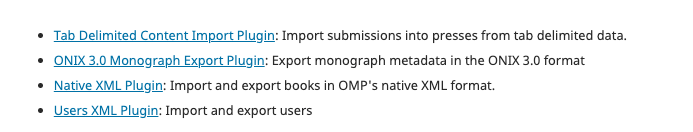
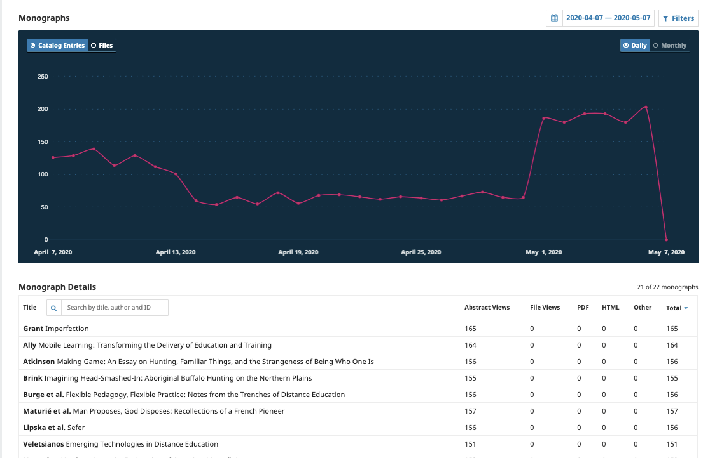
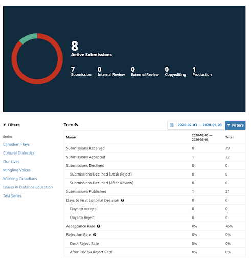

# Tools

## Import/Export

OMP provides a number of tools to import and export data into and out of your press. Please see [PKP’s Administrator’s Guide](/admin-guide/en/data-import-and-export) for information on how to use the Native XML Plugin and the Users XML Plugin. Please also note that the Quick Submit Plugin is not available for OMP.

To export using the ONIX 3.0 Monograph Export Plugin, you need to ensure that all of the fields are completed under Settings > Workflow > Production.

The Tab Delimited Content Import Plugin can only be used with the command line.

## Statistics

This chapter of the Learning OMP 3.2 provides a general overview of statistics available in Open Monograph Press (OMP). For more detailed information on statistics and usage guidelines, please see the Statistics chapter on the [PKP Administrator’s Guide](/admin-guide/en/statistics).

### Monograph

Similar to the [Article Usage visual statistics](/admin-guide/en/statistics#article-usage-visual-statistics), Monograph shows a visual graphic of the catalogue activity.

### Editorial Activity

The Editorial activity statistics provides a visual graph and trend table with a summary of the editorial activity for your press. This can be filtered for a specific date range and/or series.

### Users

Provides a summary of the number of users registered in your press and by roles.

In OMP 3.3, Press Managers and Press Editors can also export the user database as a CSV file, a user-friendly spreadsheet format. The CSV format is easy to use with marketing and mailing list management tools, such as Mailchimp.

Previous versions only offered the option to export the user database in XML format. The previous XML export options is still available (under **Tools**).

To export users, navigate to **Statistics > Users**. Click on the button **Export**. Next, use checkboxes to select the group(s) of users you wish to export, and **Export** again. This will generate a download, which may take several minutes to process, depending on the size of your user database.

### Report Generator

You can generate statistical reports for usage and reviews or create a custom report. For information on how to use and configure statistics in OMP see the [PKP Administrator’s Guide](/admin-guide/en/statistics).
