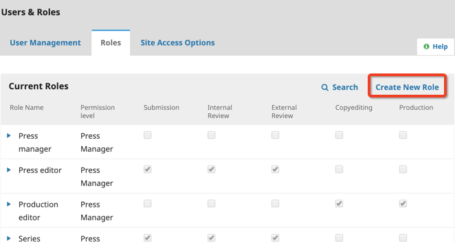
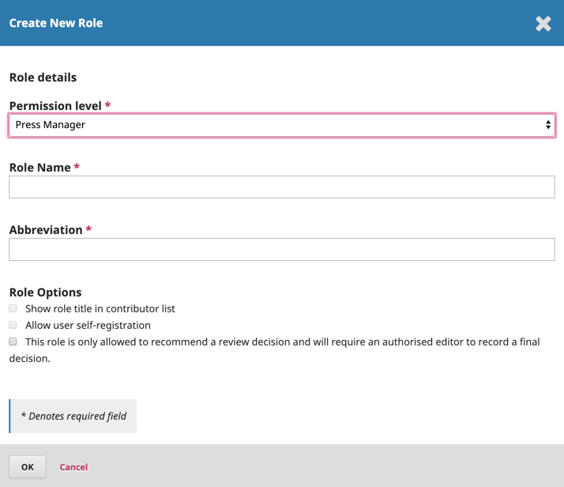

# User Accounts

A monograph publishing workflow will involve various users with various roles. OMP offers a flexible role management system that allows the Press Manager to control which roles have access to a given task and/or stage of the workflow.

OMP has a number of default roles with associated permissions/access. These roles include Press Manager, Press Editor, Series Editor, Volume Editor, Author, Internal Reviewer, External Reviewer, Copyeditor, Layout Editor, and Proofreader. OMP 3 also includes additional roles such as Translator and Designer. You can create new roles or rename and reconfigure existing roles as needed.

## Permission Levels

There are six levels of permissions/access that a role can have: Press Manager, Press Assistant, Series Editor, Reviewer, Author, Reader. Permission determines to which parts of the dashboard the role has access. These permission levels cannot be changed once set. You can assign any number of roles to each workflow stage. Assigning a role to a workflow stage means that you will be able to include one or more persons with that role during that stage of the submission. For example, by default, the Marketing Coordinator is included in the editorial stage, the Layout Editor in the production stage, and the Author in all stages. You can add or remove any role from a workflow stage.

__Press Managers__ can access the many Press Management pages, including content settings, press settings, and import/export tools and other plugins. The Press Manager(s) should configure the press via the Press Settings pages before any submissions are solicited. By default, the Press Editor, Production Editor, and Layout Editors all have "press manager" permissions. These four roles have limited customizable options in the OMP workflow.

__Series Editors__ can access all of the submissions that are part of the [series](./press-setup.md#series) to which they are assigned. They do not need to be explicitly assigned to the submission to have access, as long as the submission is in their series. By default, only the Series Editor role has this set of permissions.

__Assistants__ can access only the workflow stage and monograph to which they have been assigned. They need to be explicitly assigned to the monograph at the appropriate stage to gain access. By default, most roles fall under this set of permissions.

__Reviewers__ only have access to the pages that are used to perform a review. They only have access to a submission they have been asked to review. By default, there is an Internal Reviewer and an External Reviewer role with this set of permissions. They are intended to help organize two distinct sets of reviewers for the press.

__Authors__ only have access to their own submissions and can see a limited set of information about the submission through the Author Dashboard. Authors can create new submissions and add files to the submission. By default, the Author, Volume Editor, and Translator have this set of permissions.

__Reader__ has access to the reader-facing website. This permission is included within other permission levels.

## Roles

Roles may vary according to Press; OMP has been designed to accommodate various Press sizes and the accompanying roles. Depending on the size of your press, you may utilize some or all of these roles. You may also have one person perform multiple roles.

Some Presses may have the Press Editor overseeing all the editing, whereas some presses may not have Layout Editors or Proofreaders.

__Press Manager__ is responsible for setting up the press website, configuring the system options, and managing the user accounts. This does not involve any advanced technical skills but entails filling out web-based forms and uploading files.

In a closed user registration, the Press Manager will need to enroll the Editors, Copyeditors, Layout Editors, Proofreaders, Authors, and Reviewers.

The Press Manager also has access to the press’ other management features and can create new series for the press, set up review forms, edit the default emails, view statistics and reports, import and export data, and access the editorial workflow and all press submissions.

__Press Editor__, along with the Press Manager, typically establishes the policies and procedures for the press. Press Editors can also access journal settings, users and roles, and tools. They have access to all submissions and manage submissions and Series Editors.

__Production Editor__ oversees the entire review, editing, and publishing process for the press as a whole.

In the editorial process, the Production Editor assigns responsibilities to the Series Editor(s) and Volume Editor(s) to manage content further down the chain. The Production Editor maintains an overview of all active projects and assists with problem-solving as appropriate.

The Production Editor also creates the press series and schedules ebooks for publication.

__Series Editor__ oversees the reviewing, editing, and publishing process for a monographic series.

In the editorial process, the Series Editor assigns responsibilities to the Volume Editor(s) to manage the content of individual titles in the series. The Series Editor maintains an overview of all active titles and assists with problem-solving as appropriate.

The Series Editor also authorizes individual ebooks within the series.

__Volume Editor__ oversees the review, editing, and publishing process for a monograph in a series.

In the editorial process, the Volume Editor manages the content of an individual title in a series. The Volume Editor would have direct responsibility for overseeing all other contributors to the editorial workflow of the given title.

__Copyeditor__ edits accepted submissions to improve grammar and clarity, works with authors to ensure everything is in place, ensures strict adherence to the press' bibliographic and textual style, and produces a clean, edited copy for a Layout Editor or Production Assistant to turn into the galleys that will be in the published format of the ebook.

*Some presses have a Production Editor or Series Editor play this role*.

__Proofreader__ carefully reads over the galleys in the various formats in which the press publishes (as does the Author). The Proofreader (and the Author) record any typographic and formatting errors for the Layout Editor to fix.

In the case of some presses, the Production Editor or Series Editor will also serve as Proofreader.

__Designer__ will make decisions about fonts and other design elements. This may involve working with CSS. The Designer may also design book covers that will be done outside of OMP.

__Layout Editor__ transforms the copyedited versions of the submission into galleys in HTML, PDF, XML, etc. – formats that the press has elected to use for online publication.

Note - OMP does not currently provide software for automatically converting word-processed documents to galley formats (although a project is in development), so the Layout Editor should have access to and be able to use third-party software packages for creating galleys.

_In some cases, the Editor or Section Editor will also serve as the Layout Editor_.

__Indexer__, as some ebooks will require an index to the content. Creating the index would be the responsibility of the Indexer.

__Funding Coordinator__ identifies appropriate grants to which projects may apply. In some cases, funding may also be obtained from a scholarly society or sponsor.

__Marketing and Sales Coordinator__ have no specific role in the editorial workflow but could be designated within OMP to oversee the public face of the press.

__Author submits__ manuscripts to the press directly through the press' website. The Author is asked to upload submission files and to provide metadata or indexing information (the metadata improves the search capacity for research online and for the discovery of the press' ebooks).

The Author is able to track the submission through the review and editorial process and participate in copyediting and proofreading of submissions accepted for publication.

## Creating new roles

OMP allows for the creation of new roles if the default ones do not fit your needs.

To create a new role, go to Users & Roles > Roles. On the top-right corner of the Current Roles box, click ‘Create New Role.'

Select the Permission level, enter the Role Name and Abbreviation, and select from the Role Options (as it applies).

## Emailing all users in a role

It is now possible to notify all users with a role by using the **Notify** feature in **Users & Roles**.

Please note, this feature is disabled by default and administrators will need to enable it for each press.

To email users with a particular role, start by selecting role and scrolling to the bottom to enter your message. This feature may be useful for contacting your reviewers to confirm their interest in serving as a reviewer for your press.

Once you have sent your message, there will be a status notification indicating whether your message has been successfully sent.

When using this function, please note that there will be no record in your press of the emails that have been sent using this. Although you could opt to cc the main Press contact on the email.

 

## Granting Author permissions

As of OMP 3.2, editors can grant access to allow authors to make metadata changes. There are two ways editors can grant this type of access.

__Global permission__- will grant all users with the role ‘author’ permission to make metadata changes.

To enable this, go to Users & Roles > Roles. Click the blue arrow beside the ‘Author’ then click edit.

Under Role Options, enable ‘Permit submission metadata edit.’ then click OK.

__Limited Permission__ - will grant registered authors (typically a single author) permission to only make changes at certain stages of the editorial workflow.

To allow an author to change the metadata at a specific stage of the workflow, click on the workflow stage (ie., Submission, Review, Copyediting, or Production).

Under the participant’s list, click the arrow beside the author’s name followed by Edit.

Under Permissions, enable ‘Allow this person to edit publication details.’ followed by OK.

Once the author has been granted access to made edits they will be able to make changes to the following sections on the Publication tab: Title & Abstract, Contributors,  Chapters and Metadata.

