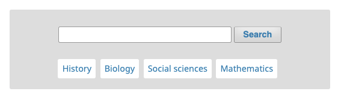
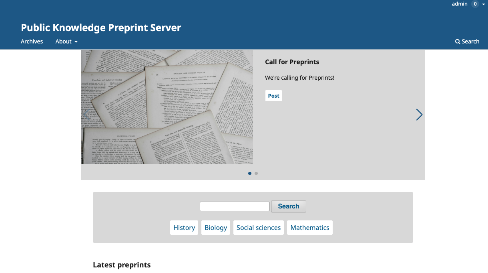
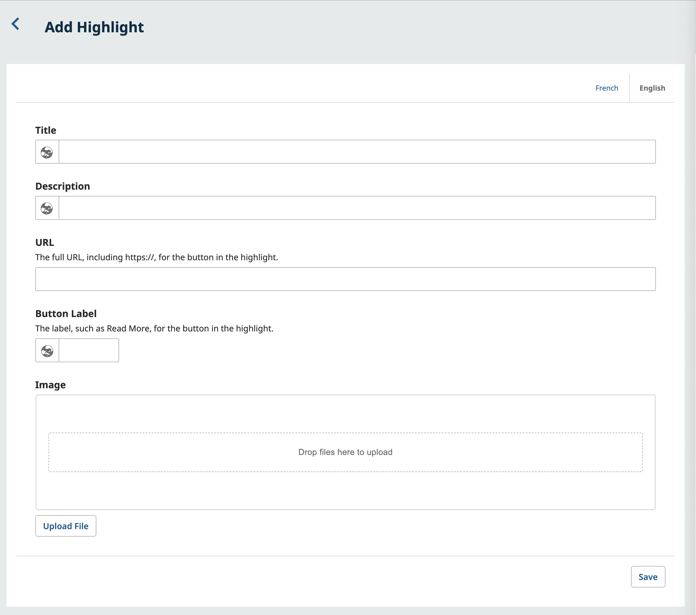

# Content Discovery

OPS supports a number of ways to make the content on your Server discoverable to your readers. Most of which are built in functionality.

## Home Page

### Search by Category

If categories have been created, users will be able to search by these from your Servers homepage.

If subcategories have been created, users will be able to search these by clicking on the parent category.

### Highlights

Highlights allow you to feature images and information on your preprint server home page. Use this to draw attention to a Call for Preprints or to highlight a particular post. If you add multiple highlights, they will be added to a carousel display that rotates between highlights. **This feature may not work for all themes**.

#### Create a Highlight #create-highlights

> Note: The Highlights feature may not currently work with all themes.
{:.warning}

In the Highlights section of Website > Setup, you can feature images and information on your home page. Use this to draw attention to a Call for Preprints or to highlight a particular post. If you add multiple highlights, they will be added to a carousel display that rotates between highlights.

To add a highlight:
1. Navigate to Website, under Settings, click on the Set Up menu tab and click on Highlights. 
2. Click on the button ‘Add Highlight’.
3. Enter a title, a short description, the URL of the page you want readers to visit, a button label, an optional image
4. Click ‘Save’.

### Advanced Search

The advanced search provides you with a few more filters to find content. This includes having a specific date range or by author name.

### Publishing Mode

Depending on policy established by your Server access to content can be configured accordingly in Settings > Distribution > Access.

### Plugins

There are also some plugins available on OPS that provide more ways for content to be discovered. See the Plugins section of the [Website Settings chapter](./setup.md#plugins) for details.
