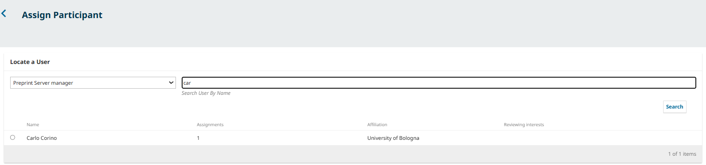
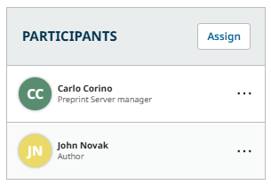
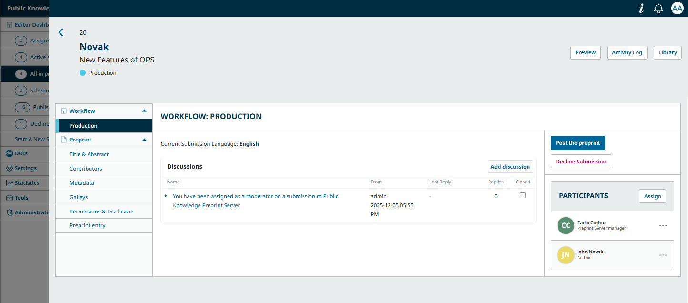
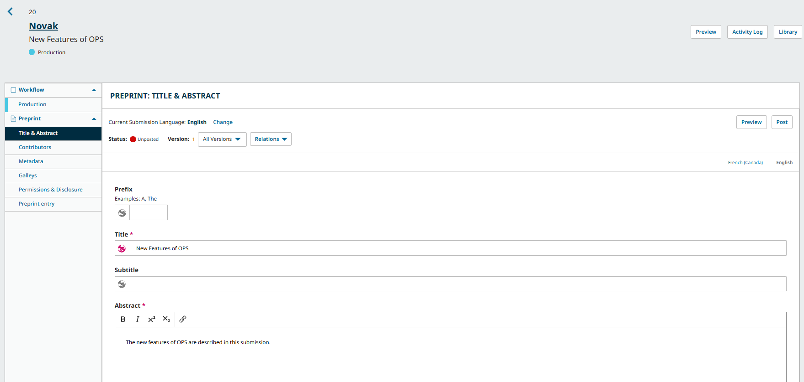

# OPS Editorial Workflow: Managing Preprints {#managing-preprints}

The editorial workflow for preprints is straightforward compared to refereed articles. When a preprint is submitted, it is immediately placed in the Production stage, the only stage in the workflow. An activity log, similar to what is in place in OJS, indicates all of the activity that has taken place on the submission. Generally, the author has more control over the process than they would when submitting to a journal. Authors can self-post immediately upon submission, or a screening process can be used, depending on the server’s screening policy. Additionally, unlike journals, preprints are not organized into issues.

A typical workflow might look like the following, with variations depending on the preprint server’s policies:

1. An author makes a submission, which includes the full-text preprint file, supplemental material, and metadata.
2. The preprint is posted online automatically and immediately. (Alternatively: The preprint is screened by a moderator. The moderator will decide to decline the submission or schedule it for posting.)
3. Metadata is finalized and the preprint is posted online.
4. The author may post revised versions of the preprint as they become available.

This chapter explains the steps in the editorial workflow for Authors, Moderators, and Preprint Server Managers.

## The Submission Stage: Assign Preprint Server Managers or Moderators and Make Desk Decisions {#submission}

The first stage of the Editorial Workflow is the Submission stage. New submissions land in this stage, where they are assigned to Preprint Server Manager or Moderator (automatically or manually by a Preprint Server manager or Moderator). The Manager or Moderator will be able to record an editorial decision by choosing to decline the submission or posting the preprint. 

In this section, we will explain:
* How a Preprint Server manager or Moderator is notified and assigned to a submission
* How to manually assign a Preprint Server Manager or Moderator
* How to make a desk decision.

The roles involved in this stage are typically: Preprint Server managers, Moderators, and Authors.

### Manage New Submission Notifications and Automatic Assignments {#manage-assignment}

When an author makes a new submission, Preprint Server manager(s) and/or Moderator(s) will be automatically emailed a notification and informed via their Tasks menu. 

>  Automatic assignments and notifications about a new submission are reliant on the journal settings selected by the Preprint Server Manager. 
>
> * If there is only one user appointed to a Preprint Server Manager role, that user will be automatically assigned and notified. 
> * If one or more Preprint Server Managers and/or Moderators are [assigned to the section](https://docs.pkp.sfu.ca/learning-ojs/journal-managers/en/policies.html#edit-section) the submission was made in, they will be automatically assigned to the submission and notified.
> * If one or more Preprint Server Managers and/or Moderators are [assigned to a category](https://docs.pkp.sfu.ca/learning-ojs/journal-managers/en/policies.html#categories) the submission was made in, they will be automatically assigned to the submission and notified.
> * Additional contacts for new submission notifications can be customized from Settings > Workflow > Emails. See [Configure Email Settings in Learning OMP for Preprint Server Managers](https://docs.pkp.sfu.ca/learning-ojs/journal-managers/en/communications.html#email-config) for more details.

You can change your personal notification settings by clicking the user menu from the top right and accessing Edit Profile > Notifications.

### Manually Assign a Preprint Server Managers or Moderators to a Submission {#assign-manager}

Depending on the configurations described above, some new submissions may come in unassigned. In this case, the next step is to assign a Preprint Server Manager or Moderator. You can assign yourself or another user with one of these roles.

Select the _Assign_ link in the **Participants** panel.

Search for an individual by name or view all individuals in a given role by choosing the relevant role and pressing the Search button. You will see the number of submissions already assigned to each individual to help you track their editorial workload and plan accordingly.
Choose whether the assignee should be able to finalize an editorial decision, or simply recommend an editorial decision.
Choose an email template from the dropdown to inform the assignee about their new assignment, or draft a custom email message. 

Hit the **OK** button to make the assignment and send the message.

The Manager will now be added to the Participants list.

> Note that a Pre-Review Discussion has been automatically created as part of the assignment.
> 

## Post the Preprint or Decline Submission {#post-or-decline}

Once a Manager or Moderator has been assigned as a participant, the following Action buttons will become available:

**Post the Preprint**: If the assigned Manager or Moderator is satisfied that the submission is appropriate for the preprint server, they can select this option to begin editing the metadata of the preprint. The system will direct them to the first subsection of the Preprint Menu, Title & Abstract.

**Decline Submission**: Rejects the submission. The submission would then be archived and listed under the ‘Declined’ tab. This decision can be reverted by clicking **Revert Decline** option in the Workflow tab. After a declined decision is reverted, the submission is restored to its previous stage,Production.

Once the manager has selected an action, the submission status will change and the action buttons will be disabled.

If more discussion is needed to make a decision, for example between the assigned Manager and Moderator or the assigned Manager and the author, the Discussions panel can be used to communicate.

### Use the Publication Menu to Finalize Details

Before posting, the final step is to edit the metadata of the submission. Metadata is information about the submission. This includes basic information like the author list, abstract, title, copyright information, and more.

While much of this information will have been provided to you by the author, it is the job of the Manager to make sure that this metadata is accurate. Accurate and complete metadata is a key element for allowing your server’s content to be indexed and easily discovered.

You can make these changes using the Preprint menu on the left sidebar of the submission record.

> Note: If a preprint has already been posted, it will need to be unposted before you can edit these details. Click Unpost at the top right of the window, make your changes, and click Post to publish it once again.
{:.warning}

We will explore each item in the menu below.

* **Title & Abstract**: Edit the preprint title, subtitle, and abstract.
* **Contributors**: Add, edit, or remove preprint contributors.
* **Metadata**: Add or edit additional metadata requested by the server such as keywords. This item will only appear for servers who have enabled the collection of additional metadata in [their metadata settings](https://docs.pkp.sfu.ca/learning-ojs/journal-managers/en/policies.html#metadata-settings).
* **References**: Add or edit the reference list for the submission. Note that every reference should be entered on a new line. This item will only appear for servers who have enabled the collection of references in [their metadata settings](https://docs.pkp.sfu.ca/learning-ojs/journal-managers/en/policies.html#metadata-settings).
**Galleys**: The preprint uploaded by the author is automatically listed under Galleys. Depending on your workflow, if the galley has been updated or prepared for publication, you should upload the final files for publication. For more information on which galley formats OPS accepts, and how to add, manage, and preview galleys, see [the OJS documentation on formats](https://docs.pkp.sfu.ca/learning-ojs/editorial-workflow/en/production#what-galleys-formats-can-ojs-accept), which also applies to OPS.
**Permissions & Disclosure**: Edit copyright holder, copyright year, and license. These are generally filled in automatically according to the server’s settings. Use this tab to override these defaults.
**Preprint Entry**: Assign the preprint to a section and/or category, or update its section and/or category if it has already been assigned.

>Note: If your server is using identifiers such as DOIs or plugins related to identifiers (e.g. the Crossref Reference Linking plugin), you should consult the DOIs and DOI Plugin guide](https://docs.pkp.sfu.ca/doi-plugin/en/) and the related [Crossref Plugin Guide](https://docs.pkp.sfu.ca/crossref-ojs-manual/en/references) (if using Crossref services).
{:.notice}

Edit the information on this tab in any relevant languages and be sure to click Save at the bottom of each page.

Now the submission should have everything needed for you to formally post the content online.

