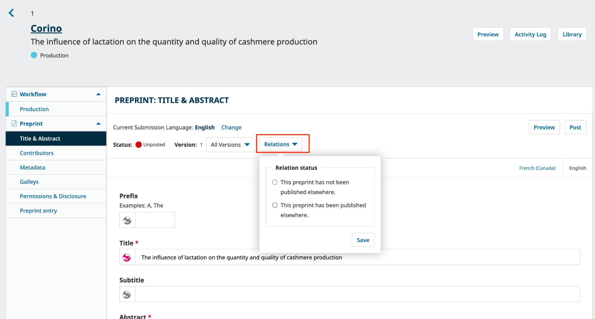
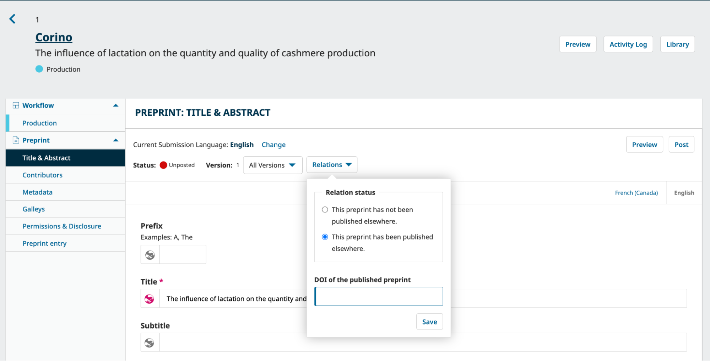
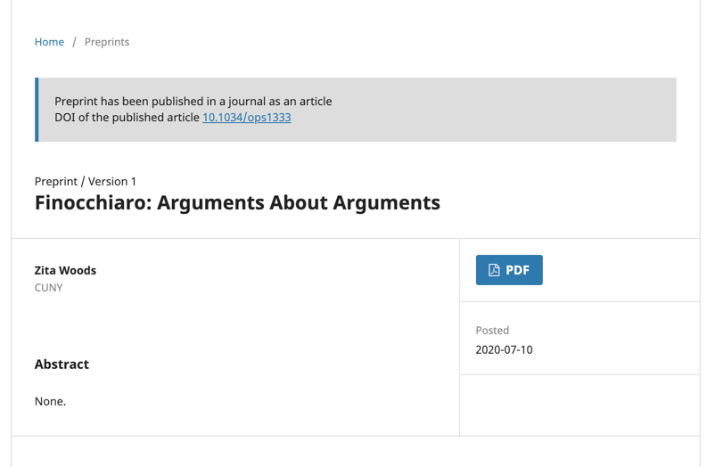
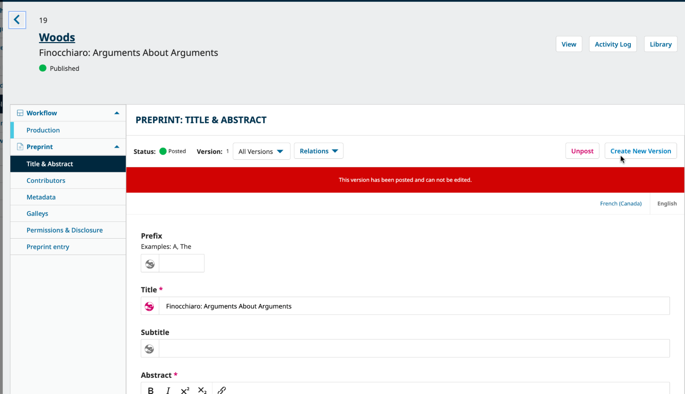
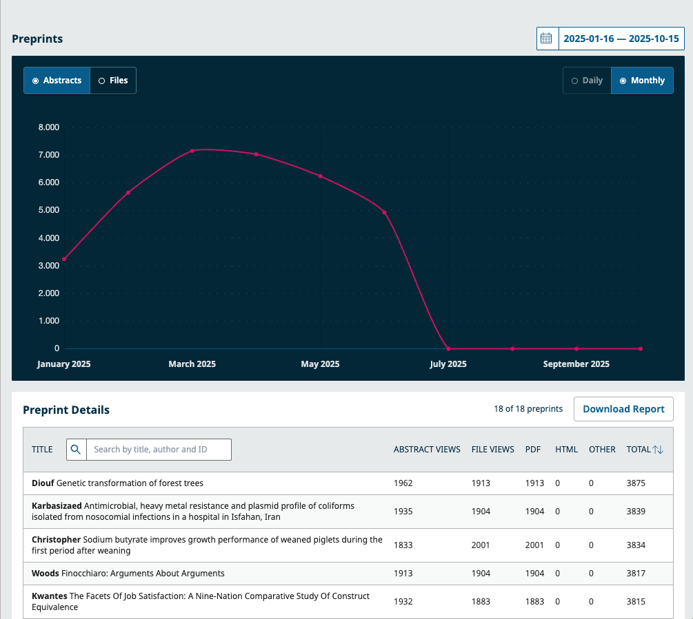
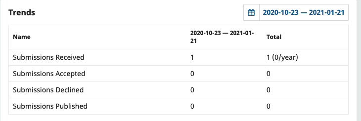
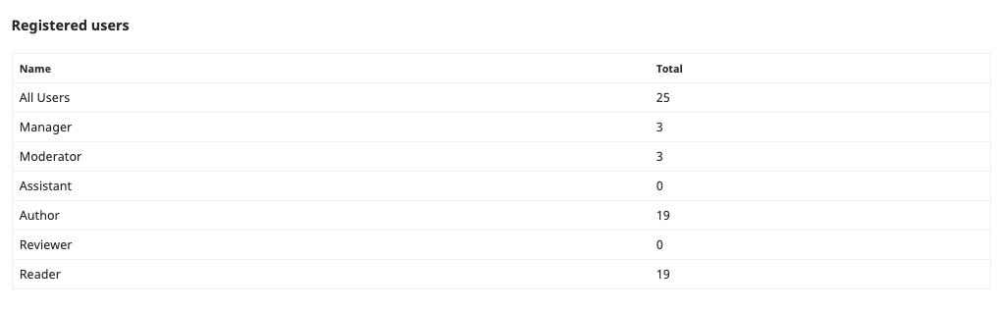

# Post-publication and Statistics {#postpublication}

Once a preprint is posted, the OPS provides tools for ongoing management and discovery. This chapter covers key post-publication actions, including updating a preprint relation status and uploading new versions, tracking statistics, and navigating the server for content discovery.

In this chapter, we will explain:
* How to update a preprint relation status
* How to publish a new version of a preprint
* How to track statistics
* How to navigate and organize the server to discover posted content.

The roles involved in this stage are typically Preprint Server manager, Moderator and Authors (for changing a preprint status or uploading a new version).

## Update a preprint relation status {#relation-status}

There are two possible relations statuses for a published preprint. Access the relation status in the Preprint menu in the left sidebar menu of the submission record.  

* This preprint has not been published elsewhere.
* This preprint has been published elsewhere.

Submission statuses can be updated even after a Preprint has been posted, either by a Moderator or an Author. Additionally, once the preprint has had its Version of Record (VoR) published in a journal, the DOI assigned to the published preprint can be added by going to the “Relations” button and selecting the last option, that will show a text box in which the user should add the VoR’s DOI link.

Once a DOI has been entered, it will appear publicly on the Preprint abstract page.

## Publish New Versions {#new-versions}

Versioning is an important feature of preprint servers because it allows researchers to correct, expand, and improve their articles over time. Since preprints can change significantly between versions, it is important to post and clearly identify all versions of a preprint. OPS allows you to post different versions of an article and display all of the versions on the posted article page.

By default, only Server Managers can create new versions of a posted preprint. 

The ‘Create New Version’ button is available next to the ‘Unpublish’ button:

> It’s important to note that, once a new version is created, it is not possible to delete it. OPS allows the user to unpublish a version and create new ones, but not to delete an existing record. Note that an unpublished version of a preprint is only visible to the Server Managers and Authors.
{:.warning}

Click ‘Create New Version’ to create new versions of a posted preprint. A pop-up will open and ask if you are sure you’d like to create a new version. 

Only once a new version is created by the Server Manager the author is allowed to edit it and add/edit metadata and galleys when they have permission to do so (for more information on this, please refer to the “Users & Roles” section of this guide).

Please keep in mind that metadata that accurately and unambiguously describes the relationships between different versions should be maintained as it’s useful for helping indexing servers and reference managers deduplicate records and point readers to new versions when available.

The Server Manager can view all past and current versions of a preprint in the ‘All Versions’ drop-down button, which becomes available next to the ‘Relations’ button and the preprint Status. 

For more information on versioning and editing a posted preprint, check the [Use Versioning for Substantial Changes to Published Content section of Learning OJS](https://docs.pkp.sfu.ca/learning-ojs/editorial-workflow/en/publication#versioning).

It is currently not possible to withdraw a posted preprint. There are ongoing discussions to integrate an option for this for future release. In this case, it’s recommended that the Preprint Manager replace the existing PDF with a “placeholder” PDF indicating that it has been withdrawn and the reason.

In the future, it should be possible for authors to submit their posted preprints for publication in a journal via OPS using the SWORD protocol.

## View Your Statistics {#stats}

Statistics allow you to track activity related to preprints and the preprint server, including editorial activity and reader access. 

### Preprint Activity {#preprints}

Under the Statistics menu item, The Preprints section provides a visual display as well as a table format of preprint activity. The visual graphic can be changed from Monthly or Daily view. While the table format will allow you to filter the Total in ascending or descending order. As well as changed to view Abstract and File activity.

There are also a number of filters that can be used including date range and section. The search bar under Preprint Details can be used to search for the activity of a specific preprint manuscript.

Click in the ‘Download Report’ button to download a CSV/Excel spreadsheet with usage statistics for preprints matching the following parameters:
* Preprints: The number of abstract views and file downloads for each preprint.
* Files: The number of downloads for each file.
* Timeline: The number of views for each day.

#### Geographical and Institutional Statistics {#stats-geographical}

When Geographical and Institutional Statistics have been enabled (see the [Administrator’s Guide for details](https://docs.pkp.sfu.ca/admin-guide/en/statistics)), OPS can collect data about readers’ locations and institutions for statistical reporting. To access these reports, click “Download Report” and choose the report you wish to access.

### Editorial Activity Statistics {#stats-editorial}

The Editorial activity statistics provides a visual graph and trend table with a summary of the editorial activity for your Server. This can be filtered for a specific date range.

### Users {#stats-users}

Provides a summary of the number of users registered to your server and their roles.

### Reports {#stats-reports}

The Reports page provides access to a variety of reports from your preprint server. The list may be expanded by installing additional plugins. For information, see [the relevant section in Learning OJS](https://docs.pkp.sfu.ca/learning-ojs/

