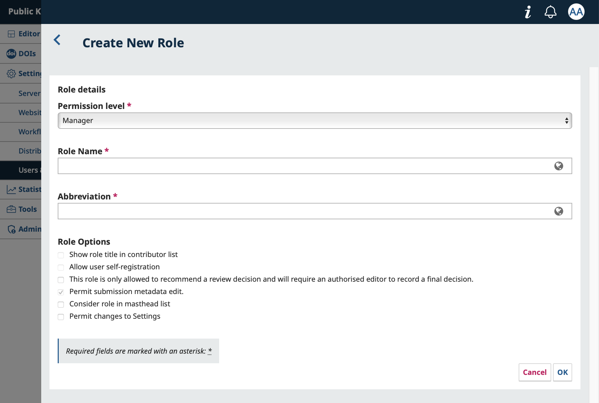
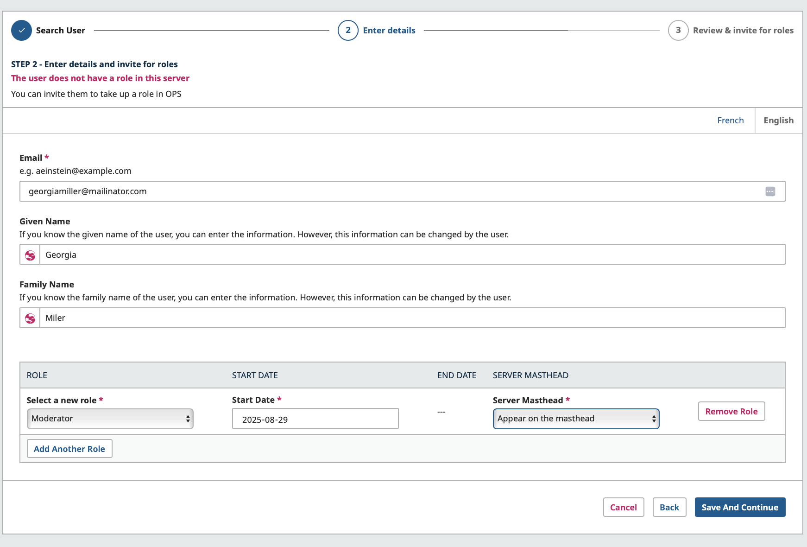
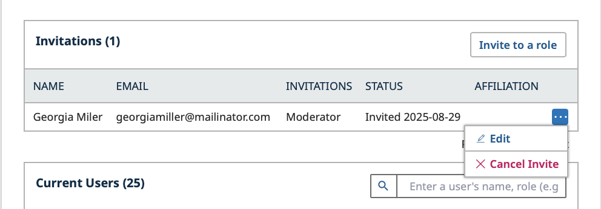
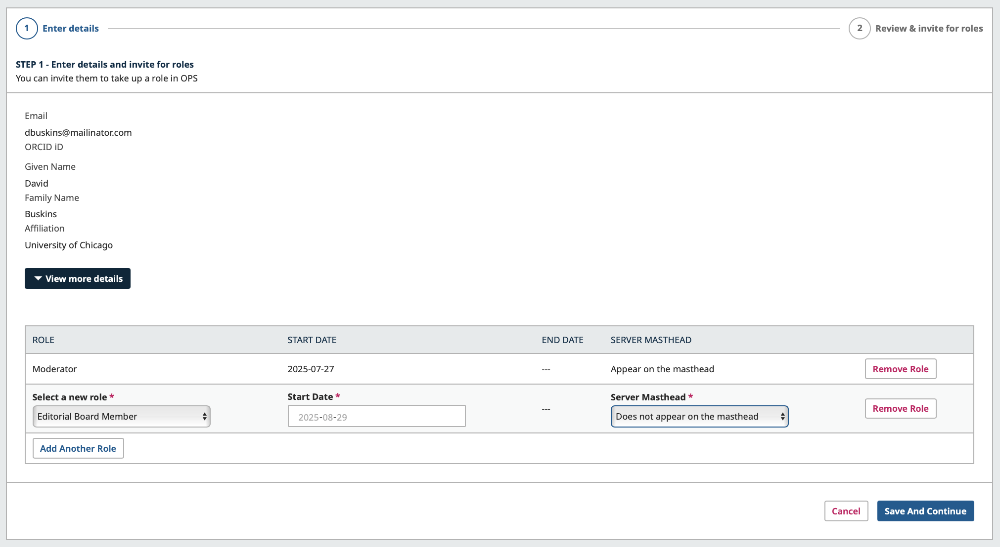
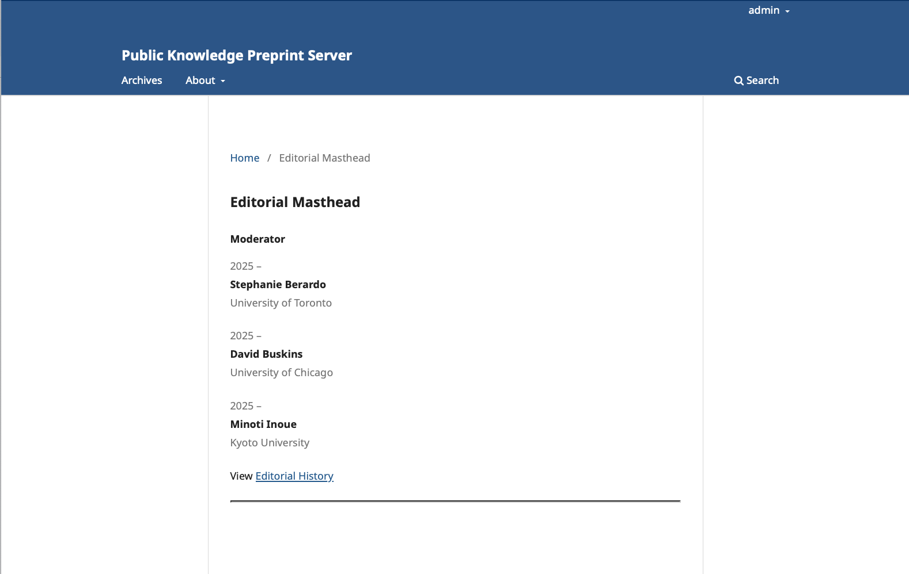

# Users and Roles

OPS has 4 default roles that will be explained in more detail below. Users have the option of creating additional roles using the Create New Role function.

## Preprint Server Manager

The Preprint Server Manager is responsible for setting up the server web site, configuring the system options, and managing the user accounts. This does not involve any advanced technical skills, but entails filling out web-based forms and uploading files.

The Preprint Server Manager also has the ability to enroll other users within the Server.

The Preprint Server Manager also has access to the Servers’ other management features, and can create new Sections for the Server, edit the default Emails, view statistics and reports, import and export data, and access the editorial workflow and all submissions.

## Moderator

The Moderator reviews and accepts or declines submissions assigned to them. May also correspond with authors and/or other moderators through the system and edit submissions prior to posting. They have the ability to record decisions as well as to schedule and finalize the metadata for posting.

## Author

Authors are able to submit manuscripts to the Server directly through the Server’s website. The Author is asked to upload submission files and to provide metadata or indexing information (the metadata improves the search capacity for research online and for the journal). The Author can upload multiple files, in the form of data sets, research instruments, or source texts that will enrich the item, as well as contribute to more open and robust forms of research and scholarship.

If permissions have been granted, the Author will be able to provide updates and make changes to the metadata provided during the submission.

## Reader

The Reader role is the simplest role in OPS, and has the fewest capabilities. They will be able to access and read content if the Server provides online access to content in the distribution settings.

## Edit or Add a Role
From the Roles tab, you can grant or remove access to the Production stage by checking or unchecking the relevant stage.

You can create new roles by clicking the “Create New Role” button, or edit an existing role by clicking the blue arrow next to a role and selecting “Edit”.

**Permission Level**: As described in the previous section, this indicates the level of permissions granted to this role.

**Role Name**: You can use this field to rename any role easily.

**Abbreviation**: Each role must have a unique abbreviation. This is used as a short identifier for participants.

**Role Options**: Configure specific options related to the role.
- Show role title in contributor lists: Users with this role will have their title included in the contributor list when making submissions.
- Allow user self-registration: Allow users to register freely for this role. Useful for allowing users register as Authors or Reviewers. Be very careful not to enable this option for roles that have access to sensitive information, such as Editors or Journal Managers.
- This role is only allowed to recommend a review decision and will require an authorised editor to record a final decision: Enable this to limit a role’s ability to make editorial decisions.
Consider role in masthead list: Select this to automatically include anyone with this role on the list of Editorial Board members.
- Permit changes to Settings: Select this to allow the role access to all journal settings and configurations.

## Invite a New User
Email configuration must be completed by a system administrator for the system to send invitation and registration confirmation emails to users. See the Administrator’s Guide for more information.

While users can self-register accounts for roles like Reader and Author (or other roles specified by you in the previous section), you can also invite users to take on new roles. This is especially useful for you to invite members of your Editorial Board to have the right permissions they need to work in your press.

From Settings > Users & Roles, click Invite to a Role.

First, you’ll be asked to search for the user. You can enter their email, username, or ORCID to ensure that they’re not already registered. If they aren’t, you’ll be prompted to invite them.

Enter their email, first and/or last name, and select the role(s) you wish to assign them. You can use the “Add Another Role” button to assign multiple roles. The user can also self-register for additional roles later from their user settings. Enter a start date for the role and choose whether it should appear on the masthead (the automatically generated page listing Editorial Masthead).

Click Save and Continue. On the final screen, you can preview and edit the email message that will be sent to the invitee.
When you are ready, click “Invite user to the role”.

You can see the status of the invitation from the Invitations list. You can edit your invitation (to add or adjust roles), or cancel your invite.

## Add and Remove Roles from a User 
Once a user has self-registered or accepted an invite, you can edit their profile to adjust their roles. Just like sending an invite, you can select a start date and choose whether the user will appear in the Server Editorial Masthead.

To edit a user:
1. Navigate to Settings > Users & Roles
2. Search for the user you wish to assign a role to under Current Users, click the three dots, and select *Edit*
3. Click Add Another Role
4. Select a new role
5. Choose a Start Date
6. Indicate whether this user should appear on the Server Masthead
7. Click Save and Continue

If a user is set to appear in the Journal Masthead, their name and affiliation will be displayed in the Editorial Masthead section.

When you remove a role from a user, the End Date will automatically be set to the current date. If you select the user to appear in the Server Masthead, their name and affiliation will be displayed in the Editorial Masthead section of the press.

The role end date will be automatically registered when the role is removed from the user.

## Manage and Track Editorial Board History/Masthead
OPS can now automatically compile a list of editorial board members, replacing the need to manually document the members of your team. Simply select which roles should be captured in the masthead and configure start and end dates for board members.

To select which roles should be captured in the masthead:
- Navigate to Users & Roles
- Find the role you want to be captured in the masthead
- Under ‘Roles Options’, make sure to enable the option: Consider role in masthead list
- Select the option to automatically include anyone with this role on the list of Editorial Board members.

You can also decide if a user will be displayed in the Masthead list when inviting a user to a role.

When inviting a user that you want to be included in the Masthead, select the option ‘Appear on the masthead’ and click save.

![Invite User screen] (./assets/ops-editorial-masthead-3.5.png)

To add an existing user to the Editorial Masthead, click in Users & Roles. Click on the three dots next to the user's name you wish to add to the Editorial Masthead and click on Edit.

Now, click Add Another Role, select a relevant role, such as Moderator, set a Start Date and indicate whether this user should appear on the journal’s Masthead. 
If a user is set to appear in the Journal Masthead, their name and affiliation will be displayed in the Editorial Masthead section.

With the Editorial Masthead feature, you are also able to remove an editorial role from a user but leave them in the editorial history.

To remove a role from the user:
- Select the user you wish to remove a role
- Click ‘Edit’
- Click ‘Remove Role’

When you remove a role from a user, the End Date will automatically be set to the current date. If you leave the option to appear in the Journal Masthead selected, the user's name, affiliation, star and end date will be displayed in the Editorial Masthead History section of the press.

When you are done, click Save and Continue.

To access your press Editorial Masthead:
- Navigate to your preprint server home page
- Hover over the ‘About’ menu
- Click in Editorial Masthead
- You can also access the previous editorial members that were added to the masthead by clicking in ‘View Editorial History’ 

## Permission to Edit Metadata

### Granting Author permissions

In OPS, the Preprint Server Manager can grant access to allow authors and Moderators to make metadata changes prior to the manuscript being posted. There are two ways editors can grant this type of access.

**Global permission**- will grant all users with the role ‘author’ and/or ‘moderators’ permission to make metadata changes.

To enable this, go to Users & Roles > Roles. Click the blue arrow beside the ‘Author’ then click edit.

Under Role Options, enable **‘Permit submission metadata edit.’** then click OK.

**Limited Permission**- will grant registered authors (typically a single author) permission to make one-time or short-term changes.To allow an author to make a change in the metadata, find their name under the participant list followed by Edit.

Under Permissions, enable **‘Allow this person to edit publication details.’** followed by OK.

Once the author has been granted access to make edits they will be able to make changes to the metadata mentioned in the box.

Authors wishing to make changes to the relations field of their submission should contact the Server Manager.

