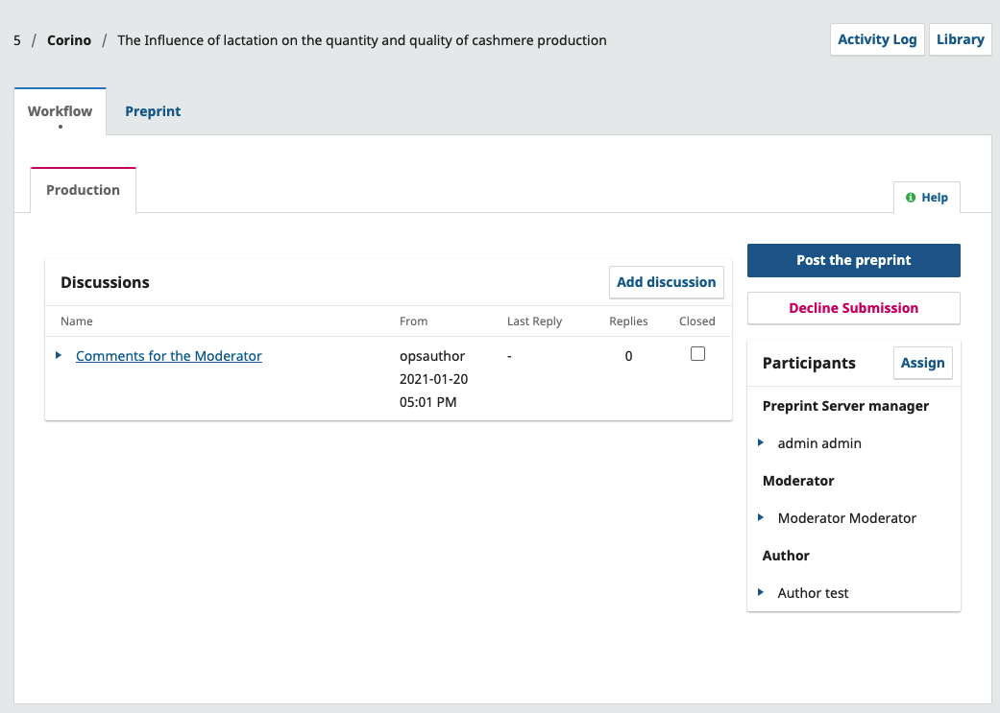
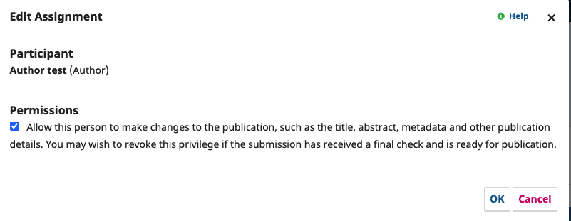
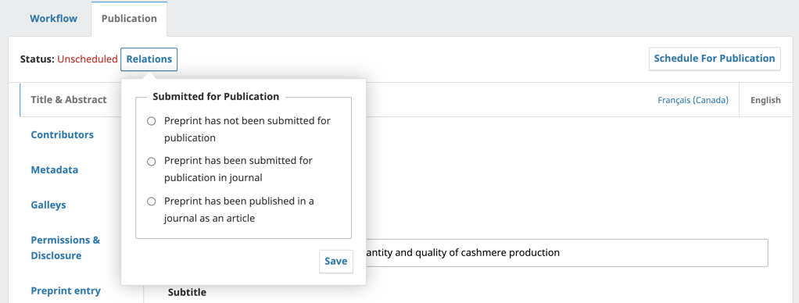

# Users and Roles

OPS has 4 default roles that will be explained in more detail below. Users have the option of creating additional roles using the Create New Role function.

## Preprint Server Manager

The Preprint Server Manager is responsible for setting up the server web site, configuring the system options, and managing the user accounts. This does not involve any advanced technical skills, but entails filling out web-based forms and uploading files.

The Preprint Server Manager also has the ability to enroll other users within the Server.

The Preprint Server Manager also has access to the Servers’ other management features, and can create new Sections for the Server, edit the default Emails, view statistics and reports, import and export data, and access the editorial workflow and all submissions.

## Moderator

The Moderator reviews and accepts or declines submissions assigned to them. May also correspond with authors and/or other moderators through the system and edit submissions prior to posting. They have the ability to record decisions as well as to schedule and finalize the metadata for posting.

## Author

Authors are able to submit manuscripts to the Server directly through the Server’s website. The Author is asked to upload submission files and to provide metadata or indexing information (the metadata improves the search capacity for research online and for the journal). The Author can upload multiple files, in the form of data sets, research instruments, or source texts that will enrich the item, as well as contribute to more open and robust forms of research and scholarship.

If permissions have been granted, the Author will be able to provide updates and make changes to the metadata provided during the submission.

## Reader

The Reader role is the simplest role in OPS, and has the fewest capabilities. They will be able to access and read content if the Server provides online access to content in the distribution settings.

## Permission to Edit Metadata

### Granting Author permissions

In OPS, the Preprint Server Manager can grant access to allow authors and Moderators to make metadata changes prior to the manuscript being posted. There are two ways editors can grant this type of access.

**Global permission**- will grant all users with the role ‘author’ and/or ‘moderators’ permission to make metadata changes.

To enable this, go to Users & Roles > Roles. Click the blue arrow beside the ‘Author’ then click edit.

Under Role Options, enable **‘Permit submission metadata edit.’** then click OK.

**Limited Permission**- will grant registered authors (typically a single author) permission to make one-time or short-term changes.To allow an author to make a change in the metadata, find their name under the participant list followed by Edit.

Under Permissions, enable **‘Allow this person to edit publication details.’** followed by OK.

Once the author has been granted access to make edits they will be able to make changes to the metadata mentioned in the box.

Authors wishing to make changes to the relations field of their submission should contact the Server Manager.

