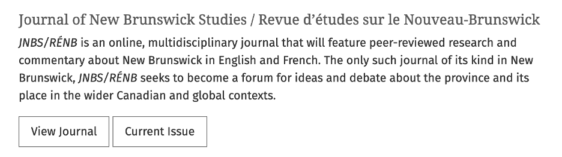
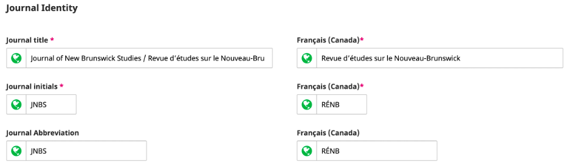

# Common Metadata Errors

This chapter highlights some common metadata errors and reasons behind metadata errors.

## Confusing metadata with style or design

The vast majority of metadata issues in OJS stem from a single problem: *a misunderstanding of the role of metadata and how OJS displays that metadata*. Often, this has to do with users trying to get the website to look a certain way at the expense of the accuracy of the metadata they've recorded. The user will add text in a certain field because they want it to be displayed in a certain way, without realizing that the text is going to be read as metadata and appear in other sources. Metadata is supposed to be descriptive, not stylistic.

For example, a publisher wants to display the credentials of an author so they put the author’s degree in the Preferred Name field. Then the author’s preferred name is read as “PhD (Agr).”

## Combining multilingual metadata in a single field

This happens frequently when multilingual journals want multilingual metadata to appear on one article page, so they combine multilingual metadata in a single field instead of using the separate fields in OJS. Let's look at a typical example in Canadian publishing that we'll also address in the [Journal Settings](./journal-metadata) section.

This is the displayed information for the Journal of New Brunswick Studies (JNBS) at the University of New Brunswick (UNB) Libraries:

JNBS is a bilingual journal. There are two discrete titles for the publication identified here, and also both English and French acronyms in their "about" information.

This journal has properly configured both languages for their journal and has created mirrored French metadata for all their title-level content. However, the concern is that the title field in English displays two languages simultaneously.

Let's take a look at the **same metadata with the UI language set to French**:

Let's take a look at the title-level settings of the journal:

Although OJS supports both English and French, the application of bilingual titles in JNBS highlights a few common problems. The journal has bilingual metadata, but, because the editors want to make its bilingual identity more explicit, they have put both languages in the English field. This is understandable! New Brunswick is a bilingual province, and the journal wants that identity to be upfront.

The issue arises when we look at a citation generated in English:

> Metallic, N. (2020). New Brunswick Needs a Public Inquiry Into Systemic Racism in the Justice System: Nova Scotia Shows Why. Journal of New Brunswick Studies / Revue d’études Sur Le Nouveau-Brunswick, 12, 1–8. Retrieved from https://journals.lib.unb.ca/index.php/JNBS/article/view/31271

Now, let's look at the French citation:

> Metallic, N. (2020). New Brunswick Needs a Public Inquiry Into Systemic Racism in the Justice System: Nova Scotia Shows Why. Revue d’études Sur Le Nouveau-Brunswick, 12, 1–8. Consulté à l’adresse https://journals.lib.unb.ca/index.php/JNBS/article/view/31271

These citations are not only different, they also don't accurately reflect the journal information associated with [its ISSN](https://portal.issn.org/resource/ISSN/2369-6591):

> **Title proper: Journal of New Brunswick studies.** 
  **Parallel title: Revue d'études sur le Nouveau-Brunswick** 
  Other variant title: JNBS 
  Other variant title: RÉNB 
  Original alphabet of title: Basic roman 
  Subject: Dewey : 971.5/1005 
  Subject: General history 
  Publisher: Fredericton NB: [University of New Brunswick], [2010]- 
  Dates of publication: 2010- 9999 
  Description: Began with: Vol 1 (2010). 
  Frequency: Annual 
  Language: English 
  Language (other): English French 
  Country: Canada 
  Medium: Online 
  Indexed by: ROAD

Small variations in publication title might not seem like a problem, but inconsistent citations will make it harder to track metrics and citation data for authors and the journal. Search engine indexing may be less consistent. If that metadata is propagated by DOIs or otherwise absorbed into the open infrastructure of academic publishing, it will provide inaccurate information much more broadly.

### Potential Solutions for multilingual metadata

OJS is both customizable and easily styled, even by journals with limited resources. *The Journal of New Brunswick Studies* can (and does) use a custom header image to represent its bilingual identity.

An image can display both French and English titles without abusing the journal's title-metadata field.

Many of the ways in which users abuse metadata to make their website look a certain way are addressable via custom themes or design work. **Accurate metadata should come first. If you need your metadata to be styled differently on your website, you should customize the way OJS *displays* that metadata**. It is also worth noting that OJS saves language information for registered users of a journal, so French users can have the site default to French if they wish.

PKP maintains two critical documents on customizing the look of OJS. For design-specific solutions, you can view the [Designing Your Journal](/designing-your-journal/en/) guide. For situations where you may want to display hidden metadata or simultaneously display two locales (i.e. languages), you'll need to modify your theme templates. You can learn more about modifying your theme templates with the [PKP Theming Guide](/pkp-theming-guide/en/).

## Inconsistent metadata in different sources

Indexing services, such as Google Scholar, will often read metadata from multiple sources in the journal and reject content if the metadata in different sources is inconsistent.

### Publication year in the article and issue

It is recommended that the publication year in an article record and the issue that it is published in are the same. An issue publication date is assigned automatically in OJS when you publish an issue. A year can also be entered manually as part of the issue identification information if you have selected Year as an identification element to include. The article’s publication date is set automatically when the issue is published or you can manually enter a date in the article’s submission record under the Publication tab and Issue metadata. A manual date should only be entered if the article was published previously.

### Article and PDF file

If you publish your full-text articles as PDF files, the PDF files will usually contain metadata about the article, such as article title, authors, and publication date. The metadata on the PDF file should match the metadata in the article record in OJS exactly, including capitalization and spelling.

If you publish full text articles in other formats, ensure that the metadata is consistent in all of these files.

## Unknown or misfit metadata

Not all problems with OJS metadata are due to a style-centric approach to the platform. Sometimes OJS does not have options for the metadata you wish to enter. For example, OJS didn't always have a single string field for "Preferred Public Name." Often, users with just a single-word, legal name couldn't submit forms without faking metadata. OJS also requires email addresses for submissions, but many users have discovered that not all authors have (or had) email addresses, requiring journal managers or editors to fake one to get past a submission screen.

Situations like these can be confusing for the user. When users are unsure where to put information that, to them, is essential, they will make do. **It is important to always review author-entered metadata thoroughly**.

A good **general practice** is to think about the downstream effect of bad, false, or otherwise improvised metadata. How will your citations appear in a publication? How will your journal appear in an ORCID[^1] record? How will your metadata appear in a library catalogue?

All OJS users are welcome to provide feedback on the [PKP Support](https://forum.pkp.sfu.ca/) Forum when conflicts between display needs and accurate metadata arise so that PKP can address these issues in the software.

*Please note that all screen captures and instructions provided in the following sections are for OJS version 3.2, and that the sections are ordered in the way that a user would encounter these settings in OJS, not by priority.*

[^1]: An ORCID iD is a unique, persistent identifier for researchers and contributors that distinguishes them from every other researcher or contributor across disciplines, borders, and time.
