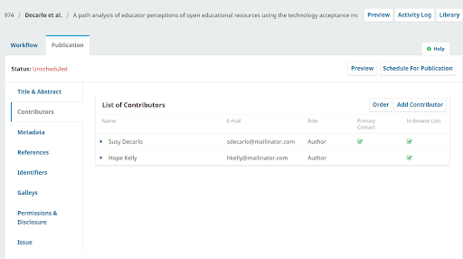
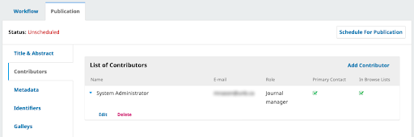
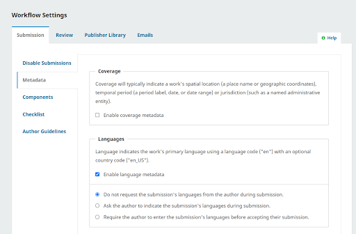

# Issue and Article Metadata

Issue and article metadata is part of each individual issue and article you publish and includes things like issue volume, issue year, article title, contributor names, date of publication, and keywords. Because a journal publishes many different issues and articles and there are often different users creating this metadata, there are many opportunities for mistakes. Additionally, **every academic discipline has its own culture of publishing**, replete with specific styles, habits, patterns, and preferences. These often make their way (sometimes inappropriately) into metadata. This chapter details best practices for issue and article metadata and how to avoid common errors.

## Issue-level Metadata

OJS has the following fields for issue-level metadata:

* Date Published
* Identification
  * Volume
  * Number
  * Year
  * Title
* Description

These are all enabled by default at the issue-level and in the **Archives** listing that shows all published issues. But it is possible to select which of these metadata fields display on an issue-by-issue basis.

To find your issue-level settings:

1. Go to **Issues** on the dashboard sidebar.
2. Click **Future Issues / Back Issues** depending on which you're editing.
3. Click **the toggle arrow** next to the issue you want to edit.
4. Click **Edit** on the expanded menu below the issue.
5. Click the **Issue Data tab** on the top menu.

You will see some metadata fields here and, below them, a checkbox next to volume, number, year, and title. These checkboxes determine whether or not the entered metadata will display on the site view. However, it is worth noting that the metadata within these fields will be available via OAI or metadata export regardless of display choice, so your issue metadata must still be accurate.

## Issue Title

The intention for the Issue Title field in OJS is as a "special issue title" or as something aside from existing volume, number and year metadata. Easily, the most common metadata problem with issue metadata is a misunderstanding about the purpose of the "issue-title" field. Users sometimes turn off the display for the volume, number, and year fields in order to write out the issue information as a single string. For example, instead of "**Vol. 56 No. 2 (2020)**" (the OJS default rendering), they'll write in something like "**Volume 56, Number II, Spring 2020**". Users do this sort of write-in title for all kinds of reasons, for example:

* Users may want to display their volume and issue numbers in Roman numerals (or whatever unique characters they used in print)
* Users want to use “Volume” and “Number” instead of “Vol.” and “No.” (the OJS standard display)

The downside is that in the harvested/indexed metadata, this article will now show the following: **Vol. 56 No. 2 (2020): Volume 56, Number II, Spring 2020**.

The one exception to this is season (ex: Spring, Fall), since there is no specific field for this within OJS currently. If you need to write in your seasonal metadata at the moment, the best way to do so is to enable display for all issue metadata fields and simply write your seasonal metadata in the "title" field by itself. Ultimately, this may result in a less than ideal display (**Vol. 56 No. 2 (2020): Spring**), but it will at least ensure you are not duplicating your issue-level metadata.

Additionally, some of these issues could be solved by editing OJS templates, but many of OJS hosting providers (in particular, multi-site OJS instances hosted at universities) are likely to shy away from template edits to solve unique display issues.

## Description

Similarly, it's not terribly uncommon for users to put custom content in the "issue description" field. This is less problematic, but generally discouraged.

The description field displays above the issue’s table of contents. It may seem a convenient way to highlight certain points, such as an editorial or an announcement about an upcoming issue. However, indexing or harvesting organizations may end up pulling unintended content from your issue metadata. Issue descriptions should be used to describe the current issue. For example, a special issue festschrift with a thematic title might include the description “Essays in honour of…”

### Dos and Don'ts

* Do
  * Fill out volume, number, and year metadata.
  * Use Issue-Title specifically for special issue titles.
* Don't
  * Re-write issue metadata in the Issue-Title field for display purposes.
  * Put content that doesn’t describe the issue in the "issue description" field.

## Article-level Metadata

Article-level metadata is created by authors when they make a submission and further enhanced by editors through the publication workflow. It is stored and can be edited in the **Publication** tab for each submission.



Article-level metadata in OJS is the most likely to be problematic in one way or another for a lot of reasons. The two most important are: 1) because you have more articles than you do issues; and, 2) because a huge portion of the metadata is actually **dependent on authors**, over whom you have varying control and who have varying degrees of technical literacy.

While you can bake a lot of requirements into your submission guidelines, we know that it doesn't mean all authors will follow those guidelines. Much of this work is incumbent on editors or other journal staff who are often volunteers or under-resourced.

This section will aim to break down the most essential metadata for articles and some general rules that will help.

### Ground Rules

**Consistency is key.** You may have some "house rules" or stylistic guidelines for your journal and the way that metadata is recorded. For example, it's not uncommon in the sciences to record names as initials and a last name instead of full names. Ideally, you'd record all metadata in full, but the most important thing is that your metadata should be consistent across your publication. If you have published many works from Robert Jones, you should make sure they all say R. Jones. They shouldn't rotate between R. Jones, R.B. Jones, Bob Jones, Rob Jones, and Robert B. Jones.

This is not just true for names. For example, titles should follow consistent capitalization conventions, though these may vary according to language. Try to keep your metadata "styles" as consistent as possible and in accordance with whatever citation style you use. We'll address some more specific examples further along.

**Metadata should be the same everywhere.** Anywhere a piece of metadata appears, it should be the same as every other place that it is recorded. For example, the title of an article should be exactly the same in its published PDF galley and in the metadata recorded in OJS. (Keep in mind that typically these were provided by the author at the time of submission. The title may have changed during the peer review process.) Depending on how you publish, that title might also be in a PDF of an issue’s table of contents. ***No matter how many places the title appears, it should always be the same to avoid confusion.*** The same applies to author names and affiliations. (This rule applies to Journal-Level and Issue-Level metadata as well, but as previously mentioned, the plethora of Article-Level metadata makes this a particular challenge.)

**Try to avoid directly pasting text copied from Microsoft Word.** It's common practice by authors to copy and paste an abstract from, say, Microsoft Word or some other application with embedded formatting. A pasted chunk of text might have hidden line breaks that are problematic downstream for metadata use. As an example, we'll use this paragraph:

> "Additionally, it's common for an abstract to have been pasted in<br>
> by an author from, say, Microsoft Word or some other platform<br>
> with embedded formatting. A pasted chunk of text might have<br>
> hidden soft returns that are problematic downstream for<br>
> metadata use."

In an XML export, this text would look like this:

```xml
<abstract>Additionally, it's common for an abstract to have been pasted inby an author from, say, Microsoft Word or some other platformwith embedded formatting. A pasted chunk of text might havehidden soft returns that are problematic downstream formetadata use.</abstract>
```

As you can see, the words separated by line breaks have run together.

There are a number of ways to clear formatting. In Windows you can first paste your text into Notepad to strip formatting. On a Mac you can paste without formatting by using Option+Command+Shift+V (you will never paste a different way again).

**Do not accessorize your metadata.** Name fields should only contain names. Titles should only contain titles. You may have a colleague who really wishes that DOIs were on the table of contents and decides to put them in subtitle fields. That will, for sure, put the DOIs on the table of contents, but it will also break all of your subtitle metadata because this is not where this information is supposed to go. It is always recommended to fill out metadata fields (no matter how little you might use them) with only what is asked.

**One language per field.** As we've addressed already in this document, if you have any multilingual metadata in your journal you should make sure that it lives in its own language-specific form. Check to make sure that, in the Languages settings, you've enabled all forms for submission-appropriate languages. Make sure to review author-entered metadata in all configured languages before publishing.

**All-caps titles/metadata are stylistic and can be implemented with a custom theme. You shouldn't yell metadata.** In some disciplines it is common, stylistically, to write article titles in all caps. This is both unnecessary and frustrating for everyone else who has to change this metadata in their reference lists in Zotero or publication records in ORCID or any other number of places. You can make text display in OJS however you want, such as in all caps, with a custom theme. See also the [PKP Theming Guide](/pkp-theming-guide/en/). (At the very least, if you are publishing your titles in all caps, do it consistently.)

OJS **does not currently support italics or other HTML styling in titles**, although it is a common practice for journals that publish articles about a work (such as a work of literature) and wish to include the title of the work in italics in the title of the article.

Now that we’ve covered those ground rules, we can look at the individual elements of article-level metadata, which can be accessed by selecting a submission, clicking View **Submission** and then opening the **Publication** tab.

### Title & Abstract

**Prefix:** A field for what librarians and developers refer to as "stop words". If an article title starts with "A" or "The," (or “Le,” “La,” “L’,” “Un” or “Une” in French) and you don't want an alphabetical list of the journal’s articles to show a long list of publications starting with "The" or "Le", put those words in the prefix field.

**Title & Subtitle:** The title and subtitle of your article. OJS used to only have a single title field but now has the option to break your metadata across two fields. Please note, if you use both the Title and Subtitle fields, do not include a colon after your Title. OJS will automatically insert that colon where needed. It doesn't really matter if you use just one title field or all three (Title, Subtitle, and Prefix , so long as you populate these fields consistently across your journal.

**Abstract:** The abstract of your article. If there isn't an abstract associated with your article, please make sure this field is empty. If you have multiple abstracts in different languages, please make sure to insert those translations into the fields for other languages. Do not put multiple languages in one abstract field. If you consistently see placeholder text in abstract fields, select “Do not require abstracts” in your **Sections Settings**. Additionally, there is no need to place the words "Abstract" or "Résumé” in your abstract metadata. OJS will display these automatically as part of the user interface.

### Contributors

Contributor information is one of the most common places that metadata errors arise. Since OJS pulls initial contributor metadata from the author’s user profile during submission, the author might not review it before publication. It is also easy to overlook from an editorial standpoint. Before you publish an article, make sure to review author information.

In OJS 3.2, you can find the contributors list for a submission by navigating to **Publication** and selecting **Contributors**. You can edit a record by clicking the small expansion arrow next to a name and clicking **Edit**.



**Name(s):** As of OJS 3.2, the only required name field in a publication is the Given Name field. Not all cultures use the same Given-Name Family-Name format familiar to many Western countries. There is no longer a middle name field in OJS metadata. Users who wish to be addressed in a specific way unmet by Given-Name Family-Name should put that preferred name in the *Preferred Public Name* field. This field should contain only the person's name as they prefer to be addressed. Additional personal details (such as the person's preferred pronouns or post-nominal letters) should be added to the author's bio statement.

It is important that you include author naming conventions in your submission guidelines. OJS 3.2 allows for a "preferred public name" field that, really, should not be altered by editors in terms of style or contents. If there are stylistic concerns for display consistency, editors should review or discuss these issues with the authors directly. You do not want to assume anything about the identities of your submitting authors by altering their name without their permission.

**It is important to review name metadata** because the name may have been submitted differently in a prior publication in your journal. For example, imagine I am the primary author for a submission. My name in submission metadata will be automatically populated with the information in my user profile in the journal’s OJS. But, for my co-authors (who may or may not also have user profiles in this journal), I might enter a name that does not match what appears in their profile. It is always best to review.

**Email:** There is no more contentious issue! OJS was designed to be used as a submission system and submissions were designed to be associated with user profiles and accounts, so email is a required field. But, not all authors on a submission will have an email address.

It's possible that editors may enter a submission *on behalf of an author*. It's also possible for editors to submit back-issue content written by individuals who died well before the ubiquity of email. **So, what do we do about email addresses we don't have?**

The long and the short of it is that it doesn't matter as long as you do it consistently. One recommendation is to use the domain @example.com. This domain doesn't resolve and is commonly used for user testing or demonstration. The email address none@example.com for all unknown or inappropriate email situations will make it easily spottable in the future, and it won't do any harm in the short term until such a time as OJS does not require email addresses as metadata.

**Affiliation:** Depending on whether an author submitted the work themselves or it was submitted for them (say, by a co-author, or the journal’s editor), you may see anything from way too much information to no information at all.

Before publishing, you should always review affiliation information in every article and make sure that the affiliation(s) used in the article’s published galley(s) (ex: PDF) match(es) the affiliation(s) in the metadata. Author affiliation is a required metadata for journals participating in Coalition Publica.

**Country & User Details:** These fields are less vital but, as always, try to keep these consistent and use multilingual features where needed. ORCID iD, for journals that have configured the plugin, in particular, will be useful for authors if they've provided it. They'll be appreciative when your clean metadata ends up automatically in their publication records.

**Order of authors and contributors:** The order of author and contributor names should be the same in the article metadata and on the published galley files.

### Other Article Metadata

**Identifiers:** This is where DOIs are assigned. This tab will only appear if the journal is configured to assign DOIs within OJS. Just a note in general that DOIs do not need to be (and are actively discouraged from being) human readable. They are not custom URLs.

**Permissions & Disclosure:** This is the section for copyright and license statements for a given article. It will be pre-populated with whatever the author choses on submission but please review it before publication. Copyright holder, year, and license URL are all passed along as metadata.

**Issue:** This is where you assign an article to an issue and provide **pagination**. You should include page numbers, in the format "*firstpage-lastpage*". Page number metadata is especially important when used in automatically generated citations.

In some of the most-used citation styles/standards, the pagination is a required metadata field for research articles. It's not uncommon for pagination to change throughout the publishing process so please review before publication. Additionally, make sure that the article is slated for the proper journal section. You can edit your URL path, but it is not recommended unless you're quite sure what you're doing.

**Keywords:** Keywords are typically one- to three-word phrases that are used to indicate the main topics of a submission. ***It is important to avoid entering keywords as a single block of text. Add a new keyword for each individual term/phrase***. Pressing "enter" after each keyword will separate them.

**References:** This field allows you to list a submission's references in a separate field and publish the references as metadata, which can then be indexed and harvested. This may be required to comply with citation-tracking services such as Crossref. For journals participating in Coalition Publica, Érudit recommends that references are added to an article’s metadata according to the following guidelines, and this can be followed as a general best practice:

* Only include references found at the end of the article, i.e. the bibliography or the list of works cited. Do not include endnotes or footnotes. If the article does not have a bibliography, do not include any reference metadata.
* The references in the article’s PDF and metadata should match. Update them if they have changed since the original submission.
* Separate each reference on its own line.
* Do not include any text other than the references themselves, such as the subtitle “Bibliography.”
* Format references as plain text. Do not include HTML or XML formatting tags, such as italics (`<i></i>`).
* Do not format the references in the form of a list, for example, with numbers or bullet points preceding each reference.
* When several works by the same author are cited, do not replace the author's name with a dash. All references must contain the name of the author.
* Regardless of the citation style used (MLA, APA, Chicago, etc.), all references must be complete, containing the characteristic elements that allow the identification of the works cited.

You can ask authors to add their references to the References field when they make a submission, or you can have editors add the references to the References field at the Production stage.

### Additional/Optional Metadata

There are a few additional options for article-level metadata you can add. You can configure which additional fields you include in your journal and whether that metadata will be collected during the submissions process (optional or required), or only added by an editor later. These metadata elements can be added and configured under **Workflow Settings > Submission > Metadata**.



If you ask authors to submit metadata, you will have to pay careful attention and update or correct it as necessary during review, copyediting, and production. Alternatively, you can restrict the fields available during submission and have editors add the metadata during the production process. This option requires more effort by the journal team but can simplify the submission process and reduce metadata errors.

You may add the following Dublin Core metadata items:

* **Coverage:** Coverage refers to the extent or scope of the topic of the article, and will typically indicate a spatial location (a place name or geographic coordinates), temporal period (a period label, date, or date range) or jurisdiction (such as a named administrative entity).
* **Languages:** A single- stringed, plain-text field for additional language metadata not covered in the submission process.
* **Rights:** Any rights held over the submission, which may include Intellectual Property Rights (IPR), Copyright, and various Property Rights.
* **Source:** The source may be an ID, such as a DOI, of another work or resource from which the submission is derived.
* **Subjects:** Subjects will be keywords, key phrases or classification codes that describe a topic of the submission. ***These are, however, distinct from Keywords proper and should be used for things like cataloguing, not general description.***
* **Type:** The nature or genre of the main content of the submission. The type is usually "Text", but may also be "Dataset", "Image" or any of the [Dublin Core types](https://www.dublincore.org/specifications/dublin-core/dcmi-terms/).
  * For Coalition Publica journals, however, it is recommended to use the types suggested by [JATS](https://jats.nlm.nih.gov/publishing/tag-library/1.2d2/attribute/article-type.html). **The “research-article” type should be reserved only for articles that pass through a peer review process.**
* **Disciplines:** Disciplines are types of study or branches of knowledge as described by university faculties and learned societies.
* **Supporting Agencies:** Supporting agencies may indicate the source of research funding or other institutional support that facilitated the research.
* **Publisher ID:** The publisher ID may be used to record the ID from an external database. For example, items exported for deposit to PubMed may include the publisher ID. This should not be used for DOIs.

These fields can be disabled, made optional for authors on submission, or required for authors on submission. Most of these are quite granular and are only recommended if there is sufficient time to vet metadata.

It is highly recommended to keep these options as simple as you need for your journal. The more information that unsure users have to populate, the more likely it is they will fill things out with filler or inaccurate information.

## Further Resources

To learn more about metadata and OJS, you can consult the following resources:

* [Google Scholar Indexing guide](/google-scholar/)
* [DOAJ Application Guide](/doaj/)
* [Crossref Curriculum - Descriptive Metadata](https://www.crossref.org/education/content-registration/descriptive-metadata/)
