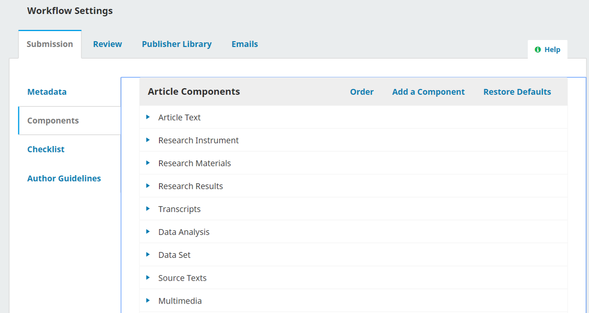
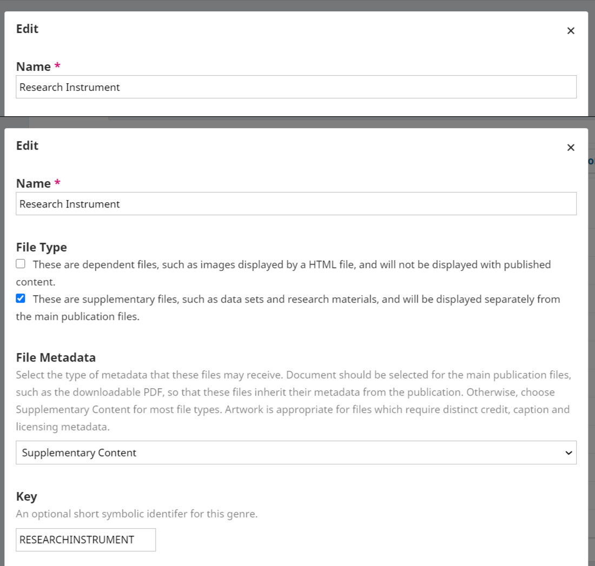

# Components

Components are used to organize and define the various files related to a submission within the system and establish where and how they should be shown to readers, if at all. For example, the article manuscript itself will be one component, while datasets, transcripts, images, etc.,  are included as separate supplementary or dependent components. In general, journals publishing only PDFs or other standalone files that don't include supplemental or embedded information will not need to make changes to component types. Components will be primarily of interest to those with complex submissions with multiple accompanying files, such as journals publishing in HTML, with datasets, etc.

Using the links in the Article Components screen, you can change the order of the components (how they will be listed to the submitting author), Add a Component (if something you need is not included by default(e.g. Video), or Restore the Defaults (if someone has made too many modifications and you just want to reset everything).

## Edit Component

You can edit each component by selecting the blue arrow to the left of the component name. This will reveal an Edit link and a Delete link.

**Please exercise caution when deleting components!** If a component is deleted, all files currently labeled with that component type will be hidden and will not be viewable until they are assigned a new component type. Unintended deletion of a common component can seriously affect your journal content, and in some cases is not feasible if the component has already been used in a prior submission.

-   Name: This is the name of the component, as presented to the author.
-   File Type: Choose how the files associated with this component will be treated and displayed. Understanding the file type and how it affects the display of a file is very important for journals using XML or HTML galleys and other multimedia formats.
-   Dependent: the link will not appear with published content at all (e.g. images and figures embedded in HTML or XML galleys, HTML stylesheets, etc.)
-   Supplementary: The link will appear on the article landing page (e.g. datasets, transcripts, etc.)
-   Neither supplementary nor dependent: The link will appear on both the article landing page and in the table of contents (e.g. main publication files - PDFs, HTML and XML galleys, etc.)
-   File Metadata: Select the type of metadata that these files may receive. "Document" should be selected for the main publication files, such as the downloadable PDF, so that these files inherit their metadata from the publication. Otherwise, choose - "Supplementary Content" for most file types. "Artwork" is appropriate for files which require distinct credit, caption and licensing metadata.
    \
-   Key: Optional short symbol for the component. This extra identifier is used in the backend of OJS and can be helpful for technical staff recovering inadvertently deleted components.

For an in-depth overview of how to manage components within OJS, [please consult the Learning OJS guide section on components.](https://docs.pkp.sfu.ca/learning-ojs/journal-managers/en/policies#components)
