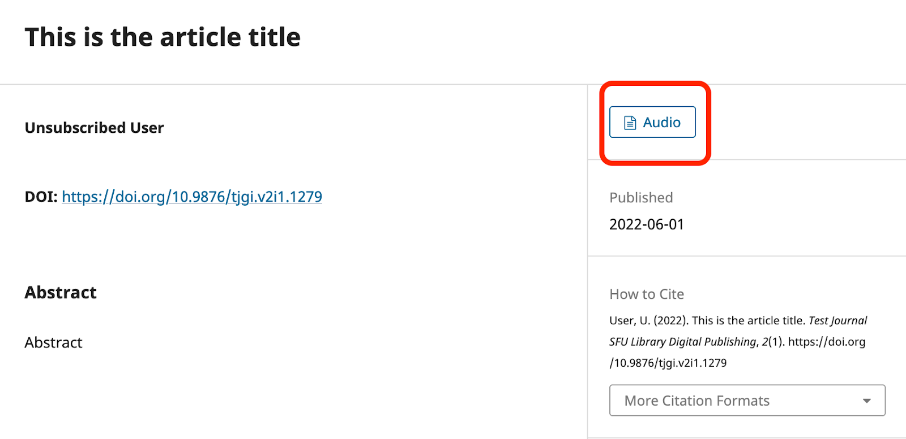
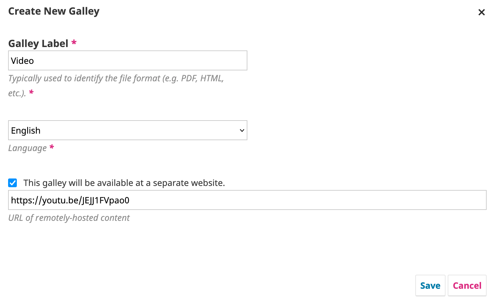

# Multimodal content in OJS

Decisions about where and how to host your multimedia content will directly impact how the content displays on the article page and is made available to users, so choose carefully. There are several common scenarios that occur in OJS, that are explored in the section below.

Prior to embarking on creating multimodal content, Users also should be familiar with how [galley files operate within OJS](https://docs.pkp.sfu.ca/learning-ojs/en/production-publication#prepare-and-add-galley-files).You can also consult with the [Learning OJS guide](https://docs.pkp.sfu.ca/learning-ojs/)  [Linking to Preparing and Adding Galley files](https://docs.pkp.sfu.ca/learning-ojs/editorial-workflow/en/production)

## Multimodal galleries as standalone galleys

### Uploading a multimedia file directly as its own galley

In some instances, entire galleys may serve as their own standalone representation of an article, for example, there might be an audio file that is an audio representation of an entire article (rather than a piece of supplementary audio embedded within a larger article).

It is possible to upload a multimedia file (JPEG, MP3, MP4, etc) directly as its own galley file and label the galley with the content type. This will give users the option to click on a button to open the file directly. Depending on the nature of the file, it may or may not be rendered within the browser.. For example, clicking on the file will prompt the user to open it in a media viewer installed on their device, and the behaviour may be different, depending on the user's browser and/or operating system configurations, so it may be a good idea to test your content with different browser and/or operating systems. In cases such as this, the use of multimodal galleys may present a barrier for users who may not be able to see the content at all if they do not have the appropriate media viewer installed, or alternative formats or instructions are not provided should the content not be viewable.



### Linking a galley file to multimedia hosted outside the journal

When creating a new galley, you can select "This galley will be available at a separate website" and insert a link to the location that the content can be found - for example, a direct link to a YouTube video or a link to an audio file on SoundCloud (if using a third party hosting provider). You could also link to a file in your institutional repository or any website. Users will see the galley button on the article landing page, and this will take them away from the journal site and over to the URL provided.

Again, a major caveat of this option is that, if left in the hands of a third party provider, the long-term availability of the content is not guaranteed. It's possible that the journal will be left with a broken link and lost content if the item is removed from the service in the future. Commonly-used preservation and backup tools, such as the [PKP Preservation Network](https://docs.pkp.sfu.ca/pkp-pn/en/) or server-side backup tools configured to periodically store your OJS installation and its contents, will generally not cover content hosted in this way.



## Embedding files within an HTML galley

One of the best ways to approach multimodal publishing within OJS is to include various multimedia parts components (e.g. embedded video, sound clips, images, etc.) within an HTML galley itself. The way that this is approached will play a key role in how sustainable a publication's content will be over time. This guide assumes some knowledge of HTML and constructing HTML galleys, and will only focus on the specifics of adding multimodal components to galleys.

### Add images and multimedia to an HTML Galley

If you would like to include images or multimedia files in an HTML galley file, you can upload them as dependent files to the submission, and link to them within the file to display them.

Before beginning the item upload, you will need an HTML page containing one of the following:
- ```<audio controls>```[Mozilla Developer Network - Embed Audio Element](https://developer.mozilla.org/en-US/docs/Web/HTML/Reference/Elements/audio) 
- ```<video>``` [Mozilla Developer Network - Embed Video Element](https://developer.mozilla.org/en-US/docs/Web/HTML/Reference/Elements/video)
- ``````[Mozilla Developer Network - Embed Image Element](https://developer.mozilla.org/en-US/docs/Web/HTML/Reference/Elements/img)


The HTML page should also contain the exact name of the file you are connecting to. You will need to save the audio/video/image file in MP3/MP4/JPEG/GIF format using the name in the HTML page. Your HTML file should contain the following minimum code (for audio files):
```
    <html>
    <head>
    <title>MP3 upload</title>
    </head>
    <body>
    <audio  controls>
    <source  src="filename.mp3"  type="audio/mpeg">
    Your browser does not support the audio element
    </audio>
    </body>
    </html>
```

For the related video or image file code, please see the w3schools instructions on [embedding video in HTML](https://www.w3schools.com/html/html5_video.asp) or instructions on [embedding images in HTML](https://www.w3schools.com/html/html_images.asp).

In OJS you will need to configure the settings for your Component Types before adding multimedia files. See the above galley file component file types above for details about adjusting these settings. Ensure you have "Multimedia" and/or "Image" files configured as depdendent files in the Component Type settings.

Now, go back to the submission to upload an HTML stylesheet to display your multimedia file. See below for instructions on how to Add Galley Files. In addition, when you upload the file:

-   Label the galley according to the multimedia file type (e.g., video, image, sound)
-   Select HTML Stylesheet from the Article Component dropdown
-   Upload the HTML file you prepared with at least the minimum code
-   Click Continue
-   In the Review Details tab you can upload Dependent Files. This is where you will upload the appropriate multimedia file.

Select "Multimedia" or "Image" from the Article Component drop-down menu, and upload the relevant file. When uploading an image file you will be asked to add a Caption, Credit, Copyright Owner, and Permission Terms, as applicable.

Click Continue to complete the upload, review the details, and confirm. Your multimedia file has now been added as a dependent file along with the HTML, and will be embedded in the HTML when the item is published.
