# Part One: Setting Up Your Conference

After successfully installing OCS, login and select your role as Site Administrator:

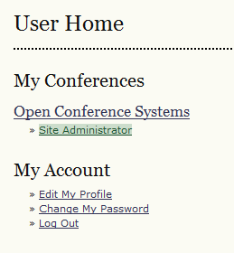

Next, select Hosted Conferences:

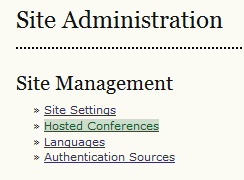

Then, choose Create Conference:

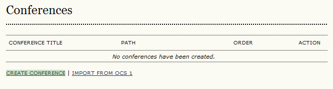

From the resulting page, fill in the form:

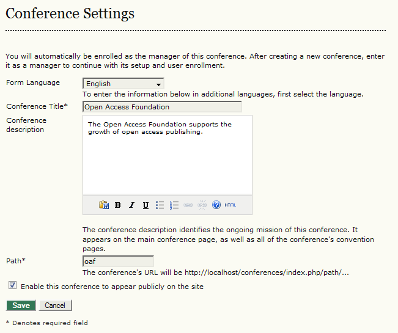

Use this page to describe the organization operating the conference. It might be a foundation, a university department, a society or association, etc.

The “path” simply requires a few characters that will become part of the URL. Do not enter a full URL here.

Once you’ve filled in the fields, press the Save button.

From the resulting page, select the User Home link in the navigation bar:

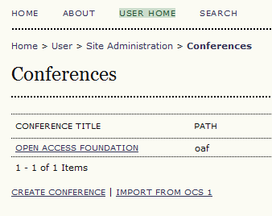

NOTE: If you ever do decide to use this OCS for a second organization, such as the Open Source Foundation, you could add it here.

Your account has now automatically been given the role of Conference Manager for the organization you just created. Select Conference Manager:

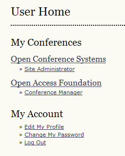

You will now see a list of choices under General Management:

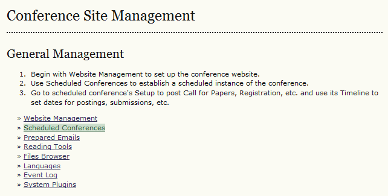

These will allow you to configure certain “site-wide” elements for the web site, including the style sheet, the header and footer, the prepared emails, and more. See OCS in an Hour for more details on these configuration options.

From the General Management menu, select Scheduled Conferences. A Scheduled Conference is an actual event, such as the 2010 Annual Meeting of the Open Access Foundation. From the resulting page, select Create Scheduled Conference:

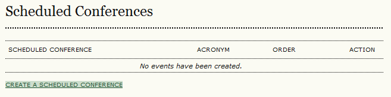

Fill in the form with the name of your event:

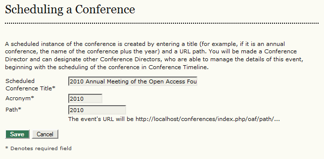

The acronym and path should just be a few characters. Do NOT enter a complete URL. When you’ve finished, hit the Save button. From the resulting page, select the User Home link in the navigation bar:

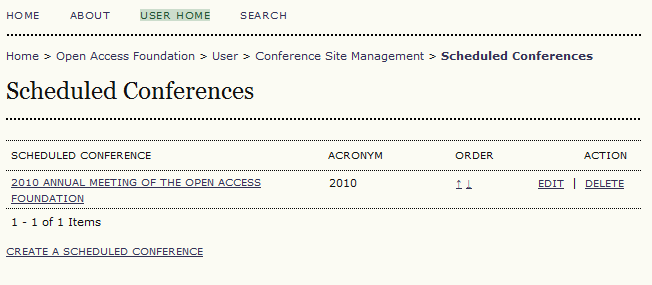

NOTE: If you ever decide to use this OCS for a second event, such as the 2011 Annual Meeting of the Open Access Foundation, you could add it here.

Select your role as Conference Manager to continue configuring this event:

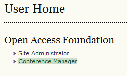

In addition to the General Management menu options you had seen previously, you now also have a variety of menu choices for your new "scheduled conference". See [OCS in an Hour](https://pkp.sfu.ca/files/OCSinanHour.pdf) for a detailed description of filling in these fields. You have now set up your OCS conference.

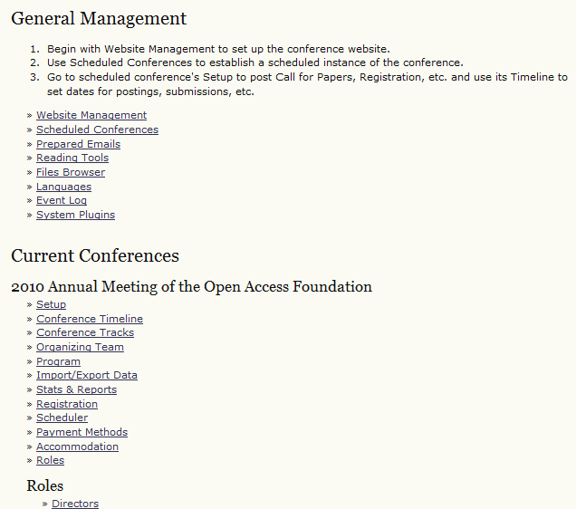

Based upon this example, the conference URL will be: http://www.myconference.org/index.php/oaf/2010/

To get started with the review process, see [Part Two: Director-Based Reviews](director-based-reviews).

