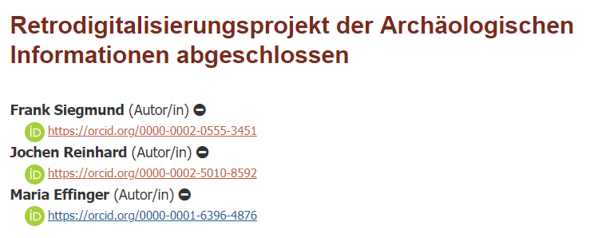

# ORCID Plugin Guide

The ORCID Plugin Guide explains how to use and configure the ORCID Profile Plugin, how to obtain ORCID membership and API credentials, and how to connect ORCID iDs with works published with OJS.

## Introduction

[ORCID (Open Researcher and Contributor Identifier)](https://orcid.org/) is a persistent digital identifier that distinguishes individual researchers and supports automated links between researchers and their professional activities. For an overview of ORCID, please see the following introductory [ORCID video](https://vimeo.com/97150912).

## Platform Compatibility

Both OJS and OPS share the same basic platform and therefore the instructions presented in this document apply for both journals using OJS and preprint servers using OPS. PKP partners with ORCID to enable the collection and display of authenticated ORCID iDs for contributors to journals published with OJS and preprints posted with OPS, using the ORCID Profile Plugin for OJS and OPS.

The ORCID Profile Plugin is supported in OJS/OPS 3.1.2 and above. Previous versions of the Plugin vary in functionality. The ORCID plugin is not currently available in [Open Monograph Press (OMP)](https://pkp.sfu.ca/omp/). Users of OMP can manually enter their ORCID iD in their user profile under View Profile > Public, but metadata will not be automatically sent from OMP to ORCID, unlike OJS/OPS where metadata can be exchanged if the plugin is configured correctly.

This document provides step-by-step instructions for Journal Managers and Administrators on how to use and configure the ORCID Profile Plugin in OJS/OPS and obtain ORCID membership and API credentials. It also explains how authors can register with ORCID and connect their ORCID iD with works published with OJS/OPS.

## What does the ORCID plugin do?

The ORCID Profile Plugin for OJS/OPS versions 3.1.2 and above allows an OJS journal and an OPS preprint server to:

* Collect and authenticate a contributor’s ORCID iD using the ORCID API ([ORCID member organizations](https://orcid.org/members) can use the ORCID Member API, non-member organizations can use the ORCID Public API - see descriptions of each API below).
* Automatically send an email to contributors requesting their ORCID iD authentication.
* Display a contributor’s authenticated ORCID iD on the journal article or preprint page, which will link to the contributor’s ORCID record. For example:

*Member API only*: Sends publication details to  the “works” section of a contributor’s ORCID record once their work has been published in OJS. This action is triggered when an issue is published, and updates the ORCID record automatically. *Please note:* that the information on the source of the publication does not currently work for OPS. For example:

When a work is added to an ORCID record, the "source" is displayed as well. If a person adds a work to their own record, the "source" will be the person's name. If a work is added via API as in the case of OJS, the "source" will appear as whatever "client name" is entered when the ORCID API credentials are requested. If the ORCID plugin is being used for just a single journal, the source/client name is usually just the name of the journal. If the ORCID plugin is used for multiple journals on the same instance, then the source/client name would need to be something more broad, like "Univ. of XYZ Open Journals."
