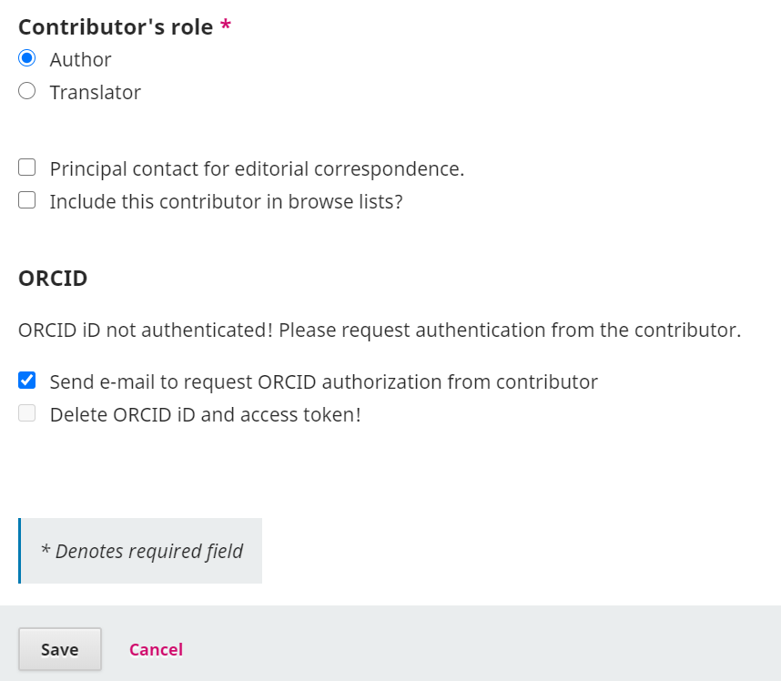

# Appendix: Testing in the ORCID Sandbox

ORCID provides the option to test the ORCID plugin in a Sandbox environment before using it in the live Production environment of your OJS journal or OPS server. Testing the plugin in the Sandbox will allow you to do the following:

* Check that the ORCID plugin works in your installation
* Learn how to use the plugin and try all of its features without affecting any real ORCID IDs or sending real emails to researchers
* Test the ORCID Member API to see how it works, even if you are not an ORCID member

This chapter explains how to test the plugin.

## Obtain ORCID Sandbox API credentials

The process for obtaining your Sandbox ORCID API credentials will vary depending on whether you are planning to use the ORCID Public API or the ORCID Member API.

### Sandbox Public API

Free and available to anyone, the Public API allows for ORCID iD authentication and reading public data from ORCID records.

See [Public API Documentation](https://info.orcid.org/documentation/features/public-api/) for instructions.

### Sandbox Member API

The ORCID Member API requires ORCID institutional membership. However, you do not need to be an ORCID member to try out the member API in the sandbox. All are welcome to request sandbox member API credentials and try out the full features available with the member API.

See [Sandbox Testing Server Documentation](https://info.orcid.org/documentation/integration-guide/sandbox-testing-server/) for instructions on how to obtain sandbox credentials and conduct tests.

## Test your ORCID in a Sandbox environment

To test that the plugin is working correctly in the sandbox, you can create a sandbox account, and act in the role of an author:

### Create a Sandbox ORCID iD

Go to the [ORCID Sandbox registration page](https://sandbox.orcid.org/register) and fill in the form. Make sure to use a made-up email address using `@mailinator.com` - for example: `test123@mailinator.com`. Please note the sandbox only allows `@mailinator.com` addresses.

See [Sandbox Testing Server Documentation](https://info.orcid.org/documentation/integration-guide/sandbox-testing-server/) for more details.

### Connect your Sandbox ORCID iD with OJS/OPS & Submit a Test Publication

There are multiple ways an author can connect their ORCID iD with their works in OJS/OPS. The scenarios you should test in the sandbox environment are:

* As author, register for a new OJS/OPS account and connect the authenticated ORCID iD to the OJS/OPS profile during their OJS account creation
* As existing OJS/OPS author, go to “Edit Profile > Public” and connect ORCID iD
* As the submitting author with a connected ORCID iD, submit a new article and publish it. The authenticated ORCID iD should appear on the article page, while the article should appear on your ORCID profile immediately upon publication.
* On a multi-author manuscript, submit while inviting a co-author to add their ORCID iD by going to Contributor > Edit > Checkbox “Send e-mail to request ORCID authorization from contributor”
* As an editor or journal administrator, invite author without an existing ORCID iD to connect their profile, by going to Contributor > Edit > Checkbox “Send e-mail to request ORCID authorization from contributor”

