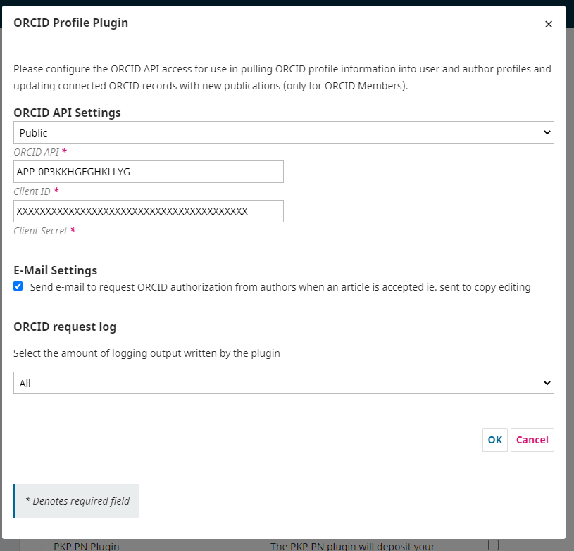

# Set Up the ORCID Plugin

To use the plugin, you will first need to obtain either Public or Member ORCID API credentials (Client ID and Client Secret) and then configure the ORCID plugin in OJS/OPS with this information.

**IMPORTANT: do not enable the plugin until you have the credentials and are ready to setup the plugin.**

If you have previously collected ORCIDs manually prior to setting up the plugin, typos in the manually-entered ORCID field may cause errors. See the [Troubleshooting section of this guide](./troubleshooting-resources.md) for more details.

## Obtain Public API credentials

See [ORCID Integration Guide](https://info.orcid.org/documentation/integration-guide/getting-started-with-your-orcid-integration/), and follow the instructions in: [Registering Public API credentials](https://info.orcid.org/documentation/integration-guide/registering-a-public-api-client/).

## Obtain Member API credentials

Member API credentials are connected to an ORCID member organization. Your organization must be an ORCID member to request Member API credentials. If your journal is affiliated with an institution, contact the institution’s library to ask about ORCID membership and API credentials. You may also wish to check whether your organization belongs to a [local consortium](https://orcid.org/consortia), as you may be able to receive help from the consortium. You can also contact ORCID directly at [support@orcid.org](mailto:support@orcid.org).

To obtain your Member API credentials, see [Registering a Member API Client](https://info.orcid.org/documentation/integration-guide/registering-a-member-api-client/).

_Please note: When registering to receive Member API credentials, organizations are required to indicate the “Name of your client application”. When working with multiple journals as part of an OJS instance, the name used must be broad enough to serve as a source for all of the journals hosted on its instance(s), as the name is what will appear as the “source” of data when a work from OJS is written to an ORCID record (e.g. “ABC University journal hosting service”). However, if you plan to install only one journal in your domain and use ORCID for that journal, then the name of the client application can be indicated as the name of the journal._

### ORCID redirect URIs

When you register for ORCID API credentials, you will need to enter at least one Redirect URI, which is the journal location that your users will be sent to after authorizing OJS/OPS to connect to their ORCID record, The URI must begin with “https://” and include the link to the journal as part of the URI. For example:

* This works (for example, for a multi-journal installation): `https://example.com`
* This works (for a single journal): `https://example.com/index.php/testJournal`
* This does NOT work: `https://example.com/index.php/testJournal/index`

The host option allows any URI under that host to be used as a Redirect URI. In multiple journal instances, make sure you choose the base url of your domain and not individual journals to avoid redirect errors. For individual journals it is important to use the journal path without any trailing information, as per above.

Although there appears to be a limit of five redirects, you can add as many as you like to the “notes to ORCID” section.

If a URI needs to be updated, or new one(s) added:

* Members can contact the ORCID Engagement Team or fill out a [Member API form](https://info.orcid.org/register-a-client-application-production-member-api/)
* Public API users can follow [these steps update the list of redirect URIs](https://info.orcid.org/ufaqs/how-do-redirect-uris-work/)

## Enable and configure the ORCID Profile plugin in OJS/OPS

After you have obtained your Client ID and Client Secret from ORCID, you can enable and configure the plugin in OJS/OPS.

There are three potential scenarios for configuring the plugin, based on your use case:
* If you have a single journal or preprint server installation, configure the plugin following the instructions below under [Per Journal/Preprint Server Setup](./installation-setup#per-journal-preprint-server-setup.md).
* If you have a multi-journal or multi-preprint server installation, but you do not want to enable the ORCID plugin for every journal, configure each journal or preprint server separately following the instructions below under [Per Journal/Preprint Server Setup](./installation-setup#per-journal-preprint-server-setup.md), using the same ORCID API credentials (Client ID and Client Secret) for each.
* If you have a multi-journal or multi-preprint server installation and want to enable the ORCID plugin for all site-wide, follow the [instructions below under Site-wide Setup](./installation-setup#site-wide-setup.md).

### Per Journal/Preprint Server Setup

If you want to enable the ORCID plugin for a single journal (OJS) or preprint server (OPS):

1. When logged in to OJS/OPS as an administrator, go to Settings > Website > Plugins
2. Under Installed Plugins find the ORCID plugin
3. Check the checkbox to enable to plugin
4. Click the blue arrow to the left of the plugin name to make “Settings” appear, then open Settings. Select your API type and enter your Client ID and Client Secret.

#### Email Settings

Under “E-Mail Settings” you can tick the checkbox to “Send e-mail to request ORCID authorization from authors when an article is accepted.” Instructions for modifying the emails sent to authors and be found in the [Plugin Functionality section](./plugin-functionality.md).

### Site-wide Setup

For multi-journal and multi-preprint server installations the plugin can be set site-wide in `config.inc.php` to enable the ORCID plugin for all journals. Note that site-wide settings through `config.inc.php` override any existing individual plugin settings. However, the plugin can be enabled/disabled on an individual basis for journals, and each journal can manage their own email settings as described above. Adding credentials in the `config.inc.php` hides the Client Secret from Journal/Server Managers, which may be preferred if you have institutional credentials for ORCID. Add the following section to your `config.inc.php` file:

Note that the `api_url` needs to end with a slash.
