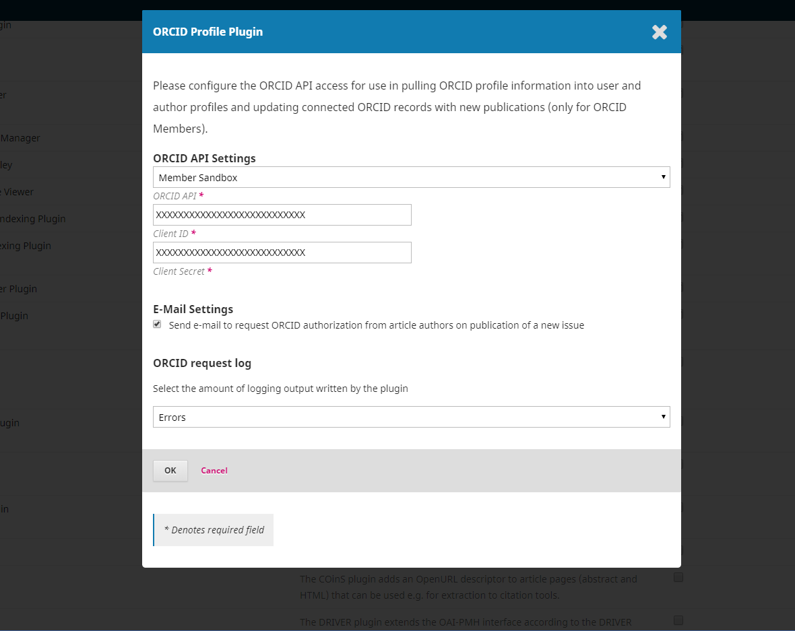
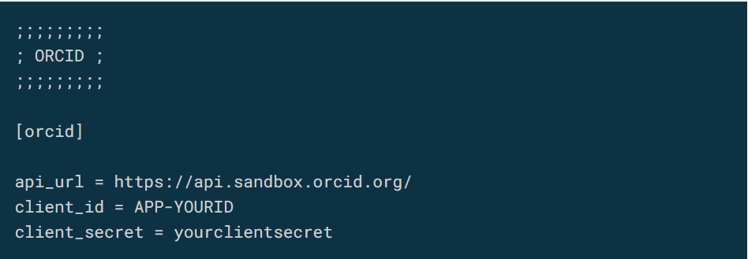

# Installation and Setup

To use the plugin, you will first need to obtain either Public or Member ORCID API credentials (Client ID and Client Secret) and then configure the ORCID Profile Plugin in OJS/OPS with this information. **Please note**: do not enable the plugin until you have the credentials and are ready to setup the plugin.

## Obtain ORCID Sandbox API Credentials

You are strongly advised  to test the ORCID plugin in the ORCID Sandbox environment using Sandbox ORCID API credentials first to make sure that the OJS/OPS environment is configured  properly, before moving to the production environment and going live with the plugin functionality. The process for obtaining your Sandbox ORCID API credentials will vary depending on whether you are planning to use the ORCID Public API or the ORCID Member API. 

ORCID provides two different API endpoints for: sandbox (testing) and production (live) environments: the ORCID Member API, and the ORCID Public API:

### Public API

Free and available to anyone, the Public API allows for ORCID iD authentication and reading public data from ORCID records.

Public API credentials are connected to an individual’s ORCID iD. To obtain Sandbox Public API credentials:

1. Register for a Sandbox ORCID iD account at the [ORCID sandbox site](https://sandbox.orcid.org).
2. Sign in to your Sandbox ORCID record.
3. Go to the “Developer tools” tab, and follow the instructions to [register a public API client application](https://support.orcid.org/hc/en-us/articles/360006897174-Register-a-public-API-client-application). See the note on “ORCID Redirect URIs” below for guidance on what to enter for your Redirect URIs.

### Member API

The ORCID Member API requires ORCID institutional membership. In addition to the functionalities of the Public API, the Member API allows for reading “trusted-parties” data from ORCID records, as well as adding/updating metadata on ORCID records. Consult the ORCID member directory to see if your organization is already an [ORCID member](https://orcid.org/members), or review [ORCID’s membership information](https://orcid.org/about/membership) if your organization is interested in becoming an ORCID member.

Member API credentials are connected to an ORCID member organization. Your organization must be an ORCID member to request Member API credentials. You may wish to check whether your organization belongs to a [local consortium](https://orcid.org/consortia), as you may be able to receive help from the consortium. To request Sandbox Member API credentials:

1. Complete the form on ORCID’s page to [Register a client application: Sandbox Member API](https://orcid.org/content/register-client-application-sandbox).
2. ORCID will email you a Sandbox Client ID and Client Secret shortly after the form is submitted. See the note on “ORCID Redirect URIs” below for guidance on what to enter for your Redirect URIs and Client Name.

For those using the Member API, please note that before production credentials can be obtained, you will need to provide a demo showing the plugin working with the ORCID Sandbox. This helps ORCID confirm that you are following their [best practices](https://members.orcid.org/api/member-api-credentials-check-list). Guidance on how to test and make sure your plugin is working properly can be found below in the “Testing in the ORCID Sandbox” chapter of this guide.

### ORCID Redirect URIs

When you register for ORCID API credentials, you will need to enter at least one Redirect URI, which is the journal location that your users will be sent to after authorizing OJS/OPS to connect to their ORCID record, The URI must begin with “https://” and include the link to the journal as part of the URI. For example:

* This works (for example, for a multi-journal installation): https://example.com
* This works (for a single journal): https://example.com/index.php/testJournal
* This does NOT work: https://example.com/index.php/testJournal/index

The host option allows any URI under that host to be used as a Redirect URI. In multiple journal instances, make sure you choose the base url of your domain and not individual journals to avoid redirect errors. For individual journals it is important to use the journal path (typically something like “index.php/testJournal”, without any trailing information, as per above). Any additional information in the URI will cause the redirect to not work.

For more detail on Redirect URIs, see the ORCID support page for [Public APIs](https://support.orcid.org/hc/en-us/articles/360006897174-Register-a-public-API-client-application) and [Member APIs](https://support.orcid.org/hc/en-us/articles/360006973913), respectively, and the [Redirect URI thread on PKP Forum](https://forum.pkp.sfu.ca/t/orcid-oauth2-redirect-uris-or-callback-urls-for-ojs).

**Please note**: When registering to receive Member API credentials, organizations are required to indicate the "Client Name" along with the Redirect URI(s). When working with multiple journals as part of an OJS instance, the Client Name used must be broad enough to serve as a source for all of the journals hosted on its instance(s), as the Client Name is what will appear as the "source" of data when a work from OJS is written to an ORCID record (e.g. “ABC University journal hosting service”). However, if you plan to install only one journal in your domain and use  ORCID for that journal, then the Client Name can be indicated as the name of the journal.

When registering for Sandbox or [Production Member API](https://orcid.org/content/register-client-application-production-trusted-party) credentials through ORCID, although there appears to be a limit of five redirects, you can add as many as you like to the ‘notes to ORCID’ section. If you ever need to adjust, add, or remove URIs, you can resubmit the form and indicate that it is for an existing application.

## Enable and Configure the ORCID Profile Plugin in OJS/OPS

After you have obtained your Client ID and Client Secret from ORCID, you can enable and configure the plugin in OJS/OPS.

First, enable the ORCID plugin for each journal (OJS) or preprint server (OPS) on your installation:

1. When logged in to OJS/OPS as an administrator, go to Settings > Website > Plugins
2. Click on Plugin Gallery and select ORCID Profile from the list

There are three potential scenarios for configuring the plugin, based on your use case:

1. If you have a single journal or preprint server installation, configure the plugin following the instructions below under Per Journal/Preprint Server Setup.
2. If you have a multi-journal or multi-preprint server installation, but you do not want to enable the ORCID plugin for all, configure each journal or preprint server separately following the instructions below under Per Journal/Preprint Server Setup, using the same ORCID API credentials (Client ID and Client Secret) for each.
3. If you have a multi-journal or multi-preprint server installation and want to enable the ORCID plugin for all site-wide, follow the [instructions below under Site-wide Setup](#site-wide-setup).

### Per Journal/Preprint Server Setup

If you want to enable the ORCID plugin for a single journal (OJS) or preprint server (OPS):

1. When logged in to OJS/OPS as an administrator, go to Settings > Website > Plugins
2. Under Installed Plugins find the ORCID plugin
3. Click the blue arrow to the left of the plugin name to make “Settings” appear, then open Settings. Enter information about your ORCID API credentials.

#### Email Settings

Under “E-Mail Settings” you can tick the checkbox to “Send e-mail to request ORCID authorization from article authors on publication of a new issue.” If checked, OJS/OPS will send an email automatically to authors who have not already linked their ORCID iDs when the article is published asking them to link their iDs. This request will be sent using the “ORCID Collect Author Id” email template (public API) or “ORCID Request Author Authorization” (member API).

### Site-wide Setup

For multi-journal and multi-preprint server installations the plugin can be set site-wide in `config.inc.php` to enable the ORCID plugin for all journals. Note that site-wide settings through `config.inc.php` override any existing individual plugin settings. However, the plugin can be enabled/disabled on an individual basis for journals, and each journal can manage their own email settings as described above. Adding credentials in the config.inc.php hides the Client Secret from Journal/Server Managers, which may be preferred if you have institutional credentials for ORCID. Add the following section to your config.inc.php file:

Note that the `api_url` needs to end with a slash.
