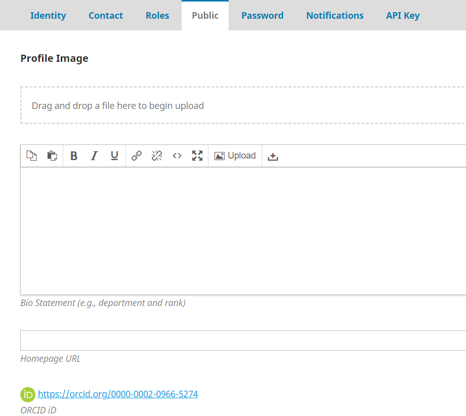

# Installation and Setup

The ORCID Profile plugin in OJS supports both the Public and Member APIs in both the sandbox (testing) and production environments. To use the plugin, the publisher first needs to obtain ORCID API credentials and then configure the ORCID Profile Plugin in OJS with this information.

Publishers should first test the plugin in the sandbox environment. The sandbox allows the creation of test user accounts and use of the plugin without having to worry about affecting data on the live (production) ORCID Registry. Once the plugin works as expected on the sandbox environment, publishers can obtain credentials and move to the production environment.

## ORCID APIs and Plugin Functionalities

Publishers must have ORCID API credentials in order to use the ORCID Profile plugin in OJS. ORCID provides two different APIs:
- Public API: Free and available to anyone. It allows anyone to obtain an authenticated iD and read public data. 
- Member API: Requires ORCID institutional membership. In addition to the functionalities of the Public API, it allows members to read “trusted-parties” data and add/update data on ORCID records.

Journals using the Public API can collect and display authenticated authors’ and coauthors’ iDs on the OJS profile and article page. The plugin also embeds the iD in the article metadata.

*Example of a journal displaying authenticated iDs on the article page*

*Example of an ORCID iD displayed on the OJS Profile page*

Journals using the Member API can collect and display authenticated authors’ and coauthors’ iDs on the OJS profile and article page. The API also embeds the iD in the article metadata. In addition, article metadata is automatically pushed to ORCID records. The source of the information will be the organization name or the journal.


Metadata changes in an OJS article are automatically reflected in the ORCID record.

It is possible to use both APIs on the production environment (registry with live ORCID iDs) or in the sandbox environment (testing iDs).

## Obtain ORCID API Credentials

### Public API
Public API credentials are connected to individual ORCID iDs. To obtain Production Public API credentials, sign in to your ORCID record, go to the “Developer tools” tab, and complete [the form](https://support.orcid.org/hc/en-us/articles/360006897174-Register-a-public-API-client-application). After clicking Save, your client ID and client secret will be generated. 

To obtain Sandbox Public API credentials, register for a Sandbox ORCID iD, sign in to your Sandbox ORCID record, go to the “Developer tools” tab, and complete [the form](https://support.orcid.org/hc/en-us/articles/360006897174-Register-a-public-API-client-application). After clicking save, your client ID and client secret will be generated.

### Member API
Before production credentials are issued, publishers need to provide a demo of the plugin working in the Sandbox environment. This helps ORCID confirm that you are following their [best practices](https://members.orcid.org/api/member-api-credentials-check-list).

To obtain Sandbox Member API credentials complete [the form](https://orcid.org/content/register-client-application-sandbox). Production Member API credentials are tied to organizations and can be requested by completing [the form](https://orcid.org/content/register-client-application-production-trusted-party). 

### ORCID Redirect URIs
Redirect URIs are permitted URL(s) in your journals where users would be forwarded after they authorize access to their ORCID record data.

When registering Redirect URIs for your ORCID API client, you can choose to either register:
1. The specific locations where users will be directed to - e.g., https://forum.pkp.sfu.ca/t/orcid-oauth2-redirect-uris-or-callback-urls-for-ojs
or
2. The host name of your OJS system - e.g., https://forum.pkp.sfu.ca

The host option allows any URI under that host to be used as a Redirect URI. 

For more detail on redirect URIs see ORCID support page for [Public APIs](https://support.orcid.org/hc/en-us/articles/360006897174-Register-a-public-API-client-application) and [Member APIs](https://support.orcid.org/hc/en-us/articles/360006973913), respectively, and the [redirect URI thread on PKP Forum](https://forum.pkp.sfu.ca/t/orcid-oauth2-redirect-uris-or-callback-urls-for-ojs).

## Enable and Configure the ORCID Profile Plugin in OJS

After you have obtained an API key from ORCID, you can enable and configure the plugin in OJS.

### Per Journal Setup
1. Go to Website Settings > Plugins
2. Under Installed Plugins find the ORCID plugin
3. Click the box to the right of the plugin name to enable it
4. Click the blue arrow to the left of the plugin name to make "Settings" appear, then open Settings. 
Enter information about your ORCID API

### Site-wide Setup
For multi-journal installations this can be set site-wide in config.inc.php. This hides the Client Secret from Journal Managers, which might be desirable if you have institutional credentials for ORCID. Add the following section to your config.inc.php:
```
;;;;;;;;;
; ORCID ;
;;;;;;;;;

[orcid]

api_url = https://api.sandbox.orcid.org/
client_id = APP-YOURID
client_secret = yourclientsecret
```
Please be aware that the api_url needs to end with a slash.

### More Plugin Settings
Under “E-Mail Settings” you can tick the checkbox to “Send e-mail to request ORCID authorization from article authors on publication of a new issue.” If checked, OJS will send an email automatically to authors who have not already linked their ORCID iDs when the article is published asking them to link their iDs.


This request will be sent using the “ORCID Collect Author Id” email template (public API) or “ORCID Request Author Authorization” (member API).
