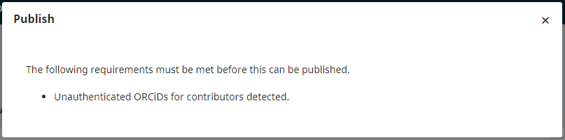

# Troubleshooting

## How to remove pre-plugin unauthenticated ORCID iDs

For journals transitioning from a manually-entered ORCID iD field to the ORCID plugin, unauthenticated ORCID iDs will prevent publication. If you see this error message, please follow [these steps to remove unauthenticated iDs](./using-plugin#remove-an-orcid-id-from-a-user-account). 

You may also want to [invite contributors to connect their ORCID iDs](./using-plugin#editors-can-invite-contributors-to-connect-their-orcid-ids-to-the-publication).

## How to solve problems with pre-plugin typos

For journals transitioning from a manually-entered ORCID iD field to using the ORCID plugin, pre-plugin typos may cause validation errors.

Pre-plugin, users are able to enter their ORCID iDs into a free text box. After the plugin, the ORCID iD field is controlled and must comply with format requirements. 

If a pre-plugin manually-entered ORCID iD does not comply with the format requirements, and the journal activates the plugin, the typo will be “locked” in place and cause errors. For example, a user might have entered “http” instead of “https” in front of their ORCID iD, or they might have neglected to enter the `https://orcid.org` prefix. 

Therefore, it’s a good practice to review ORCID iDs in active submissions prior to activating the plugin, to ensure that all manually-entered iDs conform with the correct format.

As a workaround, the Journal Administrator can temporarily deactivate the plugin, fix or delete the ORCID iD, and re-activate the plugin. 

## Make sure your plugin is up to date

For functionality issues, try upgrading the plugin first. You should also check periodically to make sure your ORCID plugin remains up to date.

To update the plugin:

1. Go to Settings > Website > Plugins > Plugin Gallery
2. Scroll to the ORCID plugin
3. Check to make sure the note next to the ORCID plugin says “up to date”. If there is an update available, install the update by clicking "Update".

## Authors receive ORCID invitation links but cannot login

Ensure that your ORCID plugin is actually configured and not just enabled; don’t enable it unless you are ready to configure it.

## ORCID is configured but authors who click the link receive an error message

Check to ensure that authors are using the current link and not a previous link from the sandbox. If you are on OJS 3.2 it may also be this bug in ORCID email template for authors - [https://github.com/pkp/orcidProfile/issues/122](https://github.com/pkp/orcidProfile/issues/122) (which is resolved in 3.2-1-3 and 3.3).

Or, if you have used the latest version of OJS 3.2.1-5, but the authors cannot authenticate their ORCID iD using the link provided in an email with an error message: “the ORCID authorization link has already been used or is invalid.” You can resolve this bug by upgrading the ORCID profile plugin to version 1.1.2.30. Check out this GitHub issue for a description of the bug: [https://github.com/pkp/orcidProfile/issues/281](https://github.com/pkp/orcidProfile/issues/281)

## Author sent “request to authorize” email cannot do so, due to integration error {#integration-error}

Redirect URIs are used by ORCID’s authentication service as a security measure. This prevents services from impersonating each other. Journals must register all redirect URIs: [see instructions to update or request new redirect URI(s)](https://docs.pkp.sfu.ca/orcid/en/installation-setup#orcid-redirect-uris).

Author will see an error message reading: "You have reached this page due to an error with the application's integration..."

  

## Videos

- [OJS and ORCID introduction](https://www.youtube.com/watch?v=YgJw9HW-JEg )
- [Set up the plugin](https://vimeo.com/374414746)
- [User authorization](https://vimeo.com/374415404)
- [Co-authors](https://vimeo.com/374416189)
- [Article publication](https://vimeo.com/374417678)
