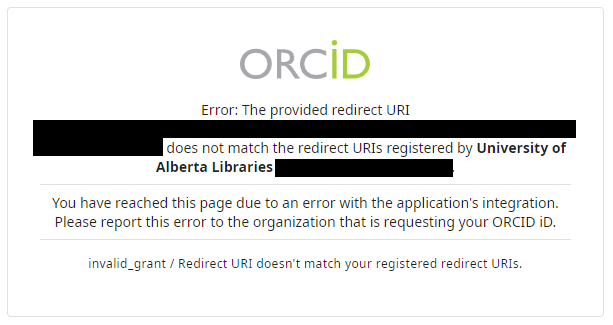

# Troubleshooting

## How to solve problem with pre-plugin typos

For journals transitioning from a manually-entered ORCID iD field to using the ORCID plugin, pre-plugin typos may cause validation errors.

Pre-plugin, users are able to enter their ORCID iDs into an open textbox. After the plugin, the ORCID iD field is controlled and must comply with format requirements. If a pre-plugin manually-entered ORCID iD does not comply with the format requirements, and the journal activates the plugin, the typo will be “locked” in place and cause errors.

For example: if a user enter `http` instead of `https` in front of their ORCID iD, or forget to enter `https://orcid.org` prefix.

Therefore, it’s a good practice to review active submission’ ORCID iDs prior to activating the plugin, to ensure that all manually-entered iDs conform with the correct format.

As a retroactive workaround: the Journal Administrator can temporarily deactivate the plugin, fix or delete the ORCID iD in quest, and re-activate the plugin. This should be done as quickly as possible.

## Make sure your plugin is up to date

For functionality issues, try upgrading the plugin first. You should also check periodically to make sure your ORCID plugin remains up to date.

To update the plugin:

1. Go to Settings > Website > Plugins > Plugin Gallery
2. Scroll to the ORCID plugin
3. Check to make sure the note next to the ORCID plugin says “up to date”. If there is an update available, install the update by clicking "Update".

## Authors receive ORCID invitation links but cannot login

Ensure that your ORCID plugin is actually configured and not just enabled; don’t enable it unless you are ready to configure it.

## ORCID is configured but authors who click the link receive an error message

Check to ensure that authors are using the current link and not a previous link from the sandbox. If you are on OJS 3.2 it may also be this bug in ORCID email template for authors - [https://github.com/pkp/orcidProfile/issues/122](https://github.com/pkp/orcidProfile/issues/122) (which is resolved in 3.2-1-3 and 3.3).

## Author sent “request to authorize” email cannot do so, due to integration error [#](https://docs.pkp.sfu.ca/orcid/en/troubleshooting-resources#author-sent-to-authenticate-at-orcid-cannot-do-so-due-to-integration-error)

Redirect URIs are used by ORCID’s authentication service as a security measure. This prevents services from impersonating each other. Journals must register all redirect URIs: [see instructions to update or request new redirect URI(s)](https://docs.pkp.sfu.ca/orcid/en/installation-setup#orcid-redirect-uris).

Author will see an error message reading: "You have reached this page due to an error with the application's integration..."

  

## Videos

- [OJS and ORCID introduction](https://www.youtube.com/watch?v=YgJw9HW-JEg )
- [Set up the plugin](https://vimeo.com/374414746)
- [User authorization](https://vimeo.com/374415404)
- [Co-authors](https://vimeo.com/374416189)
- [Article publication](https://vimeo.com/374417678)
